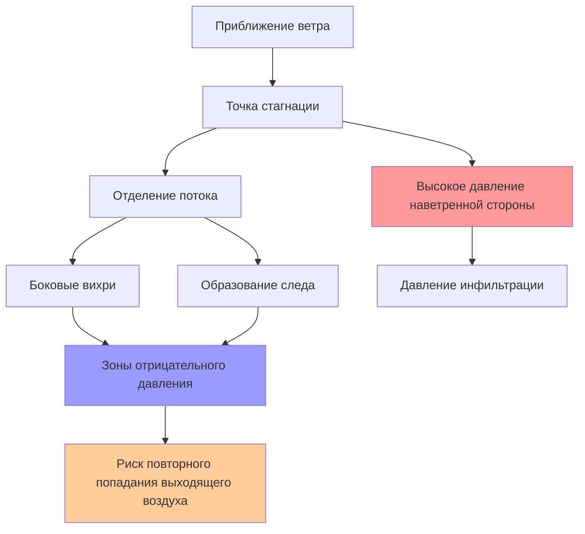
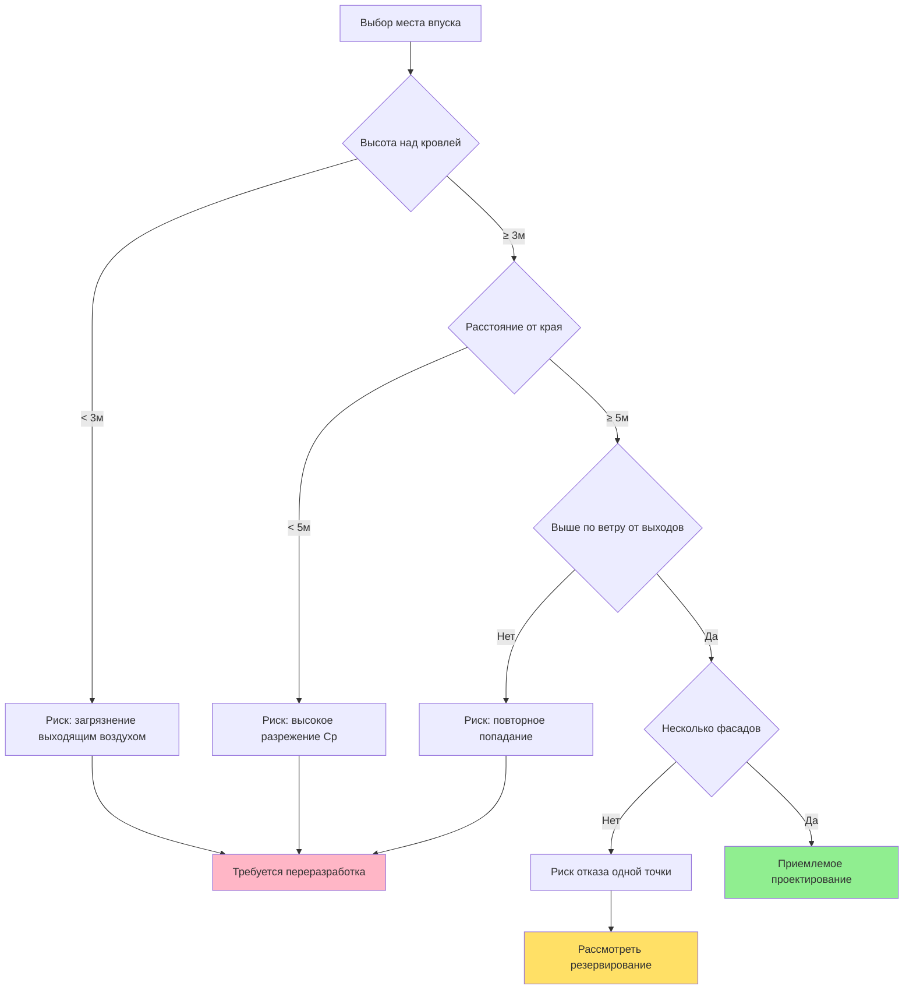
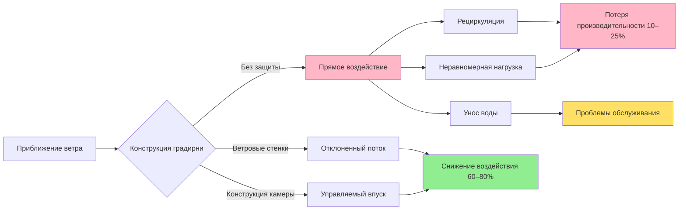

Влияние ветра доминирует при проектировании и эксплуатации систем HVAC высоких зданий, создавая распределение давлений, которое резко изменяется с высотой и геометрией здания. Взаимодействие ветровых давлений и естественной тяги создает сложные картины потоков воздуха, влияющие на качество впуска наружного воздуха, поведение выходящего потока и производительность оборудования.

## Высотные профили скорости ветра

Скорость ветра увеличивается с высотой над поверхностью земли из-за эффекта пограничного слоя атмосферы. Градиент скорости зависит от шероховатости поверхности и атмосферной стабильности.

Степенной закон профиля скорости ветра описывает фундаментальное соотношение:

$$V_z = V_{ref} \left(\frac{z}{z_{ref}}\right)^\alpha$$

Где:
- $V_z$ = скорость ветра на высоте $z$
- $V_{ref}$ = эталонная скорость ветра на эталонной высоте $z_{ref}$
- $\alpha$ = зависящий от рельефа показатель степени (0,14–0,43)

ASHRAE Fundamentals предоставляет категории рельефа с соответствующими показателями:

| Категория рельефа | Описание | Показатель α | Пример |
|-----------------|-------------|-----------|---------|
| 1 | Открытая, плоская местность | 0,14 | Океан, пастбища |
| 2 | Пересеченная, лесистая местность | 0,22 | Пригородные жилые зоны |
| 3 | Городская, промышленная | 0,33 | Центры городов |
| 4 | Плотная застройка | 0,43 | Высотные районы |

Для здания высотой 200 м в городской местности (α = 0,33) с эталонной скоростью 5 м/с на высоте 10 м:

$$V_{200} = 5 \left(\frac{200}{10}\right)^{0.33} = 5 \times 2,71 = 13,6 \text{ м/с}$$

Это увеличение скорости на 172% создает значительные перепады давления между верхней и нижней частью здания.

## Распределение давления вокруг зданий

Ветер создает поля давления, которые меняются по периметру здания и с высотой. Соотношение между скоростью ветра и давлением следует уравнению Бернулли для несжимаемого потока:

$$P_{wind} = \frac{1}{2} \rho V^2 C_p$$

Где:
- $P_{wind}$ = ветровое давление (Па)
- $\rho$ = плотность воздуха (кг/м³)
- $V$ = местная скорость ветра (м/с)
- $C_p$ = коэффициент давления (безразмерный)

Коэффициенты давления зависят от геометрии здания, направления ветра и расположения на фасаде:

| Расположение | Диапазон Cp | Тип давления |
|----------|-----------------|---------------|
| Наветренный фасад (центр) | +0,6–+0,8 | Положительное (внутрь) |
| Наветренный фасад (края) | +0,3–+0,5 | Положительное (внутрь) |
| Боковые фасады | –0,6––0,3 | Отрицательное (разрежение) |
| Подветренный фасад | –0,3––0,5 | Отрицательное (разрежение) |
| Края кровли | –1,2––0,8 | Сильное разрежение |
| След здания | –0,4––0,2 | Отрицательное (разрежение) |

На уровне кровли высокого здания при скорости ветра 15 м/с:

$$P_{windward} = \frac{1}{2} \times 1,2 \times 15^2 \times 0,7 = 95 \text{ Па}$$

$$P_{leeward} = \frac{1}{2} \times 1,2 \times 15^2 \times (-0,4) = -54 \text{ Па}$$

Перепад в 149 Па создает значительный поток воздуха при наличии проемов между этими зонами.

## Стратегии размещения впуска наружного воздуха

Размещение впуска наружного воздуха должно исключать загрязнение выходящим воздухом здания, загрязнением на уровне улицы и областями высокой турбулентности, при этом поддерживая адекватное статическое давление.

**Критерии проектирования впуска:**

1. **Вертикальное разделение от источников загрязнения:** Минимум 3 м над поверхностью кровли, 10 м от точек выброса отработанного воздуха
2. **Избегание зон высокого разрежения:** Размещение впусков вдали от краев кровли и углов здания, где $C_p < -0,6$
3. **Многоточечная стратегия впусков:** Распределение впусков на разных фасадах для поддержания подачи при неблагоприятных направлениях ветра
4. **Ограничения скорости:** Проектирование на максимальную скорость в сечении впуска 2,5 м/с для предотвращения захвата влаги

## Выброс отработанного воздуха и повторное попадание

Подъем выходящего потока зависит от вертикального импульса, плавучести и влияния ветра. Рассеивание и траектория определяют потенциал повторного попадания.

**Уравнение подъема выходящего потока** (формула Бриггса для следа здания):

$$\Delta h = \frac{3 d V_e}{V_w}$$

Для итоговой высоты выходящего потока с учетом плавучести:

$$h_{final} = h_s + \Delta h + \frac{1,5 F^{1/3}}{V_w}$$

Где:
- $\Delta h$ = подъем от импульса (м)
- $d$ = диаметр трубы (м)
- $V_e$ = скорость выхода воздуха (м/с)
- $V_w$ = скорость ветра (м/с)
- $h_s$ = физическая высота трубы (м)
- $F$ = параметр потока плавучести (м⁴/с³)

Для кухонной вытяжки: $d = 0,6$ м, $V_e = 12$ м/с, $V_w = 8$ м/с, $h_s = 3$ м:

$$\Delta h = \frac{3 \times 0,6 \times 12}{8} = 2,7 \text{ м}$$

**Критерии повторного попадания ASHRAE 62.1:**

- Минимальное вертикальное расстояние между выходом и впуском: 3 м
- Минимальное горизонтальное расстояние (одной уровень): 6 м
- Требование скорости выхода: $V_e \geq 1,5 V_w$ для предотвращения обратного потока

| Скорость ветра (м/с) | Мин. скорость выхода (м/с) | Коэффициент подъема от импульса |
|-----------------|---------------------------|---------------------|
| 5 | 7,5 | Высокий |
| 10 | 15,0 | Средний |
| 15 | 22,5 | Низкий |
| 20 | 30,0 | Минимальный |

При высоких скоростях ветра поддержание адекватного импульса выходящего воздуха становится сложной задачей, требующей более высоких труб или альтернативных стратегий выброса.

## Влияние ветра на производительность градирен

Ветер создает множественные проблемы производительности и эксплуатации для градирен на кровле:

**1. Рециркуляция и короткое замыкание потока**

Ветер может направить теплый, влажный выходящий воздух обратно во впуск градирни, снижая производительность. Коэффициент рециркуляции:

$$R = \frac{T_{wb,inlet} - T_{wb,ambient}}{T_{wb,discharge} - T_{wb,ambient}}$$

Рециркуляция более 10% ($R > 0,1$) значительно ухудшает производительность. Ветровые стенки и впускные камеры снижают этот эффект.

**2. Потеря производительности, вызванная ветром**

Поперечные ветры нарушают распределение воздуха в противоточной системе, создавая неравномерную нагрузку:

$$Q_{actual} = Q_{design} \times \eta_{wind}$$

Где $\eta_{wind}$ варьируется от 0,85 до 0,95 в зависимости от скорости ветра и конструкции градирни.

**3. Унос воды**

Сильные ветры могут переносить капельки воды за пределы элиминатора брызг. Скорость уноса увеличивается с квадратом скорости ветра:

$$\dot{m}_{carryover} \propto V_w^2$$

**Стратегии снижения влияния ветра:**

| Стратегия | Эффективность | Применение |
|----------|--------------|-------------|
| Ветровые стенки (высота 4× градирни) | Снижение на 60–80% | Крупные установки |
| Впускные камеры | Снижение на 40–60% | Модульные градирни |
| Ориентация градирни (длинная ось перпендикулярна ветру) | Улучшение на 20–30% | Зависит от площадки |
| Повышенная скорость выхода | Улучшение на 30–50% | Механическая тяга |
| Несколько меньших секций | Улучшение на 25–40% | Гибкая эксплуатация |

## Принципы интеграции при проектировании

Успешное проектирование HVAC высоких зданий требует координации ветроанализа с расположением системы:

1. **Моделирование гидродинамики (CFD)** для зданий выше 150 м или сложной геометрией
2. **Испытания в аэродинамической трубе** для сверхвысоких зданий (>300 м) для проверки коэффициентов давления
3. **Динамическое взаимодействие эффекта тяги:** Ветровые давления комбинируются векторно с давлениями от естественной тяги
4. **Запас производительности оборудования:** Запас на 10–15% производительности для градирен в местах с сильным ветром
5. **Стратегии управления:** Модулирование заслонок впуска наружного воздуха в зависимости от направления ветра и давления в здании

Комбинированное давление от ветра и естественной тяги:

$$P_{total} = P_{stack} + P_{wind} \pm P_{mechanical}$$

При сильном ветре механическая вентиляция должна преодолеть перепады давления, которые на высотных зданиях могут превышать 200 Па, требуя тщательного выбора вентилятора и секвенцирования управления.

Понимание и снижение влияния ветра отличают функциональные системы HVAC высотных зданий от систем, затронутых загрязнением, недостаточной вентиляцией и деградацией производительности оборудования.
