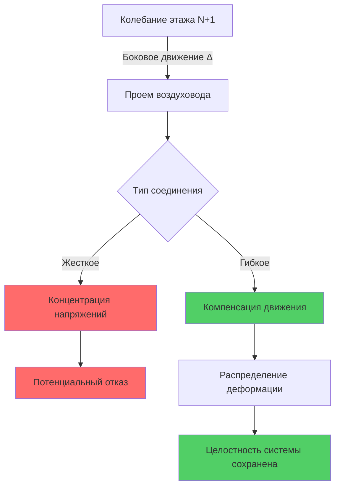

## Обзор

Высокие здания испытывают боковые смещения от ветровых нагрузок и сейсмических событий, создавая дифференциальное движение между этажами (межэтажный сдвиг), которое системы HVAC должны компенсировать без отказов. Физика колебания здания создает динамические напряжения на жесткие трубопроводы, воздуховоды и соединения оборудования, требуя спроектированной гибкости в стратегических местах.

Смещение здания на высоте следует принципам отклонения консольной балки, с максимальным колебанием на верхних этажах. Для равномерного здания под боковой ветровой нагрузкой смещение изменяется приблизительно как:

$$\delta(z) = \delta_{max} \left(\frac{z}{H}\right)^4$$

где $z$ — высота над уровнем земли, $H$ — общая высота здания, а $\delta_{max}$ — максимальное смещение на крыше. Это создает различные требования межэтажного сдвига во всем вертикальном распределении систем HVAC.

## Межэтажный сдвиг и проектирование HVAC

Межэтажный сдвиг представляет относительное горизонтальное смещение между соседними этажами, обычно выражаемое как коэффициент сдвига (смещение, деленное на высоту этажа). Строительные нормы ограничивают сдвиг для предотвращения повреждения конструкции и поддержания пригодности систем здания.

Типичные пределы сдвига и последствия для HVAC:

| Тип здания | Предел сдвига | Критерии проектирования HVAC |
|------------|---------------|------------------------------|
| Бетонный каркас | H/500 (0,2%) | Требуется умеренная гибкость |
| Стальной каркас | H/400 (0,25%) | Требуются улучшенные гибкие соединения |
| Сейсмические зоны | H/200 (0,5%) | Комплексные сейсмические швы |
| Ветровое высокое | H/300-400 | Компенсация ветрового колебания доминирует |

Для высоты этажа 3,66 м с пределом сдвига H/400 проектное смещение составляет:

$$\Delta = \frac{3,66 \text{ м}}{400} = 0,91 \text{ см}$$

Системы HVAC, пересекающие проемы в полах, должны компенсировать по крайней мере это движение, обычно умноженное на коэффициент безопасности 1,5–2,0 для учета комбинированных нагрузок и допусков установки.

## Инженерное проектирование гибких соединений

### Гибкие соединители воздуховодов

Гибкие соединения воздуховодов компенсируют движение через деформацию материала. Необходимая длина соединителя зависит от емкости углового отклонения:

$$L_{min} = \frac{\Delta}{2 \sin(\theta_{max}/2)}$$

где $\Delta$ — проектное смещение сдвига, а $\theta_{max}$ — максимальное допустимое угловое отклонение (обычно 15–20° для тканевых соединителей).

Для смещения 1,27 см с емкостью отклонения 15°:

$$L_{min} = \frac{1,27}{2 \sin(7,5°)} = 4,88 \text{ см}$$

Стандартная практика использует гибкие соединители длиной 15–30 см для обеспечения адекватной емкости движения плюс допуск установки.

### Компенсаторы и петли расширения труб

Трубопроводные системы требуют компенсаторов расширения, гибких муфт или петель расширения на проемах в полах. Выбор зависит от размера трубы, номинального давления и величины движения.

**Компенсаторы мембранного типа** компенсируют осевое, боковое и угловое движение. Требуемая емкость бокового отклонения мембраны:

$$\delta_{lateral} = \Delta \cdot SF$$

где $SF$ — коэффициент безопасности (обычно 1,5–2,0).

**Петли расширения** обеспечивают гибкость через упругую деформацию трубы. Требуемая длина ноги петли для бокового движения:

$$L = \sqrt{\frac{3 E I \Delta}{S_{allow} D}}$$

где:
- $E$ = модуль упругости (200 ГПа для стали)
- $I$ = момент инерции
- $\Delta$ = проектное смещение
- $S_{allow}$ = допустимое напряжение
- $D$ = наружный диаметр трубы

## Крепление оборудования и виброизоляция

Оборудование HVAC, установленное на несколько этажей или подключенное к конструкции здания, должно компенсировать движение, вызванное колебанием. Виброизоляция оборудования служит двум целям: контроль вибрации и компенсация движения.

### Выбор виброизолятора для колебания

Пружинные изоляторы обеспечивают как виброизоляцию, так и емкость бокового движения. Требование боковой стабильности:

$$H_{max} = \frac{W}{k_{lateral} \cdot \delta_{sway}}$$

где:
- $H_{max}$ = максимальная высота изолятора
- $W$ = вес оборудования
- $k_{lateral}$ = боковая жесткость пружины
- $\delta_{sway}$ = смещение колебания здания

Ограниченные пружинные изоляторы с ограничивающими упорами предотвращают чрезмерное движение во время сейсмических событий, позволяя при этом компенсацию рабочего колебания.

| Тип изолятора | Емкость движения | Применение |
|---------------|------------------|-----------|
| Неопреновые прокладки | ±0,64 см | Легкое оборудование, низкий сдвиг |
| Открытая пружина | ±1,27–2,54 см | Общее оборудование, умеренный сдвиг |
| Ограниченная пружина | ±2,54–5,08 см | Тяжелое оборудование, высокий сдвиг/сейсмика |
| Сейсмические демпферы | ±5,08–10,16 см | Критическое оборудование, сейсмические зоны |

### Координация крепления оборудования

Крепление оборудования должно передавать сейсмические силы на конструкцию, позволяя при этом тепловое расширение и колебание здания. Процесс проектирования требует координации между конструктивными и HVAC инженерами.

## Рассмотрение сейсмических и ветровых колебаний

Ветровое колебание цикличное и относительно низкой амплитуды, происходящее непрерывно во время работы здания. Сейсмическое движение преходящее, высокой амплитуды и редкое. Проектирование должно учитывать оба условия нагрузки.

**Характеристики ветрового колебания:**
- Частота: 0,1–0,3 Гц (собственная частота здания)
- Амплитуда: H/1000 до H/400 на верхних этажах
- Продолжительность: непрерывно во время ветровых событий
- Влияние на HVAC: усталость соединений, передача вибрации

**Характеристики сейсмического движения:**
- Частота: 0,5–10 Гц (спектр сейсмического движения)
- Амплитуда: H/200 до H/50 (землетрясение на уровне норм)
- Продолжительность: 30–90 секунд сильных движений
- Влияние на HVAC: предельная прочность соединений, напряжение в трубах

Подход к проектированию объединяет служебность ветра (усталость) с требованиями предельной прочности при землетрясениях. Гибкие соединения, рассчитанные на смещение ветра, обычно имеют достаточную пластичность для сейсмического движения, но крепление и укрепление требуют отдельного сейсмического анализа в соответствии с ASCE 7 Глава 13.

## Требования к установке

Надлежащая установка гибких соединений критична для достижения расчетной производительности:

1. **Ориентация**: установите гибкие соединители перпендикулярно направлению ожидаемого движения с достаточным свободным ходом
2. **Расстояние поддержки**: жестко поддерживайте трубопровод/воздуховод сразу рядом с гибкими соединениями (в пределах 3–5 диаметров трубы)
3. **Выравнивание**: обеспечьте нулевое предварительное натяжение при установке
4. **Зазор**: обеспечьте достаточный зазор в проемах для полного диапазона движения без контакта
5. **Идентификация**: отметьте гибкие соединения для доступа при проверке и техническом обслуживании

Отказы при компенсации движения обычно возникают из-за ошибок установки, а не неадекватной емкости соединителя. Администрирование конструкции должно проверить надлежащую установку всех компонентов, компенсирующих сдвиг.

## Проверка производительности

Методы проверки после строительства:

- **Визуальный осмотр**: подтвердите надлежащую ориентацию и зазоры
- **Имитация движения**: примените расчетное смещение сдвига для проверки зазора
- **Документация**: сфотографируйте условия по факту монтажа критических гибких соединений
- **Планирование техническое обслуживания**: установите интервалы проверки для состояния гибкого соединителя

Системы мониторинга зданий в современных высоких зданиях могут отслеживать фактическое смещение колебания, позволяя сравнение с предположениями проектирования и раннее обнаружение деградированных гибких соединений через аномальную вибрацию или шум.

---

**Связанные темы:**
- Системы сейсмического укрепления и удержания
- Компенсация теплового расширения
- Проектирование виброизоляции оборудования HVAC
- Процедуры координации конструкции и HVAC
