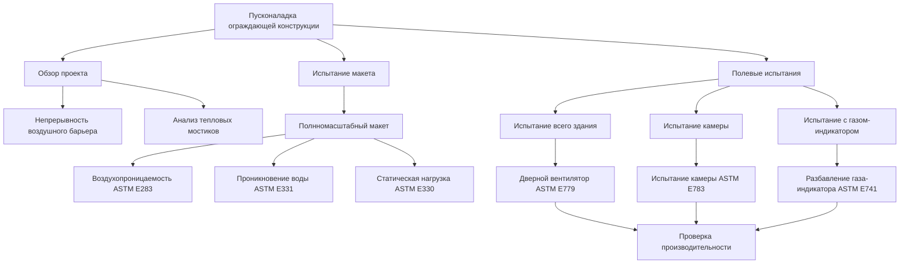

## Физические механизмы инфильтрации через облицовку

Инфильтрация воздуха через облицовку здания происходит в результате перепадов давления на ограждающей конструкции. В высотных зданиях эти перепады давления возникают из-за трех основных механизмов:

**Давление за счет эффекта стека:**
$$\Delta P_{stack} = \rho g h \left(\frac{1}{T_{outdoor}} - \frac{1}{T_{indoor}}\right)$$

где $\rho$ — плотность воздуха (кг/м³), $g$ — ускорение свободного падения (9,81 м/с²), $h$ — высота над плоскостью нейтрального давления (м), температуры выражены в Кельвинах.

**Ветровое давление:**
$$\Delta P_{wind} = \frac{1}{2} \rho V^2 C_p$$

где $V$ — скорость ветра (м/с), $C_p$ — коэффициент давления (безразмерный, варьируется от −0,8 до +0,8 в зависимости от ориентации фасада).

**Давление от механических систем:** Системы HVAC создают внутреннее давление или разрежение относительно наружной среды, обычно в диапазоне от −5 Па до +15 Па в коммерческих зданиях.

Суммарный перепад давления вызывает утечку воздуха через стыки облицовки, дефекты прокладок и зазоры в конструкции. Объемный расход воздуха через отверстие следует степенному закону:

$$Q = C A (\Delta P)^n$$

где $Q$ — расход воздуха (м³/с), $C$ — коэффициент расхода, $A$ — эффективная площадь утечки (м²), $\Delta P$ — перепад давления (Па), $n$ — показатель расхода (обычно 0,5–0,7 для турбулентного потока, приближаясь к 1,0 для ламинарного потока через длинные щели).

## Классификация воздухопроницаемости навесных стен

ASTM E283 стандартизирует испытание воздухопроницаемости наружных окон, навесных стен и дверей. Испытание измеряет скорость утечки воздуха при заданном перепаде статического давления, обычно 75 Па или 300 Па в зависимости от высоты и расположения здания.

### Классы воздухопроницаемости AAMA

| Класс производительности | Давление испытания (Па) | Максимальная скорость утечки (л/с·м²) | Применение |
|-------------------------|-------------------------|----------------------------------------|-----------|
| CW-PG25 | 300 | 0,30 | Низкоэтажные здания, защищенное расположение |
| CW-PG35 | 525 | 0,30 | Среднеэтажные здания, типичное расположение |
| CW-PG45 | 675 | 0,30 | Высокоэтажные здания, умеренный ветер |
| CW-PG50 | 750 | 0,30 | Высокоэтажные здания, сильный ветер |
| CW-PG70+ | 1050+ | 0,30 | Сверхвысокие здания, экстремальное воздействие |

Спецификация скорости утечки 0,30 л/с·м² при давлении испытания представляет объемный расход воздуха на единицу площади поверхности стены. Это значение должно быть пересчитано для реальных условий эксплуатации с помощью коррекции давления:

$$Q_{operating} = Q_{test} \left(\frac{\Delta P_{operating}}{\Delta P_{test}}\right)^n$$

Для навесной стены, испытанной при давлении 300 Па с измеренной утечкой 0,25 л/с·м², фактическая утечка при рабочем давлении 50 Па (при условии $n = 0,65$) составит:

$$Q_{50Pa} = 0,25 \times \left(\frac{50}{300}\right)^{0,65} = 0,070 \text{ л/с·м}^2$$

## Влияние на тепловую нагрузку на отопление и охлаждение

Потери или прибыль тепла при инфильтрации следуют уравнению явного тепла:

$$\dot{Q}_{sensible} = \dot{m} c_p (T_{outdoor} - T_{indoor}) = \rho Q c_p \Delta T$$

где $\dot{m}$ — массовый расход воздуха (кг/с), $c_p$ — удельная теплоемкость воздуха (1006 Дж/кг·К), $Q$ — объемный расход воздуха (м³/с).

Передача скрытого тепла при инфильтрации влажного воздуха:

$$\dot{Q}_{latent} = \rho Q h_{fg} (W_{outdoor} - W_{indoor})$$

где $h_{fg}$ — скрытая теплота парообразования (2 501 000 Дж/кг), $W$ — влагосодержание (кг влаги/кг сухого воздуха).

### Пример расчета нагрузки

Рассмотрим офисную башню высотой 200 м с площадью фасада навесной стены 25 000 м². При условии среднего расхода утечки 0,08 л/с·м² в зимних расчетных условиях с перепадом среднего давления 30 Па:

Общий расход воздуха при инфильтрации:
$$Q_{total} = 0,08 \times 25 000 = 2 000 \text{ л/с} = 2,0 \text{ м}^3\text{/с} = 7 200 \text{ м}^3\text{/ч}$$

Зимняя тепловая нагрузка на отопление (наружная температура −20°C, внутренняя 22°C):
$$\dot{Q}_{heating} = 1,2 \times 2,0 \times 1006 \times 42 = 101 000 \text{ Вт} = 101 \text{ кВт}$$

При стоимости энергии для отопления 0,10 дол./кВч и 4000 часо-градусов отопления в год:
$$\text{Годовые затраты} = 101 \times 4 000 \times 0,10 = \$40 400$$

Этот расчет демонстрирует, что утечка через ограждающую конструкцию напрямую влияет на размеры механических систем и эксплуатационные расходы. Снижение скорости утечки на 50% за счет улучшенных спецификаций облицовки позволило бы сэкономить примерно $20 000 в год в этом примере.

## Испытание воздушного барьера и пусконаладка

### Методы полевых испытаний

**Испытание дверным вентилятором ASTM E779** создает избыточное давление или разрежение в зонах здания в диапазоне 50–75 Па при измерении расхода воздуха, необходимого для поддержания давления. Результаты определяют эффективную площадь утечки и количество воздухообменов в час при 50 Па (ACH50).

**Испытание в камере ASTM E783** применяет временную камеру над установленными участками навесной стены, создавая контролируемый перепад давления при измерении утечки через заключенную площадь. Этот метод выявляет локализованные пути утечки в фактических установленных условиях.

**Разбавление газа-индикатора ASTM E741** вводит гексафторид серы (SF₆) или другой газ-индикатор в помещения здания, а затем измеряет концентрацию разбавления для определения скорости воздухообмена при нормальных условиях эксплуатации.

### Критерии приемки

ASHRAE 90.1 устанавливает максимальные скорости утечки воздуха для изделий остекления:

- **Глухие окна:** 0,20 CFM/фут² при 75 Па (1,0 л/с·м²)
- **Открывающиеся окна:** 0,30 CFM/фут² при 75 Па (1,5 л/с·м²)
- **Системы навесных стен:** 0,06 CFM/фут² при 75 Па (0,30 л/с·м²)

Высокопроизводительные здания, ориентированные на сертификацию LEED или стандарты Passive House, предусматривают более плотные ограждающие конструкции:

- **Ограждение LEED:** < 0,25 CFM/фут² при 75 Па
- **Passive House:** < 0,6 ACH при 50 Па

Взаимосвязь между удельной скоростью утечки и воздухообменом всего здания при 50 Па зависит от отношения площади ограждения к объему:

$$ACH_{50} = \frac{Q_{50} \times A_{envelope}}{V_{building}} \times 3600$$

где $Q_{50}$ — скорость утечки на единицу площади (м³/с·м²), $A_{envelope}$ — общая площадь ограждения (м²), $V_{building}$ — объем здания (м³).

## Стратегии устранения проблем

Когда полевые испытания выявляют чрезмерную утечку, систематическое расследование определяет доминирующие пути утечки:

1. **Периметральные стыки:** Нанесение дополнительного герметика на стыки между стойками навесной стены
2. **Сквозные проходки:** Герметизация механических, электрических и сантехнических проходок огнестойкой системой герметизации
3. **Зазоры на краю плиты:** Впрыскивание расширяющейся пены или минеральной ваты в зазоры между краями перекрытия и обшивкой навесной стены
4. **Переходы между остекленной и глухой частями:** Установка непрерывных прокладок на горизонтальных переходах
5. **Уплотнительные прокладки открывающихся окон:** Замена изношенных уплотняющих прокладок

Тепловизионная съемка во время испытания на давление быстро определяет пути утечки воздуха путем визуализации перепадов температуры. Холодная инфильтрирующая воздух кажется темными областями на инфракрасных изображениях во время зимних испытаний.

## Компоненты

- Инфильтрация воздуха через навесные стены
- Скорости инфильтрации окон
- Испытание утечки воздуха через фасад
- Производительность воздушного барьера
- Утечка воздуха при проникновении воды
- Испытание на дифференциальное давление
- Пусконаладка ограждающей конструкции здания
