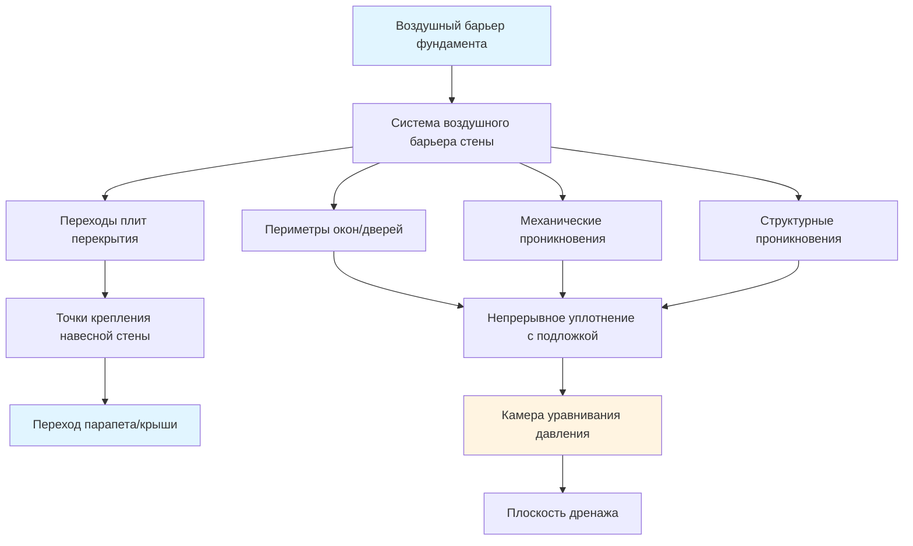
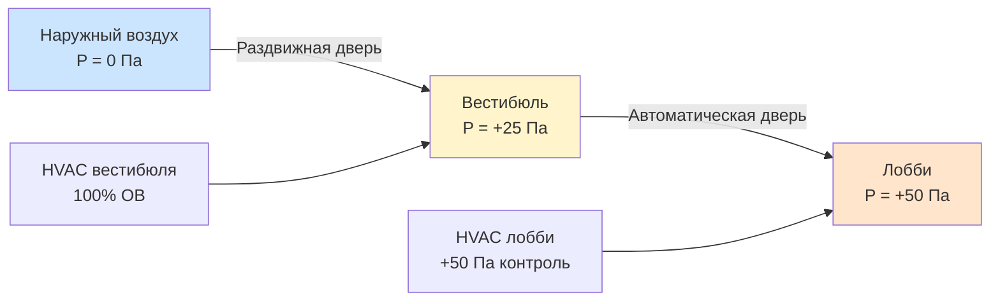

Герметизация в высотных зданиях представляет принципиально иные проблемы, чем строительство малоэтажных зданий, из-за экстремальных перепадов давления, создаваемых эффектом тяги и ветровыми нагрузками. Здание высотой 200 м испытывает перепады давления, превышающие 200 Па между внутренней и внешней поверхностями, генерируя скорости инфильтрации, которые могут перегружать системы HVAC при нарушении непрерывности оболочки.

## Физические механизмы утечки воздуха

Движение воздуха через оболочки зданий следует принципу Бернулли в сочетании с потоком через отверстия. Объемная скорость потока через проникновения оболочки соответствует:

$$Q = C_d \cdot A \cdot \sqrt{\frac{2\Delta P}{\rho}}$$

Где:
- $Q$ = объемная скорость потока (м³/с)
- $C_d$ = коэффициент расхода (0,6–0,7 для типичных щелей при строительстве)
- $A$ = эффективная площадь утечки (м²)
- $\Delta P$ = перепад давления на оболочке (Па)
- $\rho$ = плотность воздуха (кг/м³)

Квадратичная зависимость показывает, что удвоение перепада давления увеличивает инфильтрацию на 41%, а не на 100%. Однако в высотных зданиях совокупное давление от эффекта тяги и ветра создает мультипликативный эффект, требующий надежных стратегий герметизации.

Давление стека на высоте $h$ в здании с разностью температур внутри и снаружи:

$$\Delta P_{stack} = \rho_o g h \left(1 - \frac{T_o}{T_i}\right)$$

Для 60-этажного здания (210 м) при -20°C снаружи и 21°C внутри давление стека достигает 245 Па на вершине, что эквивалентно 25,0 мм водяного столба, что достаточно, чтобы заставить воздух проходить через любое нарушение непрерывности.

## Интеграция систем воздушного барьера

Эффективная герметизация требует непрерывного воздушного барьера от фундамента до крыши с уравнивающей давление конструкцией на критических переходах.

### Выбор материалов воздушного барьера

| Тип материала | Воздухопроницаемость (л/с·м² @ 75 Па) | Диапазон температур | Устойчивость к УФ | Срок службы |
|---|---|---|---|---|
| Самоклеящаяся мембрана | <0,02 | -40°C до 90°C | Требуется защита | 25+ лет |
| Жидкоприменяемая мембрана | <0,02 | -30°C до 80°C | Хорошая | 20–30 лет |
| Механически закрепленная | <0,02 | -50°C до 100°C | Отличная | 30+ лет |
| Напыляемая полиуретановая пена | <0,02 | -40°C до 110°C | Требуется покрытие | 20–25 лет |

ASTM E2357 требует, чтобы узлы воздушного барьера достигали ≤0,2 л/с·м² при перепаде давления 75 Па. В высотных зданиях проектируйте испытание при минимальном давлении 300 Па, чтобы учесть фактические условия эксплуатации.

## Герметизация навесных стен

Системы навесных стен доминируют в оболочках высотных зданий и требуют конструкции дождевой экран с уравниванием давления с четырьмя отдельными слоями управления.

### Принцип уравнивания давления

Уравнивание давления устраняет движущую силу для проникновения воды, сбалансировав давление на наружном уплотнении:

$$\Delta P_{water} = \Delta P_{exterior} - \Delta P_{chamber}$$

Когда $\Delta P_{chamber} \approx \Delta P_{exterior}$, сила проникновения воды приближается к нулю. Объем камеры должен быть достаточным, чтобы реагировать на порывы ветра в течение 1–2 секунд:

$$V_{chamber} = \frac{Q_{leak} \cdot t_{response}}{\Delta P_{max} / (R \cdot T)}$$

Типичные камеры уравнивания давления навесных стен: глубина 25–50 мм с отсеками каждые 1,5 м по вертикали и на каждой горизонтальной раме.

### Конструкция герметичного шва

Конструкционные герметичные швы допускают дифференциальное тепловое движение при сохранении герметичности воздуха и воды. Соотношение ширины к глубине шва критически влияет на характеристику:

$$\epsilon_{sealant} = \frac{\Delta L}{W_{joint}}$$

Где $\epsilon_{sealant}$ = деформация, $\Delta L$ = тепловое движение, $W_{joint}$ = ширина шва.

Силиконовые герметики допускают ±50% движения при оптимальном соотношении ширины к глубине 2:1. Отклонение на 1:1 снижает возможность движения до ±25% из-за ограниченного распределения напряжений.

Расчет теплового движения для алюминиевой навесной стены:

$$\Delta L = \alpha \cdot L \cdot \Delta T$$

Для $\alpha_{aluminum}$ = 23 × 10⁻⁶ /°C, панель 3,6 м, колебание температуры 80°C: $\Delta L$ = 6,6 мм, требующий минимальную ширину шва 13 мм с соотношением 2:1.

## Системы входов и конструкция вестибюля

Входы в здание создают самое большое нарушение оболочки, требующее специализированного управления давлением.

### Характеристика раздвижной двери

Раздвижные двери обеспечивают превосходный контроль утечки воздуха по сравнению с раздвижными или распашными дверями:

| Тип двери | Скорость утечки воздуха (м³/с @ 75 Па) | Эффективна при эффекте тяги | Пропускная способность (чел./ч) |
|---|---|---|---|
| Раздвижная дверь | 0,5–1,5 | Отличная | 1000–2000 |
| Раздвижная дверь (пара) | 3,0–6,0 | Плохая | 2000–3000 |
| Распашная дверь (пара) | 4,0–8,0 | Очень плохая | 1500–2500 |
| Распашная + вестибюль | 1,5–3,0 | Хорошая | 1500–2500 |

Раздвижные двери поддерживают близкое к постоянному давление в здании во время работы, потому что крылья двери создают прогрессивное уплотнение. Эффективная площадь утечки во время вращения:

$$A_{eff} = A_{gap} \cdot \frac{\theta_{open}}{360°}$$

При расстоянии крыльев 90°, только 25% периметра зазора одновременно подвергаются воздействию внутреннего и внешнего воздуха.

### Управление давлением в вестибюле

Конструкция вестибюля создает буферную зону давления между наружным воздухом и кондиционируемым пространством. Необходимое давление в вестибюле:

$$P_{vestibule} = P_{interior} + \frac{\Delta P_{stack} + \Delta P_{wind}}{2}$$

Поддержание вестибюля при промежуточном давлении снижает инфильтрацию на 60–75% по сравнению с одним входом. Выделенная система HVAC вестибюля подает 15–25 воздухообменов в час со 100% наружного воздуха во время занятости.

## Стратегия герметизации шахты лифта

Шахты лифтов функционируют как вертикальные дымоходы, усиливающие эффект тяги. Неконтролируемые шахты генерируют давление стека в 1,5–2,0 раза больше, чем высота здания, из-за уменьшенного трения.

### Отсечение шахты на отделения

Соответствующие коду барьеры противодымной защиты обеспечивают выгоду герметизации воздуха при интеграции с непрерывными прокладками:

- Барьеры разделения лобби каждые 10–15 этажей
- Разделение машинного помещения лифта
- Изоляция переходного этажа
- Разделение уровня стоянки

Отсечение на отделения снижает эффективную высоту стека. Для трехсегментной шахты:

$$\Delta P_{total} = \Delta P_{segment1} + \Delta P_{segment2} + \Delta P_{segment3}$$

Но $\Delta P_{segment} < \Delta P_{unified}$ потому что температурная стратификация снижает движущую силу на сегмент.

### Герметизация дверей и проникновений

Рамы дверей лифтов требуют систем непрерывных прокладок, достигающих 0,5 л/с·м @ 75 Па согласно ASTM E283. Критические точки герметизации:

- Порог: максимум 6 мм, непрерывное силиконовое уплотнение
- Периметр косяка: компрессионная прокладка, 25% сжатия при закрытии
- Верхнее закрытие: регулируемая запеканка с минимальным зацеплением 8 мм
- Периметр панели видимости: конструкционное уплотнение с стержнем-подложкой

Проникновения в стену шахты для механических/электрических систем требуют противопожарного уплотнения, обеспечивающего эквивалентную характеристику утечки воздуха. Предварительно отлитые гильзы с комбинацией интумесцентного/эластомерного уплотнения обеспечивают оптимальное решение.

## Проверка характеристики

Испытание на герметичность всего здания ASTM E779 количественно определяет характеристику оболочки. Целевая характеристика для высотных зданий:

$$q_{75} \leq 2,0 \text{ л/с·м}^2$$

Где $q_{75}$ = скорость утечки воздуха, нормализованная к площади оболочки при 75 Па.

Инфракрасная термография во время испытания под давлением выявляет тепловые мосты и пути утечки воздуха на переходах. График проверки:

1. Испытание макета при давлении 1,5× от расчетного
2. Испытание фаз строительства каждой системы
3. Испытание герметичности всего здания при существенном завершении
4. Проверка после занятости после первого сезона отопления

Герметизация напрямую влияет на потребление энергии HVAC. Снижение утечки оболочки с 4,0 до 2,0 л/с·м² при 75 Па снижает нагрузку отопления на 15–25% и улучшает управление давлением в помещении, позволяя использовать более компактное оборудование HVAC и снижая операционные расходы на протяжении всего жизненного цикла здания.

## Ссылки на стандарты

- ASTM E2357: Standard Test Method for Air Leakage of Building Envelope Assemblies
- ASTM E283: Test Method for Determining Rate of Air Leakage Through Exterior Windows, Skylights, and Doors
- ASTM E779: Standard Test Method for Determining Air Leakage Rate by Fan Pressurization
- AAMA 501: Methods of Test for Exterior Walls
- ASHRAE Handbook—Fundamentals, Chapter 16: Ventilation and Infiltration
