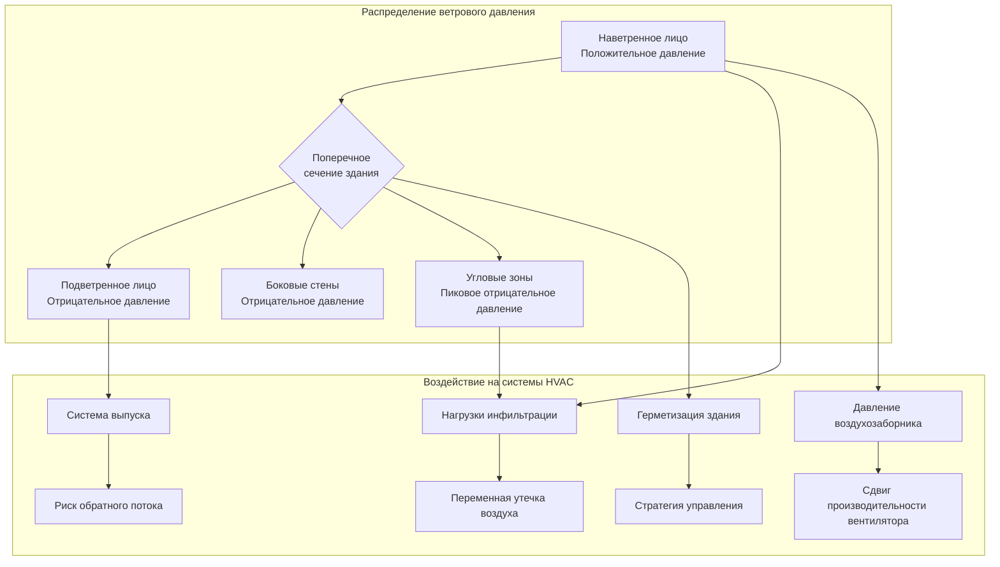
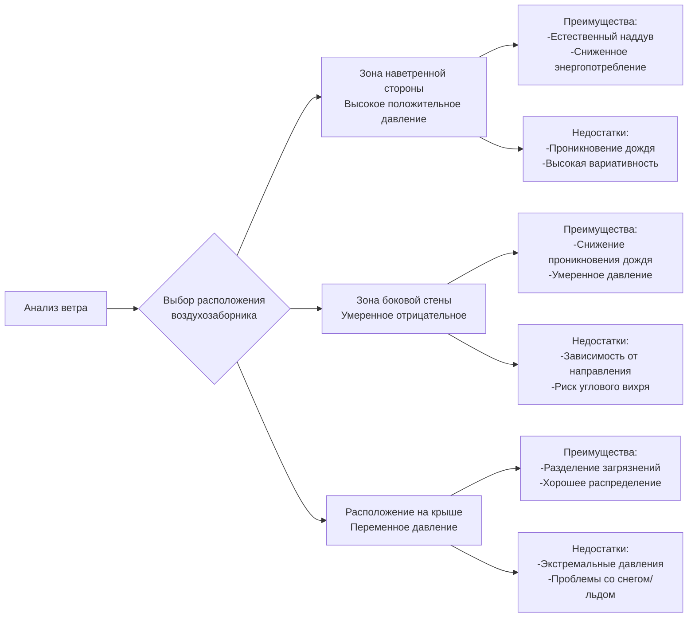

## Обзор

Ветровое давление создает значительные проблемы для систем HVAC в высотных зданиях, вызывая динамические перепады давления по всей ограждающей конструкции здания. Эти колебания давления способствуют инфильтрации, влияют на производительность системы вентиляции и усложняют проектирование воздухозаборников. Распределение давления вокруг здания зависит от скорости ветра, направления ветра, геометрии здания и окружающего ландшафта.

## Фундаментальные соотношения ветрового давления

Скоростной напор ветра на высоте $z$ над землей вычисляется по следующему соотношению:

$$q_z = 0.0613 \cdot K_z \cdot K_{zt} \cdot K_d \cdot V^2$$

Где:
- $q_z$ = скоростной напор на высоте $z$ (кПа)
- $K_z$ = коэффициент скоростного напора, зависящий от высоты и рельефа
- $K_{zt}$ = топографический коэффициент
- $K_d$ = коэффициент направленности ветра
- $V$ = базовая скорость ветра (м/с)

Коэффициент скоростного напора увеличивается с высотой в соответствии с категориями рельефа ASCE 7, отражая профиль пограничного слоя атмосферы.

## Распределение коэффициентов давления

Ветром-индуцированное давление на поверхности здания выражается как:

$$p = q_z \cdot G \cdot C_p$$

Где:
- $p$ = расчетное ветровое давление (кПа)
- $G$ = коэффициент воздействия порывов ветра
- $C_p$ = коэффициент внешнего давления (безразмерный)

### Характеристики давления с наветренной и подветренной сторон

Коэффициент давления $C_p$ резко изменяется по периметру здания:

| Расположение поверхности | Типичный диапазон $C_p$ | Тип давления | Воздействие на HVAC |
|--------------------------|--------------------------|--------------|----------------------|
| Наветренное лицо (центр) | +0,6 до +0,8 | Положительное (сжатие) | Источник инфильтрации, наддув воздухозаборника |
| Подветренное лицо (центр) | -0,3 до -0,5 | Отрицательное (разрежение) | Источник экфильтрации, помощь выпуску |
| Боковые стены (параллельно ветру) | -0,5 до -0,7 | Отрицательное (разрежение) | Перекрестная инфильтрация |
| Углы здания | -0,8 до -1,2 | Сильное отрицательное (вихрь) | Максимальный потенциал инфильтрации |
| Края крыши | -1,0 до -1,8 | Экстремальное отрицательное | Проблемы с завершением выпуска |

Наветренное лицо испытывает положительное давление (давление застоя), в то время как подветренные и боковые поверхности испытывают отрицательное давление из-за отделения потока и образования следа. Угловые вихри создают наиболее серьезные отрицательные давления.

## Комбинированное воздействие ветра и эффекта дымовой трубы

В высотных зданиях ветровое давление взаимодействует с эффектом дымовой трубы, создавая сложные распределения давления:

$$\Delta p_{total} = \Delta p_{stack} + \Delta p_{wind}$$

Где давление эффекта дымовой трубы составляет:

$$\Delta p_{stack} = C_s \cdot h \cdot \left(\frac{1}{T_o} - \frac{1}{T_i}\right)$$

С:
- $C_s$ = 0.0342 \text{ (Па·м·K⁻¹)}$ для стандартной плотности воздуха
- $h$ = высота выше нейтрального уровня давления (м)
- $T_o$, $T_i$ = абсолютная температура наружного и внутреннего воздуха (K)

Нейтральный уровень давления смещается вертикально в зависимости от направления и скорости ветра. С наветренной стороны нейтральный уровень смещается вверх; с подветренной стороны - вниз.

## Влияние на инфильтрацию

Ветровая инфильтрация через утечки в ограждающей конструкции здания рассчитывается по формуле:

$$Q_{inf} = C \cdot A \cdot (\Delta p)^n$$

Где:
- $Q_{inf}$ = расход инфильтрации (м³/ч)
- $C$ = коэффициент потока (зависит от типа отверстия)
- $A$ = площадь утечки (см²)
- $\Delta p$ = перепад давления (Па)
- $n$ = показатель потока (0,6-0,7 для типичных отверстий)

Для высотного здания с утечкой ограждающей конструкции 2,0 м³/(ч·м²) при 75 Па, колебания ветрового давления от 25 до 150 Па могут изменять расходы инфильтрации в 2-3 раза, что существенно влияет на нагрузки отопления и охлаждения.

## Особенности проектирования воздухозаборников

Воздействие ветрового давления создает критические проблемы для систем воздухозаборников:

### Стратегия расположения воздухозаборника

### Требования к выравниванию давления

Стандарт ASHRAE 62.1 требует, чтобы системы воздухозаборников компенсировали колебания давления. Стратегии проектирования включают:

1. **Множественные расположения воздухозаборников** с автоматическим управлением заслонками для выбора оптимального воздухозаборника в зависимости от направления ветра
2. **Регулирование потока, независимое от давления**, с использованием калибруемого измерения расхода воздуха и модулирующих заслонок
3. **Нагнетание в приемную камеру** для амортизации кратковременных колебаний давления
4. **Модуляция скорости вентилятора** для поддержания постоянного расхода наружного воздуха несмотря на изменение статического давления

### Компенсация производительности вентилятора

Воздействие ветрового давления смещает рабочие точки вентилятора на кривой производительности:

$$\Delta SP_{total} = \Delta SP_{system} \pm p_{wind}$$

Для приточного вентилятора с расчетным статическим давлением 100 Па, воздухозаборник с наветренной стороны, испытывающий +75 Па ветрового давления, эффективно снижает сопротивление системы, увеличивая расход воздуха и потенциально вызывая проблемы с шумом и управлением. Воздухозаборник с подветренной стороны при -75 Па увеличивает эффективное сопротивление, снижая расход воздуха ниже расчетного.

Частотно-регулируемые приводы (VFD) с управлением отслеживанием расхода воздуха компенсируют эти колебания путем модуляции скорости вентилятора для поддержания постоянного объемного расхода.

## Скорость ветра проектирования в зависимости от высоты

ASCE 7 определяет, что скорость ветра проектирования увеличивается с высотой в соответствии с профилем степенного закона:

$$V_z = V_{\text{ref}} \cdot \left(\frac{z}{z_{\text{ref}}}\right)^\alpha$$

Где $\alpha$ варьируется от 0,14 (открытая местность) до 0,33 (городская среда). Для здания высотой 183 м в городской среде скорость ветра на крыше может быть в 1,8-2,2 раза больше скорости ветра на высоте 9 м, производя скоростные напоры в 3-5 раз большие.

## Испытания в аэродинамической трубе и CFD-анализ

Для зданий, превышающих 122 м в высоту или имеющих необычную геометрию, ASCE 7 допускает испытания в аэродинамической трубе для установления специфичных для участка коэффициентов давления. Анализ вычислительной гидродинамики (CFD) обеспечивает детальные распределения давления для:

- Оптимизации воздухозаборников
- Анализа дисперсии выпуска
- Оценки ветра на уровне пешеходов
- Проектирования давления облицовки

Результаты испытаний в аэродинамической трубе или CFD обычно выявляют коэффициенты давления на 20-40% отличающиеся от значений кодекса для сложных геометрий, что существенно влияет на проектирование HVAC.

## Практические рекомендации по проектированию

**Управление инфильтрацией:**
- Проектировать герметичность ограждающей конструкции 1,0-1,5 м³/(ч·м²) при 75 Па для занятых помещений
- Внедрять секционирование с управлением давлением этаж за этажом
- Использовать преддверия в главных входах для снижения переходящей инфильтрации

**Проектирование воздухозаборника:**
- Располагать воздухозаборники вдали от зон углового вихря (минимум 0,1 × ширины здания от углов)
- Предусмотреть резервные расположения воздухозаборников с возможностью автоматического выбора
- Проектировать для диапазона вариации давления минимум ±12 Па
- Установить ограничители скорости в воздухозаборнике для предотвращения чрезмерного расхода воздуха при сильном ветре

**Герметизация системы:**
- Поддерживать герметизацию здания +7 до +12 Па относительно наружного воздуха
- Внедрять мониторинг давления в реальном времени с автоматической регулировкой
- Координировать стратегию герметизации с требованиями управления дымом согласно NFPA 92

## Ссылки

- ASCE 7: Minimum Design Loads for Buildings and Other Structures
- ASHRAE Fundamentals Handbook, Chapter 24: Airflow Around Buildings
- ASHRAE Standard 62.1: Ventilation for Acceptable Indoor Air Quality
