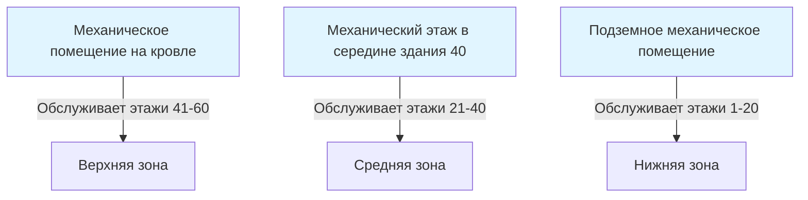
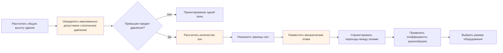

Вертикальное зонирование разделяет высотные здания на отдельные HVAC зоны, расположенные вертикально один над другим, для управления ограничениями статического давления, адаптации к различным требованиям арендаторов и оптимизации производительности системы. В отличие от горизонтального зонирования, которое разделяет площади этажей, вертикальное зонирование решает уникальные проблемы, создаваемые перепадами высоты в конструкции высотных зданий.

## Физическая основа вертикального зонирования

Основной движущей силой вертикального зонирования является **гидростатическое давление, меняющееся с высотой**. Давление в водяном столбе увеличивается линейно с глубиной в соответствии с:

$$P = \rho g h$$

где $\rho$ — плотность жидкости (кг/м³), $g$ — ускорение свободного падения (9,81 м/с²), а $h$ — вертикальная высота (м).

Для систем охлажденной воды каждые 10 м высоты создают приблизительно 10 кПа статического давления. Здание высотой 300 м создает перепад гидростатического давления 300 кПа между самым низким и самым высоким этажами. Это давление превышает несущую способность стандартных компонентов гидравлических систем, что делает вертикальное зонирование физической необходимостью, а не выбором проектировщика.

## Основные факторы вертикального зонирования

### Ограничения статического давления

**Системы охлажденной воды** обычно ограничивают высоту зон 150–200 м на основе:
- Номинальных давлений трубопроводов (стандартные фланцы ANSI B16.5: 2,0–2,8 МПа)
- Ограничений конструкции корпусов клапанов
- Целостности заголовков и соединений катушек
- Возможностей уплотнений насоса

**Системы конденсаторной воды** сталкиваются с аналогичными ограничениями, но могут использовать компоненты с более высоким рейтингом давления с учетом более простой конфигурации контура.

**Холодильные системы** испытывают изменения давления как от высоты, так и от температуры. Разница давления для вертикального холодильного стояка подчиняется:

$$\Delta P = \frac{\rho_L - \rho_V}{2} g h$$

где $\rho_L$ и $\rho_V$ представляют плотности жидкости и пара. Возврат масла становится проблематичным на высоте более 30–40 м для систем прямого расширения, ограничивая их применимость в высотных зданиях.

### Разнообразие нагрузок и коэффициенты спроса

Вертикальное зонирование позволяет применять различные коэффициенты спроса для каждой зоны. Справочник ASHRAE—HVAC Applications рекомендует коэффициенты разнообразия на основе высоты здания и характеров занятости:

| Секция здания | Типичный коэффициент разнообразия | Обоснование |
|-----------------|-----------------------------------|-----------|
| Нижняя зона (0–20 этажей) | 0,85–0,90 | Высокая корреляция занятости |
| Средняя зона (20–40 этажей) | 0,75–0,85 | Умеренное разнообразие |
| Верхняя зона (40+ этажей) | 0,70–0,80 | Большее разнообразие занятости |

Коэффициент разнообразия учитывает статистическую маловероятность того, что все помещения одновременно достигнут пиковой нагрузки. Для здания с $N$ зонами, общая подключенная нагрузка $Q_{total}$ связана с индивидуальными нагрузками зон $Q_i$ через:

$$Q_{total} = \sum_{i=1}^{N} (D_i \cdot Q_i)$$

где $D_i$ — коэффициент разнообразия для зоны $i$.

### Тип арендатора и требования к эксплуатации

Различные секции здания часто обслуживают различные функции. Многофункциональная башня может содержать розничную торговлю (этажи 1–3), офисное пространство (этажи 4–40) и жилые единицы (этажи 41–60). Каждый тип использования требует отчетливых:
- Графиков работы и стратегий снижения температуры
- Норм вентиляции (ASHRAE 62.1 варьируется по категориям занятости)
- Уставок температуры и влажности
- Детализации управления и возможностей переопределения

Вертикальное зонирование по границам типов использования предотвращает операционные конфликты и позволяет независимое планирование.

## Типичные конфигурации высоты зон

Стандартные высоты вертикальных зон зависят от типа системы и расчетных давлений:

**Системы полностью водяные (фанкойлы, радиантные):** 15–25 этажей на зону
**Системы воздушно-водяные (индукционные блоки):** 12–20 этажей на зону
**Системы полностью воздушные (VAV):** 20–30 этажей на зону (ограничены трением в воздуховодах, а не гидростатическим давлением)

Офисная башня на 60 этажей обычно использует три вертикальные зоны:
- **Нижняя зона:** Этажи 1–20 (обслуживаются из подземного механического помещения)
- **Средняя зона:** Этажи 21–40 (обслуживаются из механического этажа в середине здания)
- **Верхняя зона:** Этажи 41–60 (обслуживаются из верхнего механического помещения или кровельной установки)

## Размещение механических этажей

Механические этажи содержат центральное оборудование для каждой вертикальной зоны. Стратегическое размещение минимизирует потери при распределении и конструктивные нагрузки:

### Критерии размещения

**Конструктивные соображения:** Механические этажи требуют повышенной нагрузки на перекрытие (обычно 7,2–9,6 кПа в сравнении с 2,4–4,8 кПа для офисных этажей). Размещение их на структурных переходных этажах или над ядром здания оптимизирует расположение колонн.

**Эффективность распределения:** Централизация механических этажей в пределах обслуживаемых зон минимизирует энергию насоса. Для зоны, обслуживающей этажи с $n_1$ по $n_2$, оптимальное размещение механического этажа составляет приблизительно:

$$n_{mech} \approx \frac{n_1 + n_2}{2}$$

Это минимизирует среднее расстояние распределения и связанные с ним потери давления.

**Акустическая изоляция:** Механические этажи должны избегать смежности с чувствительными к шуму помещениями (кабинеты руководства, жилые единицы). Размещение их над розничной торговлей или парковками обеспечивает акустическую защиту.

## Стратегии переходов между зонами

Переход между вертикальными зонами требует управления перепадами давления и температуры при сохранении целостности системы.

### Станции снижения давления

Где зоны пересекаются или совместно используют стояки, клапаны снижения давления (PRV) защищают зоны с низким давлением от статического давления зон с высоким давлением. Станции PRV обычно включают:
- Клапан снижения давления с управляемостью 2:1 до 4:1
- Фильтр выше по потоку (40–60 меш)
- Датчики давления с обеих сторон
- Перепуск с отсекающими клапанами для обслуживания
- Предохранительный клапан ниже по потоку, установленный на 10–15% выше желаемого давления

### Изоляция теплообменником

Для максимальной гидравлической разделения, пластинчатые теплообменники полностью изолируют вертикальные зоны. Этот подход:
- Исключает передачу статического давления между зонами
- Позволяет использовать различные химические составы воды или концентрации гликоля на зону
- Увеличивает первоначальную стоимость, но упрощает управление давлением
- Вводит штраф за температуру приближения (обычно 1–2°C)

Эффективность теплопередачи $\epsilon$ для противоточного теплообменника равна:

$$\epsilon = \frac{1 - e^{-NTU(1-C_r)}}{1 - C_r e^{-NTU(1-C_r)}}$$

где $NTU$ — число единиц переноса, а $C_r$ — отношение тепловых мощностей. Для переходов между вертикальными зонами целевой показатель $\epsilon \geq 0,85$ минимизирует штраф за приближение.

### Расположение трубопроводов на переходах

Двухтрубные и четырехтрубные системы требуют тщательного проектирования на границах зон. Стандарт ASHRAE 90.1 требует отсекающих клапанов на переходах между зонами для обеспечения независимой работы и обслуживания. Стояки обычно имеют:
- Электромоторные отсекающие клапаны на каждой зоне
- Датчики давления и скважины для термометров для диагностики
- Сейсмическое крепление на проникновениях механического этажа
- Расширительные петли или гибкие соединители для размещения теплового расширения

## Процесс проектирования вертикального зонирования

Последовательность проектирования обеспечивает, чтобы физические ограничения управляли решениями по зонированию до оптимизации по стоимости или эффективности.

## Эксплуатационные преимущества

Помимо решения физических ограничений, вертикальное зонирование обеспечивает эксплуатационные преимущества:
- **Изоляция обслуживания:** Остановка одной зоны для обслуживания оставляет другие зоны в рабочем состоянии
- **Поэтапный пуск:** Зоны могут быть пущены в эксплуатацию и заняты последовательно по мере завершения строительства
- **Поэтапное увеличение мощности:** Меньшее оборудование на зону позволяет использовать несколько установок для резервирования и поэтапного включения
- **Оптимизация энергии:** Независимое управление зонами позволяет снижение температуры в периоды низкой занятости

Вертикальное зонирование трансформирует физический вызов HVAC в высотных зданиях в возможность повышенной операционной гибкости и устойчивости системы.
