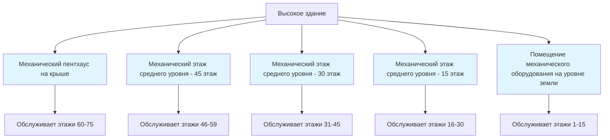
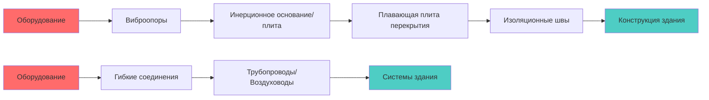

Высокие здания требуют стратегического размещения помещений механического оборудования для эффективного обслуживания вертикальных зон при одновременном учёте конструктивных, акустических и эксплуатационных ограничений. Распределение и проектирование этих пространств принципиально определяет производительность системы, энергоэффективность и доступность для обслуживания.

## Небесные вестибюли и стратегия механических этажей

Механические этажи обычно располагаются с интервалом от 15 до 30 этажей в современном строительстве высоких зданий. Такое расстояние уравновешивает гидравлические ограничения, эффективность распределения электроэнергии и конструктивные соображения. Концепция небесного вестибюля интегрирует помещения механического оборудования с этажами передачи лифтов, оптимизируя использование строительного ядра.

Вертикальный перепад давления определяет частоту механических этажей. Для водяных систем пределы статического давления диктуют максимальные вертикальные пролёты:

$$P_{static} = \rho g h$$

где $\rho$ = плотность воды (1000 кг/м³), $g$ = ускорение свободного падения (9,81 м/с²), и $h$ = вертикальная высота.

Зона из 20 этажей (примерно 80 м) генерирует статическое давление 785 кПа. Стандартные компоненты, рассчитанные на 1034 кПа, обеспечивают адекватный запас прочности. За этим пределом необходимы промежуточные механические этажи для предотвращения отказа оборудования и чрезмерного энергопотребления от избыточного давления.

## Методология определения размеров помещений оборудования

Размеры помещений оборудования вычисляются из расчётов тепловой нагрузки, выбора оборудования и требований к зазорам согласно ASHRAE Standard 15 и спецификациям производителя. Фундаментальное распределение площади следует:

$$A_{room} = A_{equip} + A_{maint} + A_{circ}$$

где $A_{room}$ = общая площадь помещения, $A_{equip}$ = площадь оборудования, $A_{maint}$ = зазоры для обслуживания, $A_{circ}$ = пути циркуляции.

ASHRAE Guideline 36 рекомендует минимальные зазоры:
- Фронтальный доступ: 1,2 м минимум
- Задний доступ: 0,9 м минимум
- Боковые зазоры: 0,6 м минимум
- Зазор над головой: 2,4 м минимум

| Тип оборудования | Коэффициент площади | Высота потолка |
|------------------|---------------------|-----------------|
| Приточно-вытяжные установки | 2,5× площадь основания | 3,6-4,5 м |
| Чиллеры (водяного охлаждения) | 3,0× площадь основания | 4,0-5,0 м |
| Котлы | 2,5× площадь основания | 3,6-4,5 м |
| Насосы и распределение | 2,0× площадь основания | 3,0-3,6 м |
| Электрооборудование/Управление | 1,5× площадь основания | 3,0 м |

Вертикальные проёмы для трубопроводов и воздуховодов потребляют дополнительную площадь механического этажа. Выделите 2-4% площади механического этажа для проёмов валов, варьируясь в зависимости от высоты здания и сложности системы.

## Рассмотрение конструктивных нагрузок

Механическое оборудование налагает сосредоточенные нагрузки, значительно превышающие типичную нагрузку офисного этажа (2,4-4,8 кПа). Координация конструкции во время проектирования предотвращает дорогостоящее усиление во время строительства.

Постоянные нагрузки включают массу оборудования, бетонные подстилающие плиты, системы трубопроводов, заполненные водой, и архитектурные отделки. Рабочие нагрузки добавляют массу воды в циркулирующих системах. Уравнение суммарной нагрузки:

$$L_{total} = L_{equip} + L_{fluid} + L_{struct} + L_{dynamic}$$

Типичная нагрузка механического этажа варьируется от 7,2 до 12,0 кПа, с сосредоточенными нагрузками в местах расположения оборудования, достигающими 15-25 кПа. Чиллеры и приточно-вытяжные установки создают наибольшие точечные нагрузки.

| Оборудование | Масса единицы (кН) | Заполненная масса (кН) | Нагрузка на этаж (кПа) |
|--------------|--------------------|-----------------------|------------------------|
| Чиллер мощностью 1760 кВт | 45-55 | 65-80 | 18-22 |
| Большая приточно-вытяжная установка (50 000 CFM / 84 500 м³/ч) | 25-35 | 30-40 | 12-16 |
| Градирня | 30-40 | 50-70 | 15-20 |
| Котел (5 ГДж) | 20-30 | 25-35 | 10-14 |

Системы виброизоляции добавляют сложность. Пружинные опоры требуют конструктивной гибкости, в то время как инерционные основания увеличивают постоянные нагрузки, но улучшают эффективность изоляции. Взаимосвязь собственной частоты управляет эффективностью изоляции:

$$f_n = \frac{1}{2\pi}\sqrt{\frac{k}{m}}$$

где $f_n$ = собственная частота, $k$ = жёсткость пружины, $m$ = суммарная масса оборудования и инерционного основания.

## Шумо- и виброизоляция

Передача звука из помещений механического оборудования требует многоуровневого управления, охватывающего воздушные и структурные пути. ASHRAE приложения указывают критерии NC-35 на NC-40 для прилегающих занятых пространств.

Воздушная изоляция использует массивную конструкцию (200-300 мм бетон) в сочетании с упругим монтажом. Закон массы управляет потерей звука при передаче:

$$TL = 20\log_{10}(m \cdot f) - 42$$

где $TL$ = потеря звука при передаче (дБ), $m$ = поверхностная плотность (кг/м²), $f$ = частота (Гц).

Управление вибрацией, вызванной конструкцией, требует полной механической изоляции:
1. Оборудование, установленное на виброопоры (пружинные или неопреновые)
2. Трубопроводы с гибкими соединениями в пределах 3× размеров оборудования
3. Воздуховоды с гибкими полотняными соединениями
4. Электрические кабель-каналы с гибкими фитингами
5. Плавающие плиты перекрытий для критических применений

## Требования доступа и обслуживания

Компоновка помещения оборудования должна предусматривать снятие и замену основных компонентов. Анализ критического пути определяет самый крупный элемент оборудования и требуемый маршрут извлечения.

Требования к доступу согласно IMC Section 306:
- Минимальная ширина дверного проёма: ширина оборудования + 0,3 м
- Ширина коридора: 1,2 м минимум, 1,8 м предпочтительно
- Зазор от пола до потолка: самое высокое оборудование + 0,6 м
- Точки строповки: рассчитаны на 2× массу самого тяжёлого компонента

Доступ грузового лифта к механическим этажам исключает операции строповки через фасад здания. Если лифты не могут достичь механических этажей, постоянные люки на крыше (2,4 м × 2,4 м минимум) позволяют доступ крана.

## Вентиляция помещения оборудования

Помещения механического оборудования требуют вентиляции для отвода тепла, подачи воздуха для горения (если применимо) и безопасности сотрудников при обслуживании. Тепловыделение от неэффективности оборудования управляет нагрузками вентиляции:

$$Q_{vent} = \frac{P_{loss}}{\rho c_p \Delta T}$$

где $Q_{vent}$ = требуемая скорость вентиляции (м³/с), $P_{loss}$ = тепловыделение оборудования (Вт), $\Delta T$ = допустимое повышение температуры (обычно 5-8°C).

Неэффективность электрического двигателя, трение насоса и потери трансформатора создают значительное тепловыделение. Установка чиллера мощностью 200 кВт может отводить 8-12 кВт в помещение оборудования. Без адекватной вентиляции температуры окружающей среды превышают допустимые пределы (максимум 40°C согласно ASHRAE Standard 15).

Оборудование для горения требует выделенного наружного воздуха согласно IMC Section 701: 50 CFM (85 м³/ч) на 293 кВт входной мощности выше 293 кВт, с минимальными требованиями ниже этого порога.

## Заключение

Проектирование помещений оборудования для вертикальных зон высоких зданий интегрирует тепловую инженерию, анализ конструкции, акустическое управление и операционное планирование. Правильное определение размеров, стратегическое размещение, адекватная конструктивная поддержка и эффективная изоляция создают надёжные, удобные для обслуживания механические системы, эффективно обслуживающие высокие здания на протяжении всего срока их эксплуатации.
