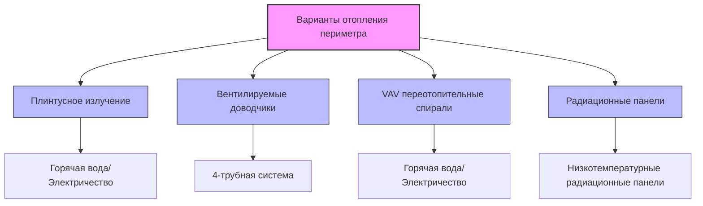

## Физические основы разделения периметральных и центральных зон

Проектирование HVAC в высотных зданиях опирается на фундаментальные различия теплопередачи между периметральными зонами, доминируемыми ограждающей конструкцией, и внутренне нагруженными центральными пространствами. Периметральная зона испытывает переходные тепловые нагрузки, обусловленные солнечной радиацией, колебаниями наружной температуры и воздействием ветра, в то время как центральная зона поддерживает относительно постоянные охлаждающие нагрузки от людей, освещения и оборудования. Это расхождение в тепловом поведении требует применения отдельных стратегий зонирования.

Стандартная глубина периметральной зоны 12-15 футов (3,7-4,6 м) определяется эффективной глубиной проникновения дневного света и радиусом теплового влияния ограждающей конструкции здания. За пределами этой глубины внутренние нагрузки доминируют в тепловом балансе, создавая явно различные требования HVAC.

## Тепловые характеристики периметральной зоны

### Изменчивость солнечной нагрузки

Солнечная радиация через остекление создает временно-зависимые тепловые нагрузки, которые зависят от ориентации, конструкции фасада и затенения. Мгновенный солнечный теплопритокт через оконные проемы составляет:

$$Q_{solar} = A_{glass} \times SHGC \times I_{incident} \times \cos(\theta)$$

Где $A_{glass}$ — площадь остекления (м²), $SHGC$ — коэффициент солнечного теплопритока (безразмерный), $I_{incident}$ — интенсивность падающей солнечной радиации (кВт/м²), и $\theta$ — угол падения.

Пиковые солнечные нагрузки варьируются кардинально в зависимости от ориентации:

| Ориентация | Пиковой солнечный прирост (кВт/м²) | Время пика | Проектное соображение |
|-------------|------------------------------|--------------|---------------------|
| Южная | 4,4-5,1 | Зимой в полдень | Круглогодичная изменчивость |
| Восточная | 5,7-6,4 | Летним утром | Утренний пик охлаждения |
| Западная | 5,7-6,4 | Летним днём | Дневной пик вызывает обеспокоенность |
| Северная | 1,3-1,9 | Только рассеянное излучение | Минимальное воздействие солнца |

Эта ориентационно-зависимая изменчивость требует отдельных периметральных зон для каждого фасада здания. Стандарт ASHRAE 90.1, раздел 6.5.1, предписывает отдельное управление термостатом для помещений, обращённых в разные стороны света, когда площадь пола превышает установленные пороги.

### Кондуктивная теплопередача

Периметральная зона испытывает кондуктивную теплопередачу через ограждающую конструкцию здания:

$$Q_{cond} = U \times A \times (T_{outdoor} - T_{indoor})$$

Где $U$ — коэффициент теплопередачи (кВт/(м²·К)), $A$ — площадь ограждающей конструкции (м²), и температуры в °C. Этот компонент нагрузки изменяет направление по сезонам и варьируется в зависимости от наружных условий, создавая потребность в отоплении в холодную погоду, которая никогда не возникает в центральной зоне.

## Тепловые характеристики центральной зоны

### Доминирование внутренних нагрузок

Центральные зоны поддерживают охлаждающие нагрузки круглый год благодаря постоянной генерации внутреннего тепла. Общая явная охлаждающая нагрузка для типичной центральной зоны:

$$Q_{core} = Q_{lights} + Q_{equipment} + Q_{occupants,sensible}$$

Типичные плотности охлаждающих нагрузок центральной зоны:

- **Освещение**: 8,6-12,9 Вт/м² (современные системы светодиодного освещения)
- **Оборудование**: 16,1-32,3 Вт/м² (компьютеры, серверы, приборы)
- **Люди**: 73-132 Вт на человека (явное тепло)
- **Итого**: 47-79 кВт/м² охлаждающей нагрузки

Охлаждающая нагрузка центральной зоны остаётся относительно постоянной независимо от наружных условий, режима работы или сезона. Эта стабильность резко контрастирует с колебаниями нагрузок периметральной зоны на 126-190 кВт/м² между летними и зимними условиями.

### Потенциал отопления вентиляционного воздуха

Хотя центральные зоны требуют постоянного охлаждения, вентиляционный воздух, поступающий в эти помещения, может использоваться стратегически. В холодную погоду наружный воздух при -18 до -7°C может быть нагрет до 13-16°C и подан непосредственно в центральные зоны, сокращая механическую охлаждающую энергию. Это «свободное охлаждение» от вентиляционного воздуха обеспечивает:

$$Q_{ventilation,cooling} = \dot{m}_{air} \times c_p \times (T_{zone} - T_{OA,tempered})$$

Для центральной зоны площадью 930 м² при интенсивности вентиляции 0,4 м³/(ч·м²) с наружным воздухом при -12°C, нагретым до 13°C, обеспечивает примерно 25 кВт охлаждения в зону при 24°C.

## Стратегии систем периметральных зон

### Отдельные системы отопления

Периметральные зоны требуют выделенной отопительной мощности для компенсации потерь через ограждающую конструкцию. Распространённые подходы:

Выбор зависит от ограничений интеграции фасада, начальной стоимости и целей эффективности работы. Четырёхтрубные системы с вентилируемыми доводчиками обеспечивают одновременное отопление и охлаждение, критически важные для переходных периодов, когда южные фасады требуют охлаждения, а северные — отопления.

### Разделение зон по ориентации

Надлежащее зонирование периметра делит ограждающую конструкцию здания на ориентационно-специфичные зоны. Для прямоугольной конфигурации этажа:

1. **Северная зона**: Минимальный солнечный прирост, доминирование отопления зимой, скромное охлаждение летом
2. **Восточная зона**: Утренний солнечный пик, охлаждение требуется к середине утра даже зимой
3. **Южная зона**: Максимальный зимний солнечный прирост (выгода от пассивного отопления), умеренные летние нагрузки при надлежащем затенении
4. **Западная зона**: Дневной солнечный пик, максимальные летние охлаждающие нагрузки, потенциальные проблемы с бликами

Угловые зоны испытывают комбинированные ориентации и оправдывают отдельное рассмотрение, когда позволяет организация пространства. Эффективный коэффициент солнечного теплопритока угловой зоны увеличивается на 30-40% по сравнению с однофасадными зонами из-за двойного фасадного воздействия.

## Соображения при интеграции фасадов

### Активные охлаждённые балки в периметральных зонах

Современное строительство высотных зданий всё чаще интегрирует подачу HVAC с системами фасадов. Активные охлаждённые балки, установленные в периметре, обеспечивают:

- **Отопление**: Спирали горячей воды компенсируют потери через ограждающую конструкцию
- **Охлаждение**: Спирали ледяной воды удаляют солнечные и ограждающие приросты
- **Вентиляция**: Воздуховод первичного воздуха индуцирует воздух в помещении через спирали

Конвективная теплопередача от периметральных балок:

$$Q_{beam} = \dot{m}_{induced} \times c_p \times (T_{return} - T_{supply})$$

Где индуцированный воздушный поток обычно составляет 3-5 кратное значение расхода первичного воздуха. Этот эффект индукции создаёт эффективное перемешивание и управление температурой на ограждающей конструкции здания.

### Подпольное распределение воздуха

Системы подпольного распределения воздуха (UFAD) в периметральных зонах подают кондиционированный воздух через диффузоры в полу рядом с фасадом. Стратифицированный температурный профиль в системах UFAD создаёт:

- **Нижняя зона** (0-1,8 м): Зона нахождения людей с прямым управлением температурой
- **Верхняя зона** (>1,8 м): Возвратный воздушный плэнум с повышенными температурами

Периметральные диффузоры UFAD должны подавать большие расходы воздуха, чем центральные диффузоры, для компенсации нагрузок через ограждающую конструкцию. Соотношение расхода периметр-центр обычно варьируется от 1,5:1 до 2,5:1 в зависимости от производительности фасада.

## Сравнение систем для смешанных зон

| Тип системы | Отопление периметра | Охлаждение центра | Одновременное отопление/охлаждение | Начальная стоимость | Эффективность |
|-------------|-------------------|--------------|------------------------------|------------|-----------|
| Двухканальный VAV | Отличное | Отличное | Да (смешивание) | Высокая | Среднее |
| 4-трубный вентилируемый доводчик | Отличное | Хорошее | Да (независимое) | Высокая | Хорошее |
| VAV с переотопл. спиралью | Хорошее | Отличное | Ограниченное | Средняя | Хорошее с DDC |
| Радиационная + DOAS | Отличное | Отличное | Да (отдельные системы) | Очень высокая | Отличное |
| Охлаждённая балка | Отличное | Отличное | Да (коммутация спирали) | Высокая | Отличное |

## Методология расчёта проектных нагрузок

Надлежащий подход к проектированию рассчитывает периметральные и центральные нагрузки отдельно в соответствии с методологией ASHRAE Fundamentals, глава 18:

1. **Периметральные зоны**: Включите солнечные приросты, кондукцию, инфильтрацию, внутренние нагрузки
2. **Центральные зоны**: Включите только внутренние нагрузки и воздействие вентиляционного воздуха
3. **Пиковое разнообразие**: Пики периметра редко совпадают с пиками центра

Пиковая охлаждающая нагрузка на уровне здания не равна сумме пиков зон:

$$Q_{building,peak} \neq \sum Q_{zone,peaks}$$

Вместо этого выполните почасовые расчёты нагрузок, чтобы определить фактический пик здания, который обычно возникает, когда периметральные солнечные нагрузки совпадают с максимальной занятостью. Этот пик обычно на 15-25% ниже суммы отдельных пиков зон, что значительно влияет на выбор размера центральной системы.

## Эксплуатационные соображения

Отдельное разделение периметра и центра на зоны обеспечивает:

- **Оптимизация ночного снижения**: Центральные зоны поддерживают охлаждение; периметральные зоны снижают отопление/охлаждение
- **Сезонный переход**: Периметральные зоны переходят между отоплением и охлаждением; центральные зоны остаются в режиме охлаждения круглый год
- **Реагирование на спрос**: Релаксация уставки периметральной зоны обеспечивает большее сокращение спроса, чем центральные зоны
- **Управление на основе занятости**: Датчики занятости центральной зоны обеспечивают большую экономию энергии благодаря более высоким базовым нагрузкам

Энергетическое воздействие надлежащего разделения периметра/центра на зоны колеблется от 15-30% сокращения годового потребления энергии HVAC по сравнению с однозонными системами, обслуживающими смешанные периметральные/центральные пространства.

## Ссылки

- ASHRAE Standard 90.1-2022, раздел 6.5.1: требования к термостату и управлению температурой
- ASHRAE Handbook - Fundamentals, глава 18: расчёты охлаждающих и отопительных нагрузок нежилых помещений
- ASHRAE Handbook - HVAC Applications, глава 3: коммерческие и общественные здания
