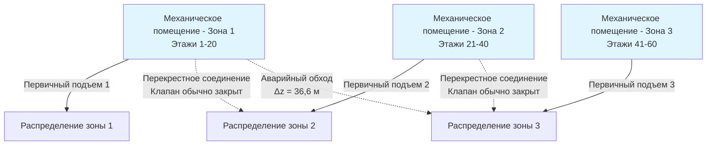
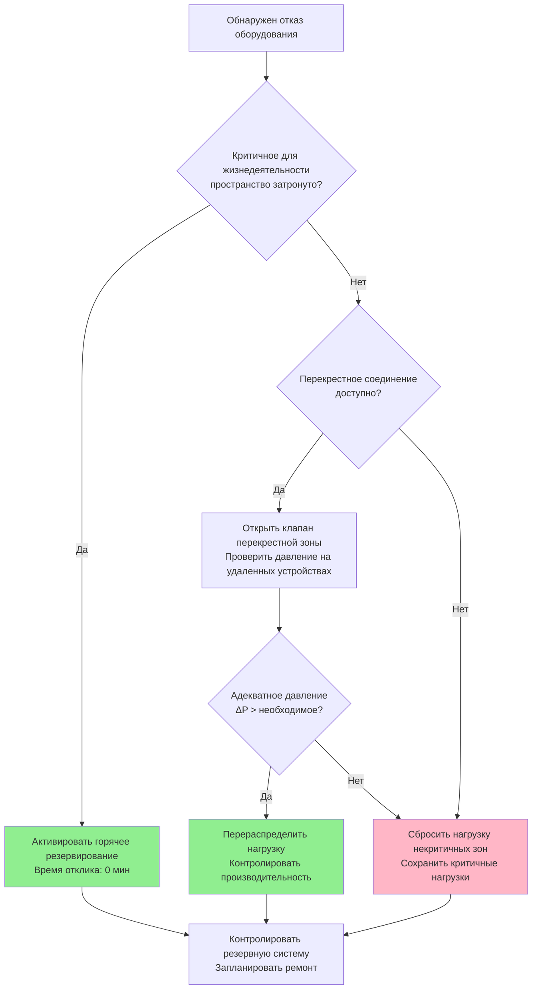

Резервирование в системах HVAC высотных зданий решает проблему катастрофических последствий отказа оборудования на нескольких этажах. Физика вертикального распределения давления в сочетании с невозможностью быстрого развертывания временных систем на высоте требует спроектированной резервной мощности, которая обеспечивает тепловой комфорт и соответствует требованиям безопасности жизни при отказах компонентов.

## Стратегии конфигурации резервирования

### Размерирование оборудования N+1

Резервирование N+1 обеспечивает резервную мощность, где N представляет минимальное оборудование, необходимое для удовлетворения проектной нагрузки, а дополнительный блок обеспечивает резервирование во время обслуживания или отказа. Методология размерирования принципиально отличается от простого увеличения мощности, так как каждый блок должен справляться с перераспределенной нагрузкой при отказе одного блока.

Для здания, требующего общей охлаждающей способности $Q_{\text{total}}$, мощность каждого блока в конфигурации N+1 становится:

$$Q_{\text{unit}} = \frac{Q_{\text{total}}}{N}$$

Это обеспечивает, что при отказе одного блока оставшиеся N блоков в совокупности обеспечивают требуемую мощность. Критическое различие состоит в последовательности управления—все блоки N+1 работают в пиковых условиях для поддержания эффективности, в то время как любой отдельный блок может быть изолирован без компрометации производительности.

**Сравнение размерирования N+1 по типам зон:**

| Конфигурация зоны | Количество оборудования | Мощность блока | Стратегия эксплуатации | Уровень резервирования |
|-------------------|------------------------|----------------|----------------------|----------------------|
| Одна зона, 3 чиллера | 2+1 | 50% каждый | Все работают на пике | Полное резервирование |
| Двойные зоны, 4 чиллера | 3+1 на зону | 33% каждый | Ротация резервирования | Полное резервирование |
| Тройные зоны, 6 чиллеров | 5+1 распределено | 20% каждый | Перекрестное резервирование | Частичное резервирование |
| Критичный этаж | 1+1 выделенный | 100% каждый | Горячее резервирование | Полное + N+1 |

### Архитектура перекрестного соединения между зонами

Перекрестные соединения между вертикальными зонами обеспечивают гидравлическое перераспределение мощности при отказе оборудования, обслуживающего одну зону. Физика, определяющая эффективные перекрестные соединения, сосредоточена на доступном давлении насоса для преодоления дополнительного перепада статического напора между зонами.

Давление, требуемое для потока между зонами:

$$\Delta P_{\text{cross}} = \rho g \Delta z + \Delta P_{\text{friction}} + \Delta P_{\text{control}}$$

где $\Delta z$ представляет вертикальную разницу высот между границами зон, $\Delta P_{\text{friction}}$ учитывает сопротивление трубопроводов, а $\Delta P_{\text{control}}$ поддерживает адекватное давление у самого высокого концевого устройства.

Перекрестные соединения вводят сложность в балансировку и управление. Гидравлический градиент, создаваемый взаимным соединением зон на разных высотах, вызывает непреднамеренную циркуляцию потока, если запорные клапаны остаются открытыми во время нормальной эксплуатации. Электромоторные клапаны с логикой отказоустойчивого положения (обычно закрыто, открывается по команде) предотвращают циркуляцию под действием гравитации, обеспечивая при этом передачу резервной мощности в экстренных ситуациях.

## Требования к резервированию для критичных арендаторов

Арендаторы с критичными операциями—центры обработки данных, торговые залы, медицинские учреждения—требуют резервирования сверх стандартных конфигураций N+1. Подход проектирования стратифицирует надежность на уровни, соответствующие критичности операций.

**Уровни резервирования для критичных пространств:**

| Уровень по классам | Конфигурация | Годовое время простоя | Пример применения |
|-------------------|--------------|---------------------|-------------------|
| Уровень I | N+0, одна цепь | 28,8 часов | Обычный офис |
| Уровень II | N+1, одна цепь | 22,0 часов | Профессиональные услуги |
| Уровень III | N+1, двойная цепь | 1,6 часов | Финансовая торговля |
| Уровень IV | 2(N+1), двойная цепь | 0,4 часов | Центры обработки данных |

Системы уровня III и IV требуют выделенного оборудования с изолированными путями распределения. Физика, определяющая улучшение надежности, исходит из статистической независимости—когда параллельные системы не имеют общих режимов отказа, совокупная вероятность отказа системы становится:

$$P_{\text{system failure}} = P_{\text{path A}} \times P_{\text{path B}}$$

Для систем с 99% индивидуальной надежностью двойные независимые пути достигают 99,99% совокупной надежности.

## Расчеты резервной мощности

Определение надлежащей резервной мощности требует анализа нагрузки сверх пиковых проектных условий. Работа при частичной нагрузке доминирует в годовых часах эксплуатации, и резервное оборудование должно поддерживать эффективность во всем спектре нагрузок.

Эффективная резервная мощность учитывает деградированную производительность при режимах отказа:

$$Q_{\text{standby,effective}} = Q_{\text{standby,rated}} \times \eta_{\text{failure mode}} \times f_{\text{distribution}}$$

где $\eta_{\text{failure mode}}$ представляет эффективность при повышенных долях нагрузки (обычно 0,85-0,95 для чиллеров, работающих при 80-90% мощности) и $f_{\text{distribution}}$ учитывает гидравлические ограничения при перераспределении мощности (0,90-1,00 в зависимости от конфигурации трубопроводов).

## Двойные системы подъемов путями распределения

Системы двойных подъемов обеспечивают физическое разделение путей распределения, исключая одиночные гидравлические отказы. Проектирование разделяет магистрали подачи и возврата на независимые вертикальные шахты с поперечными связями в стратегических местах для обеспечения реверса потока при изоляции подъема.

Гидравлическое проектирование должно учитывать неравномерные падения давления, когда один подъем справляется с полным потоком. Перепад давления между подъемами при работе с одним подъемом:

$$\Delta P_{\text{riser}} = f \frac{L}{D} \frac{\rho v^2}{2}$$

где скорость $v$ удваивается, когда поток консолидируется в один подъем, что в четыре раза увеличивает динамический член давления. Этот штраф по давлению требует увеличения размера подъемов (обычно диаметр 1,5×) или приемлемости сниженных расходов потока при сценариях отказа.

**Гидравлическая производительность двойных подъемов:**

| Режим эксплуатации | Поток на подъем | Отношение скоростей | Отношение падения давления | Доступная мощность |
|-------------------|----------------|---------------------|--------------------------|-------------------|
| Нормальный (оба подъема) | 50% | 1,0× | 1,0× | 100% |
| Отказ одного подъема | 100% | 2,0× | 4,0× | 75-85% |
| Увеличенные подъемы (1,5D) | 100% | 0,89× | 1,6× | 95-100% |

## Интеграция управления для резервированных систем

Резервная мощность обеспечивает надежность только при обнаружении отказов системами автоматизации зданий и выполнении последовательностей переключения быстрее, чем условия в пространстве деградируют. Время отклика управления зависит от расположения датчика, выполнения алгоритма и отклика исполнительного механизма.

Скорость отклонения температуры в некондиционируемом пространстве следует:

$$\frac{dT}{dt} = \frac{Q_{\text{gains}} - Q_{\text{HVAC}}}{m c_p}$$

Когда $Q_{\text{HVAC}}$ падает до нуля при отказе оборудования, тепловая массивность $m$ определяет постоянную времени для повышения температуры в пространстве. Для типичного офисного строительства с постоянной времени 2 часа температура повышается на 0,55°C за 6 минут при полной нагрузке охлаждения. Это устанавливает окно отклика 5-10 минут для активации резервной системы.

ASHRAE Standard 90.1 не требует определенных уровней резервирования, но требует документирования ожидаемого срока эксплуатации оборудования и доступности обслуживания. Приложения в высотных зданиях ссылаются на ASHRAE Guideline 36 для последовательностей операций, которые включают ответы режимов отказа и логику автоматического переключения.

Инженерное суждение по конфигурации резервирования уравновешивает капитальные инвестиции в резервное оборудование против финансовых и репутационных последствий прерывания обслуживания на нескольких этажах занятого пространства.
