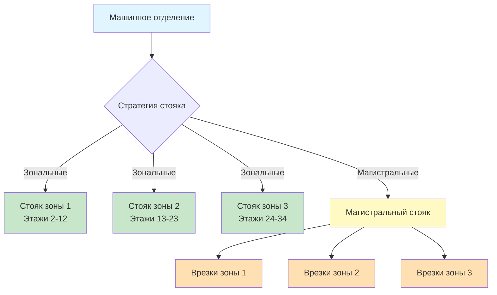
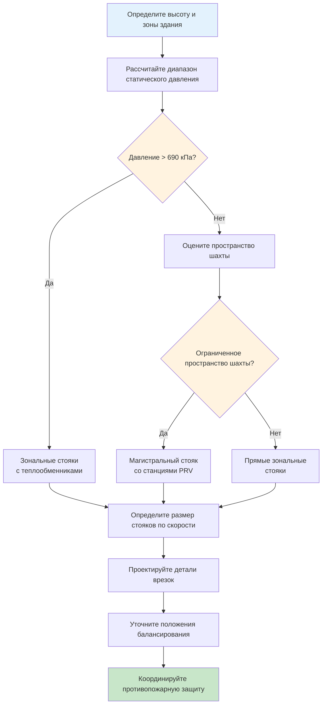

Проектирование стояков представляет критическую магистральную инфраструктуру для распределения отопления, охлаждения и вентиляции по вертикально зонированным зданиям. Выбор между независимыми зональными стояками и централизованными магистральными стояками с боковыми врезками принципиально влияет на производительность системы, стоимость монтажа, операционную гибкость и долгосрочную адаптивность.

## Зональные стояки или магистральные стояки

Основное архитектурное решение при вертикальном распределении включает выбор между независимыми зональными стояками или централизованными магистральными стояками с ветвевыми врезками.

### Системы зональных стояков

Зональные стояки обеспечивают независимое вертикальное распределение для каждой зоны HVAC, обычно обслуживая 6-12 этажей на зону в зданиях высотой более 20 этажей. Каждый стояк функционирует как изолированный контур с выделенными насосами или вентиляторами на уровне оборудования.

**Преимущества:**

- Независимые гидравлические или пневматические контуры исключают взаимное влияние между зонами
- Упрощенное управление давлением в узком диапазоне высот
- Повышенная надежность через разделение систем
- Сниженные требования к давлению для насосов или вентиляторов
- Упрощенные процедуры балансирования с изолированными контурами

**Недостатки:**

- Увеличенные требования к пространству шахты для нескольких параллельных стояков
- Более высокие первоначальные затраты на дублированную инфраструктуру распределения
- Ограниченная гибкость между зонами для распределения нагрузок
- Увеличенные требования к пересечениям огнестойких перекрытий

### Конфигурация магистрального стояка

Магистральные стояки используют крупные центральные распределительные магистрали, охватывающие высоту здания, с ветвевыми врезками на каждом уровне зоны или этажа. Этот подход консолидирует вертикальное распределение в минимальное количество пересечений шахты.

**Преимущества:**

- Минимизированное потребление пространства шахты
- Сниженные общие количества трубопровода или воздухопровода
- Большая гибкость для межзонального теплообмена или перераспределения воздуха
- Упрощенная координация с конструкциями благодаря меньшему количеству пересечений
- Более низкая первоначальная стоимость инфраструктуры распределения

**Недостатки:**

- Сложное управление давлением по всей высоте здания
- Потенциальные гидравлические или потоковые дисбалансы между зонами
- Уязвимость в одной точке, снижающая избыточность системы
- Повышенное энергопотребление насоса или вентилятора
- Более сложные требования к балансированию

## Балансирование давления между зонами

Вариации гидростатического или статического давления создают фундаментальный вызов при проектировании стояков. Для гидравлических систем дифференциал давления между зонами определяется:

$$\Delta P_{статическое} = \rho g \Delta h$$

где $\rho$ — плотность жидкости (кг/м³), $g$ — ускорение свободного падения (9,81 м/с²), и $\Delta h$ — разность высот (м).

Для 30-этажного здания с высотой этажа 4 м (всего 120 м) дифференциал гидростатического давления равняется:

$$\Delta P_{статическое} = 1000 \times 9,81 \times 120 = 1 177 200 \text{ Па} \approx 171 \text{ фунт/кв. дюйм}$$

Этот существенный дифференциал давления требует изоляции зон посредством:

1. **Станции редукторов давления** на каждой границе зоны
2. **Изоляция через теплообменники**, создающая гидравлическое разделение
3. **Насосы переменной частоты** с управлением дифференциальным давлением
4. **Устройства ограничения потока** на отдельных подключениях врезок

Для систем распределения воздуха вариации статического давления менее значительны, но все еще существенны:

$$\Delta P_{воздух} = \rho_{воздух} g \Delta h$$

При стандартных условиях ($\rho_{воздух}$ = 1,2 кг/м³) то же 120-метровое здание производит:

$$\Delta P_{воздух} = 1,2 \times 9,81 \times 120 = 1413 \text{ Па} \approx 5,6 \text{ дюйм в.ст.}$$

## Проектирование подключений врезок

Конфигурация ветвевых врезок критически влияет на распределение потока и стабильность балансирования. Надлежащее проектирование врезок следует этим принципам:

### Врезки гидравлических стояков

| Метод врезки | Применение | Коэффициент потерь давления | Стабильность балансирования |
|----------------|-------------|---------------------------|---------------------|
| Прямой тройник | Низкоэтажные, малые ветви | K = 0,9–1,2 | Слабая |
| Изогнутый фитинг 45° | Средневысокие, умеренные потоки | K = 0,4–0,6 | Хорошая |
| Врезка Вентури | Высокоэтажные, критичное балансирование | K = 0,2–0,3 | Отличная |
| Гибкое шланговое соединение | Изоляция оборудования | K = 1,5–2,5 | Удовлетворительная |

Локальная потеря давления на каждой врезке подчиняется:

$$\Delta P_{врезка} = K \frac{\rho v^2}{2}$$

где $K$ — коэффициент потерь и $v$ — скорость в ветви трубопровода (м/с).

ASHRAE Handbook—HVAC Systems and Equipment рекомендует поддерживать скорости в стояках между 1,2–2,4 м/с (4–8 фут/с) для систем охлажденной воды, чтобы предотвратить эрозию и минимизировать потери давления.

### Врезки воздуховодных стояков

Врезки распределения воздуха требуют тщательного внимания к балансированию давления и акустической производительности:

- **Объемные заслонки** на каждой врезке обеспечивают грубое балансирование
- **Венчурные расходомерные станции** позволяют проверку на основе измерений при наладке
- **Звукоглушители** справляются с разрывами потерь давления
- **Направляющие лопатки** в прямоугольных врезках снижают потери от турбулентности

## Рассмотрения гибкости в будущем

Срок службы здания обычно превышает 50 лет, в то время как системы HVAC подвергаются капитальному ремонту каждые 15–25 лет. Проектирование стояков должно учитывать предусмотренные адаптации:

**Стратегия перепроектирования:**

Проектируйте стояки для 125–150% начального расчетного потока, чтобы вместить:
- Будущее увеличение нагрузки на арендаторов
- Совершенствование технологии, требующее повышенных расходов
- Переход между различными типами систем
- Добавление дополнительного оборудования

**Заглушенные патрубки:**

Установите заглушенные соединения в стратегических местах:
- На каждом 3–4-м этаже магистральных стояков
- На полувысоте каждой зоны для будущего подразделения
- Рядом с центральными областями, подверженными улучшениям помещений

**Положения доступа:**

- Съемные панели стенок шахты в ключевых точках подключения
- Надлежащий зазор для замены трубопровода или воздухопровода
- Точки доступа крана или натяжения для обновления оборудования

## Оптимизация пространства шахты

Выделение пространства рисёрной шахты представляет дорогостоящую площадь в высотном строительстве. Оптимизируйте вертикальное распределение, используя:

### Принципы стекирования

Вертикальное выравнивание шахт через все этажи минимизирует сложность конструкции и затраты. Согласно требованиям Международного строительного кодекса, шахты, пересекающие огнестойкие конструкции, требуют:

- Огнестойкость 2-часовой защиты для зданий высотой более 23 м
- Сквозные системы герметизации пересечений, перечисленные для конкретных комбинаций труб/воздуховодов
- Доступ к обслуживанию на чередующихся этажах минимум

### Формула распределения пространства

Для предварительного планирования оценивайте площадь шахты, используя:

$$A_{шахта} = 1,5 \times \sum A_{стояк} + 0,6 \text{ м}^2$$

где $A_{стояк}$ — площадь поперечного сечения каждого трубопровода или воздухопровода, коэффициент 1,5 учитывает изоляцию и зазоры, и 0,6 м² обеспечивает пространство доступа.

### Координация многоцелевых услуг

Консолидируйте совместимые услуги в общих шахтах:

| Совместимые услуги | Требования разделения | Ссылка на код |
|---------------------|-------------------------|----------------|
| Подача/возврат охлажденной воды | Нет (одна система) | N/A |
| Отопительная вода и охлажденная вода | 150 мм минимум | ASHRAE 90.1 |
| HVAC и вентиляция сантехники | 300 мм минимум | IMC 302.1 |
| HVAC и электрический кабелепровод | По зазорам NEC | NEC 300.8 |

## Практическая реализация

Выбор между конфигурациями стояков зависит от множества факторов, оцениваемых в начале проектирования:

1. **Высота здания и количество зон** — Здания высотой более 40 этажей обычно требуют зональных стояков из-за ограничений давления
2. **Доступность центрального ядра** — Ограниченные ядра благоприятствуют магистральным стоякам несмотря на более высокие операционные затраты
3. **Требования к избыточности системы** — Критичные объекты требуют зональных систем для изоляции отказов
4. **Анализ стоимости жизненного цикла** — Энергетические затраты за 20 лет часто оправдывают зональные стояки несмотря на более высокую первоначальную стоимость

Успешное проектирование стояков уравновешивает эти конкурирующие приоритеты посредством тщательного анализа условий, специфичных для конкретного здания, а не применения предписывающих правил. Привлекайте механические, конструктивные и архитектурные команды на ранней стадии для оптимизации расположения и размеров шахт, обеспечивающих долгосрочную производительность здания.
