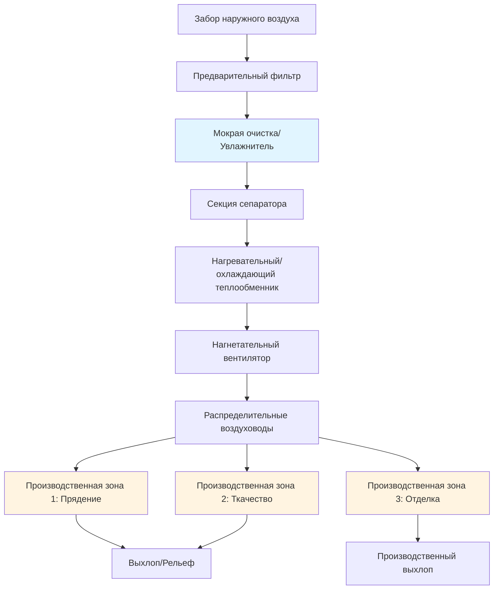
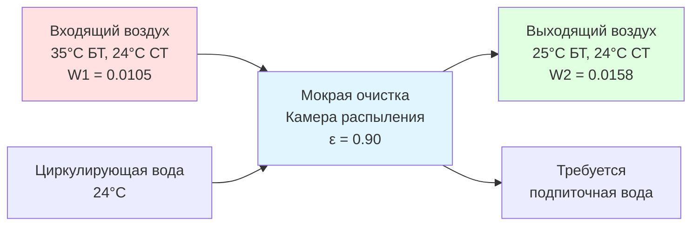

Текстильные производства требуют точного контроля окружающей среды для поддержания влагосодержания волокна, снижения статического электричества, минимизации пыли и обеспечения качества продукции. Система HVAC прямо влияет на прочность пряжи, внешний вид ткани, производительность и комфорт рабочих в различных производственных зонах с разными требованиями к температуре и влажности.

## Критические параметры окружающей среды

Текстильные волокна — гигроскопичные материалы, которые постоянно обмениваются влагой с окружающим воздухом. Поддержание точной относительной влажности предотвращает разрыв волокна, снижает накопление статического заряда и обеспечивает размерную стабильность во время переработки.

Равновесное влагосодержание (EMC) текстильных волокон зависит от условий окружающей среды:

$$EMC = f(RH, T, \text{тип волокна})$$

Для хлопковых волокон зависимость между относительной влажностью и влагоудержанием следует:

$$M = \frac{18.0 + 0.15 \cdot RH}{100 - 0.01 \cdot RH}$$

Где:
- $M$ = влагоудержание (%)
- $RH$ = относительная влажность (%)

Психрометрическое добавление влаги, необходимое для увлажнения:

$$\dot{m}_w = \dot{V} \cdot \rho \cdot (W_2 - W_1) \cdot 60$$

Где:
- $\dot{m}_w$ = скорость добавления воды (кг/ч)
- $\dot{V}$ = расход воздуха (м³/ч)
- $\rho$ = плотность воздуха (кг/м³, типично 1.2)
- $W_2$ = итоговое соотношение влажности (кг воды/кг сухого воздуха)
- $W_1$ = начальное соотношение влажности (кг воды/кг сухого воздуха)

## Требования к производственным зонам

Различные текстильные операции требуют специфических условий окружающей среды в зависимости от характеристик волокна и механических процессов.

| Производственная зона | Температура (°C) | Относительная влажность (%) | Воздухообмены/час | Основные требования |
|--------------|------------------|----------------------|------------------|------------------|
| Открытие и чесание | 24-27 | 55-65 | 6-8 | Контроль пыли, кондиционирование волокна |
| Кардочесание | 24-27 | 50-60 | 8-12 | Устранение статики, прочность волокна |
| Вытягивание и ровинг | 24-27 | 55-65 | 10-15 | Равномерность влаги, прочность ровинга |
| Прядение | 24-28 | 50-65 | 15-25 | Критическая влажность, прочность пряжи |
| Наматывание | 22-26 | 50-60 | 10-15 | Влага в катушке, контроль статики |
| Основовязка | 21-24 | 60-70 | 10-15 | Контроль удлинения пряжи |
| Шлихтование/Проклеивание | 24-29 | 65-80 | 12-18 | Поглощение влаги шлихтой, скорость сушки |
| Ткачество | 21-26 | 60-75 | 12-20 | Предотвращение разрыва основы, вставка утка |
| Трикотажное производство | 20-24 | 60-70 | 10-15 | Эластичность пряжи, трение иглы |
| Отделка | 21-27 | 40-65 | 15-30 | Зависит от процесса, удаление влаги |

## Конфигурация системы HVAC

Системы HVAC текстильных производств обычно используют 100% наружный воздух для управления высокой концентрацией пыли и пуха, что исключает рециркуляцию воздуха в большинстве производственных зон.

## Системы мокрой очистки воздуха

Мокрые очистители выполняют тройную функцию на текстильных производствах: увлажнение, охлаждение и очистка воздуха. Эти системы распыляют воду непосредственно в воздушный поток для кондиционирования воздуха через прямое испарительное охлаждение и удаление пыли.

### Психрометрический процесс мокрой очистки

Процесс мокрой очистки следует пути адиабатического насыщения на психрометрической диаграмме, приближаясь к температуре смоченного термометра входящего воздуха:

$$\frac{h_2 - h_1}{W_2 - W_1} = c_{p,ma} \cdot \left(\frac{T_{wb,1} + T_{wb,2}}{2}\right)$$

Где:
- $h$ = энтальпия (кДж/кг сухого воздуха)
- $W$ = соотношение влажности (кг воды/кг сухого воздуха)
- $c_{p,ma}$ = удельная теплоемкость влажного воздуха (кДж/кг·°C)
- $T_{wb}$ = температура смоченного термометра (°C)

Эффективность мокрой очистки:

$$\epsilon_{AW} = \frac{W_2 - W_1}{W_{sat,wb} - W_1}$$

Где $W_{sat,wb}$ представляет соотношение влажности при насыщении при температуре смоченного термометра входящего воздуха.

### Рассмотрения при проектировании

Параметры проектирования мокрой очистки для текстильных применений:

1. **Скорость в камере распыления**: 2.0-3.0 м/с через зону распыления
2. **Соотношение вода-воздух**: 1.0-2.0 л/м³·ч для высокой эффективности
3. **Давление на форсунке**: 100-280 кПа для распыления
4. **Время контакта**: минимум 1.5-3.0 секунды
5. **Эффективность сепаратора**: >99% для предотвращения уноса воды

Теплопередача и массопередача в камерах распыления:

$$Q_{total} = \dot{m}_a \cdot (h_2 - h_1) = \dot{m}_a \cdot c_{p,ma} \cdot (T_2 - T_1) + h_{fg} \cdot \dot{m}_w$$

Где:
- $Q_{total}$ = общая холодопроизводительность (кДж/ч)
- $\dot{m}_a$ = расход сухого воздуха (кг/ч)
- $h_{fg}$ = скрытая теплота испарения (≈2450 кДж/кг при типовых условиях)

## Вызовы и решения

### Контроль статического электричества

Генерирование статики экспоненциально возрастает при снижении относительной влажности ниже 50%. Поддержание 55-65% относительной влажности в прядильных и ткацких цехах предотвращает накопление заряда, вызывающего отталкивание волокна, разрыв пряжи и притяжение пыли.

### Равномерное распределение

Большие текстильные цехи (50 000-200 000 м² — обычное дело) требуют обширных сетей воздуховодов. Перфорированные тканевые воздуховоды обеспечивают равномерное распределение с меньшими затратами на установку и лучшей эстетикой по сравнению с металлическими воздуховодами.

### Энергопотребление

Текстильные производства затрачивают 15-30% операционных расходов на HVAC. Мокрые очистители, использующие испарительное охлаждение, снижают энергопотребление на 40-60% по сравнению с механическим охлаждением в подходящих климатах. Зимние нагрузки на увлажнение колеблются от 0.5-1.5 кг воды на кг перерабатываемого волокна.

### Качество воды

Вода для мокрой очистки требует обработки для предотвращения отложения минералов, биологического роста и засорения форсунок. Проводимость должна оставаться ниже 1500 мкСм/см при регулярном сбросе и химической обработке.

## Интеграция системы

Современные текстильные производства интегрируют управление HVAC с системами мониторинга производства. Датчики влажности на уровне зон обеспечивают обратную связь с пропорциональными клапанами распыления, поддерживая уставки в пределах ±3% относительной влажности. Переключение температуры подаваемого воздуха в зависимости от условий на улице оптимизирует энергопотребление при соответствии требованиям процесса.

Стандарты ASHRAE для промышленной вентиляции предоставляют всестороннее руководство для проектирования текстильных объектов, включая конкретные рекомендации для типов волокон (хлопок, шерсть, синтетика), вентиляции технологического оборудования и допустимых параметров качества внутренней среды.

Экономический эффект надлежащего контроля окружающей среды при переработке текстиля оправдывает капитальные инвестиции в сложные системы HVAC. Снижение разрывов пряжи, повышение выхода первого сорта и улучшение производительности рабочих обычно обеспечивают периоды окупаемости 2-4 года для комплексных модернизаций климатического контроля.
