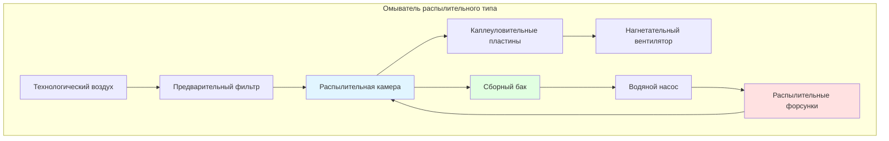
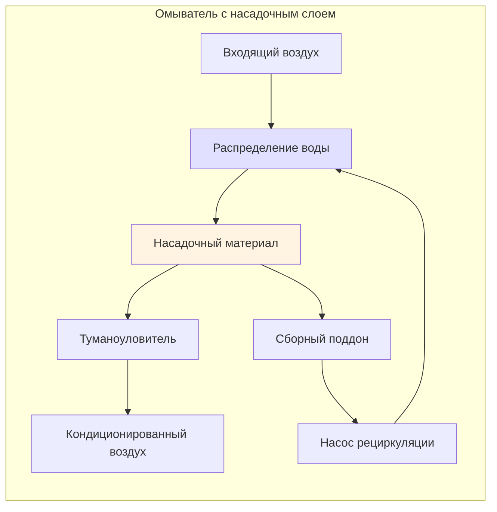

# Системы воздушного омывания для текстильных производств

Системы воздушного омывания являются критически важными компонентами систем ОВКВ текстильных производств, обеспечивая одновременное увлажнение, охлаждение и очистку воздуха. Эти системы пропускают большие объемы технологического воздуха через водяные распылители для кондиционирования атмосферы при обработке волокон, контроля статического электричества и поддержания качества продукции.

## Функции систем воздушного омывания

Омыватели воздуха в текстильных помещениях выполняют три основные функции:

**Увлажнение**: Повышает содержание влаги в подаваемом воздухе для поддержания пластичности волокон и снижения их разрывов в процессе обработки. Большинство текстильных операций требуют относительной влажности 60–75% в зависимости от типа волокна.

**Испарительное охлаждение**: Снижает температуру по сухому термометру за счет адиабатического насыщения, обеспечивая экономичное охлаждение в умеренных наружных условиях без использования механического хладагента.

**Очистка воздуха**: Удаляет воздушную пыль, ворс и твердые частицы за счет их соударения с водяными каплями, защищая оборудование и улучшая качество воздуха в помещении.

## Термодинамика воздушного омывателя

Процесс воздушного омывания основан на принципах адиабатического насыщения. Воздух поступает в распылительную камеру и приближается к температуре мокрого термометра по мере испарения воды в воздушном потоке.

### Скорость добавления влаги

Скорость добавления влаги зависит от коэффициента массоотдачи и движущей силы:

$$\dot{m}_w = h_d A \rho_a (W_s - W_1)$$

Где:
- $\dot{m}_w$ = скорость добавления влаги (кг/ч)
- $h_d$ = коэффициент массоотдачи (м/ч)
- $A$ = площадь контактной поверхности (м²)
- $\rho_a$ = плотность воздуха (кг/м³)
- $W_s$ = влагосодержание при насыщении (кг/кг)
- $W_1$ = влагосодержание входящего воздуха (кг/кг)

### Эффективность насыщения

Эффективность работы омывателя воздуха количественно определяется эффективностью насыщения:

$$\eta_{sat} = \frac{t_1 - t_2}{t_1 - t_{wb1}} \times 100\%$$

Где:
- $t_1$ = температура входящего воздуха по сухому термометру (°C)
- $t_2$ = температура выходящего воздуха по сухому термометру (°C)
- $t_{wb1}$ = температура входящего воздуха по мокрому термометру (°C)

Типичные значения эффективности насыщения составляют 85–95% для правильно спроектированных систем с достаточным покрытием распылением и временем контакта.

### Охлаждающая способность

Явное охлаждение, обеспечиваемое испарительными процессами:

$$Q_s = \dot{m}_a c_p (t_1 - t_2)$$

Поглощение скрытой теплоты в процессе испарения влаги:

$$Q_l = \dot{m}_a h_{fg} (W_2 - W_1)$$

Где $h_{fg}$ = скрытая теплота парообразования (≈2440 кДж/кг в стандартных условиях).

## Типы систем воздушного омывателя

## Параметры проектирования системы

### Конфигурация распылительной камеры

**Длина камеры**: Типичная длина 1,8–3,6 м, обеспечивающая время контакта 2–4 секунды при скоростях воздуха на поперечном сечении 2,0–3,0 м/с.

**Расстояние между форсунками**: 30–60 см между центрами в нескольких рядах (обычно 2–4 ряда) для обеспечения полного насыщения воздуха.

**Давление воды**: 103–276 кПа на форсунках, обеспечивающее размер капель 50–200 мкм для оптимального испарения.

**Скорость воздуха на поперечном сечении**: 2,0–2,5 м/с для работы с высокой эффективностью; до 3,0 м/с допустимо при снижении эффективности.

### Конструкция каплеуловителя

Пластины каплеуловителя предотвращают унос воды в подающие воздуховоды. Параметры конструкции включают:

- Расстояние между пластинами: 12,7–19,1 мм
- Скорость воздуха через каплеуловители: максимум 2,0–2,5 м/с
- Эффективность удаления воды: 95–99%
- Потеря давления: 2,5–5,1 мм вод. ст.

## Сравнение систем

| Тип системы | Эффективность насыщения | Перепад давления | Расход воды | Обслуживание | Применение |
|------|------------------------|------------------|-------------|--------------|------------|
| Распылительная камера | 85-95% | 0.4-0.8" в.ст. (10-20 мм в.ст.) | Умеренный | Высокий (форсунки) | Большая производительность, приоритет охлаждения |
| Насадочная колонна | 90-98% | 0.6-1.2" в.ст. (15-30 мм в.ст.) | Низкий | Умеренный (насадка) | Высокая влажность, компактное пространство |
| Капиллярный мат | 70-85% | 0.2-0.4" в.ст. (5-10 мм в.ст.) | Низкий | Низкий | Предварительная обработка, малые системы |
| Ультразвуковая | 95-99% | 0.1-0.3" в.ст. (2.5-7.5 мм в.ст.) | Очень низкий | Умеренный (излучатели) | Чистые помещения, прецизионный контроль |

## Требования к качеству воды

Качество воды напрямую влияет на производительность системы и требования к обслуживанию:

**Общее содержание растворенных твердых веществ (TDS)**: Поддерживать ниже 500 ppm для предотвращения образования накипи на форсунках и поверхностях теплообмена.

**Диапазон pH**: 6.5-8.5 оптимален для контроля коррозии и предотвращения образования накипи.

**Биологический контроль**: Требуется непрерывная обработка для предотвращения роста водорослей, бактерий и образования биопленки. Стандарт ASHRAE 188 содержит рекомендации по контролю легионеллеза.

**Скорость продувки (Blowdown)**: Рассчитывается на основе TDS подпиточной воды и допустимого TDS рециркулирующей воды:

$$\dot{m}_{BD} = \frac{\dot{m}_{evap}}{COC - 1}$$

Где COC = циклы концентрации (обычно 3-5 для воздушных моек).

## Интеграция с системами HVAC текстильной промышленности

Системы воздушной мойки интегрируются с общей системой HVAC текстильной промышленности следующим образом:

1. **Стадии предварительного охлаждения**: Снижение нагрузки на механическое охлаждение в теплую погоду.
2. **Контроль влажности**: Основной источник увлажнения для технологических помещений.
3. **Обработка приточного воздуха**: Кондиционирование наружного воздуха перед смешиванием с рециркуляционным воздухом.
4. **Рекуперация энергии**: Использование энтальпии вытяжного воздуха при экономической целесообразности.

Выбор воздушной мойки зависит от климата наружного воздуха, требуемых внутренних условий, технологических нагрузок и стоимости энергии. В засушливых климатах с низкой температурой мокрого термометра воздушная мойка обеспечивает высокоэкономичное охлаждение и увлажнение по сравнению с механическими системами.

## Справочные материалы по проектированию

Справочник ASHRAE — HVAC Applications, глава 20: Текстильная обработка, предоставляет исчерпывающие рекомендации по проектированию воздушных моек, обработке воды и интеграции систем для текстильных предприятий. Справочник ASHRAE — HVAC Systems and Equipment, глава 41: Оборудование для рекуперации энергии воздух-воздух, охватывает детальный термодинамический анализ и критерии выбора оборудования.
