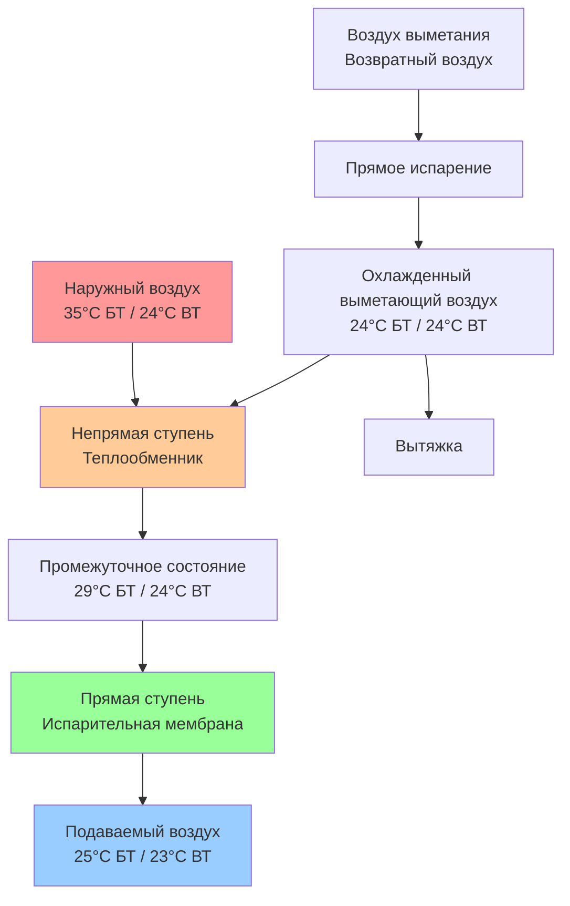
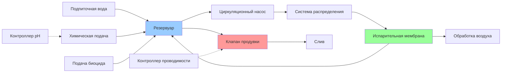

## Основы испарительного охлаждения

Испарительное охлаждение использует скрытую теплоту испарения для снижения температуры сухого термометра при одновременном увеличении содержания влаги. На текстильных производствах испарительные системы обеспечивают экономичное охлаждение и увлажнение одновременно, что особенно пригодно для зон подготовки волокна и прядения, где требуется высокая влажность.

Фундаментальный теплообмен следует процессу адиабатного насыщения, при котором явная теплота преобразуется в скрытую теплоту без добавления чистой энергии. Этот процесс следует по линии постоянной температуры влажного термометра на психрометрической диаграмме.

### Теория адиабатного насыщения

Температура адиабатного насыщения представляет собой температуру равновесия, достигаемую при прохождении воздуха над поверхностью воды бесконечной длины. Для практических приложений она приблизительно соответствует температуре влажного термометра для смесей воздуха и водяного пара.

Баланс энергии для адиабатного насыщения:

$$h_1 + (W_s - W_1) \cdot h_{fg} = h_s$$

Где:
- $h_1$ = энтальпия поступающего воздуха (кДж/кг)
- $h_s$ = энтальпия при насыщении (кДж/кг)
- $W_1$ = коэффициент влажности поступающего воздуха (кг/кг)
- $W_s$ = коэффициент влажности при насыщении (кг/кг)
- $h_{fg}$ = скрытая теплота испарения (кДж/кг)

Возможное снижение температуры:

$$\Delta T_{max} = T_{db1} - T_{wb1}$$

Где $T_{db1}$ — температура сухого термометра поступающего воздуха, а $T_{wb1}$ — температура влажного термометра поступающего воздуха.

## Прямое испарительное охлаждение

Прямые испарительные охладители (ПИО) приводят воздух в прямой контакт с водой через фильтрующие мембраны, распылительные камеры или форсунки туманообразования. Вода испаряется непосредственно в воздушный поток, повышая влажность при снижении температуры сухого термометра.

### Расчет эффективности

Эффективность охлаждения определяет фактическую производительность по сравнению с теоретическим максимумом:

$$\varepsilon_{DEC} = \frac{T_{db1} - T_{db2}}{T_{db1} - T_{wb1}}$$

Где:
- $T_{db2}$ = температура сухого термометра уходящего воздуха (°C)
- $\varepsilon_{DEC}$ = эффективность прямого испарительного охлаждения (безразмерная)

Типичные диапазоны эффективности прямых систем:

| Тип мембраны | Эффективность | Перепад давления | Применение |
|------------|---------------|---------------|-------------|
| Жесткая целлюлозная мембрана (15 см) | 85-95% | 1,2-1,7 кПа | Требования высокой эффективности |
| Жесткая целлюлозная мембрана (10 см) | 75-85% | 0,86-1,2 кПа | Стандартные текстильные применения |
| Распылительная камера | 60-80% | 0,48-0,96 кПа | Интеграция с промывкой волокна |
| Системы туманообразования | 50-70% | 0,24-0,48 кПа | Дополнительное охлаждение |

### Добавление влаги

Увеличение коэффициента влажности:

$$\Delta W = W_2 - W_1 = \varepsilon_{DEC} \cdot (W_s - W_1)$$

Это одновременное охлаждение и увлажнение делает ПИО идеальным для текстильных прядильных цехов, требующих 65-75% ОВ при температуре 24-27°C.

## Непрямое испарительное охлаждение

Непрямые испарительные охладители (НИО) разделяют процесс испарения от потока подаваемого воздуха с помощью теплообменника. Вода испаряется с одной стороны, охлаждая поверхность теплообменника, который затем охлаждает подаваемый воздух без добавления влаги.

### Эффективность для непрямых систем

$$\varepsilon_{IEC} = \frac{T_{db1} - T_{db2}}{T_{db1} - T_{wb,scavenger}}$$

Эффективность непрямых систем обычно составляет 50-75%, ниже чем прямые системы, но обеспечивая явное охлаждение без увлажнения.

### Двухступенчатое испарительное охлаждение

Комбинированные непрямые-прямые системы максимизируют потенциал охлаждения:

$$T_{final} = T_{db1} - \varepsilon_{IEC}(T_{db1} - T_{wb1}) - \varepsilon_{DEC}[(T_{db1} - \varepsilon_{IEC}(T_{db1} - T_{wb1})) - T_{wb1}]$$

Двухступенчатые системы достигают 90-110% эффективности по отношению к температуре влажного термометра, приближаясь к температуре влажного термометра или превышая её при высокой эффективности обеих ступеней.

## Требования к обработке воды

Испарительное охлаждение концентрирует растворенные твердые вещества через непрерывное испарение. Надлежащая обработка воды предотвращает образование накипи, коррозию и биологический рост.

### Циклы концентрации

$$COC = \frac{C_{circulating}}{C_{makeup}}$$

Где:
- $COC$ = циклы концентрации (безразмерная)
- $C_{circulating}$ = растворенные твердые вещества в циркулирующей воде (мг/л)
- $C_{makeup}$ = растворенные твердые вещества в подпиточной воде (мг/л)

Расчет расхода продувки:

$$Q_{bleed} = \frac{Q_{evap}}{COC - 1}$$

Где:
- $Q_{bleed}$ = расход продувки (л/мин)
- $Q_{evap}$ = расход испарения (л/мин)

Для текстильных производств поддерживайте 3-5 циклов концентрации для баланса потребления воды и потенциала образования накипи.

### Параметры обработки

| Параметр | Целевой диапазон | Влияние при превышении |
|-----------|--------------|-------------------|
| Общее содержание растворённых твёрдых веществ | < 2000 мг/л | Образование накипи, снижение эффективности |
| pH | 6,5-8,5 | Коррозия (низкое значение), образование накипи (высокое значение) |
| Жёсткость по кальцию | < 400 мг/л в виде CaCO₃ | Образование накипи |
| Общая щелочность | < 400 мг/л в виде CaCO₃ | Образование накипи |
| Биологический счёт | < 10 000 КОЕ/мл | Биопленка, запах, риск для здоровья |

## Конструктивные соображения для текстильных применений

**Климатическая пригодность:** Испарительное охлаждение работает оптимально в сухих климатах (депрессия влажного термометра > 8°C). В влажных регионах системы обеспечивают ограниченное охлаждение, но всё ещё предлагают экономичное увлажнение.

**Интеграция с технологической нагрузкой:** Координируйте испарительное охлаждение с технологическими тепловыделениями от оборудования, освещения и паровых систем. Рассчитывайте размеры систем на основе пиковых условий влажного термометра согласно справочнику ASHRAE по промышленным применениям.

**Фильтрация воздуха:** Установите фильтрацию выше по потоку (MERV 8-11) для предотвращения засорения мембраны волокнистыми частицами и наружными загрязнениями.

**Защита от замерзания:** Полностью слейте системы при зимнем отключении. Установите нагреватели резервуара и теплопроводящие трассы в климатических зонах с температурами ниже нуля.

**Контроль легионеллы:** Внедрите обработку биоцидом, поддерживайте надлежащую химию воды и следуйте протоколам ASHRAE Standard 188 для управления водными системами на текстильных объектах.

**Обслуживание мембран:** Проверяйте площадки ежеквартально, очищайте дважды в год, заменяйте при снижении эффективности ниже 80% от расчётной эффективности или при деградации мембраны.

## Контроль производительности

Отслеживайте эти параметры для проверки производительности системы:

- Температуры сухого термометра поступающего и уходящего воздуха
- Температура влажного термометра поступающего воздуха
- Рассчитанная эффективность в сравнении с проектными значениями
- Расход воды
- Проводимость продувки
- Статическое давление на мембране

Рассчитывайте эффективность работы еженедельно в период пиковых нагрузок. Эффективность ниже проектных значений более чем на 10 процентных пункта указывает на засорение мембраны, неадекватное распределение воды или недостаточное время контакта, требующее корректирующих действий.
