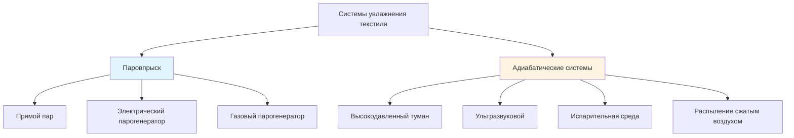

## Требования к увлажнению при обработке текстиля

Текстильное производство требует точного контроля влажности для поддержания гибкости волокна, снижения статического электричества, минимизации разрывов волокна и обеспечения консистентного качества продукции. Целевая относительная влажность обычно находится в диапазоне 65–75% в зависимости от типа волокна и стадии технологического процесса. Обработка хлопка требует 70–75% ОВ, в то время как синтетические волокна оптимально работают при 60–65% ОВ.

Нагрузка увлажнения на текстильных предприятиях существенна из-за высоких кратностей воздухообмена, тепловыделения в технологических процессах и гигроскопических свойств текстильных материалов. Стандарты ASHRAE по промышленной вентиляции определяют, что текстильные предприятия требуют непрерывного добавления влаги для компенсации потерь при вентиляции и абсорбции в процессе.

## Расчет нагрузки увлажнения

Общая нагрузка увлажнения состоит из потери влаги при вентиляции и абсорбции в процессе.

### Влажностная нагрузка вентиляции

Скорость добавления влаги, необходимая для поддержания установленного значения влажности, рассчитывается как:

$$\dot{m}_w = \frac{\dot{V} \cdot \rho_{air} \cdot (W_{setpoint} - W_{outdoor})}{3600}$$

Где:
- $\dot{m}_w$ = скорость добавления влаги (кг/ч)
- $\dot{V}$ = скорость вентиляционного потока воздуха (м³/ч)
- $\rho_{air}$ = плотность воздуха (кг/м³)
- $W_{setpoint}$ = коэффициент влажности при установленном значении (кг H₂O/кг сухого воздуха)
- $W_{outdoor}$ = коэффициент влажности наружного воздуха (кг H₂O/кг сухого воздуха)

### Общая производительность увлажнения

Включая абсорбцию в процессе и коэффициент безопасности:

$$\dot{m}_{total} = (\dot{m}_{vent} + \dot{m}_{process}) \cdot SF$$

Где:
- $\dot{m}_{vent}$ = потеря влаги при вентиляции (кг/ч)
- $\dot{m}_{process}$ = абсорбция влаги в процессе (кг/ч)
- $SF$ = коэффициент безопасности (1,15–1,25)

Скорости абсорбции в процессе варьируются в зависимости от операции: области прядения абсорбируют 0,15–0,25 кг/ч на веретено, в то время как ткацкие операции абсорбируют 0,10–0,18 кг/ч на ткацкий станок.

## Типы систем увлажнения

### Системы паровпрыска

Паровпрыск обеспечивает изотермическое увлажнение путем добавления чистого водяного пара в поток воздуха. Прямой пар из центрального котла или упакованного парогенератора распределяется через коллекторы с контролируемыми трубками распыления.

**Ключевые характеристики:**
- Отсутствие эффекта испарительного охлаждения
- Мгновенная абсорбция влаги
- Самостерилизация (выше 100°C)
- Высокое потребление энергии (2257 кДж/кг скрытой теплоты)
- Требует качества котловой воды (TDS < 50 ppm)

Паровпрыск предпочтителен для приложений, требующих быстрого отклика, высокоточного контроля и минимального риска бактериального роста.

### Адиабатические системы увлажнения

Адиабатические системы испаряют жидкую воду в поток воздуха, создавая испарительное охлаждение. Передача чувствительного тепла латентному теплу снижает температуру сухого термометра при увеличении влажности.

#### Высокодавленные туманные системы

Высокодавленные насосы (70–100 бар) нагнетают воду через специализированные форсунки, создавая капли размером 5–10 микрон, которые быстро испаряются без смачивания поверхностей.

**Параметры производительности:**
- Эффективность испарения: 85–95%
- Размер капель: 5–10 мкм
- Потребление энергии: 0,8–1,2 кВт на кг/ч
- Требование к качеству воды: TDS < 5 ppm, фильтрованная до 5 мкм
- Диапазон регулирования: 10:1

#### Ультразвуковые увлажнители

Пьезоэлектрические преобразователи, колеблющиеся на частоте 1,65–2,4 МГц, генерируют капли воды размером 1–5 микрон. Несколько модулей преобразователей обеспечивают распределенное увлажнение с минимальным потреблением энергии.

**Параметры производительности:**
- Эффективность испарения: 90–98%
- Размер капель: 1–5 мкм
- Потребление энергии: 0,05–0,08 кВт на кг/ч
- Требование к качеству воды: TDS < 200 ppm, умягченная
- Диапазон регулирования: 5:1

## Сравнение увлажнителей для текстильных приложений

| Параметр | Прямой пар | Высокодавленный туман | Ультразвуковой | Испарительная среда |
|-----------|--------------|-------------------|------------|-------------------|
| Капитальные затраты | Средние-Высокие | Высокие | Средние | Низкие-Средние |
| Операционные затраты (энергия) | Высокие | Средние | Очень низкие | Низкие |
| Эффективность испарения | 100% | 85–95% | 90–98% | 70–85% |
| Эффект температуры | +10 до +15°C | -5 до -8°C | -4 до -7°C | -6 до -10°C |
| Время отклика | Мгновенный | 15–30 секунд | 30–60 секунд | 2–5 минут |
| Качество воды (TDS) | <50 ppm | <5 ppm | <200 ppm | <500 ppm |
| Частота обслуживания | 3–6 месяцев | 1–3 месяца | 2–4 месяца | 1–2 месяца |
| Расстояние распределения | Неограниченное | 30–50 м | 20–30 м | Только у единицы |
| Риск смачивания | Отсутствует | Низкий | Низкий-Средний | Средний-Высокий |
| Контроль бактерий | Отличный | Хороший | Удовлетворительный | Плохой |

## Критерии выбора системы для текстильных предприятий

### Приложения паровпрыска

Выберите паровпрыск, если:
- Требуется точный контроль температуры и влажности (±2% ОВ)
- Требуется круглогодичное увлажнение, включая зимнюю работу
- Минимальный риск смачивания поверхности критичен
- Доступен паровой пар центрального котла
- Дифференциал стоимости энергии благоприятен

### Приложения высокодавленного тумана

Выберите высокодавленный туман, если:
- Испарительное охлаждение полезно (снижает охлаждающую нагрузку)
- Высоты потолков большие (>4 м) для расстояния испарения
- Умеренные на высокие скорости воздушного потока (>2,5 м/с)
- Доступна инфраструктура обработки воды
- Снижение операционной стоимости приоритизировано над капитальной стоимостью

### Ультразвуковые приложения

Выберите ультразвуковой, если:
- Низкое потребление энергии критично
- Требуется распределенное увлажнение
- Умеренные нагрузки увлажнения (<300 кг/ч на зону)
- Тихая работа необходима
- Ограниченная емкость электроснабжения

## Качество воды и обработка

Долговечность и производительность системы увлажнения критически зависят от качества воды. Стандарты ASHRAE по промышленной вентиляции определяют требования обработки в зависимости от типа увлажнителя.

**Требования обработки по типу системы:**

| Тип системы | РО | Умягчение | Фильтрация | УФ стерилизация |
|-------------|----|-----------|-----------|--------------------|
| Паровпрыск | Опционально | Обязательно | 5 мкм | Опционально |
| Высокодавленный туман | Обязательно | Обязательно | 1 мкм | Рекомендуется |
| Ультразвуковой | Рекомендуется | Обязательно | 5 мкм | Опционально |
| Испарительная среда | Нет | Опционально | 50 мкм | Нет |

Обратный осмос (РО) удаляет растворенные твердые вещества, предотвращая образование белой пыли от адиабатических систем. Предварительная фильтрация защищает мембраны РО и продлевает срок службы. УФ стерилизация контролирует бактериальный рост в резервуарах хранения и распределительных линиях.

## Стратегия управления и интеграция

Управление увлажнением интегрируется с системой воздушного промывочного через каскадные петли обратной связи. Основной контроллер поддерживает относительную влажность пространства путем модуляции выхода увлажнителя. Вторичный контроль предотвращает конденсацию путем ограничения коэффициента влажности подаваемого воздуха на основе самой холодной температуры поверхности в системе распределения.

Пропорционально-интегральный (ПИ) контроль с компенсацией коэффициента влажности обеспечивает стабильную работу. Зона мертвых зон управления ±3% ОВ предотвращает охоту. Размещение датчика на 10–15 метров ниже по потоку от точки впрыска увлажнителя обеспечивает полное испарение перед измерением.

## Обслуживание и эксплуатационные аспекты

Регулярные протоколы обслуживания включают проверку и очистку форсунок (ежемесячно для туманных систем, ежеквартально для ультразвуковых), тестирование качества воды (еженедельно), замену фильтров в соответствии со спецификациями производителя и годовую проверку производительности системы. Профилактическое обслуживание снижает незапланированные простои и поддерживает эффективность увлажнения в пределах проектных параметров.

Сезонная корректировка установленных значений увлажнения балансирует требования качества продукции против потребления энергии. Зимняя работа обычно требует максимальной производительности увлажнения, в то время как летние условия могут снизить или исключить потребность в увлажнении в зависимости от климатической зоны.
