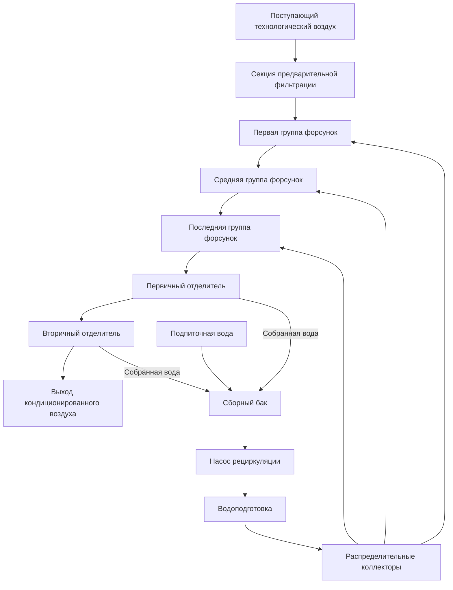
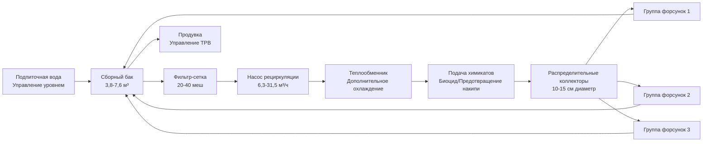

## Основы проектирования распылительных камер

Распылительные камеры служат основным компонентом систем промывки воздуха на текстильных производственных предприятиях, обеспечивая одновременное увлажнение, охлаждение и удаление пыли. Конструкция камеры объединяет форсунки для распыления воды, секции-отделители и инфраструктуру рециркуляции воды для кондиционирования технологического воздуха при одновременном удалении взвешенных загрязнений, образующихся во время текстильных операций.

Распылительная камера работает на основе принципа прямого контакта между воздухом и тонкодисперсными водяными капельками. Скорость воздуха через камеру обычно составляет 2,54 м/с, обеспечивая адекватное время контакта без чрезмерного уноса воды. Рекомендации ASHRAE по промышленной вентиляции предусматривают, что длина камеры должна обеспечивать достаточное время пребывания для передачи массы между воздушной и водной фазами.

## Конструкция и конфигурация камеры

Типичная распылительная камера включает от трёх до пяти групп форсунок, расположенных перпендикулярно направлению потока воздуха. Каждая группа содержит несколько форсунок, распределённых по сечению камеры для обеспечения равномерного распределения воды. Конструкция камеры использует коррозионностойкие материалы, включая нержавеющую сталь или стеклопластик, из-за постоянного контакта с водой и требований химической обработки.

### Спецификации параметров проектирования

| Параметр | Типичный диапазон | Критерий проектирования |
|----------|------------------|------------------------|
| Скорость на входе | 2,03-3,05 м/с | Оптимум 2,54 м/с для текстильных приложений |
| Расход воды на распыление | 0,08-0,16 м³/ч на м² входной площади | На основе нагрузки охлаждения/увлажнения |
| Давление на форсунке | 103-276 кПа | Выше давление для тонкого распыления |
| Длина камеры | 1,8-3,7 м | Минимум 1,5 секунды время контакта |
| Эффективность отделителя | 95-99% | Захват капель >50 микронов |
| Температура воды | На 2,8-8,3°C ниже температуры сухого термометра | Фактор эффективности охлаждения |

## Выбор и производительность форсунок для распыления

Выбор форсунки определяет распределение размера капель, характер распыления и эффективность распыления воды. Гидравлические форсунки с распылением доминируют в текстильных приложениях благодаря простоте и надёжности. Средний диаметр по Заутеру характеризует размер капель:

$$D_{32} = K \left(\frac{\sigma}{\rho_a v^2}\right)^{0.5} \left(\frac{\mu_w^2}{\sigma \rho_w r}\right)^{0.25} \left(1 + \frac{1}{ALR}\right)$$

Где:
- $D_{32}$ = Средний диаметр по Заутеру (микроны)
- $K$ = Константа, зависящая от форсунки
- $\sigma$ = Поверхностное натяжение (Н/м)
- $\rho_a$ = Плотность воздуха (кг/м³)
- $v$ = Относительная скорость (м/с)
- $\mu_w$ = Динамическая вязкость воды (Па·с)
- $\rho_w$ = Плотность воды (кг/м³)
- $r$ = Радиус отверстия форсунки (м)
- $ALR$ = Отношение воздуха к жидкости

Для распылительных камер текстильных предприятий форсунки, создающие капли размером 100-200 микронов, обеспечивают оптимальный баланс между эффективностью испарения и захватом отделителем. Углы распыления между 60-90 градусами обеспечивают адекватное покрытие без чрезмерного попадания на стенки.

Эффективность испарения распыляемых капель описывается следующим образом:

$$\eta_{evap} = 1 - e^{-\frac{6k_{m}A_{total}t}{\rho_w D_{32}}}$$

Где:
- $\eta_{evap}$ = Эффективность испарения
- $k_m$ = Коэффициент массопередачи (м/с)
- $A_{total}$ = Общая площадь поверхности капель (м²)
- $t$ = Время контакта (с)

## Проектирование системы рециркуляции воды

Система рециркуляции поддерживает качество воды при минимизации потребления подпиточной воды. Расчёт производительности насоса:

$$Q_{pump} = Q_{spray} \times N_{banks} \times SF$$

Где:
- $Q_{pump}$ = Общий расход насоса (м³/ч)
- $Q_{spray}$ = Расход на группу форсунок (м³/ч)
- $N_{banks}$ = Количество групп форсунок
- $SF$ = Коэффициент безопасности (1,15-1,25)

Расчёты напора насоса учитывают требования давления на форсунке, потери трения в распределительных коллекторах и перепады высот:

$$H_{total} = P_{nozzle} + h_{friction} + h_{static}$$

Объём сборного бака обеспечивает время задержки 2-5 минут при расходе рециркуляции, позволяя гравитационному отделению взвешенных твёрдых веществ и выравниванию температуры.

## Эффективность и производительность промывки воздуха

Эффективность промывки воздуха для охлаждения и увлажнения следует психрометрическим соотношениям. Эффективность насыщения представляет приближение к условиям адиабатического насыщения:

$$\eta_{sat} = \frac{t_{db,in} - t_{db,out}}{t_{db,in} - t_{wb,in}} \times 100\%$$

Где:
- $\eta_{sat}$ = Эффективность насыщения (%)
- $t_{db,in}$ = Температура сухого термометра на входе (°F)
- $t_{db,out}$ = Температура сухого термометра на выходе (°F)
- $t_{wb,in}$ = Температура влажного термометра на входе (°F)

Хорошо спроектированные распылительные камеры достигают эффективность насыщения 85-95% при правильном выборе форсунок и адекватном количестве групп. Эффективность удаления пыли зависит от распределения размера частиц и производительности отделителя:

$$\eta_{dust} = 1 - \prod_{i=1}^{n} (1 - \eta_{bank,i})$$

Где:
- $\eta_{dust}$ = Общая эффективность удаления пыли
- $\eta_{bank,i}$ = Эффективность отдельной группы форсунок
- $n$ = Количество групп форсунок

## Проектирование отделителя и управление уносом воды

Пластины-отделители предотвращают унос воды в подающие воздухопроводы и оборудование, расположенное ниже по течению. Елочные отделители с несколькими изменениями направления захватывают взвешенные капли посредством инерционного удара. Критический диаметр захватываемой капли описывается следующим образом:

$$d_{crit} = \sqrt{\frac{9\mu_{a} W}{V_{face} \rho_w}}$$

Где:
- $d_{crit}$ = Критический диаметр капли (м)
- $\mu_a$ = Динамическая вязкость воздуха (Па·с)
- $W$ = Расстояние между лопатками отделителя (м)
- $V_{face}$ = Скорость на входе отделителя (м/с)

Секции отделителей работают при скорости на входе 2,03-2,54 м/с с эффективностью 95-99% для капель размером более 50 микронов. Двухступенчатые конфигурации отделителей обеспечивают повышенную защиту для критических текстильных процессов, требующих минимального уноса влаги.

## Водоподготовка и управление качеством воды

Рециркулируемая вода требует обработки для предотвращения биологического роста, образования накипи и коррозии. Рекомендации ASHRAE по промышленной вентиляции предусматривают поддержание:

- pH: 6,5-8,5
- Общее содержание растворённых веществ: <1500 мг/л
- Концентрация биоцида: В соответствии со спецификациями производителя
- Расход продувки: 2-5% от расхода рециркуляции

Циклы концентрирования обычно находятся в диапазоне 3-6, балансируя сохранение воды против стоимости химикатов водоподготовки и потенциала образования накипи. Автоматические контроллеры проводимости регулируют продувку для поддержания целевых уровней ТРВ.

---

*Руководство ASHRAE по промышленной вентиляции предоставляет подробное руководство по проектированию для приложений распылительных камер в текстильных производственных средах.*
