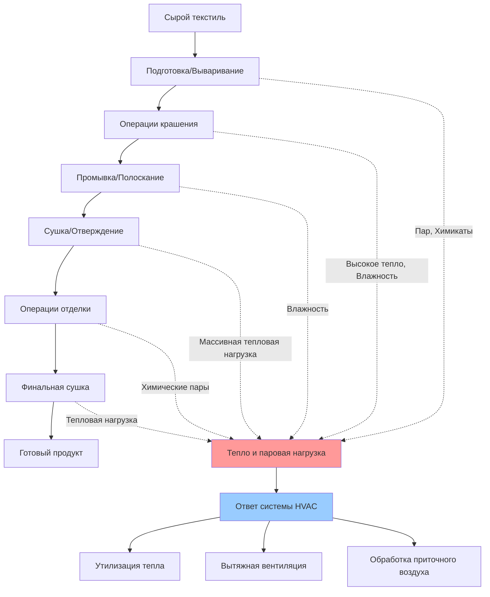

Операции крашения и отделки текстиля представляют наиболее энергоемкие и экологически критические этапы текстильного производства. Системы HVAC должны управлять значительными тепловыми нагрузками от технологического оборудования, контролировать химические пары и влажность, а также поддерживать условия, обеспечивающие качество продукции и защиту здоровья работников.

## Обзор технологического процесса и интеграция HVAC

Объекты крашения и отделки текстиля представляют уникальные вызовы из-за сочетания высокотемпературных влажных процессов, генерирования химических паров и строгих требований к контролю окружающей среды.

## Тепловые нагрузки технологического процесса и расчеты

### Тепловыделение красильного оборудования

Приход тепла от красильных машин зависит от объема сосуда, рабочей температуры и продолжительности цикла. Мгновенное тепловыделение в помещение включает радиационную и конвективную составляющие:

$$Q_{dyeing} = Q_{radiation} + Q_{convection} + Q_{evaporation}$$

Для теплоизолированных красильных сосудов:

$$Q_{total} = U \cdot A \cdot (T_{vessel} - T_{ambient}) + \dot{m}_{evap} \cdot h_{fg}$$

Где:
- $U$ = общий коэффициент теплопередачи (0,5–1,5 Вт/м²·K для теплоизолированных сосудов)
- $A$ = площадь внешней поверхности (м²)
- $T_{vessel}$ = рабочая температура (обычно 90–140°C)
- $T_{ambient}$ = температура помещения (°C)
- $\dot{m}_{evap}$ = скорость испарения при вентилировании (кг/с)
- $h_{fg}$ = удельная теплота парообразования (2257 кДж/кг при атмосферном давлении)

### Тепловые нагрузки от оборудования для сушки и отверждения

Рамы-тентеры и вентерные печи генерируют наибольшие тепловые нагрузки при отделочных операциях:

$$Q_{dryer} = \eta_{loss} \cdot Q_{input} = \eta_{loss} \cdot \dot{m}_{fuel} \cdot LHV$$

Типичные коэффициенты потерь тепла ($\eta_{loss}$) в помещение:
- Рамы-тентеры: 15–25% от общего теплового входа
- Штифтовой вентер: 20–30% от общего теплового входа
- Цилиндрические сушилки: 10–20% от общего теплового входа

Для рамы-тентера, работающей при 180°C с тепловым входом 2 МВт:

$$Q_{space} = 0,20 \times 2000 = 400 \text{ кВт}$$

### Расчеты влажностных нагрузок

Скорости удаления воды создают значительные скрытые нагрузки:

$$\dot{m}_{water} = \dot{m}_{fabric} \cdot (MC_{initial} - MC_{final})$$

Результирующая скрытая нагрузка:

$$Q_{latent} = \dot{m}_{water} \cdot h_{fg} = \dot{m}_{fabric} \cdot \Delta MC \cdot 2257 \text{ кДж/кг}$$

Для производительности 1000 кг/ч текстиля с уменьшением влажности с 80% до 5%:

$$Q_{latent} = \frac{1000}{3600} \times 0,75 \times 2257 = 470 \text{ кВт}$$

## Параметры проектирования для зон крашения и отделки

| Параметр | Зона крашения | Сушка/Отделка | Химское хранилище | Основание проекта |
|----------|---------------|----------------|--------------------|------------------|
| Температура | 24–28°C | 26–32°C | 18–24°C | Стабильность процесса, комфорт |
| Относительная влажность | 50–65% | 45–55% | <60% | Предотвращение конденсации, качество |
| Воздухообмены в час | 15–25 | 20–40 | 10–15 | Удаление паров/тепла |
| Мин. наружный воздух | 15–20% | 15–20% | 100% | Качество внутреннего воздуха, разбавление химикатов |
| Давление в помещении | Отрицательное | Отрицательное | Отрицательное | Контроль загрязнения |
| Скорость выброса | 0,5–1,0 м³/с на машину | 2–4 м³/с на сушилку | По требованию | Контроль тепла/паров |

## Проектирование системы вентиляции

### Требования местной вытяжки

Каждый этап процесса требует отдельной вытяжки:

**Красильные машины:** Вытяжные зонты над сосудами для сбора пара при вентилировании циклов. Скорость выброса основана на объеме сосуда и частоте циклов:

$$Q_{exhaust} = V_{vessel} \cdot N_{cycles/hr} \cdot F_{safety}$$

Где $F_{safety}$ = коэффициент безопасности эффективности улавливания 1,25–1,5.

**Оборудование для сушки:** Комбинация встроенной вытяжки машины и дополнительных зонтичных вытяжек. Общая вытяжка должна обрабатывать:
- Испаренный водяной пар
- Продукты сгорания (если прямое сжигание)
- Тепловой поток от горячих поверхностей

**Отделочные линии:** Непрерывная вытяжка по длине технологической линии, обычно 250–500 л/с на метр ширины линии.

### Контроль химических паров

Пределы воздействия химикатов определяют проектирование вентиляции. Для типичных красильных химикатов:

| Химикат | Предельное среднесменное воздействие | Стратегия контроля | Типичная скорость выброса |
|---------|--------------------------------------|-------------------|--------------------------|
| Формальдегид | 0,75 млн⁻¹ | Местная вытяжка при применении | 500–1000 л/с на станцию |
| Аммиак | 25 млн⁻¹ | Разбавление + местная вытяжка | Минимум 10–20 ACH |
| Уксусная кислота | 10 млн⁻¹ | Вытяжные шкафы, герметизация процесса | Поддерживать <0,5 м/с скорость фасада |
| Перекись водорода | 1 млн⁻¹ | Местная вытяжка, контроль давления | По рекомендациям ACGIH |

Коэффициент эффективности вентиляции ($\varepsilon$) для контроля химикатов:

$$C_{space} = \frac{G}{\varepsilon \cdot Q_{ventilation}} \leq C_{limit}$$

Где:
- $G$ = скорость образования химиката (мг/с)
- $Q_{ventilation}$ = скорость вентиляции (м³/с)
- $\varepsilon$ = 0,3–0,7 для общей вентиляции, 0,8–1,0 для местной вытяжки

## Возможности утилизации тепла

Объекты крашения и отделки предлагают исключительные возможности для утилизации тепла благодаря высоким температурам выбросов и большому энергопотреблению.

### Утилизация тепла от выходящего воздуха

Выход из оборудования для сушки при 80–150°C позволяет:

**Run-around циклы:** Системы на гликольной основе, передающие тепло от выброса сушилки на предварительный нагрев приточного воздуха. Эффективность 50–60%, потеря давления минимальна.

**Пластинчатые или роторные теплообменники воздух-воздух:** Где загрязнение выброса минимально. Эффективность 60–75%.

**Котлы-утилизаторы тепла:** Для высокотемпературных выбросов (>200°C) от термосольных печей или рам-вентеров. Генерируют низкотемпературный пар для технологического использования.

### Утилизация конденсата и технологической воды

Горячая вода из операций промывки и охлаждения оборудования представляет значительную энергию:

$$Q_{recoverable} = \dot{m}_{water} \cdot c_p \cdot (T_{hot} - T_{cold})$$

Для 10 л/с конденсата при 85°C, охлажденного до 30°C:

$$Q_{recoverable} = 10 \times 4,186 \times (85-30) = 2302 \text{ кВт}$$

Это восстановленное тепло может предварительно нагревать технологическую воду, существенно снижая нагрузку на котел.

## Распределение воздуха и герметизация помещения

Поддерживайте отрицательное давление в зонах крашения и отделки относительно соседних помещений, чтобы предотвратить миграцию химических паров. Типичные разности давлений:

- Зона крашения к коридору: -5–-10 Па
- Зона отделки к складу: -5–-10 Па
- Химское хранилище к производству: -10–-15 Па

Распределение приточного воздуха должно предотвращать обход воздуха, обеспечивая при этом адекватное перемешивание. Используйте высокие боковые струи или верхние диффузоры с высокими коэффициентами индукции для обработки крупных тепловых нагрузок без чрезмерных скоростей на уровне работ.

$$ADPI = f(\frac{T_{supply} - T_{space}}{T_{space} - T_{return}}, \frac{V_{throw}}{V_{room}})$$

Целевой показатель ADPI >80% для приемлемого теплового комфорта в занятых зонах.

## Рассмотрения по контролю влажности

Избыточная влажность от влажных процессов конденсируется на холодных поверхностях, вызывая коррозию и рост плесени. Подходы к осушению:

**Увеличенная вентиляция:** Наиболее экономична при низком содержании влаги в наружном воздухе.

**Механическое осушение:** Требуется в влажном климате или когда влажность наружного воздуха превышает приемлемые уровни.

**Десикантное осушение:** Для требований низкой точки росы или проблем совместимости химикатов с системами охлаждения.

Проектируйте контроль влажности для поддержания точки росы как минимум на 5°C ниже температуры самой холодной поверхности в помещении.

## Ссылки на проектирование ASHRAE

Справочник ASHRAE по промышленной вентиляции содержит подробное руководство по:
- Проектированию вытяжных зонтов для текстильного оборудования
- Процедурам расчета тепловых и влажностных нагрузок
- Пределам воздействия химикатов и требованиям к вентиляции
- Выбору и расчету систем утилизации энергии

Расчеты проектирования должны ссылаться на ASHRAE Handbook—HVAC Applications, глава 19 (Textile Processing) для специфичных для оборудования приходов тепла и скоростей вентиляции, полученных из полевых измерений на работающих объектах.

## Сводка выбора системы

Для объектов крашения и отделки рассмотрите:

1. **Высокопроизводительные вытяжные системы** с утилизацией тепла для экономичного управления процессными нагрузками
2. **Вентиляторы с переменной скоростью** для согласования скоростей выброса с графиками производства и сокращения энергопотерь
3. **Отдельную вентиляцию** для зон химического хранилища и смешивания с отдельной вытяжкой на улицу
4. **Резервное оборудование** для критических технологических зон, где производство не может допустить простой HVAC
5. **Фильтрацию и очистку** выбросов, требуемые экологическими разрешениями для твердых частиц и летучих органических соединений

Сочетание массивных тепловых нагрузок, рисков воздействия химикатов и образования влаги делает крашение и отделку одними из наиболее требовательных приложений HVAC в промышленной среде. Надлежащее проектирование требует тесной координации с инженерами технологических процессов для понимания операции оборудования и графиков производства.
