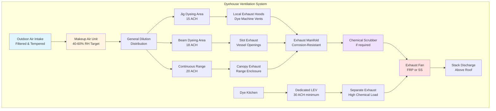

## Обзор

Вентиляция красильных цехов представляет уникальные вызовы, сочетая экстремальную влажность, воздействие химических паров, тепловые нагрузки процесса и коррозионную атмосферу. Надлежащее проектирование вентиляции требует интеграции общеобменной вентиляции, локальной вытяжной вентиляции (LEV) и систем приточного воздуха для поддержания безопасных условий труда при защите оборудования от ускоренной деградации.

Среда окрашивания и отделки генерирует тепловые нагрузки 128–256 Вт/м² площади пола, влагоприбыль 2,4–7,2 кг/(м²·ч) и химические пары, включая формальдегид, уксусную кислоту и различные проносители красителей, требующие комплексных стратегий вентиляции.

## Расчеты вентиляционной нагрузки

### Общий расход вентиляции

Требуемый расход вентиляции сочетает удаление явного тепла, удаление скрытого тепла и требования разбавления загрязняющих веществ:

$$Q_{total} = \max\left(Q_{sensible}, Q_{latent}, Q_{dilution}\right)$$

где каждый компонент рассчитывается независимо, а максимальное значение определяет проектирование.

### Удаление явного тепла

Для удаления процессного тепла оборудования окрашивания:

$$Q_{sensible} = \frac{q_{process}}{\rho \cdot c_p \cdot \Delta T} \times 60$$

где:
- $Q_{sensible}$ = требуемый расход воздуха (м³/ч)
- $q_{process}$ = тепловая нагрузка процесса (кДж/ч)
- $\rho$ = плотность воздуха (1,2 кг/м³)
- $c_p$ = удельная теплоёмкость воздуха (1,005 кДж/(кг·°C))
- $\Delta T$ = допустимое повышение температуры (5–8°C типично)

### Удаление скрытого тепла

Для удаления влаги из открытых сосудов и сушки ткани:

$$Q_{latent} = \frac{W_{evap} \times h_{fg}}{\rho \cdot \Delta \omega \cdot 60}$$

где:
- $W_{evap}$ = скорость испарения (кг/ч)
- $h_{fg}$ = скрытая теплота парообразования (2440 кДж/кг при 100°C)
- $\Delta \omega$ = разница коэффициента влажности (кг влаги/кг сухого воздуха)

### Разбавление загрязняющих веществ

Для контроля химических паров на основе пороговых предельных значений ACGIH (TLV):

$$Q_{dilution} = \frac{G \times K \times 10^6}{TLV \times 60}$$

где:
- $G$ = скорость образования загрязняющего вещества (кг/ч)
- $K$ = коэффициент безопасности (3–10 в зависимости от токсичности)
- $TLV$ = пороговое предельное значение (млн⁻¹)

## Требования по кратности воздухообмена

Следующая таблица представляет рекомендуемые кратности воздухообмена для различных зон красильного цеха на основе интенсивности процесса и использования химикатов:

| Зона красильного цеха | Кратность воздухообмена, ч⁻¹ | Основание |
|--------------|---------------------|-------|
| Машины для джига-окрашивания | 10–15 | Умеренное тепло, выпуск пара |
| Зона балочного окрашивания | 12–18 | Высокая влажность, химические пары |
| Пакетное окрашивание | 8–12 | Герметичные сосуды, меньше воздействие |
| Непрерывная линия окрашивания | 15–20 | Высокое тепло, постоянные выбросы |
| Операции пропитки-пара | 18–25 | Экстремальная влажность, температура |
| Кухня красителя/смешивание | 20–30 | Высокая концентрация химикатов |
| Отделочные линии | 12–18 | Нанесение химикатов, отверждение |
| Лаборатория пробного окрашивания | 15–20 | Переменное использование химикатов |

**Примечание:** Эти кратности предполагают высоты потолков 4,3–6,1 м. Для большей высоты потолка рассчитывайте требования объёмного расхода независимо, не полагаясь исключительно на показатели кратности воздухообмена.

## Архитектура системы вентиляции

## Проектирование локальной вытяжной вентиляции

### Кожухи красильных машин

Для открытых красильных сосудов и загрузочных станций скорость улавливания у источника загрязнения должна соответствовать рекомендациям руководства ACGIH Industrial Ventilation:

$$V_{capture} = \frac{Q}{A_{face}} = \frac{Q}{10X^2 + A_{hood}}$$

где:
- $V_{capture}$ = скорость улавливания (м/мин) = 15–30 м/мин для краски низкой токсичности, 30–60 м/мин для токсичных химикатов
- $Q$ = расход вытяжки (м³/ч)
- $X$ = расстояние от лицевой поверхности кожуха до источника (м)
- $A_{hood}$ = площадь лицевой поверхности кожуха (м²)

### Системы щелевой вытяжки

Для непрерывных линий и блоков пропитки-пара щелевая вытяжка обеспечивает эффективное улавливание:

$$Q_{slot} = V_{slot} \times W_{slot} \times L_{slot} \times 60$$

где скорость в щели $V_{slot}$ должна быть 600–900 м/мин для предотвращения затопления щели при сохранении эффективности улавливания.

## Требования к приточному воздуху

Приточный воздух должен равняться или немного превышать вытяжку (95–98% расхода вытяжки) для поддержания небольшого отрицательного давления, предотвращающего миграцию паров:

$$Q_{makeup} = Q_{general} + Q_{LEV} - Q_{infiltration}$$

Приточный воздух должен кондиционироваться для:
- Температура: 20–24°C зимой, 24–28°C летом
- Относительная влажность: 40–60% для минимизации статического электричества
- Фильтрация: MERV 8 минимум для защиты оборудования

## Выбор материалов для коррозионных сред

Сочетание высокой влажности, повышенных температур и химических паров требует использования коррозионностойких материалов:

| Компонент | Рекомендуемый материал | Обоснование |
|-----------|---------------------|-----------|
| Вытяжной воздуховод | FRP или нержавеющая сталь 316L | Устойчивость к кислотам/щелочам |
| Вытяжные вентиляторы | Конструкция FRP, вал из нержавеющей стали | Влажная коррозионная среда |
| Заслонки | Нержавеющая сталь или алюминиевая бронза | Надёжная работа при влажности |
| Диффузоры/решётки | Порошковое покрытие алюминия | Коррозионная стойкость, возможность чистки |
| Теплообменники приточного воздуха | Эпоксидное покрытие или нержавеющая сталь | Защита от химического воздействия |
| Шкафы управления | NEMA 4X нержавеющая сталь | Защита от влаги и химикатов |

## Предотвращение теплового стресса рабочих

Тепловой стресс рабочих требует мониторинга температуры влажного шара с учётом излучения (WBGT):

$$WBGT = 0,7 \times T_{wb} + 0,2 \times T_{g} + 0,1 \times T_{db}$$

где:
- $T_{wb}$ = естественная температура влажного шара (°C)
- $T_{g}$ = температура шара (°C)
- $T_{db}$ = температура сухого шара (°C)

Поддерживайте WBGT ниже 27°C при непрерывной умеренной работе или предусмотрите циклы работа-отдых в соответствии с рекомендациями ACGIH.

## Особенности проектирования системы

**Соотношения давлений:** Поддерживайте красильный цех под отрицательным давлением –5–12 Па относительно прилегающих помещений для локализации паров и влаги.

**Рекуперация тепла:** Оцените рекуперацию тепла из вытяжного воздуха, но учитывайте, что химическое загрязнение и высокая влажность могут ограничить эффективность и увеличить техническое обслуживание.

**Зонирование:** Отделите высоконагруженные зоны (кухня красителя, непрерывные линии) от низконагруженных (пакетное окрашивание) для оптимизированного управления и энергоэффективности.

**Аварийная вентиляция:** Предусмотрите возможность ручного переопределения для аварийного продува при расходе 150–200% от проектного для сценариев утечки химикатов.

## Ссылки на нормативные требования

Проектируйте вентиляцию красильных цехов в соответствии с:
- ACGIH Industrial Ventilation: A Manual of Recommended Practice for Design, 31st Edition
- ASHRAE Handbook - HVAC Applications, Chapter 29: Industrial Ventilation
- OSHA 29 CFR 1910.94: Ventilation requirements for specific operations
- NFPA 91: Standard for Exhaust Systems for Air Conveying of Vapors, Gases, Mists, and Particulate Solids

Проверьте местные и государственные нормативы в отношении конкретных лимитов на выбросы химикатов и требований к выпуску дымовой трубы.
