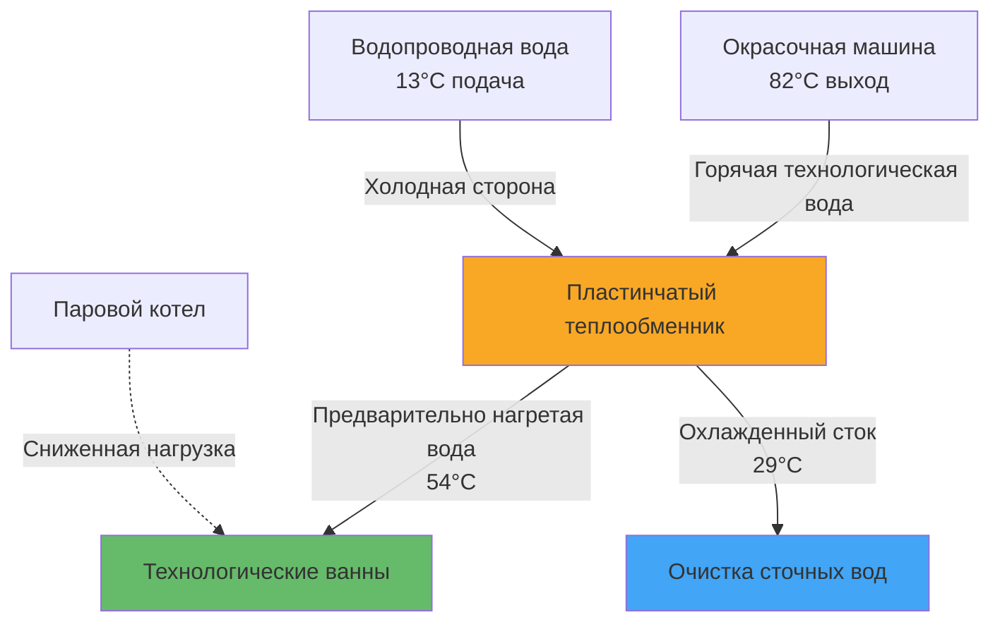
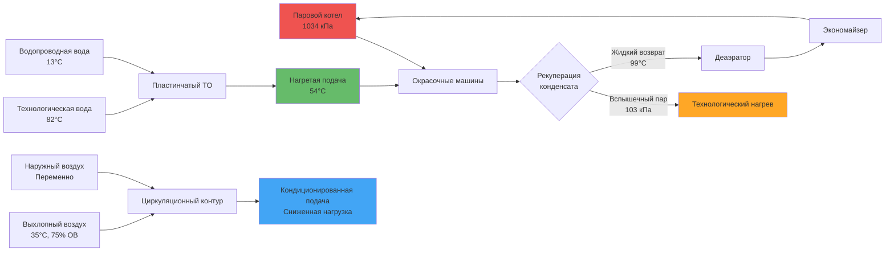

## Рекуперация тепла на предприятиях текстильной окраски и отделки

Процессы текстильной окраски и отделки относятся к наиболее энергоемким промышленным процессам, требующим значительного количества тепловой энергии для нагрева технологической воды, производства пара и кондиционирования воздуха в помещениях. Системы рекуперации тепла могут улавливать 40-70% отходящей тепловой энергии, значительно снижая эксплуатационные расходы и повышая экологические показатели.

## Фундаментальные принципы рекуперации тепла

Рекуперация тепла на текстильных предприятиях использует разницу температур между потоками отходящего тепла и входящими технологическими жидкостями. Количество рекуперируемой энергии зависит от массовых расходов, удельной теплоемкости и перепада температур:

$$Q_{recovered} = \dot{m} \cdot c_p \cdot (T_{exhaust} - T_{return})$$

Где:
- $Q_{recovered}$ = мощность рекуперируемого тепла (кВт)
- $\dot{m}$ = массовый расход (кг/с)
- $c_p$ = удельная теплоемкость (кДж/кг·К)
- $T_{exhaust}$ = температура выхлопа (К)
- $T_{return}$ = температура возврата (К)

Эффективность теплообменного оборудования количественно оценивается коэффициентом теплопередачи:

$$\eta_{HX} = \frac{Q_{actual}}{Q_{maximum}} = \frac{C_{min}(T_{hot,in} - T_{hot,out})}{C_{min}(T_{hot,in} - T_{cold,in})}$$

Где $C_{min}$ представляет минимальную тепловую производительность между горячим и холодным потоками.

## Источники рекуперации тепла при окраске и отделке

### Рекуперация тепла выхлопного воздуха

Зоны окраски и отделки поддерживают высокие уровни вентиляции (15-30 ACH) для контроля влажности и химических паров. Температура выхлопного воздуха находится в диапазоне 27-43°C с относительной влажностью часто превышающей 70%. Циркуляционные теплообменники и пластинчатые теплообменники рекуперируют явное тепло, избегая перекрестного загрязнения:

$$Q_{sensible} = 1.08 \cdot CFM \cdot \Delta T$$

Где:
- $Q_{sensible}$ = рекуперация явного тепла (кДж/ч)
- $CFM$ = расход выхлопного воздуха (м³/ч)
- $\Delta T$ = перепад температур (°C)

Рекуперация скрытого тепла через колеса энтальпии или тепловые трубы улавливает дополнительную энергию:

$$Q_{latent} = 4840 \cdot CFM \cdot \Delta W$$

Где $\Delta W$ = разница влагосодержания (кг влаги/кг сухого воздуха)

### Рекуперация конденсата пара

Процессы окраски используют пар под давлением 690-1034 кПа, конденсат которого возвращается при температуре 82-138°C с значительной тепловой энергией. Системы рекуперации вспышечного пара и возврата конденсата улавливают эту энергию:

$$Q_{flash} = \dot{m}_{condensate} \cdot h_{fg} \cdot x_{flash}$$

Где:
- $h_{fg}$ = скрытая теплота парообразования (кДж/кг)
- $x_{flash}$ = доля вспышечного пара (безразмерная)

Доля вспышечного пара зависит от перепада давления:

$$x_{flash} = \frac{h_f(P_{high}) - h_f(P_{low})}{h_{fg}(P_{low})}$$

### Рекуперация технологической воды

Вода для полоскания, сбрасываемая из окрасочных машин, выходит при температуре 60-82°C. Пластинчатые или спиральные теплообменники передают тепловую энергию входящей холодной воде:

$$\frac{1}{U \cdot A} = \frac{1}{h_{hot}} + R_{fouling,hot} + \frac{t_{wall}}{k_{wall}} + R_{fouling,cold} + \frac{1}{h_{cold}}$$

Где:
- $U$ = коэффициент теплопередачи (кВт/м²·К)
- $A$ = площадь теплопередачи (м²)
- $h$ = коэффициент конвективной теплопередачи
- $R_{fouling}$ = сопротивление загрязнению из-за отложений красителя

### Системы экономайзеров

Экономайзеры котлов рекуперируют тепло из дымовых газов (149-232°C) для предварительного нагрева питательной воды котла, повышая общую тепловую эффективность на 5-10%:

$$\eta_{boiler,improved} = \frac{Q_{steam} + Q_{economizer}}{Q_{fuel}}$$

## Производительность систем рекуперации тепла

| Метод рекуперации | Диапазон температур | Типовая эффективность | Экономия энергии | Период окупаемости |
|---|---|---|---|---|
| Рекуперация тепла выхлопного воздуха | 27-43°C | 50-65% | 15-25% нагрузки HVAC | 3-5 лет |
| Рекуперация конденсата пара | 82-138°C | 75-85% | 10-20% топлива котла | 2-4 года |
| Рекуперация технологической воды | 60-82°C | 60-75% | 20-35% водяного отопления | 2-3 года |
| Экономайзеры котлов | 149-232°C | 70-80% | 5-10% эффективности котла | 4-6 лет |
| Рекуперация вспышечного пара | 690-1034 кПа | 80-90% | 8-15% потребления пара | 2-4 года |

## Конструктивные соображения для текстильных применений

### Загрязнение и техническое обслуживание

Потоки технологической воды содержат красители, проклеивающие агенты и химические остатки, способствующие загрязнению. Выбор теплообменника должен учитывать:

- Конструкцию, доступную для очистки (съемные пакеты пластин, доступ для чистки)
- Увеличенные коэффициенты загрязнения: $R_{fouling}$ = 0,00018-0,00036 м²·К/кВт
- Поддержание скорости выше 0,9-1,2 м/с для минимизации отложений
- Совместимость химической очистки со стальными или титановыми конструкциями

### Ограничения контроля влажности

Выхлопные потоки с высокой влажностью (70-90% ОВ) ограничивают эффективность рекуперации явного тепла. Конденсация внутри теплообменников требует:

- Правильную конструкцию дренажа с уклоном минимум 1/4" на фут (примерно 2%)
- Коррозионностойкие материалы (эпоксидное покрытие алюминия, нержавеющая сталь)
- Системы оттаивания или удаления конденсата
- Контроль минимальной температуры подаваемого воздуха для предотвращения конденсации на стороне подачи

### Стратегия интеграции системы

## Расчеты экономии энергии

Общая годовая экономия энергии от интегрированной рекуперации тепла:

$$Savings_{annual} = \sum_{i=1}^{n} Q_{recovered,i} \cdot t_{operation} \cdot Cost_{energy}$$

Для типичного окрасочного предприятия площадью 4650 м² с годовым временем работы 6000 часов:

- Рекуперация технологической воды: 2638 ГДж/год
- Рекуперация конденсата пара: 4008 ГДж/год
- Рекуперация выхлопного воздуха: 1266 ГДж/год
- Экономия экономайзера: 1582 ГДж/год

**Общая потенциальная экономия:** 9494 ГДж/год при 8 $ за ГДж = **$75 952 в год**

## Рекомендации ASHRAE для промышленной вентиляции

Стандарты ASHRAE по промышленной вентиляции определяют критерии проектирования рекуперации тепла:

- Минимальный подход 28°C для жидкостных теплообменников
- Предотвращение перекрестного загрязнения через системы косвенной рекуперации тепла
- Вентиляторы рекуперации энергии, оцененные в соответствии с AHRI 1060 для применений выхлоп-в-подачу
- Надлежащее управление конденсатом в соответствии с разделом 314 IMC

## Приоритеты внедрения

1. **Сначала рекуперация высокотемпературного тепла:** системы рекуперации конденсата пара и технологической воды обеспечивают наилучший возврат инвестиций
2. **Снизить нагрев питательной воды:** предварительный нагрев входящей воды немедленно снижает нагрузку на котел
3. **Интегрировать с управлением процессом:** модулирующая рекуперация тепла в зависимости от спроса оптимизирует производительность
4. **Мониторить производительность:** установить датчики температуры и счетчики кВт/ч для проверки экономии и обнаружения загрязнений

Правильно спроектированные системы рекуперации тепла на предприятиях текстильной окраски и отделки обеспечивают снижение потребления тепловой энергии на 30-50%, при этом стоимость капитальных вложений обычно окупается в течение 2-4 лет благодаря снижению расходов на топливо и энергию.
