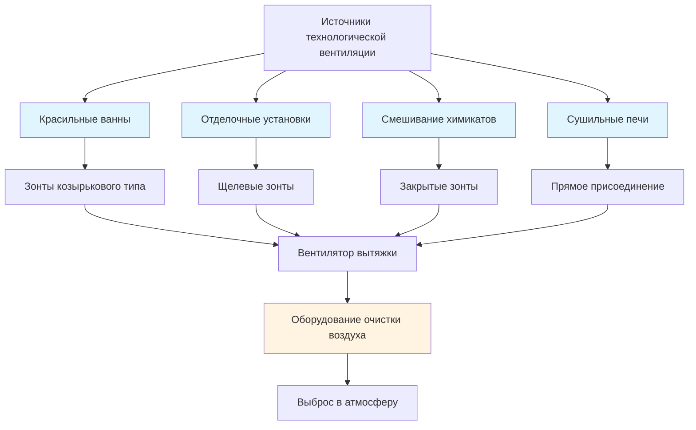
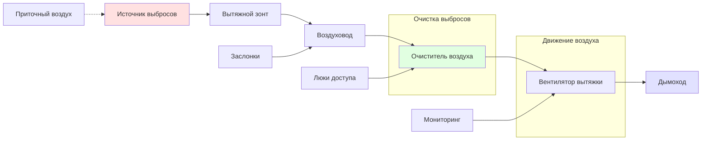

Системы технологической вентиляции на предприятиях текстильного крашения и отделки контролируют химические пары, аэрозоли красителей, тепло и влажность, выделяемые оборудованием обработки. Надлежащее проектирование вентиляции защищает здоровье работников, поддерживает качество продукции и обеспечивает соответствие требованиям OSHA PEL и ACGIH TLV.

## Требования к системам вентиляции

### Вентиляция красильных ванн

Красильные ванны выделяют пар, химические пары и аэрозоли при высокотемпературной обработке. Вытяжные зонты должны захватывать выбросы у источника до их распространения в рабочее пространство.

**Расчеты скорости захвата:**

$$V_c = \frac{Q}{A} = \frac{Q}{10 \times X^2 + A_{hood}}$$

где:
- $V_c$ = скорость захвата (м/с)
- $Q$ = расход вытяжки (м³/ч)
- $X$ = расстояние от плоскости зонта до источника выбросов (м)
- $A_{hood}$ = площадь плоскости зонта (м²)

**Необходимые скорости захвата по типам загрязнителей:**

| Тип загрязнителя | Скорость захвата | Классификация ACGIH |
|------------------|------------------|----------------------|
| Пар и влага | 0,25–0,5 м/с | Пар низкой токсичности |
| Дисперсия красящего порошка | 0,5–1,0 м/с | Частицы средней токсичности |
| Пары растворителей | 1,0–2,5 м/с | Пар высокой токсичности |
| Мисты кислот/щелочей | 0,5–1,0 м/с | Коррозионные аэрозоли |

### Контроль химических паров

Отделочные химические вещества, включая формальдегидные смолы, размягчители и огнезащитные средства, требуют специальной вентиляции при нанесении и отверждении.

**Скорость образования паров:**

$$G = \frac{M \times VP \times MW}{R \times T}$$

где:
- $G$ = скорость образования (кг/ч)
- $M$ = скорость нанесения химического вещества (л/ч)
- $VP$ = давление насыщенного пара (мм рт. ст.)
- $MW$ = молярная масса (кг/кмоль)
- $R$ = газовая постоянная (8,314 Дж/(моль·К))
- $T$ = абсолютная температура (К)

**Требуемые расходы вытяжки:**

$$Q_{exhaust} = \frac{G \times SF}{C_{max} \times \rho_{air}}$$

где:
- $Q_{exhaust}$ = расход вытяжки (м³/ч)
- $SF$ = коэффициент безопасности (обычно 2–5)
- $C_{max}$ = максимально допустимая концентрация (ppm или мг/м³)
- $\rho_{air}$ = плотность воздуха (1,2 кг/м³ при стандартных условиях)

## Проектирование местных вытяжных зондов

### Типы и применение зондов

### Расчет размеров козырьковых зондов

Для открытых красильных ванн и обрабатывающих резервуаров:

$$Q = V_c \times P \times (H + D)$$

где:
- $Q$ = расход вытяжки (м³/ч)
- $V_c$ = скорость захвата (0,25–0,5 м/с для пара)
- $P$ = периметр резервуара (м)
- $H$ = высота зонта над источником (м)
- $D$ = глубина резервуара (м)

**Требования к выступу козырькового зонта:**

| Размер резервуара | Минимальный выступ | Рекомендуемый выступ |
|---|---|---|
| < 0,9 м | 15 см | 30 см |
| 0,9–1,8 м | 30 см | 45 см |
| > 1,8 м | 45 см | 60 см |

### Проектирование щелевых зондов

Для отделочных установок и непрерывных процессов:

$$Q = 50 \times V_{slot} \times L \times W_{slot}$$

где:
- $V_{slot}$ = скорость щели (10–15 м/с)
- $L$ = длина щели (м)
- $W_{slot}$ = ширина щели (обычно 4–8 см)

**Расстояние щелей и проектирование камеры:**

$$S = \sqrt{\frac{2 \times V_{slot}^2}{\rho \times \Delta P}}$$

где:
- $S$ = расстояние щелей (м)
- $\Delta P$ = статическое давление на щелях (Па)
- $\rho$ = плотность воздуха (кг/м³)

## Компоненты системы вентиляции

### Требования к скорости потока в воздуховодах

Минимальные скорости транспорта предотвращают оседание и поддерживают захват:

| Тип материала | Минимальная скорость | Скорость проектирования |
|---|---|---|
| Пары и газы | 5 м/с | 7,5–10 м/с |
| Тонкие пыли (красящий порошок) | 10 м/с | 12,5–15 м/с |
| Тяжелые пыли | 18 м/с | 20–23 м/с |
| Липкие аэрозоли | 12,5 м/с | 15–18 м/с |

### Расчеты статического давления

**Полная потеря давления в системе:**

$$SP_{total} = SP_{hood} + SP_{duct} + SP_{fittings} + SP_{cleaner} + SP_{discharge}$$

**Потеря давления на входе в зонт:**

$$SP_{hood} = \frac{V_d^2 \times C_e}{4005}$$

где:
- $SP_{hood}$ = статическое давление в зонте (Па)
- $V_d$ = скорость в воздуховоде (м/с)
- $C_e$ = коэффициент потери на входе (0,25–1,78 в зависимости от типа зонта)

**Потеря давления на трение в воздуховоде:**

$$SP_{duct} = \frac{f \times L \times V_d^2}{4005 \times D}$$

где:
- $f$ = коэффициент трения (0,02–0,04 для оцинкованной стали)
- $L$ = длина воздуховода (м)
- $D$ = диаметр воздуховода (м)

## Оборудование для очистки выбросов

### Выбор скруббера

Химические пары и мисты кислот требуют мокрой очистки:

**Эффективность скруббера:**

$$\eta = 1 - e^{-\frac{K \times L \times A}{Q}}$$

где:
- $\eta$ = эффективность сбора
- $K$ = коэффициент массопередачи
- $L$ = высота скруббера (м)
- $A$ = площадь поперечного сечения (м²)

**Соотношение жидкость-газ:**

| Загрязнитель | Соотношение Ж/Г | Типичный диапазон |
|---|---|---|
| Пары кислот | 19–76 л/1000 м³/ч | 38–57 л/1000 м³/ч рекомендуется |
| Щелочные мисты | 11–38 л/1000 м³/ч | 19–30 л/1000 м³/ч рекомендуется |
| Пары растворителей | 38–114 л/1000 м³/ч | 57–76 л/1000 м³/ч рекомендуется |
| Аэрозоли красителей | 30–57 л/1000 м³/ч | 38–45 л/1000 м³/ч рекомендуется |

### Адсорбция на активированном углеводороде

Для летучих органических соединений (ЛОС) из отделочных химикатов:

**Расчет глубины слоя:**

$$D = \frac{Q \times C \times t}{A \times \rho_{carbon} \times W_c}$$

где:
- $D$ = глубина слоя (м)
- $C$ = концентрация на входе (кг/м³)
- $t$ = время в эксплуатации (часы)
- $\rho_{carbon}$ = плотность углерода (400–480 кг/м³)
- $W_c$ = емкость углерода (обычно 0,2–0,4 кг ЛОС/кг углерода)

## Требования к приточному воздуху

Системы вентиляции требуют сбалансированного приточного воздуха для предотвращения разрежения в здании:

$$Q_{makeup} = Q_{exhaust} - Q_{infiltration}$$

Поддерживайте давление в здании на уровне −0,008–0,020 кПа относительно наружного воздуха для локализации запахов, обеспечивая при этом адекватную подачу приточного воздуха.

**Температура приточного воздуха:**

$$T_{supply} = T_{room} - \frac{Q_{exhaust} \times (T_{room} - T_{outdoor})}{Q_{makeup} \times \eta_{heat}}$$

где $\eta_{heat}$ учитывает эффективность теплоутилизации, если применимо.

## Стандарты проектирования и источники

**Руководство ACGIH по промышленной вентиляции:** Предоставляет критерии проектирования зондов, скорости захвата и методологию расчета воздуховодов для химических процессов.

**Приложения промышленной вентиляции ASHRAE:** Описывает специальные требования для вентиляции при текстильной обработке, включая тепловые и влажностные нагрузки.

**NFPA 91:** Стандарт для систем вентиляции, работающих с легковоспламеняющимися парами, распространенными в процессах отделки на основе растворителей.

Надлежащее проектирование технологической вентиляции требует детального анализа источников выбросов, свойств химических веществ, производительности и нормативных требований. Проверка производительности системы путем измерения скорости воздуха на плоскости зонта и мониторинга профессиональной экспозиции работников обеспечивает адекватную защиту.
