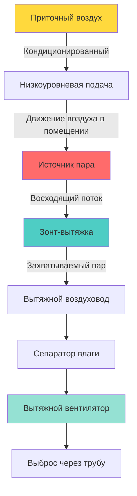
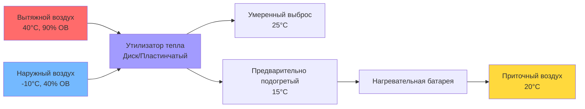

## Обзор

Удаление пара и влаги при окрашивании текстиля и отделке представляет критические проблемы из-за выбросов насыщенного пара при высокой температуре, рисков конденсации и необходимости непрерывной подачи приточного воздуха для поддержания условий производства. Надлежащая конструкция системы вытяжки предотвращает повреждение оборудования конденсатом, поддерживает комфорт рабочих и обеспечивает качество процесса.

## Скорости образования водяного пара

### Расчеты нагрузки по влаге

Общие требования по удалению влаги объединяют потери от испарения оборудования и фугитивные выбросы:

$$Q_{total} = Q_{evap} + Q_{fugitive} + Q_{process}$$

где:
- $Q_{evap}$ = нагрузка влаги от испарения (кг/ч)
- $Q_{fugitive}$ = фугитивные выбросы пара (кг/ч)
- $Q_{process}$ = прямая вентиляция технологического пара (кг/ч)

Для оборудования окрашивания, работающего при повышенных температурах:

$$Q_{evap} = A \cdot h_{fg} \cdot \frac{(P_{sat,T} - P_{partial})}{P_{atm}}$$

где:
- $A$ = площадь открытой водной поверхности (м²)
- $h_{fg}$ = скрытая теплота испарения (2257 кДж/кг при 100°C)
- $P_{sat,T}$ = давление насыщения при температуре жидкости (кПа)
- $P_{partial}$ = парциальное давление водяного пара в воздухе (кПа)
- $P_{atm}$ = атмосферное давление (кПа)

### Выброс влаги для конкретного оборудования

| Тип оборудования | Температура работы (°C) | Выброс влаги (кг/ч) | Примечания |
|------------------|-------------------------|---------------------|-----------|
| Машина для окрашивания струйного типа | 130-140 | 150-300 | Высокопрессионный сосуд с периодической вентиляцией |
| Окрашивание на валу | 100-120 | 80-150 | Низкое давление, непрерывное испарение |
| Окрашивание на грохоте | 90-100 | 60-120 | Открытая ванна с значительным испарением с поверхности |
| Промывочные установки | 60-90 | 100-200 | Несколько ванн со спрей-операциями |
| Сушилки-стентеры | 140-180 | 300-600 | Максимальные требования по удалению влаги |
| Непрерывные промыватели | 70-85 | 120-180 | Горячая вода со спреем моющего средства |

## Конструкция системы вытяжки

### Конфигурация зонта-вытяжки

Эффективность захвата зонта зависит от правильного размера над источником тепла:

$$V_{hood} = 1.4 \cdot P \cdot H \cdot \sqrt{T_{plume} - T_{amb}}$$

где:
- $V_{hood}$ = требуемый расход воздуха через зонт (м³/с)
- $P$ = периметр отверстия зонта (м)
- $H$ = расстояние от источника до зонта (м)
- $T_{plume}$ = температура потока пара (K)
- $T_{amb}$ = температура окружающей среды (K)

### Требования к скорости вентиляции

| Применение | ACH | Скорость вытяжки (CFM/м²) | Скорость потока через зонт (м/с) |
|------------|-----|---------------------------|-----------------------------------|
| Зона машины для окрашивания | 15-20 | 10,2-15,2 | 0,51-0,76 |
| Оборудование промывки | 20-25 | 12,7-20,3 | 0,64-0,89 |
| Сушилки-стентеры | 25-40 | 20,3-30,5 | 0,76-1,02 |
| Отделочная зона | 12-18 | 7,6-12,7 | 0,51-0,64 |
| Смешивание химикатов | 20-30 | 15,2-22,9 | 0,76-1,02 |

Рекомендации ASHRAE по промышленной вентиляции указывают на минимальную скорость потока через зонт 0,51 м/с для эффективного захвата пара при немасштабных нагрузках влаги.

## Предотвращение конденсации

### Управление точкой росы

Конденсация происходит, когда температура внутренней поверхности воздуховода падает ниже точки росы транспортируемого пара. Критические стратегии предотвращения включают:

1. **Изоляция воздуховода**: Минимальное термическое сопротивление 1,41 м²·K/W для вытяжных воздуховодов в кондиционированных помещениях
2. **Требования к уклону**: Минимум 2% уклона в сторону точек дренажа
3. **Дренажи конденсата**: Установка во всех низких точках и вертикальных восходящих участках

Скорость конденсации на неизолированных воздуховодах:

$$\dot{m}_{cond} = \frac{h_{conv} \cdot A_{duct} \cdot (T_{vapor} - T_{surface})}{h_{fg}}$$

где:
- $\dot{m}_{cond}$ = скорость конденсации (кг/с)
- $h_{conv}$ = коэффициент конвективной теплопередачи (Вт/м²·K)
- $A_{duct}$ = площадь внутренней поверхности воздуховода (м²)
- $T_{vapor}$ = температура пара (K)
- $T_{surface}$ = температура поверхности воздуховода (K)

### Эффективность сепаратора влаги

Установить сепаратор влаги перед вентилятором при превышении относительной влажности 90%:

$$\eta_{eliminator} = 1 - e^{-\frac{L \cdot v}{d_p^2}}$$

где:
- $\eta_{eliminator}$ = эффективность сбора (доля)
- $L$ = глубина сепаратора (м)
- $v$ = скорость потока через лицевую сторону (м/с)
- $d_p$ = диаметр капли (мкм)

## Системы приточного воздуха

### Рассмотрение утилизации тепла

Приточный воздух должен балансировать вытяжку при предотвращении чрезмерного давления в помещении:

$$Q_{makeup} = Q_{exhaust} - Q_{infiltration}$$

Типичное отношение приточного воздуха: 85-95% от объема вытяжки для поддержания легкого отрицательного давления (-2,5 до -6,2 Па), предотвращающего миграцию пара в соседние зоны.

### Расчет нагрузки отопления

Нагрузка отопления приточного воздуха в зимних условиях:

$$Q_{heating} = \dot{m}_{air} \cdot c_p \cdot (T_{supply} - T_{outdoor})$$

где:
- $Q_{heating}$ = нагрузка отопления (кВт)
- $\dot{m}_{air}$ = массовый расход приточного воздуха (кг/с)
- $c_p$ = удельная теплоемкость воздуха (1,006 кДж/кг·K)
- $T_{supply}$ = требуемая температура подачи (обычно 20°C)
- $T_{outdoor}$ = температура наружного проектного расчета (°C)

Для объекта, вытяжка которого составляет 1416 м³/ч (50 000 CFM) при температуре наружного воздуха -20°C, нагрузка отопления приточного воздуха достигает примерно 520 кВт (1,78 ГДж/ч), что представляет значительные эксплуатационные затраты.

## Рекомендации по проектированию

**Расположение зонта**: Расположить зонты-вытяжки на расстоянии 0,9-1,2 м над источниками пара с минимальным выступом 0,15 м со всех сторон.

**Скорость в воздуховоде**: Поддерживать 15-20 м/с для предотвращения накопления конденсата и обеспечения дренажа к точкам сбора.

**Выбор материала**: Использовать нержавеющую сталь (304 или 316) для воздуховодов, подвергающихся воздействию насыщенного пара и химических паров.

**Выбор вентилятора**: Выбрать материалы рабочего колеса и корпуса вентилятора, устойчивые к влаге и повышенным температурам (обычно 60-80°C).

**Управление**: Внедрить преобразователи частоты на вытяжных вентиляторах с датчиками точки росы или влажности для модуляции расхода воздуха в зависимости от фактического образования влаги.

## Источники

Справочник ASHRAE по промышленной вентиляции предоставляет подробные критерии конструкции зонтов и требования к скоростям захвата для приложений текстильной переработки с высокими нагрузками влаги.
