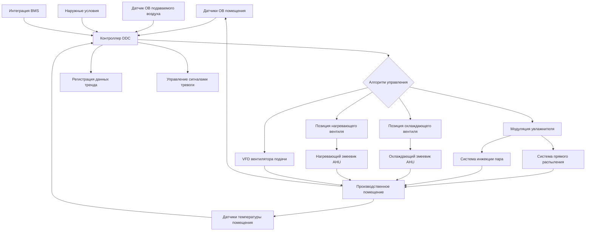
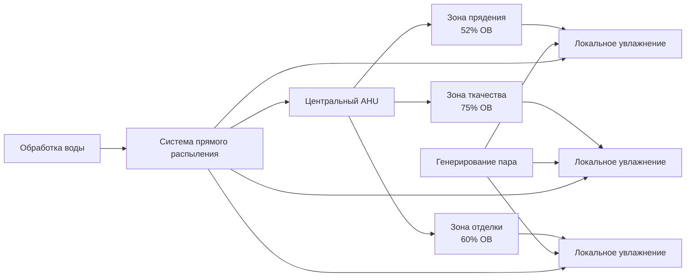

Контроль влажности представляет критически важный параметр окружающей среды в текстильном производстве, напрямую влияющий на свойства волокна, эффективность обработки, качество продукции и экономические показатели. В отличие от большинства промышленных применений, где влажность имеет второстепенное значение, текстильная обработка требует точного контроля влаги в узких пределах на всех этапах производства.

## Критическое значение контроля влажности

Текстильные волокна обладают гигроскопичными свойствами, то есть их влагосодержание уравновешивается с влажностью окружающего воздуха. Это переувлажнение напрямую влияет на прочность на растяжение волокна, эластичность, электропроводность и размерную стабильность. Недостаточная влажность приводит к накоплению статического электричества, увеличению разрывов волокна, плохому впитыванию красителя и нестабильности размеров. Избыточная влажность способствует микробному росту, коррозии оборудования и проблемам конденсации.

Экономическое воздействие неправильного контроля влажности значительно. Потери производства от разрывов волокна при прядении могут достичь 15-25% при условиях низкой влажности. Генерирование статического электричества ниже 40% ОВ вызывает прилипание волокна, наматывание вокруг оборудования и ухудшение качества пряжи. Каждое снижение относительной влажности на 1% ниже оптимальных уровней может снизить эффективность производства на 2-3% при прядении.

## Требования влажности по процессам

Различные текстильные процессы требуют определённых условий влажности в зависимости от типа волокна и этапа обработки. Следующая таблица представляет требования влажности, указанные в ASHRAE:

| Этап процесса | Температура (°C) | Относительная влажность (%) | Допуск (±%) |
|---------------|------------------|----------------------|----------------|
| Прядение хлопка | 24-28 | 50-55 | 2,5 |
| Прядение шерсти | 18-21 | 60-65 | 2,5 |
| Прядение синтетики | 21-24 | 35-40 | 2,5 |
| Ткачество хлопка | 24-27 | 70-80 | 5,0 |
| Ткачество шерсти | 21-24 | 60-70 | 5,0 |
| Ткачество синтетики | 22-26 | 45-55 | 5,0 |
| Наматывание/Основа | 21-24 | 60-65 | 2,5 |
| Окрашивание | 24-29 | 65-75 | 5,0 |
| Отделка | 21-27 | 55-65 | 5,0 |
| Проверка | 21-24 | 65 | 2,5 |

Обработка хлопка требует более высокой влажности из-за его гигроскопичной природы и склонности к накоплению статического электричества. Синтетические волокна, имея меньшую гигроскопичность, требуют более низкой влажности, но сталкиваются с большими проблемами статического электричества. Обработка шерсти требует умеренных условий для предотвращения повреждения волокна при сохранении обрабатываемости.

## Психрометрические расчёты для контроля влаги

Количество влаги, добавляемое для увлажнения текстильного производства, рассчитывается с использованием психрометрических соотношений:

$$\dot{m}_w = \dot{V} \cdot \rho_{air} \cdot (\omega_2 - \omega_1)$$

Где:
- $\dot{m}_w$ = скорость добавления влаги (кг/ч)
- $\dot{V}$ = расход воздуха (CFM)
- $\rho_{air}$ = плотность воздуха (кг/м³)
- $\omega_1$ = входящее отношение влажности (кг влаги/кг сухого воздуха)
- $\omega_2$ = требуемое отношение влажности (кг влаги/кг сухого воздуха)

Отношение влажности при конкретных условиях определяется из относительной влажности:

$$\omega = 0,622 \cdot \frac{RH \cdot P_{sat}}{P_{atm} - RH \cdot P_{sat}}$$

Где:
- $RH$ = относительная влажность (десятичная дробь)
- $P_{sat}$ = давление насыщения при температуре по сухому термометру (кПа)
- $P_{atm}$ = атмосферное давление (кПа)

Для типичного предприятия по прядению хлопка, работающего при 26°C и требующего 52% ОВ с наружными условиями 26°C и 30% ОВ, подавая 2830 CFM (м³/ч):

$$\omega_1 = 0,622 \cdot \frac{0,30 \times 3,16}{101,3 - 0,30 \times 3,16} = 0,0058 \text{ кг/кг}$$

$$\omega_2 = 0,622 \cdot \frac{0,52 \times 3,16}{101,3 - 0,52 \times 3,16} = 0,0101 \text{ кг/кг}$$

$$\dot{m}_w = 2830 \times 1,699 \times 1,20 \times (0,0101 - 0,0058) = 87,8 \text{ кг/ч}$$

## Технологии систем увлажнения

Несколько технологий увлажнения служат текстильным приложениям, каждая со своими отличительными характеристиками производительности:

**Увлажнители прямого распыления** распыляют воду непосредственно в воздушные потоки с использованием высокопроизводительных форсунок (55-210 МПа). Эти системы обеспечивают быстрое добавление влаги с минимальным изменением температуры, достигая эффективности адиабатического насыщения 85-95%. Эффект испарительного охлаждения снижает чувствительные нагрузки охлаждения примерно на 1980 кДж на килограмм испарённой воды.

**Системы инжекции пара** вводят чистый пар от специализированных котлов или теплообменников в подаваемый воздух или непосредственно в производственные помещения. Увлажнение паром обеспечивает изотермическое добавление влаги без эффектов охлаждения, критическое для температурочувствительных процессов. Расход пара следует:

$$\dot{m}_{steam} = \dot{m}_w \cdot \frac{h_{fg}}{h_{steam} - h_{water}}$$

**Ультразвуковая атомизация** генерирует тонкие водяные капли (1-5 микрон) посредством высокочастотной вибрации, обеспечивая быстрое испарение и равномерное распределение. Эти системы работают эффективно при низком давлении, но требуют деминерализованную воду для предотвращения образования белой пыли из растворённых твёрдых веществ.

**Системы увлажнения с испаряющимися влажными средами** пропускают воздух через насыщенные водой пористые среды, обеспечивая адиабатическое увлажнение с преимуществами фильтрации. Эффективность испаряющегося покрытия обычно достигает 70-85% с минимальными требованиями к обслуживанию.

## Архитектура системы управления

Точный контроль влажности требует интегрированного измерения, логики управления и модулирующих исполнительных механизмов, работающих непрерывно.

Последовательность управления реализует каскадные пропорционально-интегрально-дифференциальные (PID) циклы:

$$u(t) = K_p \cdot e(t) + K_i \int_0^t e(\tau)d\tau + K_d \frac{de(t)}{dt}$$

Где:
- $u(t)$ = выходной сигнал управления
- $e(t)$ = ошибка между уставкой и измеренным значением
- $K_p$, $K_i$, $K_d$ = коэффициенты пропорциональности, интегрирования и дифференцирования

Первичное управление контролирует относительную влажность в помещении с типичными коэффициентами $K_p = 5$, $K_i = 0,5$, $K_d = 1$ для стабильного отклика без колебаний. Вторичные циклы компенсируют колебания температуры и изменения наружных условий.

## Стратегии зонирования и распределения

Крупные текстильные производства требуют стратегического зонирования для размещения различных требований влажности в разных производственных областях.

Центральные системы обработки воздуха обеспечивают базовое кондиционирование с локальным дополнительным увлажнением, адресующим специфические требования зоны. Этот гибридный подход оптимизирует потребление энергии при сохранении точного управления. Распределительные воздуховоды требуют паровых барьеров и надлежащей изоляции для предотвращения конденсации в зонах высокой влажности, обычно требуя 5-сантиметровой закрытоячеистой изоляции с паронепроницаемым слоем для воздуховодов, несущих воздух выше 60% ОВ.

## Соображения оптимизации энергии

Увлажнение представляет значительное потребление энергии на текстильных производствах, обычно составляя 20-35% от общего потребления энергии HVAC. Нагревание воды для систем прямого распыления требует примерно 2325 кДж на килограмм воды, нагретой с 10°C до 32°C оптимальной температуры распыления. Генерирование пара потребляет примерно 2445 кДж на килограмм пара при атмосферном давлении.

Восстановление энергии из вытяжного воздуха посредством колёс энтальпии или циркуляционных контуров восстанавливает 60-75% чувствительной и скрытой энергии, существенно снижая нагрузки увлажнения. Высокоэффективные форсунки минимизируют энергию сжатого воздуха или насоса при максимизации эффективности испарения.

Контроль влажности при текстильном производстве требует инженерной точности, надлежащего выбора технологии и бдительного оперативного контроля для сохранения качества волокна, эффективности производства и экономической жизнеспособности во всех разнообразных производственных операциях.
