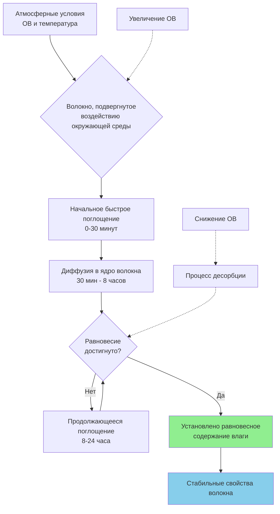
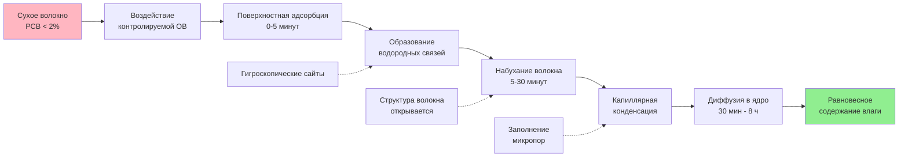

## Основы поглощения влаги волокном

Поглощение влаги волокном представляет собой гигроскопическое поглощение водяного пара из окружающего воздуха текстильными волокнами. Это явление прямо влияет на вес волокна, размерную стабильность, механические свойства и эффективность обработки. Содержание влаги при равновесии зависит от химии волокна, относительной влажности окружающей среды и температуры в соответствии с соотношениями изотерм сорбции.

Понимание восстановления влажности критически важно для проектирования систем HVAC на текстильных предприятиях, поскольку неправильный контроль влажности вызывает дефекты обработки, проблемы со статическим электричеством, разрывы волокон и экономические потери из-за колебаний веса готовой продукции.

## Определение и расчет восстановления влажности

Восстановление влажности количественно определяет массу воды, поглощенную полностью сухим волокном, выраженную в процентах от веса сухого волокна:

$$R = \frac{W_w - W_d}{W_d} \times 100$$

Где:
- $R$ = восстановление влажности (%)
- $W_w$ = вес волокна при указанных условиях (кг)
- $W_d$ = вес абсолютно сухого волокна (кг)

Альтернативный показатель, содержание влаги, приводится в отношении к мокрому весу:

$$MC = \frac{W_w - W_d}{W_w} \times 100$$

Соотношение между восстановлением влажности и содержанием влаги:

$$R = \frac{MC}{100 - MC} \times 100$$

Для коммерческих операций стандартные значения восстановления влажности устанавливаются при 65% ОВ и 21°C, как указано в ASTM D1909.

## Гигроскопическое поведение и механизмы сорбции

Текстильные волокна поглощают влагу через несколько физических механизмов:

**Первичная вода**: Непосредственно связана с полярными группами (гидроксильные, аминные, карбоксильные) через водородные связи. Эта вода прочно связана и трудно удаляется.

**Вторичная вода**: Поглощается в структуру волокна путем капиллярной конденсации в микропорах и межфибриллярных пространствах. Удаление происходит более легко, чем первичной воды.

**Третичная вода**: Поверхностная конденсация при высоких уровнях относительной влажности, особенно выше 85% ОВ.

Скорость поглощения влаги подчиняется принципам диффузии Фика при более низких уровнях влажности:

$$\frac{\partial C}{\partial t} = D \frac{\partial^2 C}{\partial x^2}$$

Где:
- $C$ = концентрация влаги
- $t$ = время
- $D$ = коэффициент диффузии (см²/с)
- $x$ = расстояние в глубину волокна

Коэффициент диффузии экспоненциально увеличивается с температурой и значительно варьируется между типами волокон.

## Стандартные значения восстановления влажности по типам волокон

В следующей таблице представлены коммерческие значения восстановления влажности при стандартных атмосферных условиях (65% ОВ, 21°C):

| Тип волокна | Стандартное восстановление влажности (%) | Типичный диапазон (%) | Классификация гигроскопичности |
|------------|--------------------:|------------------:|---------------------------|
| Хлопок | 8,5 | 7,0-9,0 | Умеренно гигроскопичное |
| Шерсть | 16,0 | 13,0-18,0 | Сильно гигроскопичное |
| Шелк | 11,0 | 10,0-12,0 | Сильно гигроскопичное |
| Лен (Лён) | 12,0 | 10,0-14,0 | Сильно гигроскопичное |
| Вискоза (Вискоза) | 13,0 | 11,0-14,0 | Сильно гигроскопичное |
| Ацетат | 6,5 | 6,0-7,0 | Умеренно гигроскопичное |
| Нейлон 6,6 | 4,5 | 3,5-5,0 | Слабо гигроскопичное |
| Полиэстер | 0,4 | 0,2-0,6 | Не гигроскопичное |
| Акрил | 2,0 | 1,5-2,5 | Слабо гигроскопичное |
| Полипропилен | 0,0 | 0,0-0,1 | Не гигроскопичное |

## Динамика равновесного содержания влаги

Равновесное содержание влаги (РСВ) устанавливается, когда парциальное давление водяного пара в волокне равно парциальному давлению водяного пара в окружающем воздухе. Время достижения равновесия варьируется от 4 часов для тонких волокон до 24+ часов для плотных волокнистых изделий.

**Эффект гистерезиса**: Волокна демонстрируют различное содержание влаги при поглощении и десорбции при одной и той же относительной влажности. Кривые десорбции показывают на 1-3% более высокое содержание влаги, чем кривые поглощения, создавая петлю гистерезиса в изотермах сорбции.

## Процесс поглощения влаги

## Влияние на операции текстильной обработки

**Прядение**: Хлопковые волокна при восстановлении влажности 6-7% демонстрируют чрезмерный разрыв; оптимальное прядение требует восстановления влажности 7,5-8,5% при 55-65% ОВ. Синтетические смеси требуют более низкую влажность для предотвращения дифференциального поглощения влаги.

**Ткачество**: Основная нить требует 6-9% влаги для гибкости и прочности. Низкое восстановление влажности вызывает хрупкость и разрывы нитей. Высокое восстановление влажности снижает трение и вызывает слабое натяжение.

**Окрашивание**: Содержание влаги в волокне влияет на скорость поглощения красителя и глубину финального цвета. Мокрая обработка требует предварительного кондиционирования до согласованных уровней восстановления влажности для равномерных результатов.

**Отделка**: Размерная стабильность во время отделки зависит от того, чтобы равновесное содержание влаги соответствовало условиям конечного использования. Степень релаксационной усадки коррелирует с разницей влаги между обработкой и конечной средой.

## Последствия для проектирования HVAC

Руководство ASHRAE по промышленной вентиляции (Глава 30) указывает требования к контролю влажности:

1. **Обработка хлопка**: Поддерживать 50-65% ОВ, 24-29°C для оптимального восстановления влажности 8%
2. **Обработка шерсти**: Поддерживать 60-70% ОВ, 18-24°C для восстановления влажности 14-16%
3. **Обработка синтетики**: Поддерживать 40-50% ОВ, 21-27°C для минимизации статического электричества

**Стратегия психрометрического контроля**:

$$q_{humidification} = \dot{m}_{air} \times (W_2 - W_1)$$

Где:
- $q_{humidification}$ = скорость добавления влаги (г/ч)
- $\dot{m}_{air}$ = скорость массового потока воздуха (кг/ч)
- $W_2$ = целевое отношение влажности (г воды/кг сухого воздуха)
- $W_1$ = отношение влажности подаваемого воздуха (г воды/кг сухого воздуха)

Расчеты нагрузки по влаге должны учитывать вентиляционный воздух, процессы сушки волокна и сезонные колебания. Системы увлажнения требуют точного контроля ±3% ОВ для поддержания согласованного восстановления влажности в зонах производства.

**Экономические соображения**: Изменение восстановления влажности на 1% при производстве 4536 кг/день хлопка представляет вариацию веса 45 кг/день, что значимо для коммерческих операций, основанных на кондиционированном весе.

## Ссылки

- ASHRAE Handbook - HVAC Applications, Chapter 30: Industrial Ventilation
- ASTM D1909: Standard Tables of Commercial Moisture Regains for Textile Fibers
- Textile Institute Moisture Regain Standards
