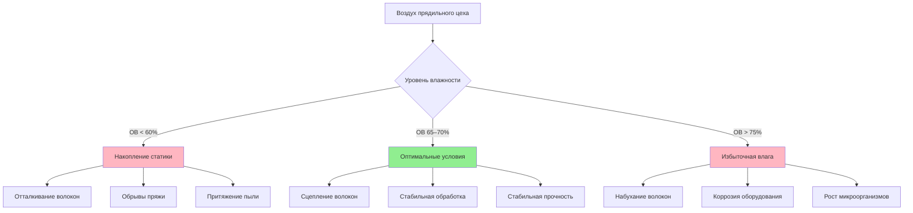
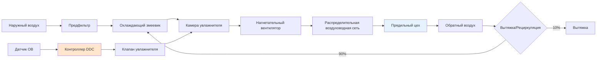

## Оптимальный диапазон влажности для прядильных операций

Прядильные операции требуют точного контроля влажности в диапазоне **65–70% ОВ** для сохранения свойств волокон, критичных для формирования пряжи. Этот диапазон оптимизирует сцепление волокон, минимизирует статическое электричество и обеспечивает стабильную прочность на разрыв как для натуральных, так и для синтетических волокон. Отклонения ниже 60% ОВ приводят к увеличению частоты обрывов, накоплению статического заряда и хрупкости волокон, тогда как условия выше 75% ОВ вызывают набухание волокон, коррозию оборудования и рост микроорганизмов.

Восстановление влаги текстильными волокнами напрямую влияет на производительность прядения. При 65–70% ОВ и 21–24°C волокна достигают равновесного содержания влаги, обеспечивающего оптимальную гибкость без чрезмерной пластификации.

## Восстановление влаги волокнами в стандартных условиях

Процент восстановления влаги определяет поведение волокон при механической обработке:

$$R = \frac{W_w - W_d}{W_d} \times 100$$

Где:
- $R$ = восстановление влаги (%)
- $W_w$ = масса влажного волокна (г)
- $W_d$ = масса высушенного в печи волокна (г)

### Требования к влажности для различных типов волокон

| Тип волокна | Оптимальная ОВ (%) | Температура (°C) | Восстановление при 65% ОВ (%) | Чувствительность к статике |
|------|------|---|-----------------|------|
| Хлопок | 65–70 | 24–27 | 7.0–8.5 | Средняя |
| Шерсть | 60–65 | 18–21 | 13.5–16.0 | Низкая |
| Полиэстер | 50–60 | 21–24 | 0.4–0.5 | Очень высокая |
| Нейлон 6,6 | 55–65 | 21–24 | 4.0–4.5 | Высокая |
| Вискоза | 65–70 | 24–27 | 11.0–13.0 | Средняя |
| Акрил | 50–60 | 21–24 | 1.5–2.5 | Очень высокая |
| Шелк | 60–65 | 21–24 | 11.0–11.5 | Низкая |

ASHRAE в рекомендациях по промышленной вентиляции и кондиционированию воздуха предлагает эти условия для стандартных прядильных операций с допуском ±2% ОВ.

## Контроль статического электричества

Накопление статического заряда возрастает экспоненциально при снижении ОВ ниже 50%. Зависимость между поверхностным сопротивлением и относительной влажностью описывается уравнением:

$$\log(\rho_s) = A - B \cdot RH$$

Где:
- $\rho_s$ = поверхностное сопротивление (Ом/квадрат)
- $A, B$ = константы, специфичные для материала
- $RH$ = относительная влажность (в долях единицы)

Для полиэстера при 40% ОВ поверхностное сопротивление достигает 10¹⁴ Ом/квадрат, что вызывает отталкивание волокон друг от друга и образование намоток на элементах прядильного оборудования. При 65% ОВ сопротивление снижается до 10¹¹ Ом/квадрат, что уменьшает количество событий разряда статического электричества на 95%.

## Сцепление волокон и прочность на разрыв

Содержание влаги создает водородные связи между молекулами волокон, увеличивая межволоконное трение, необходимое для формирования пряжи. Зависимость когезионной силы:

$$F_c = \mu \cdot N \cdot (1 + k \cdot M)$$

Где:
- $F_c$ = когезионная сила (Н)
- $\mu$ = коэффициент межволоконного трения
- $N$ = нормальная сила (Н)
- $k$ = константа чувствительности к влаге
- $M$ = содержание влаги (%)

Волокна хлопка при содержании влаги 8% (65% ОВ) демонстрируют на 40% более высокое межволоконное трение по сравнению с содержанием влаги 4% (30% ОВ), что напрямую улучшает сцепление ленты при операциях вытяжки.

## Требования к системе HVAC

Поддержание влажности 65–70% ОВ в прядильных цехах требует:

**Производительность увлажнителя:**

$$\dot{m}_w = \frac{\dot{V} \cdot \rho \cdot (W_{target} - W_{supply})}{3600}$$

Где:
- $\dot{m}_w$ = скорость подачи воды (кг/ч)
- $\dot{V}$ = расход воздуха (м³/ч)
- $\rho$ = плотность воздуха (кг/м³)
- $W$ = влагосодержание (кг воды/кг сухого воздуха)

Для прядильного цеха площадью 4645 м² с 15 воздухообменами в час типичные нагрузки на увлажнение составляют от 363 до 544 кг/ч в зависимости от влажности наружного воздуха.

## Стратегия управления для стабильной относительной влажности (RH)

**Пропорционально-интегральное управление (ПИ-регулятор):**

$$u(t) = K_p \cdot e(t) + K_i \int_0^t e(\tau) d\tau$$

Где:
- $u(t)$ = управляющий сигнал
- $K_p$ = коэффициент пропорционального усиления (обычно 0,5–1,5)
- $K_i$ = коэффициент интегрального усиления (обычно 0,1–0,3)
- $e(t)$ = сигнал ошибки (установленное значение RH — фактическое значение RH)

Управление с мертвой зоной ±1% RH предотвращает чрезмерное циклирование клапана, сохраняя параметры в рабочем диапазоне 65–70%. Размещение датчиков на высоте дыхания (1,2–1,5 м) в зоне прядения обеспечивает точную обратную связь, исключая влияние стратификации воздуха у потолка.

## Критические аспекты проектирования

**Пространственное распределение:**
Равномерность влажности по всей площади прядильного цеха должна составлять ±3% RH. Для больших помещений требуются несколько зон увлажнения с индивидуальными контурами управления.

**Качество воды:**
Использование воды обратного осмоса (TDS < 50 ppm) предотвращает отложение минералов на веретенах и образование белой пыли при работе атомизационных увлажнителей.

**Рекуперация энергии:**
Энтальпийные роторы рекуперации восстанавливают 60–70% энергии кондиционирования из вытяжного воздуха, снижая годовые эксплуатационные расходы на 0,15–0,25 долл./м² в умеренном климате.

**Мониторинг:**
Непрерывный мониторинг RH в 8–12 точках на каждые 10 000 м² обеспечивает раннее обнаружение сбоев системы до начала деградации качества пряжи.

Стандарты ASHRAE по промышленной вентиляции предписывают проведение проверочных испытаний при вводе в эксплуатацию и квартальную калибровку датчиков влажности для поддержания точности ±2% в течение всей зоны прядения.
