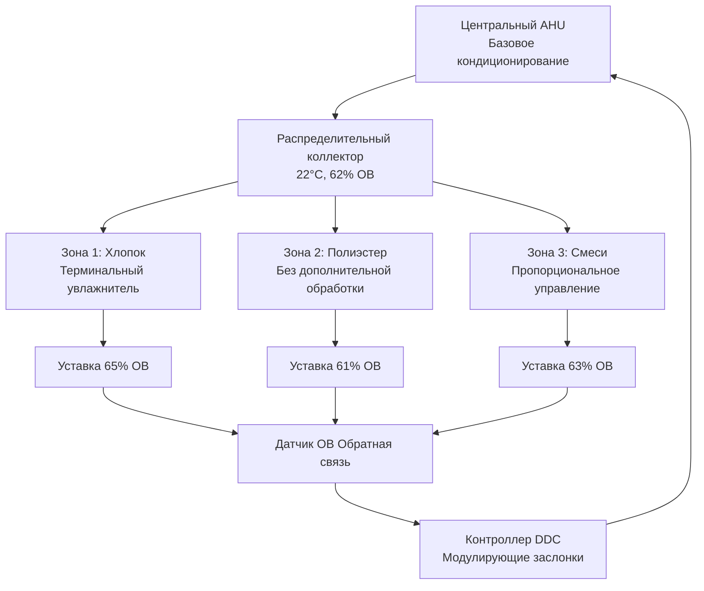

## Требования к влажности в ткацком цехе

Операции ткачества требуют точного контроля влажности на уровне 60-65% относительной влажности для сохранения оптимальных свойств пряжи и предотвращения потерь производства. Физическая основа этого требования заключается в поведении регаина влаги текстильных волокон и механических напряжениях, возникающих во время операций ткачества.

### Критический диапазон влажности для ткачества

**Целевые параметры:**
- Относительная влажность: 60-65%
- Температура: 21-24°C
- Скорость воздуха: 0,10-0,15 м/с на уровне ткацкого станка
- Однородность: ±2% ОВ по всему производственному цеху

Диапазон 60-65% ОВ представляет оптимальный баланс между пластичностью пряжи и размерной стабильностью. Ниже 60% ОВ волокна теряют влажность, становятся хрупкими и подвержены разрыву. Выше 65% ОВ пряжа поглощает избыточную влагу, что приводит к изменениям размеров и проблемам контроля натяжения.

## Физика влияния влажности на свойства пряжи

### Связь регаина влаги

Равновесное содержание влаги в текстильных волокнах следует:

$$M_r = \frac{W_{wet} - W_{dry}}{W_{dry}} \times 100$$

Где:
- $M_r$ = Регаин влаги (%)
- $W_{wet}$ = Масса при равновесной влажности
- $W_{dry}$ = Масса в сухом состоянии

Для хлопка при 65% ОВ и 21°C:

$$M_r = 8,5\%$$

Это содержание влаги обеспечивает оптимальную гибкость волокна при сохранении прочности на растяжение.

### Сохранение прочности основы

Прочность на растяжение варьируется в зависимости от содержания влаги в соответствии с:

$$\sigma_{RH} = \sigma_0 \left(1 + k_m \cdot M_r\right)$$

Где:
- $\sigma_{RH}$ = Прочность на растяжение при рабочей ОВ
- $\sigma_0$ = Прочность на растяжение при стандартных условиях
- $k_m$ = Коэффициент влаги (специфичный для волокна)
- $M_r$ = Регаин влаги

Для хлопковой пряжи $k_m \approx 0,15$, что означает изменение прочности на растяжение приблизительно на 1,5% при изменении регаина влаги на 1%.

## Предотвращение разрыва пряжи

### Анализ частоты разрывов

Частота разрывов основы напрямую коррелирует с относительной влажностью:

$$B_r = B_{ref} \cdot e^{-\alpha(RH - RH_{ref})}$$

Где:
- $B_r$ = Частота разрывов (разрывов/1000 проходов)
- $B_{ref}$ = Базовая частота разрывов при $RH_{ref}$
- $\alpha$ = Коэффициент чувствительности к влажности (≈0,08 для хлопка)
- $RH$ = Рабочая относительная влажность (%)

**Частота разрывов по уровню влажности:**

| Относительная влажность | Частота разрывов хлопка | Частота разрывов полиэстера | Частота разрывов смеси |
|-------------------|---------------------|------------------------|-------------------|
| 50% ОВ | 12,5 разрывов/1000 проходов | 6,2 разрывов/1000 проходов | 9,8 разрывов/1000 проходов |
| 55% ОВ | 8,3 разрывов/1000 проходов | 5,1 разрывов/1000 проходов | 7,2 разрывов/1000 проходов |
| 60% ОВ | 4,2 разрывов/1000 проходов | 3,8 разрывов/1000 проходов | 4,5 разрывов/1000 проходов |
| 65% ОВ | 2,8 разрывов/1000 проходов | 3,5 разрывов/1000 проходов | 3,6 разрывов/1000 проходов |
| 70% ОВ | 3,1 разрывов/1000 проходов | 4,2 разрывов/1000 проходов | 4,0 разрывов/1000 проходов |

Данные демонстрируют минимальное количество разрывов при 60-65% ОВ для всех типов пряжи.

## Контроль статического электричества

### Генерация электростатического заряда

Поверхностное удельное сопротивление текстильных материалов экспоненциально снижается с увеличением относительной влажности:

$$\rho_s = \rho_{s0} \cdot 10^{-\beta \cdot RH}$$

Где:
- $\rho_s$ = Поверхностное удельное сопротивление (Ω)
- $\rho_{s0}$ = Базовое сопротивление при 0% ОВ
- $\beta$ = Коэффициент влажности (≈0,025 для синтетики)

При 60% ОВ поверхностное удельное сопротивление снижается до $10^{10}$ Ω, позволяя рассеять заряд в течение 0,1 секунды. Ниже 50% ОВ сопротивление превышает $10^{12}$ Ω, что способствует накоплению статического заряда.

### Преимущества контроля статики при 60-65% ОВ

- Время рассеивания заряда: <0,2 секунды
- Напряжение контакта пряжа-металл: <500В (не повреждающее)
- Привлечение летучего волокна: минимальное
- Инциденты поражения оператора электричеством: исключены

## Оптимизация эффективности ткацкого станка

### Влияние на производство

Общая эффективность оборудования (OEE) коррелирует с контролем влажности:

$$OEE = A \times P \times Q$$

Где:
- $A$ = Доступность (процент времени работы)
- $P$ = Производительность (скорость в сравнении с проектной мощностью)
- $Q$ = Качество (качественные проходы против общего количества проходов)

**Влияние влажности на компоненты OEE:**

| Параметр | 50% ОВ | 60% ОВ | 65% ОВ | 70% ОВ |
|-----------|--------|--------|--------|--------|
| Доступность | 82% | 94% | 96% | 93% |
| Производительность | 76% | 91% | 93% | 88% |
| Качество | 94% | 98% | 99% | 97% |
| **Итого OEE** | **58%** | **84%** | **88%** | **80%** |

Пиковая эффективность достигается при 65% ОВ с 88% OEE, что представляет улучшение на 52% по сравнению с работой при 50% ОВ.

## Проектирование систем HVAC для ткацких цехов

### Психрометрический процесс

Процесс кондиционирования следует этой последовательности:

### Расчет нагрузки увлажнения

Требуемая производительность увлажнения:

$$\dot{m}_w = \frac{\dot{Q}_{sensible}}{h_{fg}} \cdot (W_{supply} - W_{return})$$

Где:
- $\dot{m}_w$ = Скорость добавления воды (кг/ч)
- $\dot{Q}_{sensible}$ = Чувствительная нагрузка охлаждения (кДж/ч)
- $h_{fg}$ = Скрытая теплота парообразования (≈2450 кДж/кг)
- $W$ = Коэффициент влажности (кг воды/кг сухого воздуха)

Для типичного ткацкого цеха площадью 4650 м²:
- Чувствительная нагрузка: 338 МВт
- Скрытая нагрузка: 127 МВт
- Увлажнение: 145 кг/ч в засушливые сезоны

## Требования, специфичные для типа ткани

### Оптимальная ОВ по составу волокна

| Тип ткани | Состав волокна | Оптимальная ОВ | Температура | Допуск |
|-------------|---------------|------------|-------------|-----------|
| Хлопчатобумажный батист | 100% хлопок | 62-65% | 22-24°C | ±2% ОВ |
| Полиэфирный поплин | 100% полиэстер | 60-63% | 21-23°C | ±3% ОВ |
| Смешанная полиэфирно-хлопковая | 65/35 полиэстер/хлопок | 61-64% | 22-23°C | ±2% ОВ |
| Нейлоновая тафта | 100% нейлон | 58-62% | 20-22°C | ±3% ОВ |
| Вискозный крепдешин | 100% вискоза | 63-66% | 23-24°C | ±1,5% ОВ |
| Шерстяной камвольный | 100% шерсть | 60-65% | 20-22°C | ±2% ОВ |
| Акриловый трикотаж | 100% акрил | 55-60% | 21-23°C | ±3% ОВ |
| Льняной дамаст | 100% лен | 62-67% | 22-24°C | ±2% ОВ |

### Стратегия управления

Реализовать зональное управление влажностью для многотканевого производства:

## Компоненты системы и технические характеристики

### Оборудование для обработки воздуха

**Рекомендуемые технические характеристики согласно ASHRAE Industrial Ventilation:**
- Расход подаваемого воздуха: 2,7-4,3 CFM/м² площади пола (5,4-8,6 м³/(ч·м²))
- Кратность воздухообмена: 6-10 ACH
- Эффективность фильтра: MERV 11-13 (захват летучего волокна)
- Скорость на лицевой панели змеевика: 2,0-2,5 м/с
- Температура подаваемого воздуха: 20-23°C
- Влажность подаваемого воздуха: 65-70% ОВ

### Системы увлажнения

**Прямая паровая инжекция (предпочтительно):**
- Время отклика: 30-60 секунд
- Коэффициент регулирования: 10:1
- Точность управления: ±1% ОВ
- Энергетическая эффективность: 95%+ (рекуперация отходящего тепла)

**Испарительные системы (альтернатива):**
- Время отклика: 3-5 минут
- Коэффициент регулирования: 5:1
- Точность управления: ±2% ОВ
- Преимущество охлаждения: 5,5-8 °C подход к влажному термометру

## Энергетические соображения

Годовое потребление энергии для контроля влажности:

$$E_{annual} = \dot{Q}_{humid} \cdot t_{operating} \cdot \frac{1}{COP}$$

Где:
- $E_{annual}$ = Годовая энергия (кВт·ч)
- $\dot{Q}_{humid}$ = Средняя нагрузка увлажнения (кДж/ч)
- $t_{operating}$ = Часы работы (типично 6500 ч/год)
- $COP$ = Эффективность системы

Для справочного объекта площадью 4650 м²:
- Энергия увлажнения: 80 400 кВт·ч/год
- Энергия повторного подогрева: 118 900 кВт·ч/год
- Энергия вентиляторов: 50 900 кВт·ч/год
- Итого HVAC: 250 200 кВт·ч/год

## Мониторинг и управление

### Критические точки измерения

- Влажность подаваемого воздуха: ±1% точность, дискретизация 30 секунд
- Влажность воздуха возврата: ±1% точность, дискретизация 30 секунд
- Влажность на уровне ткацкого станка: ±0,5% точность, распределенные датчики каждые 186 м²
- Поток пара: магнитный расходомер, ±2% точность
- Возврат конденсата: мониторинг температуры и потока

### Алгоритм управления

Пропорционально-интегральное (PI) управление с компенсацией по прямой связи:

$$u(t) = K_p \cdot e(t) + K_i \int_0^t e(\tau)d\tau + K_{ff} \cdot \Delta RH_{outdoor}$$

Где:
- $u(t)$ = Сигнал управления (0-100%)
- $K_p$ = Пропорциональное усиление (типично: 3,0)
- $K_i$ = Интегральное усиление (типично: 0,15 мин⁻¹)
- $K_{ff}$ = Усиление компенсации по прямой связи (типично: 1,2)
- $e(t)$ = Ошибка уставки
- $\Delta RH_{outdoor}$ = Отклонение наружной влажности

Этот подход сохраняет ±1% ОВ при нормальной работе и ±2% ОВ при экстремальных наружных условиях.

## Источники

- ASHRAE Handbook - HVAC Applications, Глава 20: Textile Processing
- ASHRAE Standard 62.1: Ventilation for Acceptable Indoor Air Quality
- Textile Institute: Humidity Control in Weaving Sheds
- ACGIH Industrial Ventilation Manual, 30-е издание
