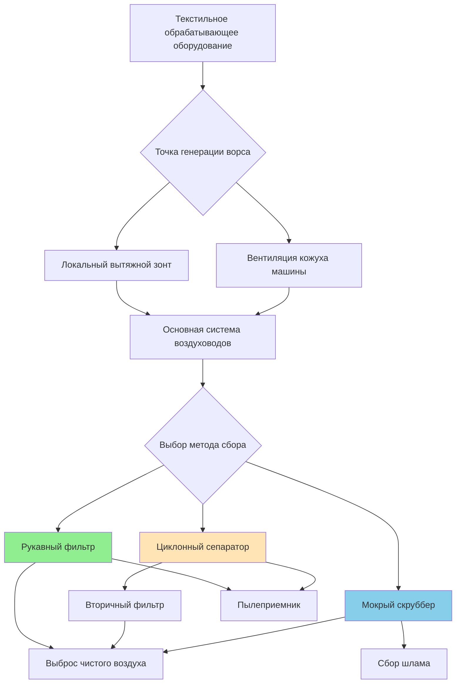
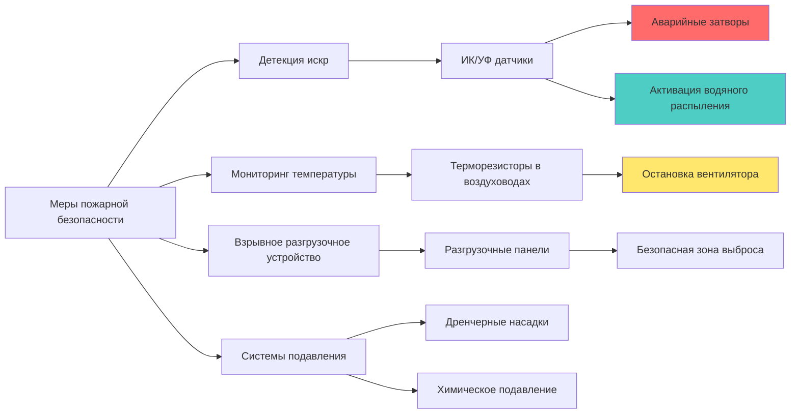

# Системы контроля ворса на текстильных предприятиях

Контроль ворса представляет собой критическую проблему безопасности и эксплуатации на текстильных производственных площадках. Накопление волокон в воздухе создает пожаро- и взрывоопасные условия, снижает качество продукции и наносит ущерб здоровью работников. Эффективное управление ворсом требует интегрированных стратегий вентиляции, фильтрации и предотвращения пожаров.

## Опасности и характеристики ворса

Текстильный ворс состоит из мелких целлюлозных или синтетических волокон, выделяемых в процессе обработки. Уровень опасности зависит от состава волокон, распределения частиц по размерам и концентрации.

### Параметры возгорания и взрыва

| Параметр | Хлопковый ворс | Полиэстер | Нейлон |
|------|---|---|---|
| Минимальная температура воспламенения | 204°C | 454°C | 510°C |
| Минимальная энергия воспламенения | 50-100 мДж | 10-20 мДж | 15-25 мДж |
| Минимальная взрывоопасная концентрация | 40-50 г/м³ | 30-40 г/м³ | 35-45 г/м³ |
| Температура воспламенения слоя | 149°C | 371°C | 399°C |

Хлопковый ворс представляет наибольший пожарный риск из-за низкой температуры воспламенения и целлюлозного состава. Слои ворса, накапливающиеся на горячих поверхностях (двигатели, подшипники, светильники), воспламеняются при температурах, значительно ниже температур воспламенения облаков взвешенных волокон.

## Требования к эффективности сбора

Системы сбора ворса должны обеспечивать высокую фракционную эффективность по всему распределению частиц по размерам. Эффективность сбора описывается моделью проникновения:

$$
\eta = 1 - e^{-\frac{4 \alpha t}{\pi d_f (1-\alpha)}}
$$

Где:
- $\eta$ = фракционная эффективность сбора (безразмерная)
- $\alpha$ = плотность фильтрующего материала (0.05-0.15 для волокнистых материалов)
- $t$ = толщина фильтра (м)
- $d_f$ = диаметр волокна (м)

ACGIH рекомендует минимальную эффективность сбора 99% для частиц >5 мкм и 95% для частиц 1-5 мкм в системах вытяжной вентиляции текстильных производств.

### Перепад давления через фильтрующий материал

Перепад давления увеличивается с ростом загрузки пылью:

$$
\Delta P = \Delta P_0 + K_2 \cdot W
$$

Где:
- $\Delta P$ = общее падение давления (Па)
- $\Delta P_0$ = падение давления на чистом фильтре (Па)
- $K_2$ = коэффициент загрузки пылью (Па·м²/г)
- $W$ = загрузка пылью на единицу площади (г/м²)

Типичные значения для текстильных применений: $\Delta P_0$ = 125-250 Па, $K_2$ = 15-25 Па·м²/г.

## Методы сбора ворса

### Системы фильтрации рукавными фильтрами

Рукавные фильтры обеспечивают наивысшую эффективность сбора (99.5-99.9%) для текстильного ворса. Ключевые параметры проектирования:

- **Воздухопроницаемость**: 0.008-0.015 м/с для хлопкового ворса
- **Цикл очистки**: Импульсная струя или обратная продувка с интервалами 2-4 минуты
- **Фильтрующий материал**: Полиэстер или арамидные ткани, рассчитанные на непрерывную работу при 200-250°F (93-121°C)
- **Детекция искр**: Обязательна для предотвращения пожаров

### Циклонные предсепараторы

Одиночные или множественные циклонные установки удаляют крупный ворс (>20 мкм) перед финальными фильтрами:

$$
\eta_c = \frac{1}{1 + \left(\frac{d_{50}}{d_p}\right)^2}
$$

Где:
- $\eta_c$ = эффективность циклона для диаметра частицы $d_p$
- $d_{50}$ = диаметр отсечки при эффективности 50% (обычно 15-25 мкм)

Циклоны снижают загрузку пылью рукавного фильтра на 60-80%, продлевая срок службы фильтров и уменьшая частоту очистки.

## Предотвращение пожаров и защита

### Требования к пожарной безопасности системы

**Критические элементы предотвращения пожаров:**

1. **Системы обнаружения искр**: Инфракрасные или ультрафиолетовые датчики, установленные на расстоянии 3–4,6 м ниже по потоку от оборудования с высоким риском. Время срабатывания <100 мс для активации аварийных затворов или систем водяного распыления.

2. **Взрывное разгрузочное устройство**: Разгрузочные панели, рассчитанные согласно NFPA 68 при давлении разгрузки 3,4–6,9 кПа. Соотношение площади vents: 0,093 м² на каждые 0,42–0,71 м³ объема коллектора для хлопковой пыли.

3. **Температурные блокировки**: Отключение вентилятора и активация системы подавления при превышении температуры в воздуховоде 66°C или скорости роста температуры более 8,3°C/мин.

4. **Заземление и уравнивание потенциалов**: Все воздуховоды должны иметь электрическую непрерывность с сопротивлением <10 Ом относительно заземления здания. Критически важно для рассеивания статического электричества в условиях низкой влажности.

## Сравнение систем

| Метод сбора | Эффективность | Потеря давления | Риск пожара | Обслуживание | Относительная стоимость |
|------|------------|---------------|------------|-----|------------|
| Рукавный фильтр (импульсная очистка) | 99,5–99,9% | 10–15 см вод. ст. | Высокий (требуется защита) | Средний (замена рукавов) | Высокая |
| Циклон + рукавный фильтр | 99,0–99,5% | 15–23 см вод. ст. | Средний (предварительное разделение) | Низкий | Средне-высокая |
| Мокрый скруббер | 95–98% | 20–30 см вод. ст. | Низкий (негорючий) | Высокий (обработка воды) | Средняя |
| Патронные фильтры | 99,0–99,5% | 7,6–12,7 см вод. ст. | Высокий (требуется защита) | Средний (замена патронов) | Средняя |

## Рекомендации по проектированию

Руководства ASHRAE по промышленной вентиляции и Справочник ACGIH по промышленной вентиляции устанавливают минимальные требования:

- **Транспортная скорость**: 20–23 м/с в горизонтальных воздуховодах для предотвращения осаждения (эквивалентно 4000–4500 фут/мин).
- **Скорость захвата в приемной камере**: 0,75–1,0 м/с для закрытых источников (эквивалентно 150–200 фут/мин).
- **Подпиточный воздух**: 100% от объема вытяжного воздуха, кондиционированный для поддержания влажности 50–65% относительной влажности.
- **Доступ для осмотра**: Люки каждые 6 м трассы воздуховода и во всех местах изменения направления.
- **Удаление пыли**: Ежедневный график очистки накопленной пыли во всех доступных зонах.

Правильное проектирование системы контроля пыли интегрирует высокоэффективный сбор, технологии предотвращения пожаров и строгие протоколы обслуживания для обеспечения безопасной работы текстильного завода при соблюдении стандартов качества воздуха.
