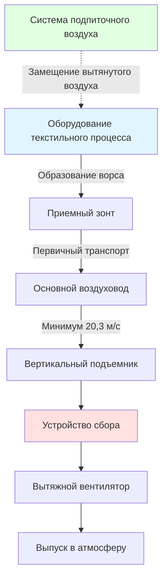
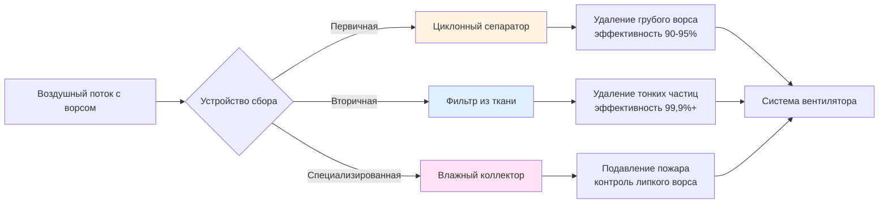
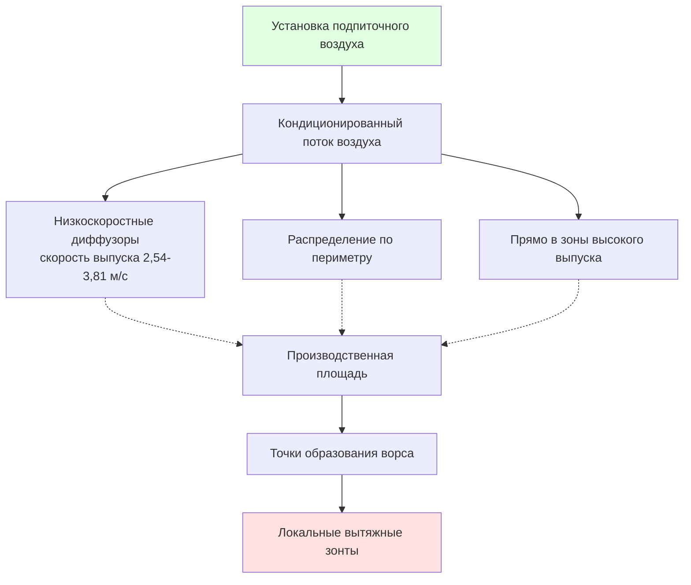

## Обзор

Системы выпуска воздуха для контроля ворса на текстильных фабриках представляют критически важные приложения промышленной вентиляции, требующие точного инженерного расчета для поддержания качества воздуха, предотвращения пожарных опасностей и обеспечения эффективности процесса. Надлежащее проектирование системы предполагает баланс между эффективностью захвата, скоростью транспорта, расходом энергии и требованиями обслуживания.

## Принципы локальной вытяжной вентиляции

### Требования к скорости захвата

Фундаментальный критерий проектирования вытяжки ворса – обеспечение достаточной скорости захвата в точке образования. В соответствии с руководством ACGIH Industrial Ventilation Manual, частицы ворса требуют минимальные скорости захвата в зависимости от условий образования:

| Условие образования ворса | Требуемая скорость захвата (м/с) |
|---------------------------|----------------------------------|
| Выпущено без скорости (осаждение) | 0,25-0,51 |
| Выпущено при низкой скорости (<0,51 м/с) | 0,51-1,02 |
| Активное образование (кардинг, прядение) | 1,02-2,54 |
| Высокоскоростная обработка (>5,08 м/с) | 2,54-5,08 |

### Расчеты конструкции зонта

Требуемый объемный расход для незаключенных зонтов:

$$Q = V_c \cdot A_h \left(10X^2 + A_h\right)$$

Где:
- $Q$ = требуемый расход воздуха (м³/ч)
- $V_c$ = скорость захвата у источника (м/с)
- $A_h$ = площадь лицевой стороны зонта (м²)
- $X$ = расстояние от лицевой стороны зонта до источника (м)

Для фланцевых зонтов зависимость улучшается:

$$Q = V_c \cdot A_h \left(5X^2 + A_h\right)$$

Конструкция с фланцем снижает требуемый расход воздуха примерно на 50% для эквивалентной производительности захвата.

## Типы и технические характеристики зонтов

### Конструкция щелевого зонта

Щелевые зонты обеспечивают эффективный захват для линейных текстильных процессов. Критические параметры проектирования:

| Параметр | Спецификация | Основание |
|----------|--------------|-----------|
| Скорость щели | 5,08-10,16 м/с | Увлечение ворса |
| Ширина щели | 0,64-1,27 см | Баланс потока/захвата |
| Глубина плены | 6-10× ширины щели | Равномерное распределение скорости |
| Коэффициент потерь входа | 0,5-1,2 | Зависит от геометрии сужения |

Расчет площади выпуска щели:

$$A_{slot} = \frac{Q}{V_{slot}}$$

Где $V_{slot}$ представляет проектную скорость щели.

### Приложения навесных зонтов

Большие навесные зонты служат для текстильного оборудования, где точечный захват непрактичен:

$$Q = V_c \cdot \left(P \cdot W + A_f\right)$$

Где:
- $P$ = периметр рабочей площади (м)
- $W$ = расстояние от источника до зонта (м)
- $A_f$ = площадь лицевой стороны открытия оборудования (м²)

## Проектирование воздуховода и скорость транспорта

### Минимальные скорости транспорта

Воздушные потоки, содержащие ворс, требуют достаточной скорости для предотвращения осаждения и накопления:

| Характеристики материала | Минимальная скорость (м/с) |
|--------------------------|---------------------------|
| Хлопковый ворс (легкий, пушистый) | 17,78 |
| Синтетические волокна (средняя плотность) | 20,32 |
| Тяжелые смеси пыли/ворса | 22,86 |
| Вертикальные воздуховоды (любой материал) | 20,32 минимум |

### Расчеты потерь давления

Общее падение давления в системе:

$$\Delta P_{total} = \Delta P_{hood} + \Delta P_{duct} + \Delta P_{fittings} + \Delta P_{collector}$$

Потери трения в воздуховоде согласно ACGIH:

$$\Delta P_{duct} = f \cdot \frac{L}{D} \cdot \frac{V^2}{4005}$$

Где:
- $f$ = коэффициент трения (0,035-0,05 для воздуховодов ворса)
- $L$ = длина воздуховода (м)
- $D$ = диаметр воздуховода (см)
- $V$ = скорость (м/с)

Потери на фитингах:

$$\Delta P_{fitting} = C \cdot \frac{V^2}{4005}$$

Типичные коэффициенты потерь для обслуживания ворса:
- Отвод 90° (r/D = 1,5): C = 0,27
- Отвод 90° (r/D = 2,5): C = 0,20
- Вход ветви (45°): C = 0,30
- Резкое расширение: C = 1,0

## Системы сбора

### Циклонные сепараторы

Первичная сбор текстильного ворса. Скорость входа 17,78-22,86 м/с достигает 90-95% эффективности сбора для частиц >10 микрон.

Оценка падения давления:

$$\Delta P_{cyclone} = K \cdot \frac{V_{inlet}^2}{4005}$$

Типичные значения K: 4-8 напорных высот для циклонов стандартной эффективности.

### Фильтры-коллекторы из ткани

Вторичная фильтрация достигает >99,9% эффективности. Параметры проектирования:

| Параметр | Типичный диапазон | Примечания |
|----------|-------------------|-----------|
| Соотношение воздуха и ткани | 0,12-0,19 м³/(с·м²) | Приложения с хлопковым ворсом |
| Скорость фильтрации | 0,02-0,04 м/с | Через ткань |
| Цикл очистки | 30-60 секунд | Импульсно-реактивные системы |
| Падение давления (чистое) | 498-995 Па | Первоначальное |
| Падение давления (загруженное) | 995-1990 Па | Перед очисткой |

## Требования подпиточного воздуха

### Объемный баланс

Подпиточный воздух должен равняться общему выпуску в пределах допустимого допуска:

$$Q_{makeup} \geq 0.90 \cdot Q_{exhaust}$$

Недостаточное питание создает отрицательное давление в здании, снижающее эффективность захвата зонта и увеличивающее инфильтрацию.

### Температурные соображения

Нагрузка на нагрев подпиточного воздуха в зимний период:

$$q = 1.08 \cdot Q_{makeup} \cdot \left(T_{space} - T_{outdoor}\right)$$

Где:
- $q$ = тепловая нагрузка (кДж/ч)
- $Q_{makeup}$ = расход воздуха (м³/ч)
- Температуры в °C

Для крупных систем вытяжки текстиля (>13,2 м³/с), нагрев подпиточного воздуха представляет значительные рабочие затраты. Следует оценить рекуперацию тепла из выпуска.

### Стратегия распределения

Распределяйте подпиточный воздух вдали от вытяжных зонтов для предотвращения замыкания контура. Скорость выпуска <5,08 м/с в занятых зонах предотвращает дискомфорт.

## Выбор вентилятора

Вентиляторы вытяжки ворса требуют особого рассмотрения:

- **Конструкция без искр** (алюминий или покрытая сталь) для пожарной безопасности
- **Открытый радиальный дизайн лопасти** для предотвращения накопления
- **Конструкция II или III класса** согласно стандартам AMCA
- **Расположение входа с закруткой** при расположении ниже по потоку от коллектора
- **Взрывозащищенные двигатели** где требуется электрической классификацией

Выбор давления вентилятора включает коэффициент безопасности 25% выше расчетного сопротивления системы для компенсации загрузки фильтра и незначительных ограничений воздуховода.

## Балансировка системы

Проверка после установки измеряет статическое давление зонта и объемный расход. Каждый зонт должен достичь расхода воздуха в пределах ±10% от проектного. Балансировка с использованием:

1. Заслонок для грубой регулировки
2. Дроссельных клапанов у входов ветвей для точной настройки
3. Основного дампера воздуховода для контроля общего потока системы

Критическое измерение: статическое давление зонта у обозначенной точки отвода. Сравните с проектными значениями с учетом коррекций высоты и температуры.

## Техническое обслуживание и эксплуатация

Установите интервалы плановых проверок:

- **Ежедневно**: Мониторинг падения давления коллектора
- **Еженедельно**: Визуальная проверка воздуховода на накопление в отводах
- **Ежемесячно**: Измерение скорости лицевой стороны зонта в репрезентативных местоположениях
- **Ежеквартально**: Проверка полного переоборудования системы
- **Ежегодно**: Комплексная очистка и проверка воздуховода

Поддерживайте чистоту воздуховода. Накопление ворса, превышающее 3,2 мм в толщину, указывает на недостаточную скорость транспорта или дефект очистки, требующий немедленного исправления.

---

*Ссылка: ACGIH Industrial Ventilation: A Manual of Recommended Practice for Design, 30-е издание*
