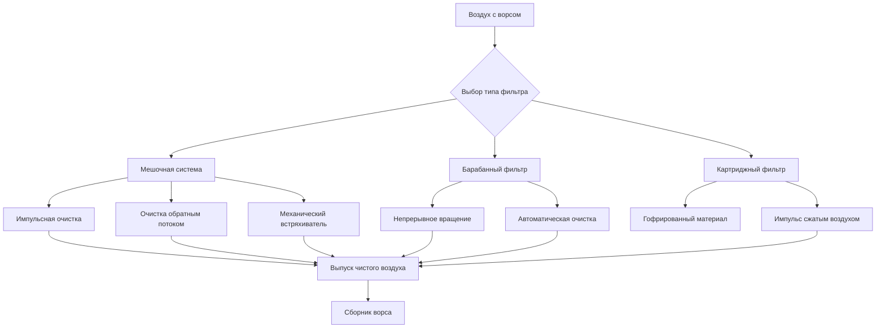

## Требования к системам фильтрации

Фильтрация ворса на текстильных предприятиях требует специализированного оборудования, способного работать при высоких нагрузках на загрязнение при сохранении эффективности воздушного потока. В отличие от обычной вентиляционной фильтрации, текстильный ворс создает уникальные проблемы, включая накопление волокнистого материала, накопление электростатического заряда и потенциальную опасность пожара от концентрированных легковоспламеняющихся волокон.

В рекомендациях ASHRAE по промышленной вентиляции указывается минимальная эффективность сбора 95% для частиц ворса выше 10 микрометров, при этом общее падение давления в системе не превышает 1,5 кПа при проектном воздушном потоке. Выбор технологии фильтрации зависит от объема производства, типа волокна, содержания влаги и ограничений планировки объекта.

## Расчеты эффективности фильтра

Производительность фильтра определяется показателями фракционной и общей эффективности сбора.

**Фракционная эффективность:**

$$\eta_d = \frac{C_{in,d} - C_{out,d}}{C_{in,d}} \times 100$$

Где:
- $\eta_d$ = фракционная эффективность для размера частиц d (%)
- $C_{in,d}$ = входная концентрация для размера d (мг/м³)
- $C_{out,d}$ = выходная концентрация для размера d (мг/м³)

**Общая эффективность сбора:**

$$\eta_{total} = \frac{m_{collected}}{m_{inlet}} \times 100 = \left(1 - \frac{C_{out}}{C_{in}}\right) \times 100$$

**Падение давления через фильтрующий материал:**

$$\Delta P = K_1 \mu V + K_2 \rho V^2$$

Где:
- $\Delta P$ = падение давления (Па)
- $K_1$ = коэффициент вязкого сопротивления (м⁻²)
- $K_2$ = коэффициент инерционного сопротивления (м⁻¹)
- $\mu$ = вязкость воздуха (Па·с)
- $V$ = лицевая скорость (м/с)
- $\rho$ = плотность воздуха (кг/м³)

## Технологии фильтрации ворса

### Системы мешочных фильтров

Мешочные пылесборники представляют отраслевой стандарт для фильтрации ворса большого объема. Отдельные фильтровальные мешки длиной обычно 3,6-4,9 м и диаметром 13-20 см обеспечивают большую площадь фильтрации в компактных конструкциях. Выбор ткани критичен — войлочный полиэстер с плотностью 544-611 г/м² обеспечивает оптимальный баланс между эффективностью, долговечностью и очищаемостью.

**Импульсная очистка:** Мощные импульсы сжатого воздуха (550-690 кПа), направленные вниз по центрам мешков, удаляют накопленный ворс. Длительность импульса 0,1-0,2 секунды с интервалом 30-90 секунд поддерживает падение давления ниже 1,25 кПа, максимизируя срок службы мешков.

**Очистка обратным потоком:** Низконапорный (25-50 кПа) обратный воздушный поток коллабирует мешки, вызывая выпадение ворса через механическое изгибание. Этот более мягкий метод продлевает срок службы мешков, но требует более крупных отсекаемых систем для непрерывной работы во время циклов очистки.

### Системы барабанных фильтров

Ротационные барабанные фильтры используют цилиндрические сетки диаметром 1,8-3,7 м, длиной 2,4-6,1 м, вращающиеся со скоростью 1-3 об/мин через потоки воздуха с ворсом. Автоматические скребковые лезвия непрерывно удаляют накопленный ворс в сборники. Эти системы превосходны в приложениях с чрезвычайно высокими нагрузками ворса (>50 зерен на 1000 м³), где быстрое забивание мешков или картриджей скомпрометировало бы эффективность.

Лицевые скорости ограничены 0,76-1,27 м/с через поверхность барабана для предотвращения проникновения ворса через сетку (обычно из нержавеющей стали размером ячейки 40-60 меш). Барабанные системы используются как предварительные фильтры перед финальными мешочными каскадами на крупных производственных объектах.

### Системы картриджных фильтров

Гофрированные картриджные фильтры обеспечивают площадь в 3-5 раз больше, чем эквивалентные мешочные фильтры благодаря компактной гофрированной конструкции материала. Картриджные системы занимают на 40-60% меньше площади, чем мешочные эквиваленты, но требуют более частой импульсной очистки (интервал 15-30 секунд) из-за меньшей глубины материала.

Картриджные фильтры оптимальны для средних нагрузок ворса (<20 зерен на 1000 м³) в помещениях с ограниченным пространством. Затраты на замену материала обычно на 20-30% превышают мешочные системы, но сокращение площади установки часто оправдывает операционную надбавку.

## Сравнение типов фильтров

| Параметр | Мешочный (Импульсный) | Барабанный фильтр | Картриджный фильтр |
|-----------|---------------------|-------------|------------------|
| Эффективность сбора | 99,5-99,9% | 85-92% | 98-99,5% |
| Лицевая скорость | 0,020-0,030 м/с | 0,76-1,27 м/с | 0,030-0,046 м/с |
| Падение давления (чистый) | 75-100 Па | 25-50 Па | 50-75 Па |
| Падение давления (загруженный) | 125-150 Па | 60-85 Па | 100-125 Па |
| Макс. входная нагрузка | >50 зерен/1000 м³ | >100 зерен/1000 м³ | 20 зерен/1000 м³ |
| Интервал очистки | 30-90 секунд | Непрерывная | 15-30 секунд |
| Срок службы материала | 2-4 года | 3-5 лет | 1-3 года |
| Занимаемая площадь (относительно) | 1,0x | 0,8x | 0,4-0,6x |
| Начальная стоимость ($/м³/ч) | $0,27-0,41 | $0,41-0,61 | $0,34-0,51 |

## Загрузка и размеры фильтра

**Соотношение воздуха к ткани:**

$$\text{Соотношение В/Т} = \frac{Q}{A_{filter}} = \frac{\text{Воздушный поток (м³/ч)}}{\text{Площадь фильтра (м}^2\text{)}}$$

Рекомендуемые соотношения воздуха к ткани:
- Импульсный мешочный: 0,067-0,101 м³/(с·м²)
- Мешочный обратного потока: 0,033-0,050 м³/(с·м²)
- Картриджные фильтры: 0,101-0,152 м³/(с·м²)

**Требуемая площадь фильтра:**

$$A_{filter} = \frac{Q_{design}}{\text{Соотношение В/Т}} \times \text{КБ}$$

Где КБ = коэффициент безопасности (1,2-1,5 для приложений с ворсом)

## Защита от пожара и безопасность

Накопление ворса создает значительные пожарные риски. Все системы фильтрации должны включать:

- Непрерывное мониторинг температуры с сигналами при 82-93°C
- Автоматические системы подавления (водяной спрей или CO₂)
- Фильтрующий материал с рассеиванием статического электричества (поверхностное удельное сопротивление <10¹¹ Ом)
- Вентиляционные отверстия для взрыва, рассчитанные по NFPA 68 (минимум 0,093 м² на 0,43 м³ объема)
- Заземленные проводящие компоненты по всему воздушному потоку

Системы выпуска сборника должны эвакуировать собранный ворс в течение 8-часовых интервалов для предотвращения уплотнения и рисков самовозгорания.

## Оптимизация производительности системы

Регулярный мониторинг дифференциального давления между фильтровальными секциями обеспечивает раннее указание на отказы системы очистки или чрезмерную входную нагрузку. Установите базовые кривые падения давления и исследуйте отклонения, превышающие 20% от нормального рабочего диапазона.

Графики проверки материала должны включать визуальный осмотр на предмет истирания, химической деградации или неполных схем очистки. Преждевременное забивание мешков обычно указывает на недостаточное давление импульса, засоренные форсунки или загрязнение сжатого воздуха маслом или влагой.

Поддерживайте точку росы сжатого воздуха для очистки ниже -40°C для предотвращения конденсации влаги на фильтрующем материале, что вызывает необратимое забивание с гигроскопичными материалами ворса.
