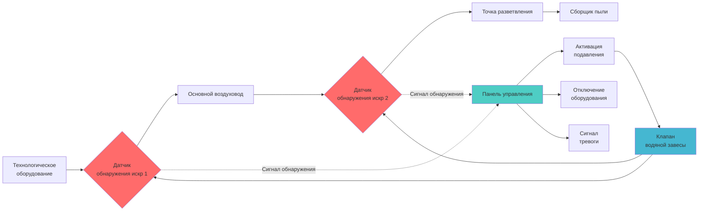
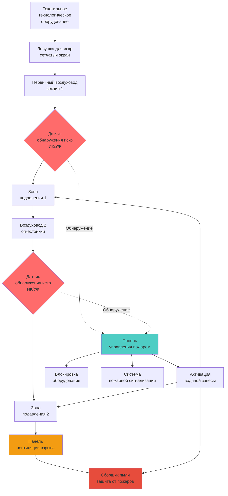

## Анализ опасности пожара от ворса

Текстильный ворс представляет один из наиболее серьезных пожарных и взрывных рисков в системах промышленной вентиляции. Накопление ворса создает богатую горючим веществом среду, где источники зажигания могут вызвать быстрое распространение пламени через воздуховоды, потенциально приводя к катастрофическим взрывам.

**Основные источники зажигания на текстильных предприятиях:**
- Искры трения от подшипников машин
- Разряды статического электричества
- Горячие поверхности, превышающие температуру самовозгорания ворса (обычно 200-230°C)
- Посторонние металлические предметы в технологическом оборудовании
- Сварка или резка вблизи систем вентиляции

Минимальная энергия зажигания для взвешенной текстильной пыли составляет 10-100 миллиджоулей, что позволяет даже небольшим искрам инициировать пожары. Отложения ворса в воздуховодах обеспечивают непрерывные пути распространения горючего, позволяя огню распространяться со скоростью, превышающей 460 м/мин.

## Системы обнаружения искр

Обнаружение искр обеспечивает первую линию защиты от пожаров ворса, идентифицируя и реагируя на источники зажигания до развития пламени.

**Методология обнаружения:**

Инфракрасные (ИК) и ультрафиолетовые (УФ) датчики контролируют воздуководы на стратегических местах для обнаружения тепловых сигнатур, характерных для искр и углей. Время отклика системы не должно превышать 0,5 секунды от обнаружения до активации подавления.

**Оптимальное размещение датчиков:**
- Непосредственно после технологического оборудования (в пределах 10 диаметров воздуховода)
- До и после каждого основного ответвления воздуховода
- До сборщиков пыли и фильтров
- На станциях измерения скорости в воздуководе

**Расчет расстояния между датчиками:**

$$L_{max} = \frac{V_{duct} \times t_{response}}{SF}$$

Где:
- $L_{max}$ = Максимальное расстояние между датчиками (м)
- $V_{duct}$ = Скорость воздуха в воздуководе (м/мин)
- $t_{response}$ = Время отклика системы (мин)
- $SF$ = Коэффициент безопасности (обычно 2,0)

Для системы со скоростью 1220 м/мин и временем отклика 0,5 секунды:

$$L_{max} = \frac{1220 \times (0.5/60)}{2.0} = 5.1 \text{ м}$$

## Автоматические системы подавления

### Системы водяной завесы

Водяное подавление обеспечивает быстрое локализацию пожара с минимальной сложностью системы. Форсунки завесы впрыскивают распыленную воду непосредственно в воздуховод при обнаружении искры.

**Критические параметры проектирования:**

| Параметр | Спецификация | Основание проектирования |
|-----------|---------------|--------------|
| Давление воды | 520-690 кПа | Требование распыления |
| Расстояние между форсунками | 3-4,5 м | Полное покрытие воздуховода |
| Время активации | <0,5 сек | Скорость распространения пожара |
| Расход | 1,9-3,8 л/мин·м² | NFPA 654 минимум |
| Размер капель | 200-400 микрон | Оптимальная эффективность охлаждения |

**Расчет расхода воды:**

$$Q_{water} = A_{duct} \times q_{spec} \times N_{zones}$$

Где:
- $Q_{water}$ = Общий расход воды (л/мин)
- $A_{duct}$ = Площадь поперечного сечения воздуховода (м²)
- $q_{spec}$ = Удельная норма подачи (л/мин·м²)
- $N_{zones}$ = Количество активных зон подавления

Для воздуховода диаметром 900 мм с нормой подачи 2,8 л/мин·м² в 3 зонах:

$$Q_{water} = \pi \times (0.45)^2 \times 2.8 \times 3 = 5.3 \text{ л/мин}$$

### Химические системы подавления

Системы на основе сухого химического вещества используют бикарбонат натрия или моноаммонийфосфат для подавления пожаров посредством вытеснения кислорода и торможения цепной реакции. Эти системы предпочтительны при неприемлемости ущерба от воды продукции или оборудованию.

## Проектирование защиты от пожаров в воздуководах

### Конструкция огнестойких воздуховодов

Воздуководы в высокорискованных зонах требуют огнестойкой конструкции для предотвращения распространения внешних пожаров и локализации внутренних пожаров.

**Требования кодексов NFPA:**

| Кодекс | Требование | Применение |
|------|-------------|-------------|
| NFPA 654, раздел 7.2.3 | Металлический воздуховод минимум 22-го калибра | Все системы сбора ворса |
| NFPA 654, раздел 7.2.5 | Горизонтальный воздуховод минимум 2% уклона | Предотвращение накопления ворса |
| NFPA 654, раздел 9.4.1 | Требуется вентиляция взрыва | Сборщики пыли и закрытое оборудование |
| NFPA 91, раздел 4.3.2 | Конструкция, устойчивая к искрам | Транспорт абразивных материалов |
| NFPA 654, раздел 8.3.2 | Противопожарные заслонки запрещены | Системы воздуховодов ворса |

### Вентиляция взрыва

Панели вентиляции взрыва защищают оборудование и конструкции, сбрасывая избыточное давление во время дефлаграционных событий.

**Расчет площади вентиляции по NFPA 68:**

$$A_v = C \times V^{0.667} \times \left(\frac{P_{max}}{P_{red}}\right)^{0.5}$$

Где:
- $A_v$ = Требуемая площадь вентиляции (м²)
- $C$ = Константа вентиляции (0,11 для текстильной пыли)
- $V$ = Объем корпуса (м³)
- $P_{max}$ = Максимальное давление взрыва (обычно 690 кПа)
- $P_{red}$ = Пониженное давление при вентиляции (обычно 10-14 кПа)

Для сборщика пыли объемом 28,3 м³ с $P_{red}$ = 10 кПа:

$$A_v = 0.11 \times (28.3)^{0.667} \times \left(\frac{690}{10}\right)^{0.5} = 7.9 \text{ м}^2$$

## Требования к уборке и техническому обслуживанию

Эффективная защита от пожаров критически зависит от предотвращения накопления ворса, обеспечивающего топливо для пожаров.

**Стандарты уборки NFPA 654:**
- Максимальная толщина слоя пыли: 0,8 мм над 5% площади пола инициирует уборку
- Частота уборки: ежедневно в зонах высокой производительности
- Требуется вакуумная очистка (сжатый воздух запрещен)
- Интервалы проверки воздуховодов: еженедельная визуальная, ежегодная внутренняя проверка
- Замена фильтра в зависимости от перепада давления, не по расписанию

**Триггеры очистки воздуховодов:**

$$\Delta P_{clean} = 1.5 \times \Delta P_{design}$$

Где очистка является обязательной при измеренном перепаде давления, превышающем 150% проектных значений, указывая на значительное накопление ворса, ограничивающее воздушный поток и увеличивающее пожарный риск.

## Интеграция системы и испытания

Системы защиты от пожаров требуют интегрированного проектирования с блокировками технологического процесса для обеспечения скоординированного ответа во время пожарных событий. При обнаружении искры или активации пожарной сигнализации система должна:

1. Активировать системы подавления в затронутых зонах
2. Отключить технологическое оборудование, питающее затронутый воздуховод
3. Закрыть изолирующие заслонки для локализации распространения пожара
4. Поддерживать работу вытяжного вентилятора для предотвращения обратного дымления
5. Уведомить персонал экстренного реагирования объекта

**Частота испытаний по NFPA 654:**
- Датчики обнаружения искр: ежемесячное функциональное испытание
- Разряд системы подавления: ежегодное полномасштабное испытание
- Блокировки аварийного отключения: ежеквартальная проверка
- Панели вентиляции взрыва: ежегодная проверка засорения

## Ссылки

- NFPA 654: Стандарт по предотвращению пожаров и взрывов пыли при производстве, переработке и обращении с горючими твердыми частицами
- NFPA 68: Стандарт по защите от взрывов дефлаграционной вентиляцией
- NFPA 91: Стандарт для вытяжных систем для воздушного транспорта паров, газов, туманов и твердых частиц
- ASHRAE Industrial Ventilation Design Guidebook, Глава 14: Вентиляция текстильной промышленности
