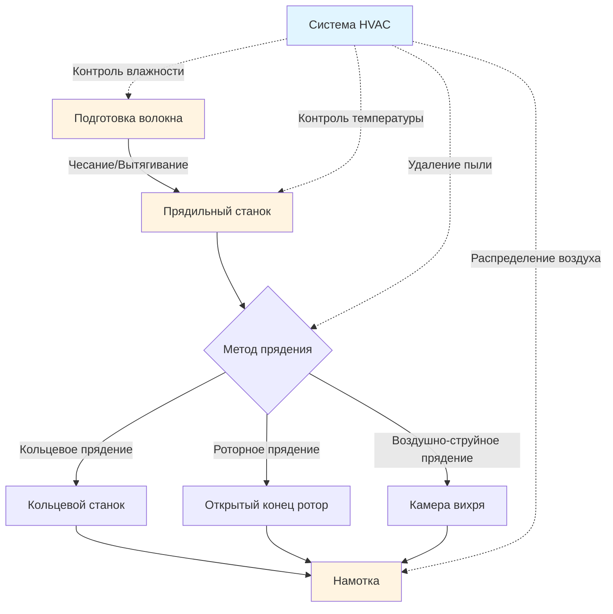

# Системы HVAC для процессов прядения текстиля

Процессы прядения трансформируют волокно в пряжу посредством операций механического вытягивания и скручивания, которые требуют точного контроля окружающей среды. Физические свойства текстильных волокон — особенно гигроскопичность, накопление статического заряда и прочность при растяжении — значительно варьируются в зависимости от условий окружающей среды, что делает системы HVAC критически важными для качества продукции и эффективности процесса.

## Обзор процесса и требования HVAC

Текстильное прядение охватывает множество технологий, каждая с отличительными требованиями к окружающей среде, определяемыми характеристиками обработки волокна и механическими напряжениями, возникающими при формировании пряжи.

### Сравнение методов прядения

| Метод прядения | Температура (°C) | Относительная влажность (%) | Скорость воздуха (м/мин) | Приоритет контроля пыли |
|----------------|------------------|----------------------|-------------------|----------------------|
| Кольцевое прядение | 22–26 | 55–65 | 9–15 | Высокий |
| Роторное (открытый конец) | 21–24 | 50–60 | 15–30 | Очень высокий |
| Воздушно-струйное прядение | 20–24 | 45–55 | 30–45 | Критический |
| Фрикционное прядение | 21–24 | 50–60 | 15–30 | Высокий |

## Физика контроля влажности

Текстильные волокна обладают гигроскопичным поведением, поглощая или выделяя влагу до достижения равновесия с окружающим воздухом. Гигроскопичность напрямую влияет на гибкость волокна, генерацию статического заряда и прочность пряжи.

### Соотношение гигроскопичности

Равновесная гигроскопичность хлопковых волокон подчиняется:

$$M_e = \frac{18.99 \phi + 0.05 \phi^2}{1 - 0.01 \phi}$$

Где:
- $M_e$ = равновесная гигроскопичность (%)
- $\phi$ = относительная влажность (%)

### Психрометрические требования

Абсолютная влажность должна поддерживаться в узких диапазонах, чтобы предотвратить нарушения процесса:

$$W = 0.622 \frac{P_v}{P_{atm} - P_v}$$

Где:
- $W$ = коэффициент влажности (кг воды/кг сухого воздуха)
- $P_v$ = парциальное давление водяного пара (кПа)
- $P_{atm}$ = атмосферное давление (кПа)

Для хлопчатобумажного прядения при 24°C и 60% ОВ:

$$P_v = \phi \times P_{sat} = 0.60 \times 2.985 = 1.791 \text{ кПа}$$

$$W = 0.622 \frac{1.791}{101.325 - 1.791} = 0.0111 \text{ кг/кг}$$

Это соответствует примерно 11,1 граммам влаги на килограмм сухого воздуха, что требует точной осушающей или увлажняющей мощности.

## Стратегия контроля температуры

Прядильное оборудование генерирует значительное тепло за счет трения в подшипниках веретен, интерфейсах путеводитель-кольцо и роторных системах. Тепловые нагрузки варьируются от 5–7 кВт на веретено для кольцевых станков до 11–17 кВт на позицию ротора.

### Расчет чувствительной тепловой нагрузки

Общая чувствительная тепловая нагрузка для прядильного цеха:

$$Q_s = Q_{machines} + Q_{lighting} + Q_{transmission} + Q_{occupants}$$

Для прядильной фабрики с 10 000 веретён кольцевого прядения:

$$Q_s = (10,000 \times 5.9) + 145,000 + 87,000 + 29,000 = 351 \text{ кВт}$$

Температурную стратификацию необходимо минимизировать, чтобы поддерживать равномерные условия на всей производственной площадке. Вертикальные температурные градиенты, превышающие 1,1°C на 3 м высоты, вызывают неприемлемые вариации в свойствах пряжи.

## Контроль пыли и фильтрация

Образование волокнистой пыли при открытии, чесании и прядении создает респираторные опасности и загрязнение процесса. Размеры частиц пыли варьируются от 0,5 до 50 микрон, причем респирабельная фракция (< 10 микрон) требует удаления для соответствия предельно допустимой концентрации (ПДК) OSHA 1,0 мг/м³ для хлопковой пыли.

### Проектирование вентиляции

Локальная вытяжная вентиляция в точках образования пыли:

$$Q = V \times A \times 60$$

Где:
- $Q$ = объемный расход воздуха (CFM или м³/ч)
- $V$ = скорость захвата (м/мин, обычно 30–61 для текстильной пыли)
- $A$ = площадь открытия вытяжного зонта (м²)

Для чесальной машины с открытием вытяжки 0,37 м²:

$$Q = 30 \times 0,37 \times 60 = 665 \text{ м³/ч минимум на машину}$$

### Требования к фильтрации

Требования к эффективности фильтрации ASHRAE 52.2:

- Предварительные фильтры: MERV 8–11 (35–65% эффективность при 1–3 микронах)
- Финальные фильтры: MERV 13–14 (75–90% эффективность при 0,3–1 микронах)
- Опциональные HEPA: 99,97% при 0,3 микронах для приложений прядения в чистых помещениях

## Системы распределения воздуха

Равномерное распределение воздуха предотвращает локализованные вариации влажности и температуры, которые вызывают дефекты качества пряжи. Приточный воздух должен вводиться с низкой скоростью через перфорированные воздуховоды или текстильные диффузоры, чтобы минимизировать сквозняки при обеспечении адекватного перемешивания.

### Критерии проектирования распределения

- Температура приточного воздуха: 13–16°C (на 8–9°C ниже температуры помещения)
- Относительная влажность приточного воздуха: 85–95% (требуется последующее охлаждение и осушение)
- Воздухообмены в час: 20–40 ACH в зависимости от пыльности
- Максимальная скорость воздуха на уровне работы: 0,25 м/с, чтобы предотвратить возмущение волокна

## Архитектура системы

Современные системы HVAC для текстильного прядения интегрируют:

1. **Центральные приточные установки** с охлаждающими катушками холодной воды и паровыми увлажнителями
2. **Двухканальные или VAV системы** для одновременного отопления и охлаждения в разных зонах
3. **Локализованную вытяжку** для сбора пыли в каждой точке процесса
4. **Прямое цифровое управление** с датчиками точки росы для точного контроля влажности
5. **Рекуперацию энергии** через тепловые колеса или замкнутые циклы (30–50% экономии энергии)

## Руководство ASHRAE для промышленности

ASHRAE Applications Handbook, Глава 20 (Обработка текстиля) рекомендует:

- Допуск по влажности: максимум ±3% ОВ отклонение
- Допуск по температуре: максимум ±1,1°C отклонение
- Требование свежего воздуха: 7–10 м³/ч на человека плюс компенсация вытяжки
- Время отклика системы: < 15 минут для коррекции отклонения на 5% ОВ

Соответствие этим параметрам обеспечивает стабильное качество пряжи, минимизирует разрывы волокна и поддерживает комфорт оператора в требовательной промышленной среде.

## Эксплуатационные соображения

Сезонные вариации требуют мощности системы для:

- **Зима**: Нагрузка увлажнения 1,4–2,3 кг воды/ч на 470 м³/ч приточного воздуха
- **Лето**: Нагрузка осушения 70 кВт на 930 м² площади пола
- **Переходные сезоны**: Независимый контроль температуры и влажности, чтобы избежать одновременного отопления и охлаждения

Интервалы техническое обслуживание оборудования должны учитывать накопление пуха на катушках, фильтрах и лопастях вентиляторов, обычно требующее еженедельной проверки и ежемесячной очистки.
