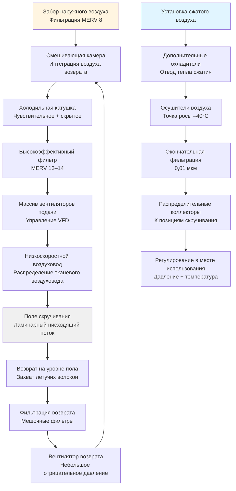

Воздушное скручивание представляет наиболее высокоскоростной метод формирования пряжи в текстильном производстве, использующий высокоскоростные воздушные потоки для скручивания и связывания волокон в непрерывную пряжу. Требования HVAC для объектов воздушного скручивания принципиально отличаются от обычного кольцевого или роторного скручивания из-за критической взаимозависимости между качеством технологического воздуха, системами сжатого воздуха и управлением окружающей средой.

## Требования к технологическому воздуху

Процесс воздушного скручивания потребляет значительные объемы сжатого воздуха при строго контролируемых условиях. Объемный расход воздуха на позицию веретена определяет общую нагрузку на систему сжатого воздуха объекта.

### Потребление сжатого воздуха

Массовый расход технологического воздуха на веретено определяется следующим образом:

$$\dot{m}_{spindle} = \frac{P_1 V_{nozzle}}{RT_1} \times n_{jets}$$

Где:
- $\dot{m}_{spindle}$ = массовый расход на веретено (кг/с)
- $P_1$ = абсолютное давление подачи (Па)
- $V_{nozzle}$ = объемный расход на сопло (м³/с)
- $R$ = удельная газовая постоянная для воздуха (287 Дж/кг·К)
- $T_1$ = абсолютная температура подачи (К)
- $n_{jets}$ = количество сопел на веретено

Общий спрос объекта на сжатый воздух:

$$Q_{total} = \dot{m}_{spindle} \times N_{spindles} \times \frac{RT_{amb}}{P_{amb}}$$

Где $N_{spindles}$ представляет общее количество действующих позиций веретен.

## Параметры управления окружающей средой

Воздушное скручивание требует более жестких допусков по окружающей среде, чем обычные методы скручивания, из-за электростатического поведения волокон и динамики вставки скручивания.

| Параметр | Требование | Допуск | Критическое влияние |
|-----------|-------------|-----------|-----------------|
| Температура | 22–25°C | ±1°C | Влажность волокна, плотность воздуха |
| Относительная влажность | 55–65% | ±3% | Электростатичность, прочность волокна |
| Скорость воздуха | 0,15–0,25 м/с | ±0,05 м/с | Распределение летучих волокон |
| Фильтрация | MERV 13–14 | — | Загрязнение сопел |
| Давление | –5 до –10 Па | ±2 Па | Изоляция соседних зон |

### Управление температурой

Чувствительная охлаждающая нагрузка объединяет тепловыделение организма, электрический ввод машины, тепло сжатия сжатого воздуха и приобретение оболочки:

$$Q_{sensible} = Q_{machines} + Q_{occupants} + Q_{compressed} + Q_{envelope} + Q_{lights}$$

Высвобождение тепла сжатого воздуха приблизительно следует:

$$Q_{compressed} = \dot{m}_{air} c_p (T_{compressed} - T_{ambient}) \times \eta_{recovery}$$

Где $\eta_{recovery}$ представляет долю тепла сжатия, выделяемого в кондиционируемое пространство (обычно 0,3–0,5 для систем с дополнительными охладителями).

## Управление влажностью

Поддержание точной влажности предотвращает электростатическое прилипание волокон к компонентам машины и обеспечивает согласованное введение скручивания. Скорость добавления влаги следует:

$$\dot{m}_{H_2O} = \frac{\dot{V}_{supply}}{v_1} (W_2 - W_1)$$

Где:
- $\dot{V}_{supply}$ = объемный расход подаваемого воздуха (м³/с)
- $v_1$ = удельный объем при условиях подачи (м³/кг)
- $W_2$ = требуемое соотношение влажности помещения (кг/кг)
- $W_1$ = соотношение влажности подаваемого воздуха (кг/кг)

## Система распределения воздуха

## Стратегия управления летучими волокнами

Воздушное скручивание создает значительное количество взвешенных волокон из-за высокоскоростной пневматической обработки. Эффективный контроль летучести требует:

**Подход вентиляции:**
- Нисходящий ламинарный воздушный поток со скоростью 0,15–0,25 м/с по позициям скручивания
- Захват воздуха возврата на уровне пола минимизирует время взвешивания волокна
- Фильтрация воздуха возврата удаляет 85–95% содержания волокна перед рециркуляцией
- Разбавление наружным воздухом обеспечивает 15–25% от общего объема подачи

**Управление давлением:**
- Поддерживайте поле скручивания при –5 до –10 Па относительно соседних пространств
- Предотвращает миграцию волокон в чистые зоны или офисы
- Герметизированные проемы для электрических и сжатых воздушных служб

## Оптимизация энергии

Объекты воздушного скручивания представляют уникальные возможности для оптимизации энергии благодаря высокому потреблению сжатого воздуха.

### Рекуперация тепла сжатого воздуха

Процесс сжатия преобразует электрический ввод в тепловую энергию. Эффективность рекуперации тепла:

$$\eta_{heat\ recovery} = \frac{Q_{recovered}}{P_{compressor} \times 3600}$$

Типичный потенциал восстановления достигает 50–70% входной мощности компрессора через:
- Производство горячей воды для увлажнения
- Отопление помещений в холодное время года
- Интеграция осушителя воздуха с регенерацией

### Управление переменным расходом

Современные системы используют:
- Вентиляторы подачи и возврата, управляемые VFD, в ответ на условия помещения
- Компрессорное каскадирование и управление VFD в соответствии с производственным спросом
- Циклы экономайзера на основе энтальпии при подходящих условиях окружающей среды
- Стратегии ночного снижения, снижающие допуски по температуре и влажности во время остановки производства

## Рассмотрения при определении размера системы

Рекомендации ASHRAE по промышленной вентиляции:

**Смены воздуха:**
- 20–30 смен воздуха в час для современных объектов
- Более высокие показатели в конфигурациях высокой плотности скручивания

**Наружный воздух:**
- Минимум 15% подачи для разбавляющей вентиляции
- Увеличено до 25% при высокой генерации летучих волокон

**Емкость сжатого воздуха:**
- Коэффициент безопасности 1,2–1,5 при расчетном спросе
- Избыточная емкость компрессора для непрерывности производства
- Объем накопителя, обеспечивающий 1–2 минуты пиковой нагрузки

## Требования к техническому обслуживанию

Критические интервалы обслуживания для HVAC воздушного скручивания:

| Компонент | Частота | Влияние пренебрежения |
|-----------|-----------|-------------------|
| Фильтры технологического воздуха (MERV 13–14) | 30–45 дней | Загрязнение сопел, падение давления |
| Мешочные фильтры возврата | 60–90 дней | Снижение рециркуляции, штраф на энергию |
| Фильтры сжатого воздуха | 90–120 дней | Перенос масла, загрязнение продукции |
| Среда увлажнения | 180 дней | Биологический рост, потеря емкости |
| Конденсатные стоки | 30 дней | Перенос воды, коррозия |
| Катушки теплообменника | 180 дней | Деградация емкости, образование льда |

Взаимозависимость между качеством сжатого воздуха, условиями окружающей среды и обработкой волокна отличает HVAC воздушного скручивания от обычных текстильных применений, требуя интегрированного проектирования системы, учитывающего требования пневматического процесса наряду с традиционными параметрами комфорта.
