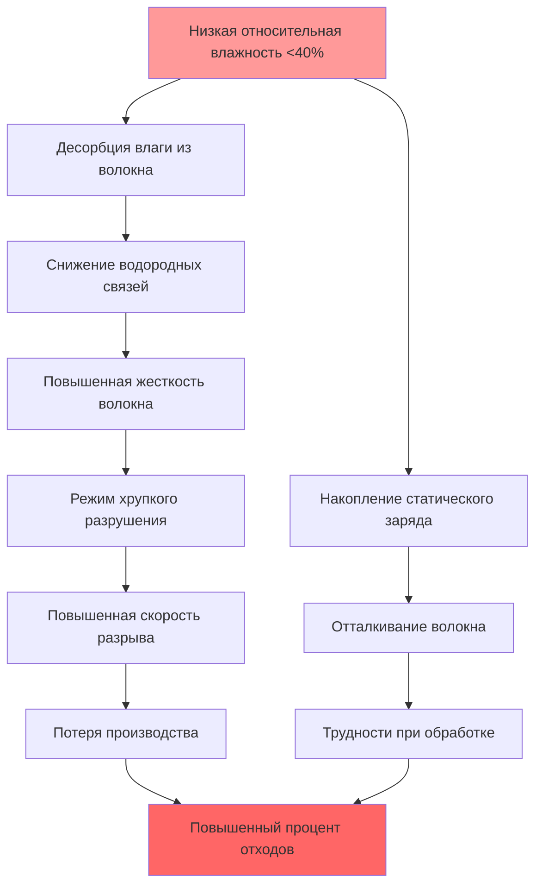
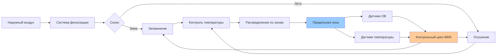

## Соотношение влаги и прочности волокна

Текстильные волокна демонстрируют значительные вариации механических свойств в зависимости от окружающей относительной влажности из-за гигроскопичного поглощения воды. Восстановление влаги прямо влияет на прочность при растяжении волокна, удлинение и модуль упругости через водородные связи между молекулами воды и полимерными цепями волокна.

### Основы восстановления влаги

Восстановление влаги (MR) определяет гигроскопичное содержание воды в текстильных волокнах:

$$MR = \frac{W_{wet} - W_{dry}}{W_{dry}} \times 100\%$$

Где:
- $W_{wet}$ = масса волокна в равновесии с окружающей ОВ
- $W_{dry}$ = сухая масса волокна в печи (обычно 105°C)

Содержание влаги в равновесии следует изотермам сорбции, которые варьируются в зависимости от типа волокна и относительной влажности. Для большинства натуральных волокон соотношение нелинейно и демонстрирует гистерезис между циклами адсорбции и десорбции.

### Зависимость прочности волокна от влажности

Прочность при растяжении гигроскопичных волокон увеличивается с содержанием влаги до оптимальных уровней. Молекулы воды пластифицируют структуру волокна, снижая хрупкость и позволяя подвижность полимерных цепей. Однако избыточная влага ослабляет водородные связи между полимерными цепями, снижая прочность.

Соотношение прочность-влажность для натуральных волокон:

$$\sigma_{fiber} = \sigma_{ref} \left(1 + k_{1} \cdot MR - k_{2} \cdot MR^{2}\right)$$

Где:
- $\sigma_{fiber}$ = прочность при растяжении при текущем восстановлении влаги
- $\sigma_{ref}$ = прочность в стандартных условиях
- $k_{1}$, $k_{2}$ = эмпирические постоянные, специфичные для волокна

## Оптимальные уровни влажности по типам волокна

Различные материалы волокна требуют конкретных диапазонов относительной влажности для максимальной прочности и минимального разрыва при операциях прядения.

| Тип волокна | Оптимальный диапазон ОВ | Целевое восстановление влаги | Диапазон температур | Увеличение прочности vs сухое |
|------------|-------------------------|------------------------------|---------------------|------------------------------|
| Хлопок | 60-65% | 7,0-8,5% | 24-27°C | +25-30% |
| Шерсть | 65-70% | 14-16% | 20-24°C | +35-40% |
| Вискозный район | 60-65% | 11-13% | 24-27°C | +40-50% |
| Лен | 65-70% | 10-12% | 22-25°C | +30-35% |
| Шелк | 65-70% | 10-11% | 24-27°C | +20-25% |
| Полиэстер | 40-50% | <0,5% | 24-27°C | +2-5% |
| Нейлон | 50-60% | 4-5% | 24-27°C | +15-20% |

### Поведение хлопкового волокна

Хлопок демонстрирует максимальную прочность при растяжении при 60-65% ОВ с приблизительно 7,5% восстановлением влаги. При ОВ ниже 40%, хлопок становится хрупким с прочностью при растяжении, снижающейся на 25-30% по сравнению с оптимальными условиями. Повышенная хрупкость вызывает повышенные скорости разрыва пряжи при вытягивании и прядении.

### Шерсть и волокна животного происхождения

Шерсть демонстрирует наибольшее восстановление влаги среди обычных текстильных волокон благодаря своей белковой структуре. Оптимальная прочность наступает при 65-70% ОВ. Корковые клетки в структуре шерстяного волокна требуют влаги для гибкости. При низкой влажности (<40% ОВ) шерсть становится грубой и подвержена разрывам волокна при кардочесании и расчесывании.

### Рассмотрение синтетических волокон

Гидрофобные синтетические волокна (полиэстер, полипропилен) показывают минимальное изменение прочности с влажностью, но требуют контролируемой ОВ для управления электростатическим электричеством. Гигроскопичные синтетические волокна (нейлон, акрил) демонстрируют умеренное увеличение прочности с влагой, аналогичное натуральным волокнам.

## Хрупкое поведение волокна при низкой влажности

Когда относительная влажность падает ниже критических пороговых значений, текстильные волокна теряют содержание влаги и демонстрируют характеристики хрупкого разрушения, а не пластичное поведение.

### Механизмы механического отказа

При низком содержании влаги:
1. **Сниженное удлинение**: Сухие волокна демонстрируют удлинение при разрыве на 30-50% ниже, что вызывает внезапный разрыв под натяжением
2. **Повышенный модуль упругости**: Жесткость увеличивается, снижая способность поглощать ударные нагрузки при обработке
3. **Эмбриттлемент поверхности**: Кутикула волокна затвердевает, увеличивая трение и урон от истирания
4. **Жесткость кристаллической области**: Потеря подвижности аморфной области концентрирует напряжение в кристаллических зонах

## Контроль статического электричества

Генерация электростатического заряда при обработке волокна обратно коррелирует с относительной влажностью. Контроль статического электричества представляет критическое вторичное преимущество управления влажностью в операциях прядения.

### Механизм генерации статического электричества

Трибоэлектрическая зарядка происходит, когда волокна контактируют с поверхностями обработки (валики, кардочесальные машины, гребни). При низкой влажности поверхностная проводимость увеличивается экспоненциально, препятствуя рассеиванию заряда.

Соотношение поверхностной проводимости:

$$\rho_{s} = \rho_{0} \cdot e^{-\beta \cdot RH}$$

Где:
- $\rho_{s}$ = поверхностная проводимость (Ω/квадрат)
- $\rho_{0}$ = опорная проводимость при 0% ОВ
- $\beta$ = коэффициент влажности (обычно 0,05-0,08 для текстиля)
- $RH$ = относительная влажность (%)

### Пороги контроля статического электричества

| Относительная влажность | Поведение статического электричества | Влияние на обработку |
|-------------------------|--------------------------------------|----------------------|
| <30% | Сильное накопление заряда | Летаемость волокна, обертывание, остановка производства |
| 30-40% | Умеренное статическое электричество | Снижение эффективности, проблемы качества |
| 40-50% | Минимальное статическое электричество | Приемлемо для синтетических волокон |
| >50% | Пренебрежимо малое статическое электричество | Оптимально для натуральных волокон |

## Рассмотрения при проектировании системы HVAC

Руководящие принципы промышленной вентиляции ASHRAE рекомендуют непрерывный мониторинг и плотный контроль условий в прядильном цехе для сохранения свойств волокна.

### Технические характеристики управления

- **Допуск управления ОВ**: ±3% от установки для прядения натуральных волокон
- **Допуск температуры**: ±1,5°C для предотвращения психрометрического смещения
- **Воздухообмены**: 15-25 ACH в зависимости от тепловых нагрузок машинного оборудования
- **Фильтрация**: MERV 11-13 для предотвращения загрязнения волокном

### Выбор системы увлажнения

Операции прядения обычно требуют емкости увлажнения 2000-5000 кг/ч на 10000 веретен. Рекомендуемые технологии:
- **Атомизация сжатым воздухом**: Генерирование мелких капель, минимальное смачивание
- **Ультразвуковые увлажнители**: Ультратонкая дымка для равномерного распределения
- **Прямой впрыск пара**: Высокая емкость, требует беззольного пара

## Стратегии предотвращения разрывов

Поддержание оптимальной влажности снижает разрывы пряжи при прядении на 40-60% по сравнению с неконтролируемыми условиями.

### Экономическое воздействие

Для операции прядения на кольцевом веретене с 20000 веретен:
- **Неконтролируемые условия** (35-50% ОВ): 15-20 разрывов на 1000 веретено-часов
- **Контролируемые условия** (62-65% ОВ): 6-8 разрывов на 1000 веретено-часов
- **Прирост производительности**: 8-12% за счет снижения времени простоя
- **Улучшение качества**: 20-30% снижение в толстых/тонких местах

### Требования мониторинга

Непрерывное измерение:
1. Относительной влажности (калибруемые гигрометры, ±2% точность)
2. Температуры по сухому термометру (датчики RTD, ±0,3°C)
3. Частоты разрывов пряжи (интегрировано с мониторингом веретен)
4. Статического напряжения (электростатические полевые измеритель в критических зонах)

Надлежащий контроль влажности в операциях текстильного прядения прямо усиливает механические свойства волокна, снижает статическое электричество, предотвращает разрывы и улучшает как производительность, так и качество продукции. Инвестиция в системы точного контроля HVAC дает измеримую отдачу за счет снижения отходов и повышения эффективности производства.
