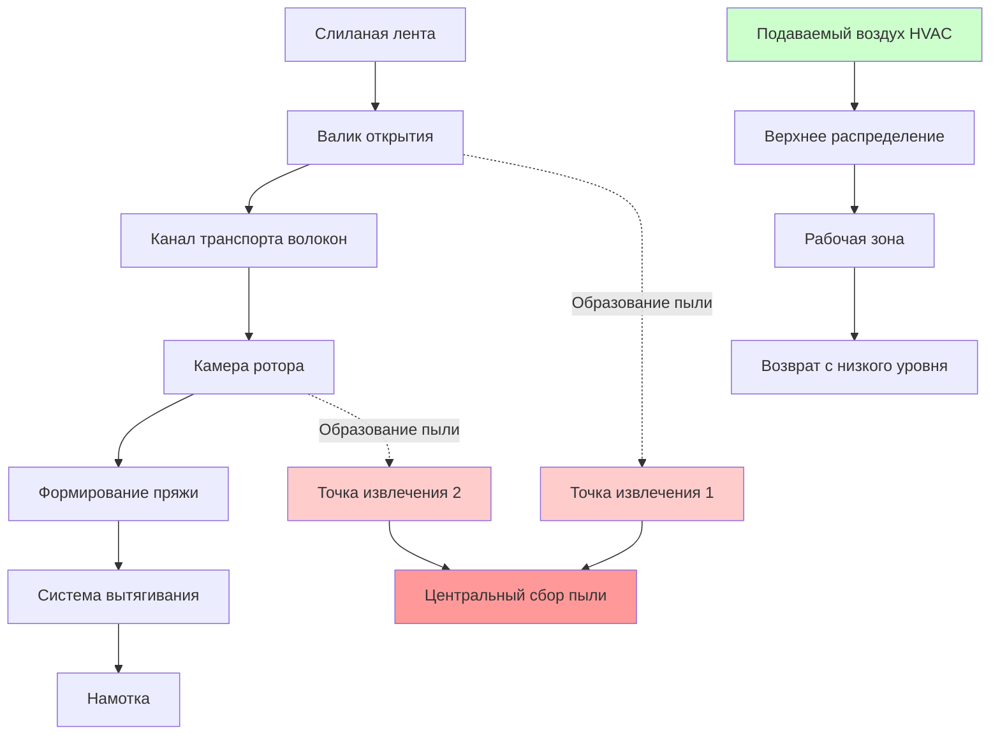
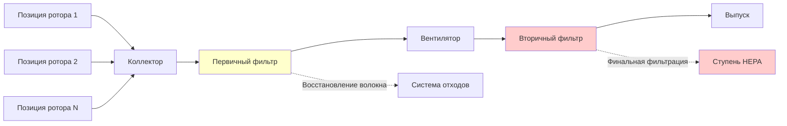

## Обзор

Открытое прядение, также известное как роторное прядение или прядение с разрывом, работает с существенно более высокими производительностями, чем кольцевое прядение, при этом требуя менее строгих экологических условий. Система HVAC должна поддерживать умеренные уровни влажности, эффективное удаление пыли и стабильные тепловые условия для обеспечения стабильного качества пряжи и производительности оборудования. В отличие от кольцевого прядения, поток разломанных волокон в процессах открытого прядения уменьшает проблемы статического электричества, но увеличивает образование пыли в роторных ящиках.

## Описание процесса

Открытое прядение полностью разделяет волокна перед их переassembling в пряжу за счет центробежной силы внутри высокоскоростного ротора. Процесс исключает традиционные системы "ползун-кольцо", обеспечивая производительность, превышающую 150 000 об/мин. Образование пыли происходит в основном на валике открытия и в камере ротора, требуя непрерывного извлечения для предотвращения накопления волокон и загрязнения подшипников.

## Спецификации окружающей среды

### Требования к температуре и влажности

ASHRAE Industrial Applications рекомендует следующие условия для открытого прядения:

| Параметр | Спецификация | Допуск | Примечания |
|----------|------------|---------|-----------|
| Температура сухого термометра | 21-24°C | ±1,1°C | Ниже, чем кольцевое прядение |
| Относительная влажность | 50-60% | ±3% | Требуется умеренный контроль |
| Скорость воздуха | 7,6-12,2 м/ч | ±3 м/ч | На уровне оператора |
| Концентрация пыли | <0,5 мг/м³ | Максимум | Дышащая фракция |

Соотношение влагопоглощения для хлопковых волокон в открытом прядении следует:

$$M_r = \frac{W_{wet} - W_{dry}}{W_{dry}} \times 100$$

Где оптимальное влагопоглощение для роторного прядения происходит при:

$$M_r = 7.0\% \pm 0.5\%$$

Это соответствует указанному диапазону 50-60% ОВ при стандартных температурах.

### Психрометрические требования

Изменение энтальпии, необходимое для кондиционирования наружного воздуха в условия комнаты прядения:

$$\Delta h = h_{room} - h_{outdoor}$$

Для типичной операции в сезон охлаждения от 35°C ОТ/24°C ОВТ на улице к 23°C ОТ/60% ОВ внутри:

$$\Delta h = 25.8 - 40.5 = -14.7 \text{ кДж/кг}_{\text{da}}$$

Коэффициент чувствительного тепла для помещений открытого прядения обычно составляет 0,70-0,80, отражая умеренные скрытые нагрузки от изменений влагосодержания волокон.

## Системы контроля пыли

### Требования извлечения

Каждая позиция роторного прядения генерирует 1,4-2,0 м³/ч загруженного пылью воздуха, требующего извлечения. Для объекта с N позициями прядения:

$$Q_{extraction} = N \times 1.7 \text{ м³/ч}/\text{позиция} \times SF$$

Где SF (коэффициент безопасности) равен 1,15-1,25 для учета вариаций давления в системе.

### Проектирование системы сбора пыли

Требования к эффективности фильтров:

| Ступень | Эффективность | Перепад давления | Тип среды |
|--------|-------------|------------------|----------|
| Первичная | 95% @ 10мкм | 508-762 Па | Мешок/картридж |
| Вторичная | 99% @ 5мкм | 762-1016 Па | Гофрированный синтетический |
| Финальная (опционально) | 99,97% @ 0,3мкм | 254-508 Па | HEPA |

## Проектирование системы HVAC

### Стратегия распределения воздуха

Распределение подаваемого воздуха использует верхние текстильные воздуховоды или перфорированные трубы для обеспечения равномерного нисходящего воздушного потока, предотвращая горизонтальные сквозняки, которые могли бы повлиять на транспорт волокон. Извлечение возвратного воздуха происходит на низких уровнях для захвата частиц пыли и поддержания небольшого избыточного давления, предотвращающего проникновение загрязнителей снаружи.

### Нормы вентиляции

Общее количество подаваемого воздуха объединяет охлаждение процесса, контроль влажности и общую вентиляцию:

$$Q_{total} = Q_{sensible} + Q_{latent} + Q_{ventilation}$$

Минимальная вентиляция: 2,7-4,3 м³/ч/м² площади производственного этажа, существенно ниже, чем кольцевое прядение, благодаря сниженному беспокойству по поводу статического электричества.

### Расчеты нагрузки системы

Приращения чувствительного тепла включают:

$$Q_s = Q_{machines} + Q_{lighting} + Q_{envelope} + Q_{occupants,sensible}$$

Выделение тепла машиной роторного прядения: 250-350 Вт на позицию прядения при полной производительности.

Скрытые нагрузки в основном происходят из выделения влаги волокном:

$$Q_l = \dot{m}_{fiber} \times \Delta M_r \times h_{fg}$$

Где:
- $\dot{m}_{fiber}$ = скорость переработки волокна (кг/ч)
- $\Delta M_r$ = изменение влагопоглощения (%)
- $h_{fg}$ = скрытая теплота испарения (2324 кДж/кг)

## Интеграция системы управления

Современные объекты открытого прядения внедряют интегрированные системы управления, отслеживающие:

1. **Зональная температура**: Прямое расширение или охлаждение ледяной водой с модулирующим управлением
2. **Влажность**: Паровая или ультразвуковая увлажнение с зондированием точки росы
3. **Извлечение пыли**: Приводы с частотным управлением, поддерживающие постоянное статическое давление на заголовках сбора
4. **Баланс воздуха**: Мониторинг избыточного давления в помещении относительно условий снаружи

Контур управления влажностью реагирует на измеренную точку росы с пропорционально-интегральным управлением:

$$u(t) = K_p \cdot e(t) + K_i \int e(t) dt$$

Где e(t) представляет ошибку точки росы от уставки, обычно управляется с допуском ±0,6°C точки росы.

## Рассмотрения энергетической эффективности

Открытое прядение требует примерно 30-40% меньше энергии HVAC, чем кольцевое прядение из-за:

- Более низких требований влажности, снижающих нагрузки увлажнения
- Умеренных спецификаций температуры, позволяющих работу экономайзера
- Сниженных скоростей воздухообмена из-за более низких потребностей контроля
- Более высоких допустимых допусков температуры и влажности

Утилизация тепла из выхлопа системы сбора пыли обеспечивает предварительное нагревание для поступления воздуха в отопительный период, восстанавливая 50-60% энергии воздуха извлечения.

## Техническое обслуживание и мониторинг

Критические интервалы техобслуживания для систем HVAC открытого прядения:

| Компонент | Частота проверки | Ключевые параметры |
|-----------|------------------|-------------------|
| Фильтры сбора пыли | Еженедельно | Перепад давления, визуально |
| Воздуховоды извлечения | Ежемесячно | Отложения, утечки |
| Системы увлажнения | Еженедельно | Пропускная способность, санитария |
| Охлаждающие змеевики | Ежемесячно | Перепад давления, пропускная способность |
| Датчики температуры/ОВ | Ежеквартально | Проверка калибровки |

Непрерывный мониторинг производительности системы извлечения пыли предотвращает потери производства из-за неадекватного удаления волокон в роторных ящиках. Снижение на 10% в эффективности извлечения может увеличить частоту чистки роторного ящика на 30-40%.

## Стандарты ссылок

Проектирование и эксплуатация систем HVAC открытого прядения должны ссылаться на:
- ASHRAE Handbook - HVAC Applications, Chapter 20: Textile Processing Plants
- ACGIH Industrial Ventilation Manual для проектирования системы контроля пыли
- Местные строительные нормы для минимальных требований к вентиляции и фильтрации
