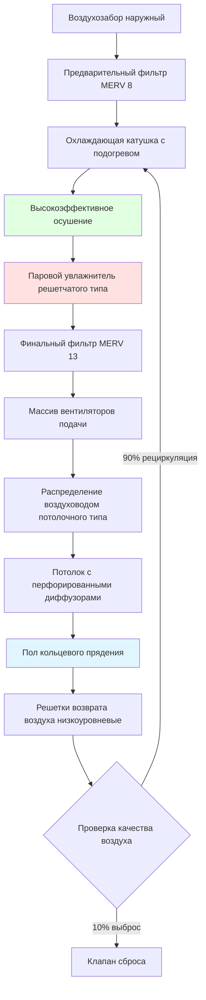
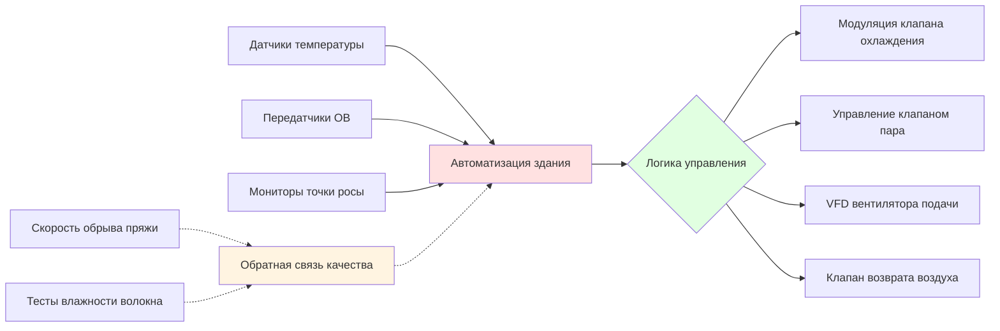

## Контроль окружающей среды при кольцевом прядении

Кольцевое прядение представляет собой наиболее сложную задачу контроля окружающей среды в текстильном производстве. Процесс преобразует вытянутый ровинг в скрученную пряжу через высокоскоростное вращение веретена, при этом механизм кольца и ползуна генерирует значительное количество тепла, требуя при этом точного содержания влаги в волокне для предотвращения разрывов.

Условия окружающей среды напрямую влияют на прочность пряжи, ее равномерность и производственную эффективность. Неадекватный контроль влажности вызывает хрупкость волокна и повышенные уровни обрывов нитей, в то время как отклонения температуры влияют на эластичность волокна и характеристики трения ползуна.

## Критические параметры процесса

Кольцевое прядение требует более жестких допусков окружающей среды, чем другие методы прядения, из-за механического напряжения, оказываемого на волокна во время введения крутки.

| Параметр | Хлопок | Полиэстер-хлопок | Синтетика | Допуск контроля |
|-----------|--------|------------------|-----------|-------------------|
| Температура | 24-27°C | 22-25°C | 21-24°C | ±1°C |
| Относительная влажность | 65-70% | 60-65% | 55-60% | ±3% |
| Скорость воздуха | 0,15-0,25 м/с | 0,15-0,25 м/с | 0,13-0,23 м/с | ±0,05 м/с |
| Влажность волокна | 7-8% | 5-6% | 0,5-1% | ±0,5% |

### Равновесное содержание влаги в волокне

Равновесное содержание влаги в текстильных волокнах подчиняется следующему соотношению:

$$M_e = \frac{K_1 \cdot K_2 \cdot RH}{(1 - K_2 \cdot RH)(1 + K_1 \cdot K_2 \cdot RH)}$$

Где:
- $M_e$ = равновесное содержание влаги (%)
- $K_1$, $K_2$ = специфичные для волокна константы сорбции
- $RH$ = относительная влажность (десятичная доля)

Для хлопка при стандартных условиях прядения (24°C, 65% ОВ):

$$M_e = 7,5\%$$

Этот уровень влажности обеспечивает оптимальную гибкость волокна и смазку для высокоскоростного процесса скручивания.

## Генерация тепла и расчет нагрузки

Машины кольцевого прядения генерируют значительное чувствительное тепло от приводов веретен, трения ползуна и работы двигателя.

### Тепловая нагрузка веретена

$$Q_{spindle} = \frac{N_{spindles} \cdot P_{motor} \cdot LF \cdot 3,557}{E_{motor}}$$

Где:
- $Q_{spindle}$ = генерируемое тепло (кДж/ч)
- $N_{spindles}$ = количество веретен
- $P_{motor}$ = мощность двигателя на веретено (кВт)
- $LF$ = коэффициент нагрузки (0,70-0,85)
- $E_{motor}$ = эффективность двигателя (0,85-0,92)

Для типичной прядильной машины на 500 веретен с мощностью 0,037 кВт на веретено:

$$Q_{spindle} = \frac{500 \cdot 0,037 \cdot 0,75 \cdot 3,557}{0,88} = 76,900 \text{ кДж/ч}$$

### Тепло трения ползуна

Интерфейс кольца-ползуна генерирует локализованное тепло от трения:

$$Q_{traveler} = \mu \cdot N \cdot v \cdot 3,41$$

Где:
- $\mu$ = коэффициент трения (0,15-0,25)
- $N$ = нормальная сила на ползун (грамм-сила)
- $v$ = скорость ползуна (м/мин)

## Требования к дизайну системы HVAC

### Стратегия распределения воздуха

Кольцевое прядение требует равномерного вертикального распределения воздуха для поддержания постоянных условий на всех позициях веретен:

$$ACH = \frac{Q_{total} \cdot 60}{V_{room} \cdot \rho_{air} \cdot c_p \cdot \Delta T}$$

Типичные показатели кратности воздухообмена: 20-30 кратно/ч для хлопка, 15-25 кратно/ч для синтетики.

**Критические особенности дизайна:**

- **Распределение через потолочный плейнум** с перфорированными панелями потолка (40-50% открытой площади)
- **Возврат воздуха боковой низкоуровневый** для создания нисходящего потока воздуха
- **Однородное поле скоростей** предотвращающее накопление ворсинок волокна
- **Зонированный контроль влажности** для разных номеров пряжи

## Подача влаги и контроль

Поддержание точных уровней влажности требует тщательного выбора системы увлажнения и управления.

### Расчет нагрузки увлажнения

$$W_{humidification} = \rho_{air} \cdot Q_{supply} \cdot (w_{supply} - w_{return}) \cdot 60$$

Где:
- $W_{humidification}$ = скорость подачи влаги (кг/ч)
- $\rho_{air}$ = плотность воздуха (кг/м³)
- $Q_{supply}$ = скорость подачи воздуха (м³/ч)
- $w$ = коэффициент влажности (кг влаги/кг сухого воздуха)

Для прядильного цеха на 4650 м² с 30-кратным воздухообменом и целевыми условиями:

$$W_{humidification} = 1,2 \cdot 635,000 \cdot (0,0115 - 0,0095) \cdot 60 = 1,527 \text{ кг/ч}$$

### Требования к впрыску пара

Прямой впрыск пара обеспечивает быстрый отклик по влажности:

$$m_{steam} = \frac{W_{humidification} \cdot h_{fg}}{h_{steam} - h_{fg}}$$

Использование пара при 103 кПа (избыточное) обеспечивает полное поглощение в пределах длины воздуховода.

## Мониторинг производительности системы

**Ключевые показатели производительности:**

- Корреляция скорости обрывов нитей с отклонением ОВ
- Коэффициент вариации прочности пряжи в сравнении со стабильностью температуры
- Энергопотребление на килограмм произведенной пряжи
- Эффективность увлажнителя и расход пара

## Рекомендации ASHRAE по промышленной вентиляции

В соответствии со стандартами ASHRAE по промышленной вентиляции, в зонах кольцевого прядения требуется:

1. **Минимальный наружный воздух:** 0,15 м³/(мин·м²) для разбавления ворсинок
2. **Фильтрация:** минимум MERV 13 для предотвращения повторного заражения волокном
3. **Наддув:** +0,012-0,030 кПа относительно соседних помещений
4. **Однородность температуры:** максимум 1,7°C вариации по полу прядильной машины
5. **Время отклика влажности:** возврат к заданию в течение 15 минут после возмущения

## Устранение неполадок распространенных проблем

**Высокая скорость обрывов нитей:**
- Проверить калибровку датчиков ОВ (требуется точность ±2%)
- Проверить стратификацию с использованием профиля вертикальной температуры
- Осмотреть форсунки увлажнителя на предмет накипи или засорения
- Подтвердить однородность картины распределения воздуха

**Чрезмерное энергопотребление:**
- Оценить одновременное нагревание и охлаждение (оптимизация подогрева)
- Проверить работу экономайзера в переходные сезоны
- Проверить утилизацию тепла от систем охлаждения оборудования
- Оптимизировать кратность воздухообмена на основе фактической тепловой нагрузки

**Накопление ворсинок волокна:**
- Увеличить кратность воздухообмена в проблемных зонах
- Проверить поддержание паттерна нисходящего потока воздуха
- Проверить загрузку фильтра и перепад давления
- Оценить электростатическое осаждение для тонких частиц

## Рекомендации по дизайну

1. **Избыточная емкость увлажнения:** 120% от расчетной нагрузки для гибкости при обслуживании
2. **Вентиляторы подачи переменной скорости:** экономия энергии на 25-30% при сниженной производительности
3. **Стратегия управления точкой росы:** более стабильна чем управление ОВ при изменяющихся температурах
4. **Зонированные системы:** отдельное управление для разных номеров пряжи или типов волокон
5. **Утилизация тепла:** захват 40-60% чувствительного тепла от производственного оборудования

Критический характер контроля окружающей среды при кольцевом прядении оправдывает выбор премиум-оборудования HVAC и комплексные системы мониторинга для обеспечения постоянного качества пряжи и производственной эффективности.
