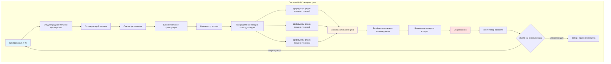
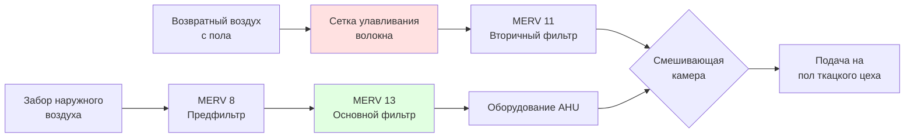

# Требования HVAC для процессов ткачества

Операции ткачества требуют точного контроля окружающей среды для поддержания прочности пряжи, снижения обрывов и обеспечения стабильного качества ткани. Система HVAC должна решать уникальные проблемы высокоскоростных механических ткацких станков, образования летучих волокон и влагочувствительности текстильной пряжи во время процесса переплетения.

## Критические параметры окружающей среды

Процессы ткачества требуют более жестких допусков окружающей среды, чем многие другие текстильные операции, из-за механического напряжения, воздействующего на пряжу во время процесса переплетения. Руководящие принципы ASHRAE Industrial Ventilation устанавливают базовые условия, с конкретными требованиями, варьирующимися в зависимости от типа волокна и конструкции ткани.

### Требования к температуре по типам волокон

| Тип волокна | Температура (°C) | Допуск | Обоснование |
|------------|------------------|--------|-----------|
| Хлопок | 24-28 | ±1,1°C | Поддерживает гибкость волокна |
| Шерсть | 18-21 | ±1,1°C | Предотвращает чрезмерную усадку |
| Полиэстер | 21-24 | ±1,7°C | Снижает накопление статического электричества |
| Шелк | 21-24 | ±1,1°C | Сохраняет целостность волокна |
| Смеси | 22-26 | ±1,1°C | Сбалансировано для компонентов |

### Требования к относительной влажности

Влажность пряжи напрямую влияет на её разрывную прочность и удлинение. Связь между относительной влажностью и прочностью пряжи описывается следующим образом:

$$\sigma_y = \sigma_0 \left(1 + k \cdot \frac{RH}{100}\right)$$

Где:
- $\sigma_y$ = разрывная прочность пряжи при заданной RH
- $\sigma_0$ = базовая прочность при стандартных условиях
- $k$ = коэффициент чувствительности к влаге (зависит от волокна)
- $RH$ = относительная влажность (%)

**Стандартные условия в ткацком цехе:**

| Параметр | Хлопок/Вискоза | Шерсть | Синтетические | Шелк |
|-----------|----------------|--------|--------------|------|
| Целевая RH (%) | 65-70 | 60-65 | 45-50 | 65-70 |
| Допуск RH | ±3% | ±3% | ±5% | ±2% |
| Точка росы (°C) | 17-20 | 13-16 | 10-13 | 16-18 |

## Распределение воздуха в ткацком цехе

Системы распределения воздуха должны обеспечивать равномерные условия по полу ткацкого цеха, одновременно управляя теплом от механического оборудования и удаляя летучее волокно.

## Стратегии управления влажностью

Поддержание стабильной относительной влажности в ткацких цехах требует изощрённого управления из-за непрерывной потери влаги из пряжи и изменяющихся нагрузок от находящихся в помещении людей.

### Расчёт нагрузки увлажнения

Общее требование к увлажнению учитывает вентиляционный воздух, инфильтрацию и потерю влаги пряжей:

$$\dot{m}_{humid} = \dot{m}_{vent} + \dot{m}_{inf} + \dot{m}_{yarn}$$

**Нагрузка влаги вентиляции:**

$$\dot{m}_{vent} = \rho_{air} \cdot \dot{V} \cdot (\omega_{target} - \omega_{outdoor})$$

Где:
- $\rho_{air}$ = плотность воздуха (кг/м³)
- $\dot{V}$ = расход вентиляционного воздуха (м³/ч)
- $\omega$ = коэффициент влажности (кг воды/кг сухого воздуха)

**Скорость потери влаги пряжей:**

$$\dot{m}_{yarn} = N_{looms} \cdot v_{pick} \cdot w_{yarn} \cdot \Delta MC$$

Где:
- $N_{looms}$ = количество активных ткацких станков
- $v_{pick}$ = уток в минуту
- $w_{yarn}$ = вес пряжи на уток (кг)
- $\Delta MC$ = изменение содержания влаги (%)

### Выбор системы увлажнения

| Тип системы | Диапазон производительности | Время отклика | Энергоэффективность | Применение |
|-------------|---------------------------|----------------|-------------------|-----------|
| Паровая решётка | Высокая | Быстрое (5-10 мин) | Умеренная | Крупные предприятия |
| Ультразвуковая | Низко-средняя | Очень быстрое (2-5 мин) | Высокая | Зоны точного контроля |
| Испарительные материалы | Средне-высокая | Умеренное (10-15 мин) | Очень высокая | Экономичная эксплуатация |
| Воздушный промыватель | Очень высокая | Медленное (15-20 мин) | Высокая | Комбинированное охлаждение/увлажнение |

## Качество воздуха и фильтрация

Операции ткачества генерируют значительное количество летучего волокна, которое должно быть удалено, чтобы предотвратить:
- Заклинивание механизмов ткацких станков
- Загрязнение ткани
- Воздействие на органы дыхания рабочих
- Засорение оборудования HVAC

### Рекомендуемый подход к фильтрации

**Критерии выбора фильтра:**

| Место установки | Тип фильтра | Рейтинг MERV | Перепад давления | Периодичность замены |
|-----------------|-------------|-------------|------------------|------------------|
| Забор наружного воздуха | Панельный гофрированный | MERV 8 | 25 Па | Ежеквартально |
| Основная подача | Мешочный фильтр | MERV 13 | 51 Па | Два раза в год |
| Предфильтр возврата | Уловитель волокна | N/A | 17 Па | Ежемесячно |
| Вторичный возврат | Жёсткий фильтр | MERV 11 | 43 Па | Ежеквартально |

## Требования к вентиляции

Минимальная вентиляция наружным воздухом для ткацких цехов учитывает требования к воздуху для находящихся в помещении людей и разбавление выбросов от процесса.

$$\dot{V}_{OA} = \max(\dot{V}_{occupant}, \dot{V}_{dilution})$$

**Вентиляция для находящихся в помещении людей согласно ASHRAE Standard 62.1:**

$$\dot{V}_{occupant} = N_{people} \cdot 2,4 \text{ м³/ч/человек} + A_{floor} \cdot 0,65 \text{ м³/ч/м}^2$$

**Типичные проектные значения для ткацкого цеха:**

- Кратность воздухообмена: 15-25 ACH
- Доля наружного воздуха: 15-25% от общего расхода подачи
- Скорость подаваемого воздуха на уровне ткацких станков: 0,15-0,25 м/с
- Размещение возврата воздуха: Низкий уровень (0,6-0,9 м над полом)

## Управление тепловой нагрузкой

Установки ткацких станков высокой плотности генерируют значительное явное тепло, требующее постоянного удаления:

$$\dot{Q}_{looms} = N_{looms} \cdot P_{motor} \cdot \eta_{operation}$$

**Типичное производство тепла:**

| Тип ткацкого станка | Мощность двигателя (кВт) | Выход тепла (кВт) | Ткацких станков на 100 м² |
|-------------------|-------------------------|-------------------|--------------------------|
| Воздушно-реактивный | 3,7-5,2 | 3,7-5,2 | 8-12 |
| Рапирный | 2,2-3,7 | 2,2-3,7 | 10-15 |
| Снарядный | 3,0-4,5 | 3,0-4,5 | 8-12 |
| Водно-реактивный | 3,0-3,7 | 3,0-3,7 | 10-14 |

## Рекомендации по проектированию

1. **Стратегия зонирования:** Отдельные зоны HVAC для различных типов волокон или конструкций тканей, требующих разных условий
2. **Резервирование:** Предусмотрите производительность увлажнения N+1 для поддержания производства во время обслуживания
3. **Мониторинг:** Установите непрерывный контроль RH и температуры в нескольких местах на полу ткацкого цеха
4. **Время отклика управления:** Настройте управление влажностью с временем отклика 2-5 минут, чтобы предотвратить быстрые колебания окружающей среды
5. **Адаптация к сезонам:** Реализуйте циклы экономайзера при умеренную погоду для снижения энергии охлаждения при сохранении контроля влажности

## Метрики производительности системы

Контролируйте эти параметры для проверки правильной работы HVAC:

- Равномерность температуры: Максимум 1,1°C вариации по полу ткацкого цеха
- Равномерность относительной влажности: Максимум 3% RH вариации по полу ткацкого цеха
- Тренд перепада давления фильтра: Оповещение при 150% от начального перепада давления чистого фильтра
- Цикличность системы увлажнения: Не должна превышать 6 циклов в час
- Интенсивность энергопотребления: Целевое 1,6-2,6 ГДж/м²/год для кондиционируемого пространства

## Заключение

Системы HVAC ткацких цехов требуют тщательной интеграции управления температурой, точного увлажнения, эффективной фильтрации воздуха и надлежащей вентиляции для поддержки высокого качества производства ткани. Проектирование системы должно учитывать требования к волокнам, механические тепловые нагрузки и образование волокна при поддержании операционной энергоэффективности. Надлежащая наладка и постоянный мониторинг обеспечивают условия окружающей среды, необходимые для минимизации обрывов пряжи и максимизации эффективности ткачества.
