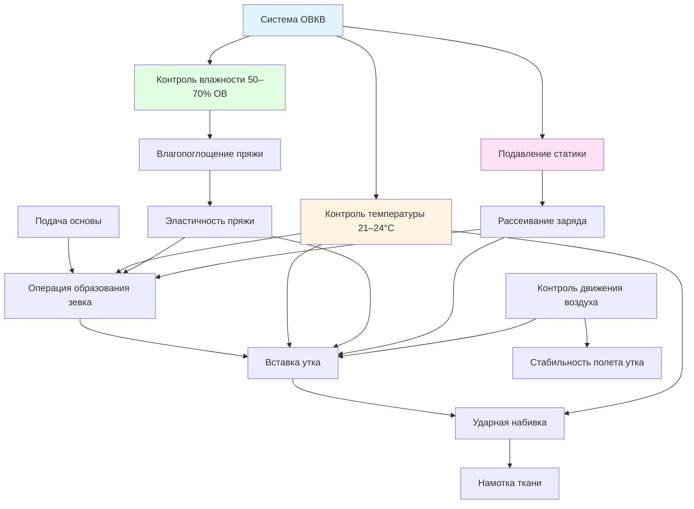

## Требования к окружающей среде в ткацком цехе

Формирование ткани путем переплетения требует точного контроля окружающей среды для поддержания эластичности пряжи, минимизации статического электричества и предотвращения разрывов в процессе переплетения. Ткацкий цех представляет собой наиболее критичную зону контроля на ткацких производствах, где механические свойства пряжи напрямую зависят от содержания влаги в атмосфере.

### Критические параметры окружающей среды

**Контроль температуры:**
Ткацкие цеха работают в узком температурном диапазоне 21–24°C для поддержания постоянных размеров и механических свойств пряжи. Повышение температуры снижает относительную влажность при постоянном абсолютном содержании влаги, тогда как понижение температуры может вызвать конденсацию на металлических компонентах ткацкого станка.

**Требования к влажности:**
Взаимосвязь между влагопоглощением пряжи и относительной влажностью окружающей среды определяет эффективность ткачества. Хлопчатобумажные пряжи требуют 60–65% относительной влажности (ОВ), синтетические пряжи — 50–55% ОВ, а шерстяные пряжи — 65–70% ОВ для оптимальных характеристик формирования.

Влагопоглощение пряжи подчиняется эмпирической зависимости:

$$M_r = k_1 \cdot \phi^{n} \cdot e^{k_2 \cdot T}$$

Где:
- $M_r$ = Влагопоглощение (%)
- $\phi$ = Относительная влажность (в долях единицы)
- $T$ = Температура (°C)
- $k_1, k_2, n$ = Константы, специфичные для волокна

### Контроль статического электричества

Накопление статического заряда на пряже вызывает прилипание к компонентам станка и взаимное отталкивание пряжи, что негативно сказывается на формировании ткани. Плотность поверхностного заряда связана с влажностью:

$$\sigma_s = \sigma_0 \cdot e^{-\alpha \cdot \phi}$$

Где:
- $\sigma_s$ = Плотность поверхностного заряда (Кл/м²)
- $\sigma_0$ = Референтный заряд при 0% ОВ
- $\alpha$ = Коэффициент рассеивания влажности (зависит от волокна)
- $\phi$ = Относительная влажность (в долях единицы)

Эта экспоненциальная зависимость объясняет, почему поддержание относительной влажности 55–65% эффективно подавляет генерацию статического электричества при высокоскоростных операциях ткачества.

## Параметры проектирования системы ОВКВ для ткацкого цеха

| Параметр | Хлопковое ткачество | Синтетическое ткачество | Шерстяное ткачество | Основание для проектирования |
|------|---|------|----|---|
| Температура | 22,8°C ± 1,1°C | 22,2°C ± 1,1°C | 20°C ± 1,1°C | ASHRAE Industrial Ch. 21 |
| Относительная влажность | 62% ± 3% | 52% ± 3% | 67% ± 3% | Влагопоглощение, специфичное для волокна |
| Скорость воздуха | 0,25–0,38 м/с | 0,25–0,38 м/с | 0,20–0,30 м/с | Минимизация возмущения пряжи |
| Расход воздуха | 2–4 ACH | 3–5 ACH | 2–3 ACH | Отвод тепла, контроль ворса |
| Распределение подаваемого воздуха | Ламинарное сверху | Ламинарное сверху | Ламинарное сверху | Равномерные условия |
| Расположение вытяжных отверстий | На уровне пола | На уровне пола | На уровне пола | Удаление ворса |

## Взаимодействие параметров окружающей среды с процессом ткачества

## Предотвращение разрывов пряжи

Прочность пряжи на разрыв варьируется в зависимости от содержания влаги согласно:

$$\sigma_t = \sigma_{dry} \cdot (1 + \beta \cdot M_r)$$

Где:
- $\sigma_t$ = Прочность на разрыв при влагопоглощении $M_r$
- $\sigma_{dry}$ = Прочность на разрыв в сухом состоянии
- $\beta$ = Коэффициент упрочнения влагой
- $M_r$ = Влагопоглощение (%)

Для хлопчатобумажных пряж $\beta$ варьируется от 0,05 до 0,08, что указывает на увеличение прочности на 5–8% при каждом увеличении влагопоглощения на 1% в пределах гигроскопического диапазона. Недостаточная влажность вызывает охрупчивание и увеличение числа разрывов в операциях образования зевка и ударной набивки.

### Корреляция частоты разрывов

Эмпирические исследования устанавливают зависимость частоты разрывов пряжи от влажности:

$$B_f = B_0 \cdot e^{-\gamma(\phi - \phi_0)}$$

Где:
- $B_f$ = Частота обрывов (обрывы/1000 станко-часов)
- $B_0$ = Базовая частота обрывов при эталонной влажности
- $\gamma$ = Фактор чувствительности к влажности
- $\phi$ = Эксплуатационная относительная влажность
- $\phi_0$ = Эталонная относительная влажность (обычно 50%)

Данная зависимость демонстрирует экспоненциальное снижение частоты обрывов по мере приближения влажности к оптимальным для конкретного типа волокна значениям.

## Соображения по проектированию систем HVAC

**Расчет нагрузок:**
Явные тепловыделения в ткацком цехе включают тепловыделение от двигателей станков (500–800 Вт на станок), освещение, теплопередачу через ограждающие конструкции здания и теплоотвод системы сжатого воздуха. Скрытые нагрузки обычно остаются минимальными, за исключением летнего инфильтрационного притока.

**Системы увлажнения:**
Системы паровой инжекции обеспечивают наиболее точный контроль влажности для ткацких операций. Системы атомизации (распыления) предлагают более низкие эксплуатационные расходы, но требуют тщательной обработки воды для предотвращения отложения минералов на пряже и тканях.

**Распределение воздуха:**
Подача воздуха с ламинарным потоком сверху обеспечивает равномерные условия по всей высоте ткацкого цеха. Скорость подаваемого воздуха должна оставаться ниже 0,38 м/с (0,38 м/с), чтобы предотвратить возмущения при вводе утка, особенно для воздушно-струйных станков.

**Требования к фильтрации:**
Фильтрация с минимальным классом MERV 11 защищает пряжу от загрязнения частицами. Дополнительный сбор ворса в местах возврата воздуха предотвращает его накопление на механизмах станков.

**Стратегия управления:**
Управление по точке росы обеспечивает превосходную производительность по сравнению с управлением по относительной влажности, поддерживая постоянную влажность регенерации пряжи несмотря на незначительные колебания температуры из-за изменений нагрузки.

## Мониторинг и обеспечение качества

Непрерывный мониторинг температуры по сухому термометру, температуры по влажному термометру и рассчитанной относительной влажности в нескольких точках ткацкого цеха обеспечивает соответствие спецификациям. Установите датчики на высоте плоскости основы (обычно 0,91–1,22 м над уровнем пола) для репрезентативных измерений фактических условий среды для пряжи.

Ведите журнал данных для корреляции между условиями окружающей среды и частотой обрывов пряжи, что позволяет оптимизировать уставные значения для конкретных типов пряжи и ткацких операций.

## Ссылки на стандарты ASHRAE

Проектные параметры соответствуют справочнику ASHRAE — HVAC Applications, глава 21 (Текстильная обработка), раздел «Ткацкие операции». Консультируйтесь со спецификациями производителей для специальных синтетических волокон, требующих нестандартных условий окружающей среды.
