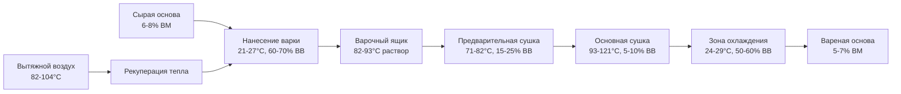

## Требования к системе HVAC для процесса варки

Процесс варки наносит защитные покрытия на нити основы перед ткачеством, требуя точного контроля окружающей среды в трех критических зонах: нанесение варки, сушка и послеварочная кондиционирование. Каждая зона требует специфических температурных и влажностных условий для обеспечения надлежащей адгезии варки, контролируемого удаления влаги и оптимальных свойств нитей для ткачества.

### Экологические зоны процесса варки

### HVAC зоны нанесения варки

Зона нанесения варки требует стабильных условий для поддержания постоянной вязкости и предотвращения преждевременного высыхания:

**Параметры окружающей среды:**

| Параметр | Целевой диапазон | Допуск | Метод контроля |
|------|---|-----|-----------|
| Температура | 21-27°C | ±1.1°C | Агрегат обработки воздуха (AHU) с нагревательными/охлаждающими змеевиками |
| Относительная влажность | 60-70% | ±5% | Увлажнение или осушение |
| Скорость воздуха | <25 см/с | ±5 см/с | Низкоскоростная вытеснительная вентиляция |
| Кратность воздухообмена | 8-12 ACH | - | Система постоянного объема |

Избыточное движение воздуха вызывает испарение раствора и изменение вязкости. Подаваемый воздух должен распределяться через диффузоры низкой скорости, расположенные вдали от варочных ящиков, чтобы предотвратить сквозняки над поверхностью влажных нитей.

### Вентиляция сушилок для варки

Сушильные камеры удаляют 20-40% веса нити в виде влаги, требуя значительной мощности вытяжки и теплового ввода. Скорость удаления влаги определяет требования к вентиляции:

$$\dot{m}_w = \frac{Y \cdot V \cdot \rho_y \cdot (MC_i - MC_f)}{100}$$

Где:
- $\dot{m}_w$ = скорость удаления влаги (кг/ч)
- $Y$ = скорость производства нитей (м/мин)
- $V$ = линейная плотность нити (м/кг)⁻¹
- $\rho_y$ = коэффициент плотности нити
- $MC_i$ = начальное содержание влаги (%)
- $MC_f$ = конечное содержание влаги (%)

**Требования к вытяжному воздуху:**

$$Q_e = \frac{\dot{m}_w}{W_{sa} - W_{ea}} \cdot 60$$

Где:
- $Q_e$ = расход вытяжного воздуха (м³/ч)
- $W_{sa}$ = коэффициент влажности подаваемого воздуха (кг/кг)
- $W_{ea}$ = коэффициент влажности вытяжного воздуха (кг/кг)

Для типичной линии варки, обрабатывающей 457 м/мин хлопчатобумажной нити 30/1 с начальным содержанием влаги 25% (влажная варка) до конечного содержания влаги 6%:

$$\dot{m}_w = \frac{457 \cdot 0.0333 \cdot 1.0 \cdot (25 - 6)}{100} = 2.88 \text{ кг/ч}$$

При условиях подаваемого воздуха 93°C, 0.005 кг/кг и условиях вытяжного воздуха 0.035 кг/кг:

$$Q_e = \frac{2.88}{0.035 - 0.005} \cdot 60 = 5,760 \text{ м³/ч}$$

### Конфигурация зоны сушки

Современные машины для варки используют несколько стадий сушки с прогрессивным повышением температуры:

**Параметры многостадийной сушки:**

| Стадия | Температура | ВВ | Скорость воздуха | Тепловой ввод |
|-------|-------|-----|-----|----|
| Предварительная сушка | 71-82°C | 15-25% | 4-5 м/с | Змеевики с паром |
| Основная сушка 1 | 93-110°C | 8-12% | 5-6 м/с | Газовая горелка/пар |
| Основная сушка 2 | 104-121°C | 5-10% | 6-8 м/с | Газовая горелка/пар |
| Финальная сушка | 93-104°C | 8-12% | 4-5 м/с | Змеевики с паром |

Импульс воздуха высокой скорости, направленный перпендикулярно поверхности листа нитей, максимизирует теплопередачу. Подаваемый воздух поступает через массивы сопел на расстоянии 5-10 см от нитей, а сбор вытяжного воздуха осуществляется с противоположной стороны, создавая сквозной поток.

### Системы рекуперации тепла

Вытяжной воздух сушилок при температуре 82-104°C содержит значительное количество энергии для рекуперации. Руководства ASHRAE по промышленной вентиляции рекомендуют рекуперацию тепла, когда температура вытяжного воздуха превышает 65°C, а время работы превышает 4000 часов в год.

**Варианты рекуперации тепла:**

1. **Бегущие контуры (Runaround Loops)**: Змеевики с гликолем в потоках вытяжного и приточного воздуха, эффективность 50-60%
2. **Пластинчатые теплообменники**: Прямая теплопередача, эффективность 60-70%, требует фильтрации
3. **Системы тепловых насосов**: Активная теплопередача, COP 200-300%, самая высокая капитальная стоимость

Восстановленное тепло используется для предварительного нагрева приточного воздуха или для отопления смежных зон подготовки.

### Пост-размерная кондиционирование

После сушки намотанная пряжа должна остыть до температуры обработки, одновременно восстанавливая контролируемое содержание влаги для обеспечения гибкости при ткачестве:

$$MC_{target} = MC_{ambient} \pm 1\%$$

Где «окружающая среда» относится к условиям в ткацком цехе (влажность 65–75% RH). Зона охлаждения работает при следующих параметрах:

- Температура: 24–29°C
- Относительная влажность: 50–60%
- Время пребывания: 30–60 секунд
- Скорость воздуха: 1–2 м/с (200–400 фут/мин)

Приточный воздух контактирует с пряжей через перфорированные цилиндры или бобины, обеспечивая мягкое охлаждение без термического шока, который может вызвать растрескивание размера.

### Конструктивные особенности вентиляции

**Расчет приточного воздуха:**

Общий объем приточного воздуха должен компенсировать:
- Вытяжку сушилки (основная нагрузка)
- Локальную вытяжку у ванн с размером (контроль испарений)
- Инфильтрацию здания
- Общую вентиляцию (8–12 крат/час)

**Стратегия распределения воздуха:**
1. Подача подогретого приточного воздуха в зону нанесения размера
2. Обеспечение потока воздуха в сторону зон сушки
3. Удаление воздуха из сушилок и зон с высокой влажностью
4. Поддержание легкого избыточного давления в зоне нанесения размера

**Требования к фильтрации:**
- Приточный воздух: MERV 8–10 (предотвращение загрязнения размером)
- Рециркуляционный воздух: MERV 13–14 (удаление ворса и волокон)
- Вытяжка из сушилок: Моющиеся сетки (высокая нагрузка ворсом)

### Оптимизация энергопотребления

Процессы нанесения размера потребляют 2112–4224 кДж на фунт обработанной пряжи. Стратегии снижения энергопотребления включают:

1. **Максимизация эффективности рекуперации тепла** (целевой показатель не менее 60%)
2. **Оптимизация температурных профилей сушилки** (избегание избыточной температуры)
3. **Управление приточным воздухом на основе влажности** (снижение избыточной вентиляции)
4. **Использование частотных преобразователей** на вентиляторах сушилки (соответствие производственной мощности)
5. **Внедрение циклов экономайзера** при благоприятных наружных условиях

Эти меры позволяют снизить энергопотребление на 25–40% по сравнению с системами постоянного объема без рекуперации, сохраняя качество нанесения размера и надежность процесса.

---

**Справочник:** Справочник ASHRAE — Применение HVAC, Глава 20: Текстильная обработка
