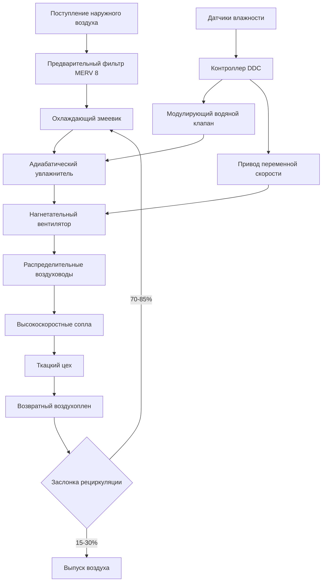
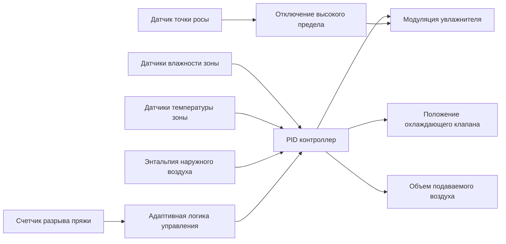

## Основы контроля влажности в ткацких цехах

Контроль влажности в ткацких операциях напрямую влияет на качество продукции, эффективность производства и эксплуатационные расходы. Физическая взаимосвязь между относительной влажностью и содержанием влаги в волокне определяет поведение пряжи при высокоскоростных ткацких процессах. Недостаточная влажность вызывает накопление статического электричества, повышение разрывов пряжи и дефекты ткани. Избыточная влажность приводит к набуханию пряжи, снижению прочности на растяжение и развитию микроорганизмов.

## Восстановление влаги и физика волокна

Текстильные волокна проявляют гигроскопичные свойства, поглощая или выделяя влагу для достижения равновесия с условиями окружающего воздуха. Эта взаимосвязь количественно определяется через восстановление влаги:

$$R = \frac{W_w - W_d}{W_d} \times 100$$

Где:
- $R$ = восстановление влаги (%)
- $W_w$ = масса кондиционированного волокна (кг)
- $W_d$ = масса волокна на абсолютно сухой основе (кг)

Содержание влаги при равновесии зависит от типа волокна и следует установленным изотермам. Хлопок при 65% ОВ и 21°C достигает примерно 7,5% восстановления, в то время как синтетические волокна проявляют значительно более низкие значения.

Для практического проектирования контроля влажности поглощение влаги воздухом в ткацком цехе рассчитывается следующим образом:

$$Q_m = \frac{\dot{m}_f \times \Delta R}{100 \times \rho_a \times V}$$

Где:
- $Q_m$ = скорость добавления влаги (кг/с)
- $\dot{m}_f$ = пропускная способность волокна (кг/ч)
- $\Delta R$ = изменение восстановления (%)
- $\rho_a$ = плотность воздуха (кг/м³)
- $V$ = скорость вентиляции (м³/с)

## Оптимальные параметры влажности по типам волокна

Различные виды волокна требуют специфических диапазонов влажности для оптимальной производительности ткачества. Эти значения установлены как на основе термодинамических принципов, так и эмпирических производственных данных.

| Тип волокна | Температура (°C) | Относительная влажность (%) | Восстановление влаги (%) | Точка росы (°C) |
|------------|------------------|----------------------|---------------------|----------------|
| Хлопок | 24-27 | 60-65 | 7,0-8,5 | 16-19 |
| Шерсть | 20-23 | 60-70 | 14,0-16,0 | 14-18 |
| Полиэстер | 21-24 | 50-55 | 0,4-0,5 | 11-14 |
| Нейлон | 21-24 | 55-65 | 3,5-4,5 | 13-17 |
| Вискоза | 24-27 | 60-70 | 11,0-13,0 | 16-20 |
| Шелк | 22-25 | 60-70 | 9,0-11,0 | 15-19 |
| Смесь хлопка с полиэстером | 23-26 | 55-60 | 4,0-5,0 | 14-18 |
| Лен | 22-25 | 60-65 | 10,0-12,0 | 15-18 |

Рекомендации ASHRAE по промышленной вентиляции (Глава 13) предусматривают поддержание условий в пределах ±2% ОВ и ±1°C для высокого качества производства.

## Механизмы разрыва пряжи и предотвращение

Разрыв основной и уточной пряжи представляет основную проблему качества в ткацких операциях. Степень разрыва прямо коррелирует с отклонением от оптимальных условий влажности.

### Контроль разрыва основной пряжи

Основная пряжа под напряжением испытывает циклические напряжения при формировании зева. При ОВ ниже 50% прочность хлопковой основы на растяжение снижается на 15-20%, а поверхностное трение увеличивается на 30-40%. Совместный эффект экспоненциально повышает частоту разрывов.

Критические параметры контроля:
- Поддерживать равномерность ОВ в пределах ±3% по ширине ткацкого станка
- Контролировать скорость изменения влажности менее 5% ОВ в час при запуске
- Расположить сопла увлажнения так, чтобы избежать прямого попадания на основную нить
- Отслеживать точку росы для предотвращения конденсации на направляющих нитей

### Предотвращение разрыва уточной пряжи

Уточная пряжа испытывает тензионный удар при вводе челнока или щитка. Хрупкие волокна при низкой влажности проявляют сниженное удлинение при разрыве. Для хлопковой уточи поддержание 60-65% ОВ снижает разрывы на 40-60% по сравнению с работой при 40% ОВ.

## Проектирование системы увлажнения

### Критерии выбора системы

Система увлажнения должна обеспечивать точный контроль при минимизации потребления энергии и обслуживания. Три основные технологии применяются в ткацких операциях:

**Прямое испарительное (адиабатическое) увлажнение**
- Конфигурация смоченного материала или распылительной камеры
- Эффективность: 85-95% эффективности насыщения
- Потребление воды: 0,8-1,2 л/кг добавленной влаги
- Охлаждающий эффект: 2450 кДж/кг испарившейся влаги
- Лучшее применение: Высокий процент наружного воздуха, наличие охлаждающих нагрузок

**Паровая решетка увлажнения**
- Распределение атмосферного или низкого давления пара
- Время отклика: 30-90 секунд
- Модуляция производительности: соотношение отключения 10:1
- Лучшее применение: Низкий процент наружного воздуха, жесткая допуск ОВ (±2%)

**Ультразвуковая атомизация**
- Размер капель: 1-10 микрометров
- Потребление энергии: 20-40 Вт на кг/ч производительности
- Равномерность распределения: ±1% ОВ при правильном расположении сопел
- Лучшее применение: Модернизация существующих систем, контроль локализованных зон

## Архитектура системы управления

Система управления должна предотвращать конденсацию при поддержании установленного значения. Температура точки росы на любой поверхности должна быть по крайней мере на 2°C ниже температуры поверхности. Для ткацкого оборудования, работающего при 25°C, максимальная точка росы составляет 23°C, что соответствует 67% ОВ при 25°C.

## Распределение воздуха и равномерность условий

Достижение равномерных условий по всему ткацкому полу требует тщательного проектирования распределения воздуха. Высокоскоростное струйное диффузионное распределение от потолочных линейных диффузоров обеспечивает превосходное смешивание по сравнению с низкоскоростными системами вытеснения.

Параметры проектирования:
- Скорость подаваемого воздуха: 8-12 м/с на диффузоре
- Дальность распределения: 0,8 высоты потолка
- Кратность воздухообмена: 15-25 ACH для ткачества натуральных волокон
- Скорость на уровне станка: <0,3 м/с для предотвращения отклонения пряжи

## Оптимизация энергопотребления

Контроль влажности в ткацком цехе представляет значительную энергетическую нагрузку. Стратегии оптимизации включают:

1. **Управление экономайзером на основе энтальпии**: Использование наружного воздуха, когда энтальпия благоприятна в сравнении с рециркуляцией
2. **Переменный объем воздуха**: Снижение потока воздуха в периоды низкого производства при поддержании ОВ
3. **Рекуперация тепла**: Извлечение явного тепла из вытяжного воздуха с использованием пластинчатых или роторных теплообменников (60-75% эффективности)
4. **Десиккантное осушение**: Для климатических условий, требующих одновременного охлаждения и осушения

Удельное потребление энергии для поддержания 65% ОВ при 25°C на хлопковом ткацком предприятии составляет от 15-30 кВтч на килограмм произведенной ткани в зависимости от климата и конструкции системы.

## Влияние на качество и показатели производства

Правильно контролируемые условия влажности обеспечивают измеримые улучшения производства:

- Снижение разрыва основы: 50-70%
- Снижение разрыва уточи: 30-50%
- Увеличение скорости производства: 10-20%
- Улучшение выхода первосортной ткани: 5-15%
- Устранение статического электричества: >90% снижение дефектов

Эти улучшения типично оправдывают капитальные затраты на систему увлажнения в течение 12-24 месяцев работы для средних и крупных ткацких предприятий, перерабатывающих натуральные волокна.
