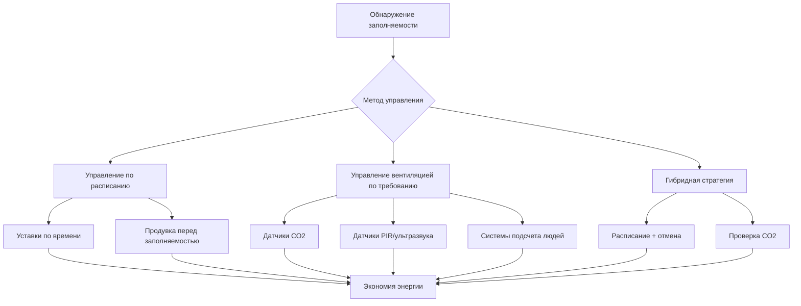
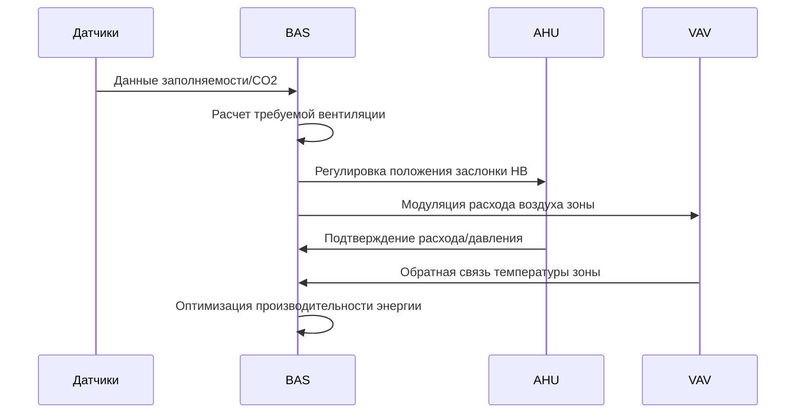

Управление переменной заполняемостью представляет критическую стратегию оптимизации производительности систем HVAC в помещениях, где плотность обитателей значительно колеблется в течение дня или недели. Эти методологии управления снижают потребление энергии в периоды низкой заполняемости, одновременно сохраняя комфортность и качество внутреннего воздуха при полной эксплуатации помещений.

## Основные принципы

Пространства с переменной заполняемостью создают уникальные проблемы из-за динамического характера тепловых нагрузок и нагрузок на вентиляцию. Общая чувствительная охлаждающая нагрузка варьируется пропорционально плотности обитателей:

$$Q_{sensible} = Q_{envelope} + Q_{lights} + Q_{equipment} + n \cdot q_{person,sensible}$$

где $n$ представляет количество обитателей, а $q_{person,sensible}$ равняется примерно 84 Вт на человека при типичных внутренних условиях. Компонент скрытой нагрузки следует аналогичному соотношению:

$$Q_{latent} = n \cdot q_{person,latent} + Q_{moisture,other}$$

где $q_{person,latent}$ варьируется от 58–130 Вт в зависимости от уровня активности и температуры помещения.

Требуемая вентиляция наружным воздухом соответствует стандарту ASHRAE 62.1:

$$V_{oz} = R_p \cdot P_z + R_a \cdot A_z$$

где $R_p$ — норма подачи наружного воздуха на человека (CFM/человека), $P_z$ — население зоны, $R_a$ — норма подачи наружного воздуха на площадь (CFM/м²), а $A_z$ — площадь пола зоны. Для приложений с переменной заполняемостью компонент, связанный с количеством людей, доминирует и создает значительную возможность модуляции.

## Стратегии управления

### Управление по расписанию

Управление по расписанию основано на предопределенных схемах заполняемости для регулировки работы HVAC. Этот подход хорошо работает для помещений с предсказуемым использованием, включая офисы, учебные заведения и религиозные здания.

Ключевые параметры включают:
- Уставки в период заполняемости (типично 22–24 °C охлаждение, 20–22 °C отопление)
- Понижение в период отсутствия (13–15 °C отопление, 29–32 °C охлаждение)
- Расчет времени запуска перед заполняемостью
- Программирование праздников и дней-исключений

Требуемое время запуска следует:

$$t_{startup} = \frac{C \cdot \Delta T}{Q_{capacity} \cdot 60}$$

где $C$ представляет тепловую массу здания (кДж/°C), $\Delta T$ — требуемое восстановление температуры (°C), а $Q_{capacity}$ — мощность нагрева или охлаждения системы (кДж/ч).

### Управление вентиляцией по требованию (DCV)

DCV модулирует приток наружного воздуха на основе измерений заполняемости в реальном времени, обычно используя концентрацию CO2 как прокси для плотности обитателей. Стандарт ASHRAE 62.1 допускает DCV в помещениях площадью более 46 м² с переменной заполняемостью и плотностью более 2,7 человека на м².

Доля наружного воздуха регулируется согласно:

$$\frac{V_{ot}}{V_{supply}} = \frac{C_{space} - C_{return}}{C_{outdoor} - C_{return}}$$

где концентрации измеряются в ppm. Контур управления поддерживает уровни CO2 в помещении на 240–400 ppm выше наружного фона (обычно 400 ppm), что соответствует адекватной вентиляции на человека.

## Рассмотрение конкретных применений

### Сборочные сооружения

Объекты общественного назначения, включая театры, аудитории и места поклонения, испытывают экстремальные колебания заполняемости от почти нулевого до расчетной мощности. Критические соображения включают:

**Разнообразие нагрузки**

Мощность вентиляции при проектировании должна учитывать коэффициенты одновременного использования. Для многопомещительных сооружений:

$$V_{total} = \sum_{i=1}^{n} D_i \cdot V_{design,i}$$

где $D_i$ представляет коэффициент разнообразия (типично 0,6–0,8 для сборочных помещений).

**Требования к быстрому отклику**

Высокая плотность обитателей (1,5 м² на человека или менее) генерирует значительные скрытые нагрузки, требующие быстрого отклика системы. Скорости вентиляции должны увеличиваться от минимума (типично 0,30 CFM/м²) до расчетной мощности в течение 15–30 минут после обнаружения заполняемости.

### Выставочные пространства и конференц-центры

Крупные выставочные пространства требуют сложного управления из-за высокой вариативности расписаний и гибкости конфигурации:

| Режим работы | Скорость вентиляции | Уставка температуры | Контроль влажности |
|---|---|---|---|
| Без заполняемости | 0,30 CFM/м² | 29 °C охлаждение / 16 °C отопление | Отсутствует |
| Предсобытийная | 50 % расчетной | 23 °C | Активна осушка |
| Заполнено | Полная расчетная | 22–23 °C | Полный контроль |
| Послесобытийная | 75 % расчетной (30 мин) | 23 °C | Активна |
| Уборка/подготовка | 0,75 CFM/м² | 26 °C | Отсутствует |

### Учебные и офисные здания

Управление по расписанию доминирует в этих приложениях, дополняемое зональным DCV в высокоплотных пространствах, таких как конференц-залы и классные комнаты:

**Алгоритмы оптимального запуска/остановки**

Современные системы автоматизации зданий рассчитывают время запуска на основе температуры наружного воздуха и теплового отклика здания:

$$t_{start} = K_1 + K_2(T_{setpoint} - T_{space}) + K_3(T_{space} - T_{outdoor})$$

где $K_1$, $K_2$ и $K_3$ — эмпирически полученные коэффициенты, основанные на тепловой массе здания и мощности системы.

## Интеграция системы

Эффективное управление переменной заполняемостью требует координации между несколькими системами здания:

Последовательность управления должна поддерживать минимальные требования вентиляции согласно ASHRAE 62.1 Раздел 6.2, одновременно предотвращая чрезмерный приток наружного воздуха в условиях экстремальной погоды.

## Производительность энергии

Правильно реализованное управление переменной заполняемостью достигает снижения потребления энергии HVAC на 20–40 % по сравнению с работой постоянного объема. Экономия получается за счет:

- Снижения энергии вентиляторов (пропорционально кубу расхода)
- Снижения нагрева/охлаждения наружного воздуха
- Оптимизированного времени работы оборудования
- Минимизации одновременного отопления и охлаждения

Соотношение мощности вентилятора следует законам подобия:

$$\frac{P_2}{P_1} = \left(\frac{V_2}{V_1}\right)^3$$

демонстрируя, что снижение расхода воздуха до 50 % расчетного снижает мощность вентилятора до 12,5 % полнолюдной мощности.

## Требования к реализации

Успешные системы управления переменной заполняемостью требуют:

- Точного обнаружения заполняемости или прогнозирования
- Правильно откалиброванных датчиков CO2 (точность ±50 ppm)
- Системы автоматизации здания с адаптивными алгоритмами
- Комиссионирование проверки последовательностей управления
- Периодической калибровки датчиков и мониторинга производительности

Рекомендация ASHRAE 36 обеспечивает стандартизированные последовательности управления для приложений с переменной заполняемостью, обеспечивая согласованную реализацию на различных типах зданий и платформах управления.
