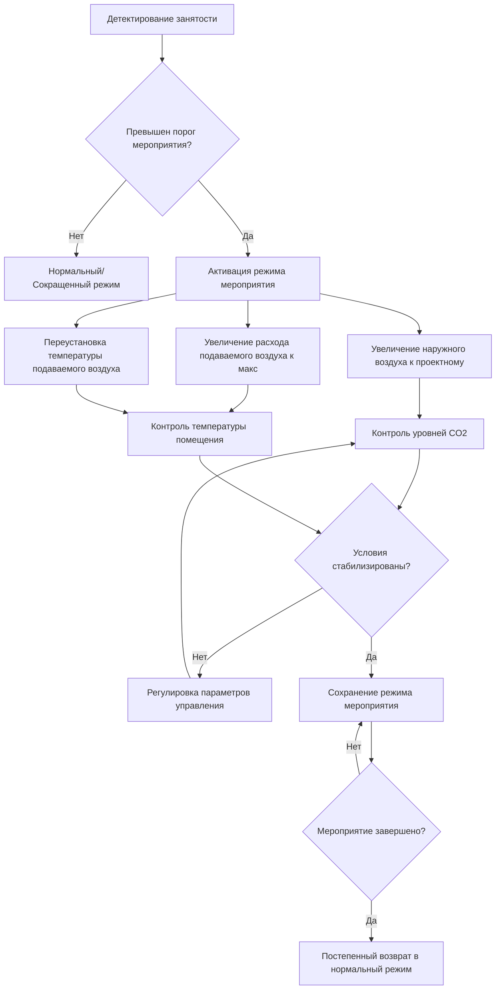
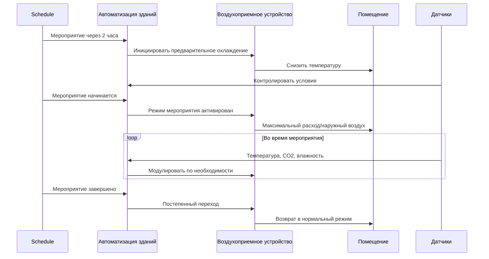

Режим мероприятия представляет собой критическую стратегию управления системами HVAC для помещений, испытывающих внезапное значительное увеличение численности людей, таких как аудитории, конференц-центры, культовые сооружения и многоцелевые объекты. Этот режим работы переводит системы из энергосберегающих условий сокращенного режима в полную работу, управляя как вентиляцией, так и тепловыми нагрузками при высокой плотности занятости.

## Физические принципы нагрузок мероприятия

Режим мероприятия обеспечивает управление двумя основными категориями нагрузок: вентиляционными нагрузками от увеличенных требований к наружному воздуху и внутренними теплогенерирующими нагрузками от метаболического тепла и влагообразования присутствующих людей.

### Расчет вентиляционной нагрузки

Требование к вентиляции наружным воздухом во время мероприятий следует расчетам зоны дыхания ASHRAE Standard 62.1:

$$V_{bz} = R_p \times P_z + R_a \times A_z$$

Где:
- $V_{bz}$ = расход наружного воздуха в зоне дыхания, CFM
- $R_p$ = норма наружного воздуха на одного человека, CFM/чел (обычно 5–7,5 CFM/чел для помещений массового скопления)
- $P_z$ = численность населения зоны при пиковой занятости мероприятия
- $R_a$ = норма наружного воздуха на единицу площади, CFM/м²
- $A_z$ = площадь пола зоны, м²

Явная охлаждающая нагрузка от увеличенной вентиляции:

$$Q_{vent,s} = 1.08 \times V_{oa} \times (T_{oa} - T_{sa})$$

Скрытая вентиляционная нагрузка:

$$Q_{vent,l} = 0.68 \times V_{oa} \times (W_{oa} - W_{sa})$$

Где $V_{oa}$ — расход наружного воздуха в CFM, $T$ — температуры по сухому термометру в °C, и $W$ — влагосодержание в граммах/кг.

### Расчет нагрузки от присутствия людей

Явное и скрытое тепловыделение от присутствия людей варьируются в зависимости от уровня активности и температуры помещения. Для помещений массового скопления с сидячей, очень легкой активностью (ASHRAE Handbook—Fundamentals):

$$Q_{occ,s} = N_{occ} \times q_{s,person}$$

$$Q_{occ,l} = N_{occ} \times q_{l,person}$$

При температуре помещения 24°C: $q_{s,person}$ = 115 кДж/ч, $q_{l,person}$ = 73 кДж/ч на одного человека.

Общая охлаждающая нагрузка мероприятия:

$$Q_{event,total} = Q_{vent,s} + Q_{vent,l} + Q_{occ,s} + Q_{occ,l} + Q_{lighting} + Q_{equipment}$$

## Стратегии управления режимом мероприятия

### Методы детектирования

Активация режима мероприятия использует несколько стратегий детектирования:

- **Запланированная активация**: Предварительно запрограммированная на основе календаря объекта (наиболее распространена для предсказуемых мероприятий)
- **Активация по CO₂**: Концентрация CO₂ в помещении превышает пороговое значение (обычно 150–200 ppm выше окружающего наружного воздуха)
- **Датчики занятости**: Системы подсчета людей, обнаруживающие занятость, превышающую установку (80–90% проектной занятости)
- **Ручное переопределение**: Активация оператором здания для незапланированных мероприятий

### Сравнение режимов работы

| Параметр | Сокращенный режим | Нормальный режим | Режим мероприятия | Время отклика |
|-----------|-------------------|------------------|-------------------|---------------|
| Заслонка наружного воздуха | Минимальное положение (10–15%) | Минимум по нормам | Проектный максимум (100%) | 2–5 минут |
| Расход подаваемого воздуха | 40–60% проектного | 70–85% проектного | 95–100% проектного | 5–10 минут |
| Температура подаваемого воздуха | 15–18°C | 13–14°C | 11–13°C | 10–15 минут |
| Установка температуры помещения | 26–28°C | 22–24°C | 22–23°C | 15–30 минут |
| Заслонки вытяжки/сброса | Закрыто/минимум | Модулирующие | Максимум | 2–5 минут |

## Стратегии предварительного охлаждения и вентиляции

Эффективная работа в режиме мероприятия требует предварительного кондиционирования помещения для минимизации теплового шока и обеспечения адекватного качества воздуха при прибытии людей.

### Продолжительность предварительного охлаждения

Требуемое время предварительного охлаждения зависит от тепловой массы здания и желаемого снижения температуры:

$$t_{precool} = \frac{m \times c_p \times \Delta T}{Q_{cooling,net}}$$

Где:
- $t_{precool}$ = продолжительность предварительного охлаждения, часы
- $m$ = эффективная тепловая масса, кг
- $c_p$ = удельная теплоемкость строительных материалов, кДж/(кг·°C)
- $\Delta T$ = желаемое снижение температуры, °C
- $Q_{cooling,net}$ = чистая охлаждающая мощность при пустом помещении, кДж/ч

Типичные периоды предварительного охлаждения: 1–3 часа для легких конструкций, 2–4 часа для конструкций с высокой тепловой массой.

### Вентиляционная продувка

Предварительная вентиляционная продувка удаляет накопленные загрязнения и обеспечивает адекватное качество воздуха:

$$N_{ACH} = \frac{V_{oa} \times 60}{V_{space}}$$

Где $N_{ACH}$ — это число смен воздуха в час и $V_{space}$ — объем помещения в м³.

ASHRAE рекомендует 2–3 смены наружного воздуха перед занятостью для помещений с продолжительными неработающими периодами.

## Требования к мощности системы

Размер оборудования для работы в режиме мероприятия должен обеспечивать пиковые нагрузки с надлежащим коэффициентом безопасности:

$$\text{Охлаждающая мощность} = Q_{event,total} \times 1.15 \text{ до } 1.25$$

Множитель учитывает:
- Одновременные пиковые условия
- Деградацию оборудования с течением времени
- Эффекты высоты и установки
- Требования переходного отклика

### Соображения по вентилятору подачи

Переменно-расходные системы в режиме мероприятия работают при максимальном расходе воздуха с соответствующей мощностью вентилятора:

$$P_{fan} = \frac{V_{sa} \times \Delta P_{total}}{6356 \times \eta_{fan}}$$

Где $P_{fan}$ — мощность вентилятора (кВт), $V_{sa}$ — расход подаваемого воздуха (CFM), $\Delta P_{total}$ — полное статическое давление (Па), и $\eta_{fan}$ — полный КПД вентилятора.

Пиковая мощность вентилятора во время режима мероприятия обычно представляет 2–3 раза потребление мощности при нормальном режиме занятости в VAV системах.

## Интеграция последовательности управления

Работа в режиме мероприятия интегрируется с системами автоматизации зданий посредством определенных последовательностей управления:

1. **Инициация мероприятия** (T-120 до T-60 минут): Запуск предварительного охлаждения, увеличение наружного воздуха до 50% проектного
2. **Предварительная занятость** (T-60 до T-0 минут): Достижение установки температуры помещения, увеличение наружного воздуха до 75% проектного
3. **Активное мероприятие** (T-0 до завершения мероприятия): Сохранение полного проектного наружного воздуха, модулирование охлаждения для сохранения установки
4. **Переходный период после мероприятия** (0 до +30 минут): Постепенное снижение наружного воздуха и охлаждающей мощности
5. **Возврат в нормальный режим** (+30 до +60 минут): Возобновление запланированного режима работы

## Метрики производительности

Эффективность работы в режиме мероприятия требует контроля:

- **Время восстановления температуры**: Продолжительность достижения установки после начала мероприятия
- **Управление CO₂**: Сохранение CO₂ в помещении ниже 1000 ppm при пиковой занятости
- **Управление влажностью**: Относительная влажность помещения поддерживается между 30–60%
- **Потребление энергии**: кВч на мероприятие в сравнении с базовым уровнем
- **Комфорт людей**: Вариация температуры в пределах ±1,1°C от установки

Надлежащим образом спроектированная работа в режиме мероприятия обеспечивает комфорт людей и качество воздуха в помещении при высокой плотности занятости, при этом оптимизируя потребление энергии в периоды неработающего и нормального состояния занятости. Стратегия управления уравновешивает быстрое реагирование с эффективностью системы посредством скоординированной работы оборудования и прогнозирующего планирования.
