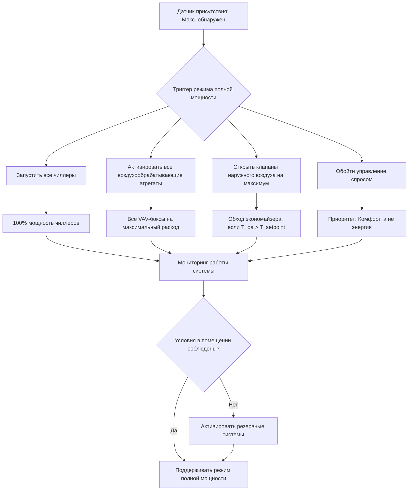

## Обзор

Режим полной мощности представляет собой максимальное рабочее состояние систем ОВКВ с переменной нагрузкой, предназначенное для поддержания теплового комфорта и качества воздуха в помещении во время пиковых событий с высокой заполняемостью. В этом режиме активируется все доступное оборудование, максимизируется приток наружного воздуха, и приоритет отдается комфорту occupants, а не энергоэффективности.

## Расчет пиковой нагрузки

Общая охлаждающая нагрузка при работе в режиме полной мощности складывается из явных и скрытых теплопритоков от максимальной заполняемости:

$$Q_{total} = Q_{sensible} + Q_{latent}$$

Где явная нагрузка включает:

$$Q_{sensible} = Q_{occupants,s} + Q_{lights} + Q_{equipment} + Q_{envelope} + Q_{ventilation,s}$$

Явный теплоприток от occupants при максимальной плотности:

$$Q_{occupants,s} = N_{max} \times q_{s,person} \times CLF$$

Скрытая нагрузка от occupants и вентиляции:

$$Q_{latent} = N_{max} \times q_{l,person} + \dot{m}_{oa} \times h_{fg} \times (W_{oa} - W_{ra})$$

Общая требуемая подача воздуха:

$$\dot{V}_{supply} = \frac{Q_{sensible}}{1.08 \times \Delta T_{supply}}$$

## Требования к вентиляции

Стандарт ASHRAE 62.1 предписывает подачу наружного воздуха в зависимости от заполняемости и площади пола. Расход воздуха в зоне дыхания:

$$V_{bz} = R_p \times P_z + R_a \times A_z$$

Для помещений собраний при максимальной заполняемости:

$$V_{oz} = \frac{V_{bz}}{E_z}$$

Где эффективность распределения воздуха в зоне $E_z$ обычно варьируется от 0,8 до 1,0 в зависимости от конфигурации приточного воздуха.

## Стратегия ступенчатого запуска оборудования

## Параметры производительности системы

| Параметр | Значение при полной мощности | Проектные основания | Ссылка ASHRAE |
|------|---|--------------|--------------|
| Плотность occupants | 100% от проектной | 0,65–1,4 м²/чел | Таблица 6-1 стандарта 62.1 |
| Расход наружного воздуха | Максимальный CFM (м³/ч) | 2,4–3,5 л/с на человека | 62.1-2022 |
| Температура подаваемого воздуха | 11–13°C | Максимальная охлаждающая мощность | Раздел 6 стандарта 90.1 |
| ΔT холодной воды | 5,6–7,8°C | Проектный расход | Руководство 0-2021 |
| Скорость вентилятора | 90–100% | Максимум VFD | 90.1-2022 |
| Температура в помещении | 22–24°C | Зона комфорта | 55-2020 |
| Относительная влажность | 40–60% | Управление скрытой нагрузкой | 55-2020 |

## Требования к охлаждающей мощности

Компоненты пиковой охлаждающей нагрузки для помещений собраний:

| Компонент нагрузки | Удельная нагрузка | Коэффициент пиковой заполняемости | Общая нагрузка (кДж/ч) |
|------|---|---|---|
| Occupants (явная) | 733 кДж/ч·чел | 500 человек | 366 500 |
| Occupants (скрытая) | 586 кДж/ч·чел | 500 человек | 293 000 |
| Освещение | 16,1 Вт/м² | 929 м² | 149 600 |
| Оборудование | 8,6 Вт/м² | 929 м² | 79 900 |
| Ограждающие конструкции | 6,5 Вт/м² | 929 м² | 60 400 |
| Вентиляция (явная) | 1184 м³/ч × 1,08 | 35°C на улице | 237 600 |
| Вентиляция (скрытая) | 1184 м³/ч × 0,68 | ΔW 0,015 кг/кг | 96 500 |
| **Общая охлаждающая нагрузка** | | | **1 283 500** |

Коэффициент запаса 1,15–1,25, применяемый для выбора оборудования, дает установленную мощность 1 476 000–1 604 000 кДж/ч.

## Последовательность управления

Активация режима полной мощности следует этой логике:

1. **Обнаружение триггера**: Датчики присутствия сообщают о заполнении ≥90% от проектного в течение ≥15 минут.
2. **Валидация предварительного охлаждения**: Температура в помещении ≥23°C или прогнозируется превышение в течение 30 минут.
3. **Разгон оборудования**: Все агрегаты переводятся на 100% в течение 5–10 минут.
4. **Наружный воздух**: Клапаны модулируются до максимального положения экономайзера или требования минимальной вентиляции.
5. **Активация обхода**: Сигналы управления спросом игнорируются, графики отступов приостанавливаются.
6. **Мониторинг**: Уровень CO₂ поддерживается <1000 ppm, температура в пределах ±1,1°C от уставки.

## Переопределение режима спроса

Во время работы на полной мощности стратегии управления энергопотреблением отдают приоритет комфорту occupants:

$$P_{electrical} = P_{chillers} + P_{fans} + P_{pumps} + P_{auxiliary}$$

Пиковое потребление электроэнергии может достигать 1,5–2,0 от нормального уровня. Координация с поставщиками коммунальных услуг обеспечивает достаточную пропускную способность сети.

## Мониторинг производительности

Критические параметры, отслеживаемые во время работы на полной мощности:

- **Температура подаваемого воздуха**: Поддерживать 11,1–12,8°C для удовлетворения явной нагрузки
- **Температура в помещении**: Контролировать в пределах ±0,8°C от уставки при пиковой нагрузке
- **Концентрация CO₂**: Поддерживать ниже 1000 ppm согласно ASHRAE 62.1
- **Относительная влажность**: Поддерживать 40–60% для управления скрытой нагрузкой
- **Время работы оборудования**: Фиксировать часы для планирования технического обслуживания
- **Потребление энергии**: Отслеживать кВт и пиковую нагрузку для координации с коммунальными службами

## Конструктивные особенности

Системы, рассчитанные на переменную занятость с режимом полной мощности, требуют:

- Мощности оборудования в 1,2–1,5 раза больше расчетной нагрузки в установившемся режиме
- Резервного холодильного оборудования для работы в пиковых событиях
- Увеличенных приточных камер и клапанов для максимальной вентиляции
- Частотных преобразователей, рассчитанных на непрерывную работу на высоких скоростях
- Продвинутых систем управления с алгоритмами прогнозирования занятости
- Интеграции с системами управления зданием для координации режима спроса

Правильная реализация обеспечивает тепловой комфорт и качество воздуха при максимальной занятости, сохраняя при этом надежность и долговечность системы.
