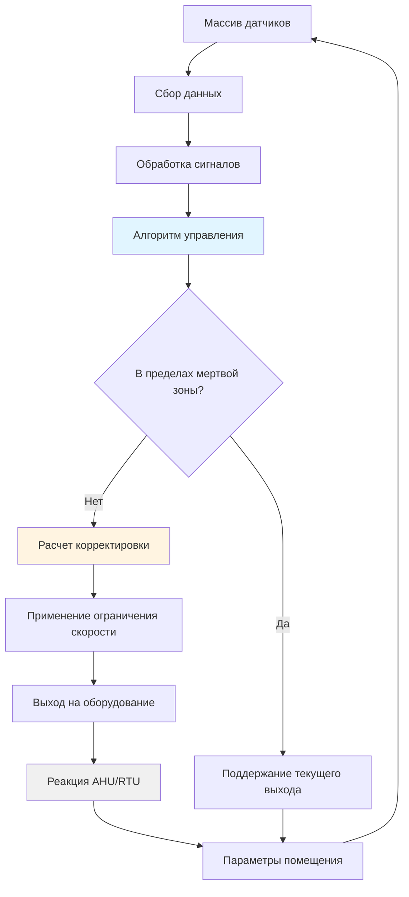
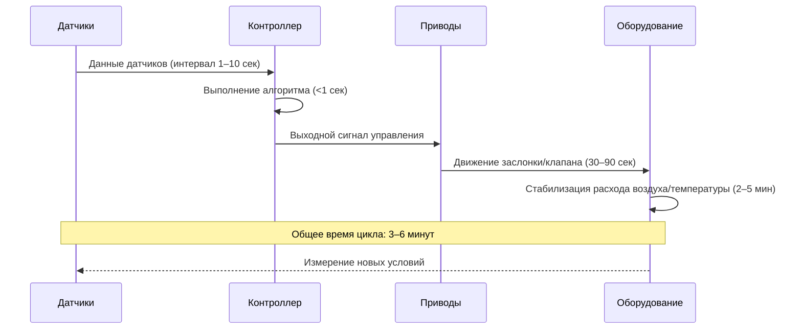

## Основы управления в реальном времени

Управление в реальном времени представляет собой динамический слой реагирования систем HVAC в режиме событий, непрерывно модифицирующий параметры системы на основе измеренных условий окружающей среды. Эта стратегия управления реагирует на фактическую нагрузку от присутствия людей, а не на заранее определенные графики, оптимизируя комфорт при минимизации энергопотерь.

Эффективность управления в реальном времени зависит от трех критических факторов: точности датчиков, времени отклика алгоритма управления и мощности системы для удовлетворения быстрых изменений нагрузки. Стандарт ASHRAE 62.1 требует, чтобы системы вентиляции с управлением по спросу поддерживали минимальные нормы вентиляции при всех условиях эксплуатации, позволяя модуляцию выше минимума на основе индикаторов присутствия.

## Архитектура контура управления

Контур управления в реальном времени работает на основе измеренных отклонений от целевых уставок, реализуя пропорционально-интегрально-дифференциальное (ПИД) управление с усилением, взвешенным по присутствию.

## Требования к конфигурации датчиков

Точность управления в реальном времени напрямую зависит от размещения датчиков, частоты калибровки и надежности сигнала. В следующей таблице указаны требования к датчикам согласно стандарту ASHRAE 135 (BACnet) и стандарту 62.1.

| Тип датчика | Расположение | Требуемая точность | Время отклика | Интервал калибровки |
|------|---------|-------|------|-----|
| CO₂ | Зона дыхания (высота 1,2–1,8 м) | ±50 ppm | <60 секунд | 6 месяцев |
| Температура | Возвратный воздух, несколько зон | ±0,3°C | <30 секунд | 12 месяцев |
| Влажность | Поток возвратного воздуха | ±3% отн. влажн. | <60 секунд | 12 месяцев |
| Присутствие (PIR) | Потолочный монтаж, стратегическое покрытие | Н/Д (бинарный) | <10 секунд | Функциональная проверка ежегодно |
| Расход воздуха | Подающий воздуховод, после вентилятора | ±10% от показания | <15 секунд | 12 месяцев |
| Давление | Дифференциальное давление в помещении относительно смежных зон | ±2,5 Па | <10 секунд | 6 месяцев |

## Адаптивные алгоритмы управления

Алгоритм управления в реальном времени модулирует приток наружного воздуха, температуру подаваемого воздуха и расход воздуха на основе интегрированной обратной связи от датчиков. Расчет выходного сигнала управления выполняется по формуле:

$$
u(t) = K_p e(t) + K_i \int_0^t e(\tau) d\tau + K_d \frac{de(t)}{dt} + G_o \cdot O(t)
$$

Где:
- $u(t)$ = сигнал выходного управления
- $e(t)$ = сигнал ошибки (уставка - измеренное значение)
- $K_p$, $K_i$, $K_d$ = пропорциональные, интегральные и дифференциальные коэффициенты усиления
- $G_o$ = коэффициент усиления по присутствию
- $O(t)$ = нормализованный сигнал присутствия (от 0 до 1)

Для вентиляции с управлением по спросу на основе CO₂ требуемый расход наружного воздуха корректируется непрерывно:

$$
\dot{V}_{oa}(t) = \dot{V}_{oa,min} + \frac{(C_{measured} - C_{target}) \cdot \dot{V}_{supply}}{(C_{indoor} - C_{outdoor})} \cdot K_{adj}
$$

Где:
- $\dot{V}_{oa}(t)$ = расход наружного воздуха во времени t (м³/с)
- $\dot{V}_{oa,min}$ = минимальный расход наружного воздуха по нормативам (м³/с)
- $C_{measured}$ = измеренная концентрация CO₂ (ppm)
- $C_{target}$ = целевая уставка CO₂ (обычно 500–700 ppm)
- $\dot{V}_{supply}$ = общий расход подаваемого воздуха (м³/с)
- $K_{adj}$ = коэффициент корректировки усиления (0,5–1,0)

## Требования к времени отклика

Скорость выполнения контура управления определяет, насколько быстро система реагирует на изменяющиеся условия. Следующая иерархия отклика обеспечивает стабильную работу:

**Критические временные параметры:**

- Интервал опроса датчиков: 5–10 секунд для CO₂, 1–5 секунд для температуры
- Цикл вычислений управления: 1–10 секунд (скорость обработки BAS)
- Время хода исполнительного механизма: 30–120 секунд для заслонок, 15–60 секунд для клапанов
- Время установления системы: 3–10 минут для теплового равновесия

## Требования к реализации

**Конфигурация мертвой зоны**

Реализуйте мертвые зоны управления для предотвращения чрезмерного циклирования исполнительных механизмов и износа оборудования:

- Мертвая зона по температуре: ±0,56°C от уставки
- Мертвая зона по CO₂: ±50 ppm от уставки
- Мертвая зона по влажности: ±5% отн. влажности от уставки

**Ограничение скорости изменения**

Применяйте ограничения скорости нарастания (slew rate) для предотвращения ударных нагрузок:

$$
\frac{d\dot{V}_{oa}}{dt} \leq R_{max}
$$

Где $R_{max}$ обычно составляет от 10 до 20% от максимального расхода воздуха в минуту.

**Условия переопределения**

Режим реального времени должен уступать приоритет аварийным переопределениям:

1. Аварийная сигнализация по высокому уровню CO₂ (>1400 ppm): принудительная подача максимального количества наружного воздуха
2. Экстремальная температура наружного воздуха: ограничение подачи наружного воздуха до минимального значения, требуемого нормативными документами
3. Аварийная неисправность оборудования: возврат в безопасное дефолтное положение
4. Ручное переопределение оператором: регистрация события и отключение автоматического управления

## Интеграция с системами автоматизации зданий

Режим реального времени требует надежной интеграции с BAS, поддерживающей:

- Тренды высокого разрешения (минимальный интервал 1 минута для критических точек)
- Генерацию сигналов тревоги с протоколами эскалации
- Возможность удаленного мониторинга и корректировки
- Хранение исторических данных (минимум 2 года) для проверки эффективности
- Доступ по API для платформ расширенной аналитики

Руководство ASHRAE 36 предоставляет стандартизированные последовательности управления для систем VAV с вентиляцией по требованию, обеспечивая согласованную реализацию на различных платформах BAS.

## Проверка эффективности

Непрерывная пусконаладка подтверждает эффективность управления в реальном времени через:

- Гистограммы концентрации CO₂, показывающие время ниже 1200 ppm (целевой показатель: >95%)
- Анализ отклонения температуры от уставки (целевой показатель: ±1,1°C для >90% времени работы в присутствии людей)
- Сравнение энергопотребления с базовым режимом (типичная экономия: 15–30% для помещений с переменной занятостью)
- Обнаружение дрейфа датчиков путем сравнения избыточных измерений

Отчет о производительности системы составляется ежеквартально, а датчики калибруются согласно указанному выше графику для поддержания оптимальной работы.
