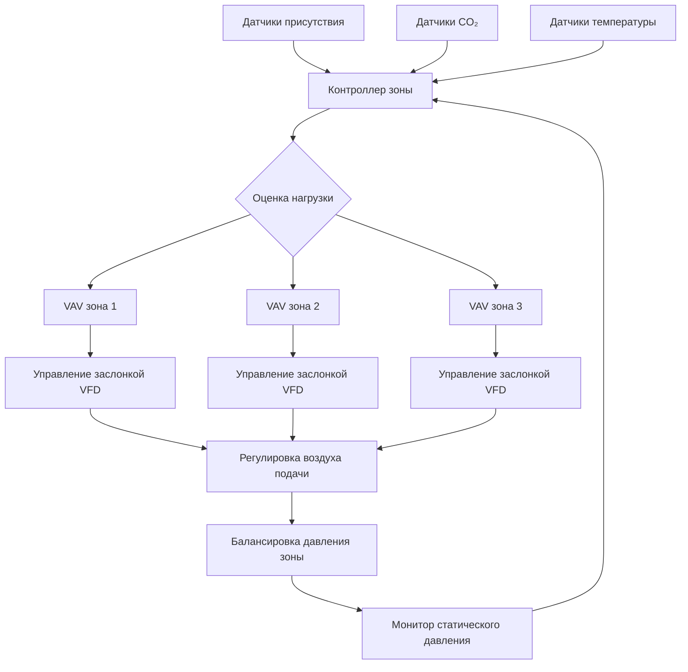
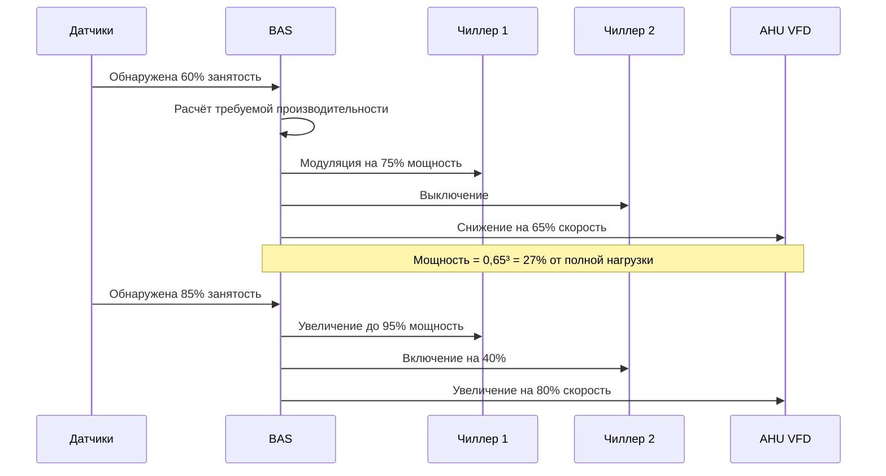

## Основы управления переменной нагрузкой

Системы управления переменной нагрузкой постоянно регулируют производительность HVAC для соответствия реальным тепловым и вентиляционным требованиям во время событий с колеблющейся занятостью. Стратегия управления существенно отличается от стационарной операции благодаря внедрению предиктивных алгоритмов, которые предвидят изменения нагрузки на основе данных датчиков и программирования события.

### Динамика расчёта нагрузки

Мгновенная охлаждающая нагрузка при переменной занятости:

$$Q_{total}(t) = Q_{sensible}(t) + Q_{latent}(t)$$

При этом явная нагрузка от людей варьируется с фактическим количеством присутствующих:

$$Q_{sensible}(t) = N(t) \cdot q_{s,person} \cdot CF_{activity}$$

- $N(t)$ = мгновенное количество людей
- $q_{s,person}$ = явное тепловыделение на человека (обычно 70–130 Вт)
- $CF_{activity}$ = коэффициент активности (1,0 сидя, 1,4–2,0 активность)

Составляющая скрытой нагрузки реагирует медленнее из-за буферизации влажности:

$$Q_{latent}(t) = N(t) \cdot q_{l,person} + V_{space} \cdot \rho_{air} \cdot \frac{d\omega}{dt} \cdot h_{fg}$$

Второй член учитывает накопление/высвобождение влаги строительными материалами при переходах занятости.

## Алгоритмы управления откликом

### Пропорциональное следование нагрузке

Модуляция производительности системы следует:

$$\dot{m}_{air}(t) = \dot{m}_{design} \cdot \left[\frac{Q_{total}(t)}{Q_{design}} \right]^{0.85}$$

Показатель меньше единицы учитывает вариации эффективности системы при неполной нагрузке. Управляемые VFD вентиляторы подачи регулируют скорость согласно:

$$\omega_{fan}(t) = \omega_{rated} \cdot \sqrt[3]{\frac{\dot{m}_{air}(t)}{\dot{m}_{design}}}$$

Потребление энергии масштабируется по кубическому закону:

$$P_{fan}(t) = P_{rated} \cdot \left[\frac{\omega_{fan}(t)}{\omega_{rated}}\right]^3$$

Это соотношение обеспечивает существенную экономию энергии во время периодов частичной занятости.

## Балансировка на уровне зон

### Отклик концевого элемента VAV

Каждый концевой элемент зоны модулирует на основе локальных условий:

$$\dot{m}_{zone,i}(t) = \dot{m}_{min,i} + \left(\dot{m}_{max,i} - \dot{m}_{min,i}\right) \cdot f(T_{error}, CO_{2,error})$$

Где функция $f$ реализует управление PI или PID:

$$f = K_p \cdot e(t) + K_i \int e(\tau)d\tau$$

Минимальный расход воздуха $\dot{m}_{min,i}$ обеспечивает вентиляцию согласно требованиям ASHRAE 62.1 даже в незанятых зонах.

## Характеристики времени отклика

| Тип изменения нагрузки | Время обнаружения | Время отклика | Время установления |
|------------------------|-------------------|---------------|-------------------|
| Резкое увеличение занятости | 1–3 мин | 3–5 мин | 8–15 мин |
| Постепенное увеличение занятости | 2–5 мин | 5–8 мин | 10–20 мин |
| Уменьшение занятости | 2–4 мин | 8–12 мин | 15–25 мин |
| Изменение уровня активности | 3–6 мин | 6–10 мин | 12–18 мин |

*Примечание: Времена предполагают правильно откалиброванные датчики и настроенные контрольные циклы*

## Отклик многоступенчатого оборудования

### Логика ступенчатого переключения

Переключение оборудования следует полосам гистерезиса для предотвращения короткого цикла:

$$Stage_{n+1,ON} = \frac{Q_{total}}{Q_{installed}} > 0.85 \cdot n + 0.15$$

$$Stage_{n,OFF} = \frac{Q_{total}}{Q_{installed}} < 0.70 \cdot (n-1) + 0.15$$

Зона 15% мёртвого хода между порогами включения и выключения ступени предотвращает колебания при граничных условиях.

## Стратегия интеграции датчиков

| Тип датчика | Основная функция | Вес отклика | Частота обновления |
|-------------|------------------|-------------|-------------------|
| Присутствие (PIR/ультразвук) | Оценка количества людей | 0,40 | 30–60 сек |
| CO₂ (NDIR) | Потребность вентиляции | 0,30 | 60–120 сек |
| Температура (RTD) | Тепловая нагрузка | 0,20 | 30–60 сек |
| Влажность (ёмкостной) | Скрытая нагрузка | 0,10 | 120–180 сек |

Алгоритм взвешенного сплавления датчиков объединяет входные сигналы:

$$Load_{estimated} = \sum_{i=1}^{n} w_i \cdot Signal_i(t)$$

При условии $\sum w_i = 1.0$ и индивидуальные граничные значения, предотвращающие доминирование отказов датчиков над управляющими решениями.

## Оптимизация производительности

### Предиктивное предвидение нагрузки

Продвинутые системы внедряют управление по схеме прямой связи на основе расписания события:

$$Q_{predicted}(t+\Delta t) = Q_{current}(t) + \frac{dN}{dt}\bigg|_{scheduled} \cdot q_{person} \cdot e^{-\frac{\Delta t}{\tau}}$$

Где $\tau$ представляет термическую постоянную времени помещения (обычно 10–30 минут для больших пространств событий). Это позволяет предварительное включение оборудования за 5–10 минут до предполагаемого увеличения нагрузки.

### Метрики энергоэффективности

Коэффициент производительности при переменной нагрузке:

$$COP_{variable}(t) = \frac{Q_{cooling}(t)}{P_{compressor}(t) + P_{fan}(t) + P_{pumps}(t)}$$

Правильно реализованное управление переменной нагрузкой сохраняет $COP_{variable} / COP_{rated} > 0.90$ в диапазоне операции от 40–100% производительности.

## Соответствие стандартам ASHRAE

- **ASHRAE 90.1**: Требует управление VFD на вентиляторах подачи >5,6 кВт и системы VAV для управления вентиляцией по требованию
- **ASHRAE 62.1**: Обязывает минимальные скорости вентиляции независимо от показаний датчиков присутствия
- **ASHRAE 55**: Тепловой комфорт поддерживается во время переходов нагрузки (лимит дрейфа ±0,8°C)
- **Guideline 36**: Обеспечивает последовательности операции для систем VAV с управлением по присутствию

## Рекомендации по внедрению

Успешное управление переменной нагрузкой требует:

1. **Размещение датчиков**: датчики CO₂ в воздухозаборах возврата, датчики присутствия с перекрывающимся охватом зон
2. **Настройка контрольного цикла**: Более медленные интегральные коэффициенты усиления предотвращают перерегулирование при быстрых изменениях занятости
3. **Лимиты минимального расхода**: Установите максимум из требуемой кодексом вентиляции или 30% от максимума зоны
4. **Сброс статического давления**: Уставка статического давления здания снижается по мере уменьшения общего требования
5. **Логика блокировки**: Переключение оборудования на основе совокупных требований зоны, а не отдельных запросов зон

Термическое отставание между изменениями занятости и откликом условий в помещении требует правильно настроенных предиктивных алгоритмов для поддержания комфорта во время динамических условий события.
