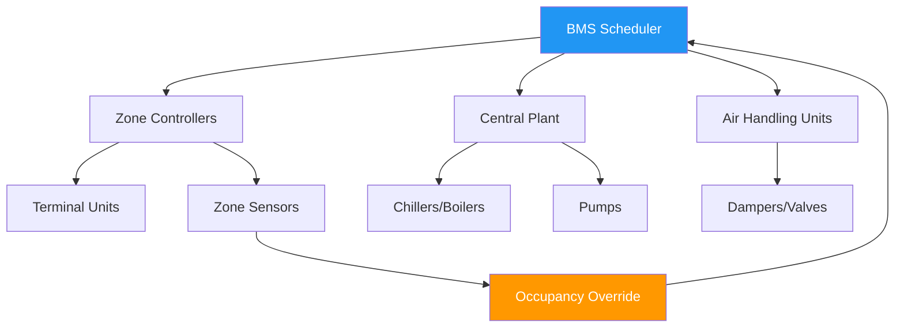
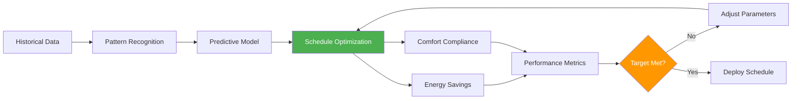

# Планирование графика занятости для систем HVAC

Планирование занятости представляет временную составляющую управления HVAC с контролем спроса, устанавливая параметры управления на основе времени, согласованные с режимами использования здания. Этот детерминированный подход снижает энергопотребление в периоды отсутствия людей, обеспечивая комфортные условия при прибытии занимающих.

## Основные принципы планирования

### Стратегия управления на основе времени

Планирование занятости делит рабочий день на дискретные периоды с отличными друг от друга параметрами управления:

- **Режим занятости**: Полная работа системы с сохранением проектных условий комфорта
- **Режим пустого помещения**: Сокращенная работа с расслабленными уставками
- **Режим предварительного кондиционирования**: Переходная работа, подготавливающая помещения к заселению
- **Режим ночной вентиляции**: Стратегическая вентиляция в благоприятных наружных условиях

Потенциал сбережения энергии следует соотношению:

$$Q_{saved} = \sum_{i=1}^{n} \dot{Q}_i \cdot t_{unoccupied,i} \cdot \eta_{reduction,i}$$

где $\dot{Q}_i$ представляет тепловую нагрузку зоны $i$, $t_{unoccupied,i}$ — продолжительность периода пустого помещения, а $\eta_{reduction,i}$ — дробное сокращение нагрузки при отката.

### Оптимизация отката

Оптимальная стратегия отката уравновешивает экономию энергии против требований восстановления. Критическим параметром является тепловая постоянная времени:

$$\tau = \frac{m \cdot c_p}{UA + \dot{m}_{inf} \cdot c_p}$$

где $m$ — тепловая масса здания, $c_p$ — удельная теплоемкость, $UA$ — проводимость оболочки, а $\dot{m}_{inf}$ — массовый расход инфильтрации.

Здания с большой $\tau$ (высокая тепловая масса) допускают более широкие диапазоны отката без чрезмерных штрафов на восстановление.

## Интеграция системы управления зданием

### Архитектура BMS

Планировщик BMS координирует несколько уровней системы:

1. **Планирование центральной установки**: Этапирование холодильной машины/котла на основе прогнозируемой нагрузки
2. **Планирование распределения**: Работа насоса и вентилятора в соответствии с зонами спроса
3. **Планирование зон**: Индивидуальное управление температурой и вентиляцией помещения
4. **Управление переопределением**: Временные корректировки занятости

### Иерархия приоритета событий

| Уровень приоритета | Тип события | Время отклика | Предел продолжительности |
|----------------|------------|---------------|----------------|
| 1 (Высший) | Безопасность жизни | Немедленно | Неограниченно |
| 2 | Ручное переопределение | <30 секунд | 2-4 часа |
| 3 | Датчик занятости | <2 минуты | При обнаружении |
| 4 | Запланированное событие | По программе | По графику |
| 5 (Низший) | Оптимизация | <15 минут | Непрерывно |

## Стратегии предварительного кондиционирования

### Алгоритм оптимального запуска

Предварительное кондиционирование вычисляет требуемое время опережения для достижения условий уставки при заселении:

$$t_{start} = t_{occupancy} - \frac{\Delta T_{required}}{\dot{T}_{recovery}}$$

где $\dot{T}_{recovery}$ — скорость восстановления температуры системой при максимальной мощности.

Продвинутые системы используют адаптивные алгоритмы, которые обучаются на основе отклика здания:

$$\dot{T}_{recovery}(t) = f(T_{outdoor}, T_{initial}, \text{equipment capacity}, \text{solar gain})$$

### Метрики производительности восстановления

Эффективность предварительного кондиционирования количественно определяется:

$$\eta_{precon} = \frac{t_{actual\_ready} - t_{optimal\_start}}{t_{occupancy} - t_{optimal\_start}} \times 100\%$$

Целевая производительность: $\eta_{precon} \geq 95\%$ (рекомендация ASHRAE Guideline 36).

## Структура оптимизации расписания

### Компромисс между энергией и комфортом

Целевая функция оптимизации уравновешивает стоимость энергии и штрафы за дискомфорт:

$$\min \left[ \sum_{t=1}^{T} C_{energy}(t) + \lambda \sum_{t=1}^{T} P_{discomfort}(t) \right]$$

где $C_{energy}(t)$ — зависящая от времени стоимость энергии, $P_{discomfort}(t)$ — штраф за дискомфорт, а $\lambda$ — весовой коэффициент.

### Матрица параметров расписания

| Тип здания | Время предварительного кондиционирования | Откат ΔT (°C) | Вентиляция при пустом помещении | Целевая скорость восстановления |
|---------------|-------------------|-----------------|------------------------|----------------------|
| Офис | 30-90 мин | 4-7 | 0-15% проектной | 1,7-2,8°C/ч |
| Класс | 45-120 мин | 3-6 | 10-20% проектной | 2,2-3,3°C/ч |
| Розница | 20-60 мин | 2-4 | 15-25% проектной | 2,8-4,4°C/ч |
| Здравоохранение | 15-30 мин | 1-2 | 50-100% проектной | 1,1-1,7°C/ч |
| Центр обработки данных | Н/П | 0-1 | 100% проектной | Н/П |

## Соответствие стандартам ASHRAE

**ASHRAE Standard 90.1-2019** (раздел 6.4.3.3) предписывает автоматическое отключение HVAC или откат в периоды пустого помещения, с исключениями для:

- Помещения, требующие непрерывной работы (центры обработки данных, лаборатории)
- Системы, обеспечивающие подпиточный воздух для выхлопных систем
- Помещения с особыми требованиями вентиляции (здравоохранение)

**ASHRAE Standard 189.1** требует органов управления оптимальным запуском для систем, превышающих 17000 CFM (м³/ч).

**ASHRAE Guideline 36** (Высокопроизводительные последовательности операций для систем HVAC) предоставляет подробные последовательности планирования, включая:

- Переходы в режиме занятости
- Последовательности прогрева и охлаждения
- Защита от замерзания в периоды пустого помещения
- Алгоритмы оптимального запуска/остановки

## Рассмотрения при внедрении

### Гибкость расписания

Эффективные системы планирования включают:

1. **Обработка исключений**: Календари праздников, специальные события, доступ в нерабочее время
2. **Детализация на уровне зон**: Независимое планирование для областей с различными режимами использования
3. **Адаптивное обучение**: Автоматическая корректировка на основе фактических шаблонов занятости
4. **Возможность ручного переопределения**: Локальное управление занимающими с автоматическим возвратом

### Мониторинг производительности

Ключевые показатели эффективности для запланированной работы:

$$\text{Energy Use Intensity Ratio} = \frac{\text{EUI}_{actual}}{\text{EUI}_{baseline}}$$

$$\text{Unoccupied Hour Savings} = \frac{E_{occupied} - E_{unoccupied}}{E_{occupied}} \times 100\%$$

Целевые метрики: снижение энергии на 20-40% в периоды пустого помещения для типичных коммерческих зданий.

### Распространенные ошибки при планировании

- **Недостаточное время предварительного кондиционирования**: Дискомфорт в начале занятости
- **Избыточное время опережения**: Ненужное энергопотребление
- **Недостаточный откат**: Минимальный потенциал сбережения
- **Жесткие расписания**: Невозможность адаптации к фактическим шаблонам использования
- **Плохое управление переопределением**: Расширенная ненужная работа

Надлежащее планирование занятости обычно достигает 15-30% ежегодного сбережения энергии HVAC при сохранении соответствия комфорту, превышающего 98% в периоды занятости.
