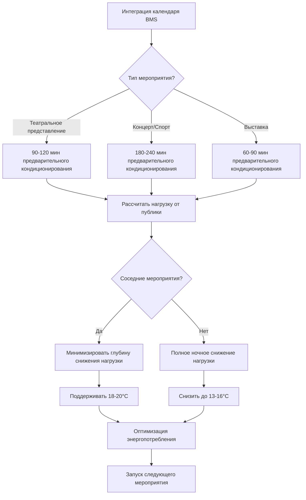

## Обзор

Площадки мероприятий и представлений представляют уникальные вызовы для HVAC из-за быстрого изменения занятости, высоких переходных нагрузок и строгих требований к комфорту во время представлений. Надлежащее расписание координирует предварительное кондиционирование, управление пиковой нагрузкой и восстановление после мероприятия для поддержания комфорта при минимизации энергопотребления.

ASHRAE Standard 90.1 предписывает автоматические временные управления для помещений, превышающих 929 м², а ASHRAE 55 требует поддержания теплового комфорта в течение периода занятости независимо от плотности публики.

## Характеристики нагрузки по типам мероприятий

| Тип мероприятия | Плотность занятости | Явная нагрузка | Скрытая нагрузка | Время предварительного кондиционирования |
|------------|-------------------|---------------|-------------|--------------------|
| Театральное представление | 0,65-0,93 м²/человека | 65-73 Вт/человека | 58-66 Вт/человека | 90-120 мин |
| Концертный зал | 0,46-0,74 м²/человека | 73-80 Вт/человека | 66-73 Вт/человека | 120-180 мин |
| Выставка/Трейд-шоу | 1,39-1,86 м²/человека | 65-73 Вт/человека | 51-58 Вт/человека | 60-90 мин |
| Спортивная арена | 0,74-1,11 м²/человека | 80-88 Вт/человека | 73-80 Вт/человека | 180-240 мин |
| Банкетный зал | 0,93-1,39 м²/человека | 65-73 Вт/человека | 58-66 Вт/человека | 60-90 мин |

## Расчеты нагрузки от публики

Общая охлаждающая нагрузка для площадок мероприятий сочетает явные и скрытые компоненты от присутствующих, освещения и оборудования.

### Нагрузка от присутствующих

$$Q_{occupant} = N \times (q_{sensible} + q_{latent})$$

Где:
- $Q_{occupant}$ = Общее выделение тепла от присутствующих (кДж/ч)
- $N$ = Количество присутствующих
- $q_{sensible}$ = Явное тепло на человека (65-88 Вт)
- $q_{latent}$ = Скрытое тепло на человека (51-80 Вт)

### Пиковая нагрузка с коэффициентом разнообразия

$$Q_{peak} = Q_{occupant} + Q_{lighting} + Q_{equipment} + Q_{infiltration}$$

Для театра на 500 мест:

$$Q_{peak} = 500 \times (73 + 66) + 4,39 + 2,34 + 3,51 = 79,6 \text{ кВт}$$

### Требования к энергии для предварительного кондиционирования

Энергия, требуемая для кондиционирования помещения до занятости:

$$Q_{precool} = \rho V c_p (T_{initial} - T_{setpoint}) + m \times h_{fg} \times (\omega_{initial} - \omega_{setpoint})$$

Где:
- $\rho$ = Плотность воздуха (1,2 кг/м³)
- $V$ = Объем помещения (м³)
- $c_p$ = Удельная теплоемкость воздуха (1006 Дж/кг·°C)
- $m$ = Масса воздуха (кг)
- $h_{fg}$ = Латентная теплота парообразования (2465 кДж/кг)
- $\omega$ = Влажностное соотношение (кг влаги/кг сухого воздуха)

## Стратегия расписания

```mermaid
gantt
    title Временная линия расписания HVAC для мероприятий
    dateFormat HH:mm
    axisFormat %H:%M

    section Подготовка к мероприятию
    Запуск системы           :done, startup, 14:00, 30m
    Фаза предварительного кондиционирования   :done, precool, 14:30, 120m
    Период стабилизации     :done, stabil, 16:30, 30m

    section Мероприятие
    Открытие дверей              :active, doors, 17:00, 30m
    Начало представления       :crit, perf, 17:30, 150m
    Антракт            :inter, 19:00, 20m
    Конец представления         :crit, end, 20:10, 50m

    section Завершение мероприятия
    Очистка площадки          :clear, 21:00, 30m
    Режим восстановления           :recover, 21:30, 60m
    Ночное снижение нагрузки           :setback, 22:30, 60m
```

## Протокол предварительного кондиционирования

### Стратегия снижения температуры

1. **Первоначальный запуск (T-150 мин)**: Включить все воздухообрабатывающие агрегаты, включить полный экономайзер, если позволяют условия на улице
2. **Агрессивное охлаждение (T-120 мин)**: Установить температуру воздуха на выходе 10-11°C, максимизировать расход воздуха
3. **Зарядка тепловой массы (T-90 мин)**: Продолжить охлаждение для снижения температуры в помещении на 1,7-2,8°C ниже уставки
4. **Стабилизация (T-30 мин)**: Вернуть к нормальной температуре воздуха на выходе, позволить помещению дрейфовать в сторону уставки
5. **Окончательная отладка (T-0 мин)**: Поддерживать уставку ±0,6°C по мере прихода посетителей

### Управление влажностью

Для площадок, требующих строгого контроля влажности (целевая влажность 60% отн.):

$$\dot{m}_{dehumid} = \frac{V \times \rho \times (\omega_{initial} - \omega_{target})}{t_{precondition}}$$

Где:
- $\dot{m}_{dehumid}$ = Требуемая скорость удаления влаги (кг/ч)
- $t_{precondition}$ = Время предварительного кондиционирования (ч)

## Координация нескольких мероприятий

### Логика оптимизации расписания

Для площадок с несколькими ежедневными мероприятиями сохраняйте промежуточные уставки между представлениями:

$$T_{intermediate} = T_{occupied} - \Delta T_{recovery} \times f_{time}$$

Где:
- $\Delta T_{recovery}$ = Максимальная разница температуры восстановления (4,4-6,7°C)
- $f_{time}$ = Временной коэффициент (доступные часы / требуемые часы)

## Мониторинг производительности

### Ключевые показатели эффективности

- **Достижение предварительного кондиционирования**: Помещение в пределах уставки ±0,6°C во время открытия дверей
- **Ответ на пиковую нагрузку**: Поддерживать уставку ±1,1°C при максимальной занятости
- **Эффективность восстановления**: Возврат к снижению нагрузки в течение 60 минут после мероприятия
- **Энергетический индекс**: кВт·ч на час занятости нормализовано к условиям на улице

### Адаптивное обучение

Современные системы BMS отслеживают фактические модели занятости и тепловой отклик:

$$t_{optimal} = t_{baseline} + \alpha \times (T_{missed} - 0)$$

Где:
- $t_{optimal}$ = Скорректированное время начала
- $t_{baseline}$ = Запланированное время начала
- $\alpha$ = Коэффициент обучения (3-6 мин/°C)
- $T_{missed}$ = Отклонение температуры в начале мероприятия

## Специальные соображения

### Дневные и вечерние расписания

Дневные представления требуют модифицированного предварительного кондиционирования из-за более высоких температур на улице. Увеличьте время предварительного кондиционирования на 15-20% для дневных мероприятий в сезон охлаждения.

### Вариация выходного дня

Мероприятия на выходных, следующие за периодами отсутствия занятости, нуждаются в расширенном предварительном кондиционировании для восстановления тепловой массы. Добавьте 30-60 минут к стандартному запуску для представлений в понедельник или мероприятий, следующих за периодом отсутствия 48+ часов.

### Управление антрактом

Во время 15-20-минутных антрактов поддерживайте расход подаваемого воздуха на уровне 80-90% пикового для предотвращения быстрого дрейфа температуры при одновременном снижении энергопотребления вентилятора. Не включайте экономайзер во время антракта из-за инфильтрации через открытые двери.

## Интеграция с системами управления зданием

ASHRAE Guideline 36 рекомендует расписание, основанное на календаре, со следующей иерархией:

1. **Основное расписание**: Обычное время представлений, выбранное из системы бронирования площадки
2. **События с переопределением**: Специальные события вводятся вручную с пользовательскими параметрами
3. **Проверка занятости**: Датчики движения подтверждают, что фактическая занятость соответствует расписанию
4. **Адаптивная корректировка**: Система изучает оптимальные время начала на основе исторической производительности

Системы расписания мероприятий должны взаимодействовать с системами пожарной сигнализации и безопасности жизнедеятельности для обеспечения возврата HVAC в нормальное состояние во время аварийной эвакуации.

## Восстановление энергии

Восстановление после мероприятия переводит систему из режима занятости с комфортом в режим снижения нагрузки при захвате остаточной охлаждающей способности:

$$E_{recovery} = \int_{t_0}^{t_1} \dot{Q}_{total}(t) \, dt$$

Где восстановление продолжается до тех пор, пока помещение не достигнет температуры снижения нагрузки или истекут 90 минут, в зависимости от того, что наступит раньше. Это предотвращает чрезмерное время работы при одновременном обеспечении теплового сброса для мероприятий следующего дня.
