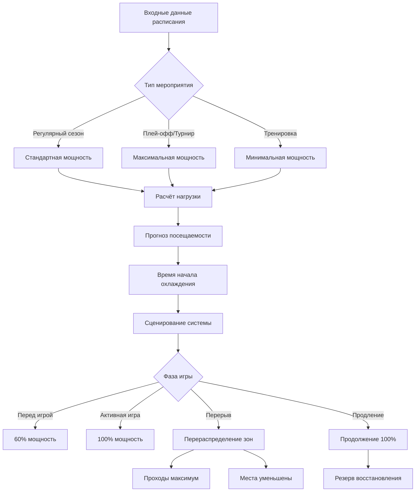

## Обзор

Спортивные объекты представляют экстремальные вызовы для HVAC из-за быстрых изменений численности посетителей, высокого метаболического выделения тепла, сосредоточенных периодов пиковых нагрузок и специфических требований мероприятий. Проектирование системы должно обеспечивать работу пустых объектов в нерабочее время, умеренные нагрузки во время тренировок и пиковые требования при мероприятиях с тысячами зрителей, генерирующими значительное явное и скрытое тепло.

## Характеристики нагрузок для спортивных мероприятий

### Тепловая нагрузка на основе численности людей

Общая охлаждающая нагрузка варьируется в зависимости от типа мероприятия и посещаемости:

$$Q_{total} = Q_{sensible} + Q_{latent} = \dot{m}c_p\Delta T + \dot{m}h_{fg}\Delta\omega$$

Где:
- $Q_{sensible}$ = явное тепло от людей, освещения и оборудования (кДж/ч)
- $Q_{latent}$ = скрытое тепло от влагообразования людей (кДж/ч)
- $\dot{m}$ = массовый расход воздуха (кг/ч)
- $c_p$ = удельная теплоёмкость воздуха = 1,006 кДж/кг·°C
- $\Delta T$ = разность температур (°C)
- $h_{fg}$ = скрытая теплота испарения ≈ 2,450 кДж/кг
- $\Delta\omega$ = изменение влажностного отношения (кг влаги/кг сухого воздуха)

### Метаболическое выделение тепла по уровню активности

По ASHRAE Fundamentals метаболическое тепло варьируется в зависимости от степени участия зрителей и активности спортсменов:

$$q_{metabolic} = N \times q_{person} \times AF$$

Где:
- $N$ = количество людей
- $q_{person}$ = теплоприток на одного человека (кДж/ч)
- $AF$ = коэффициент активности (1,0 сидящий, 1,3 стоящий/кричащий, 4,0-6,0 активная игра)

| Тип активности | Явное тепло (кДж/ч) | Скрытое тепло (кДж/ч) | Итого (кДж/ч) |
|---------------|------------------------|----------------------|----------------|
| Зритель сидящий | 243 | 201 | 444 |
| Стоящий/кричащий | 264 | 317 | 581 |
| Лёгкая спортивная активность | 333 | 618 | 951 |
| Умеренная активность (баскетбол) | 364 | 955 | 1,319 |
| Интенсивная активность (хоккей, интенсивная игра) | 427 | 1,420 | 1,847 |

## Интеграция с графиком мероприятий

### Прогнозирование графика нагрузки

Системы HVAC должны предварительно кондиционировать объекты на основе графика мероприятий:

$$T_{precool} = \frac{V \times \rho \times c_p \times \Delta T_{desired}}{Q_{cooling} - Q_{building}}$$

Где:
- $T_{precool}$ = требуемое время предварительного охлаждения (часы)
- $V$ = объём объекта (м³)
- $\rho$ = плотность воздуха ≈ 1,2 кг/м³
- $Q_{cooling}$ = доступная мощность охлаждения (кДж/ч)
- $Q_{building}$ = нагрузка на оболочку здания (кДж/ч)

```mermaid
gantt
    title График планирования HVAC спортивного мероприятия
    dateFormat HH:mm
    axisFormat %H:%M

    section Подготовка
    Режим отката (55% мощность)     :a1, 00:00, 6h
    Предварительное охлаждение (75%) :a2, 06:00, 2h
    Финальная кондиция (100%)       :a3, 08:00, 1h

    section День игры
    Открытие дверей                 :milestone, m1, 09:00, 0m
    Перед игрой (50% толпы)         :a4, 09:00, 1h
    Начало игры                     :milestone, m2, 10:00, 0m
    Первый тайм (100% нагрузка)     :crit, a5, 10:00, 1h
    Перерыв (пик проходов)          :crit, a6, 11:00, 20m
    Второй тайм (100% нагрузка)     :crit, a7, 11:20, 1h
    Возможное продление             :a8, 12:20, 30m

    section После мероприятия
    Рассеивание толпы (80% мощность) :a9, 12:50, 30m
    Режим уборки (40% мощность)     :a10, 13:20, 2h
    Режим отката (30% мощность)     :a11, 15:20, 8h
```

## Стратегии управления динамической нагрузкой

### Управление на основе зон

Применение отдельных стратегий управления для различных зон объекта:

**Зона игровой площадки:**
- Строгий контроль температуры (20-22°C для баскетбола/волейбола, 13-16°C для ледового хоккея)
- Высокие воздухообмены: минимум 6-12 ACH согласно ASHRAE 62.1
- Минимизация скорости воздуха на уровне игровой площадки (<0,25 м/с для предотвращения помех)

**Зона мест для зрителей:**
- Режим занятости: 22-24°C, 30-60% относительной влажности
- Переменное сценирование мощности на основе продажи билетов
- Повышенная вентиляция при пиковой численности: минимум 7,1 CFM (12,1 м³/ч) на человека

**Проходы и удобства:**
- Пиковая нагрузка во время перерыва и перемены
- 100% коэффициент численности во время перерывов
- Требуется способность быстрого восстановления

### Управление скачком нагрузки во время перерыва

Перерыв создаёт уникальное распределение нагрузки, так как люди движутся из мест в проходы:

$$Q_{halftime} = Q_{concourse\_peak} + Q_{restrooms} + Q_{concessions} - Q_{seating\_reduced}$$

Пиковая численность в проходах может достигать 70-80% от общей посещаемости одновременно, создавая:
- 40-60% увеличение охлаждающей нагрузки проходов
- Снижение нагрузок в зоне мест (снижение на 30-40%)
- Сосредоточенные скрытые нагрузки рядом с пищевыми предприятиями
- Требования вытяжки туалетов скачут на максимум

## Требования к вентиляции

ASHRAE 62.1 определяет минимальные скорости вентиляции для спортивных объектов:

- Зоны зрителей: 7,1 CFM (12,1 м³/ч) на человека
- Игровые площадки: 0,053 м³/(м²·с) (спортзалы), 0,085 м³/(м²·с) (арены)
- Раздевалки: 0,085 м³/(м²·с) плюс вытяжка из душей

Общее требование наружного воздуха:

$$\dot{V}_{OA} = R_p \times P + R_a \times A$$

Где:
- $R_p$ = скорость наружного воздуха на человека (м³/ч на человека)
- $P$ = ожидаемая пиковая численность
- $R_a$ = скорость наружного воздуха на единицу площади (м³/(м²·ч))
- $A$ = площадь зоны (м²)

## Рекомендации по системе

**Сценирование мощности:**
- Проектирование с 20-30% перепроизводительностью для экстремальных условий
- Множественное сценирование чиллер/РТУ для эффективности на частичной нагрузке
- Переменная скорость на всех основных приборах обработки воздуха

**Интеграция планирования:**
- Интеграция BMS с системами продажи билетов для данных реальной численности
- Гибкость отсрочки из-за погоды с быстрой способностью переплана
- Турнирный режим для спина-к-спине мероприятий с минимальным временем восстановления

**Последовательности управления:**
- Предварительное охлаждение за 2-4 часа на основе внешних условий и типа мероприятия
- Вентиляция с контролем по спросу с использованием датчиков CO₂ в занятых зонах
- Отката после мероприятия на 13°C (зима) или 29°C (лето) в течение 30 минут

**Точки мониторинга:**
- Подсчёт численности в реальном времени у входов
- Температура и влажность на уровне зон
- Переустановка температуры подачи на основе плотности толпы
- Уровни CO₂ возвратного воздуха для адекватности вентиляции

## Компоненты

- Входные данные расписания игр
- Расписание тренировок
- Расписание турниров
- Сезонные вариации расписания
- Гибкость отсрочки из-за погоды
- Приспособление к изменениям расписания
