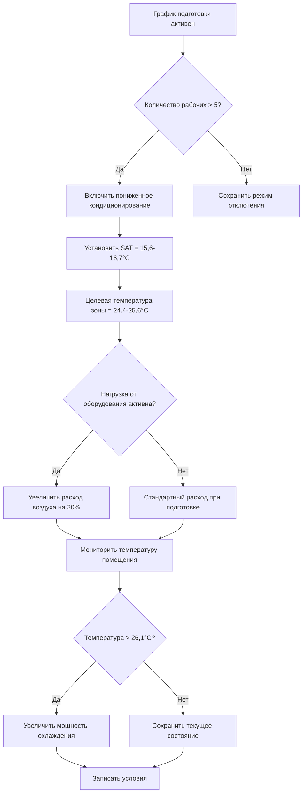

## Обзор

Периоды подготовки и уборки помещений представляют особые задачи для кондиционирования HVAC, когда помещения переходят между состояниями вакантности, присутствия рабочих и полной занятости. В отличие от полной занятости помещений, подготовка/уборка предполагает меньшее количество рабочих, сосредоточенные нагрузки оборудования и физическую активность, вызывающую повышенное метаболическое тепловыделение. Правильное расписание HVAC в эти переходные периоды оптимизирует энергопотребление, сохраняя при этом приемлемые условия работы в соответствии со стандартом ASHRAE Standard 55.

## Анализ тепловой нагрузки при кондиционировании

### Тепловыделение при занятости рабочими

Бригады подготовки генерируют значительно большее чувствительное тепло, чем сидящие люди, вследствие физической активности:

$$q_{worker} = q_{sensible} + q_{latent} = 1.180 + 0.944 = 2.124 \text{ кДж/с на человека}$$

Для умеренной или тяжелой работы (ASHRAE Fundamentals, Chapter 18):

$$Q_{occupants} = N_{workers} \times q_{worker} \times CLF$$

Где:
- $N_{workers}$ = количество рабочих при подготовке
- $q_{worker}$ = 2.124 кДж/с для умеренной работы (поднятие, перемещение оборудования)
- $CLF$ = коэффициент охлаждения (обычно 0,90-0,95 для короткой продолжительности)

### Тепловые нагрузки при расстановке оборудования

Временное оборудование при подготовке создает переходящие нагрузки:

$$Q_{equipment,staging} = \sum_{i=1}^{n} (P_i \times F_{use,i} \times F_{rad,i})$$

Где:
- $P_i$ = мощность оборудования (кВт)
- $F_{use}$ = коэффициент использования при подготовке (0,4-0,6 типично)
- $F_{rad}$ = коэффициент излучения (теплопередача в помещение)

### Стратегия пониженного кондиционирования

При подготовке/уборке целевые условия могут быть ослаблены по сравнению с полной занятостью:

$$\Delta T_{setup} = T_{occupied} + 1,7°C \text{ до } 2,8°C$$

Допустимый диапазон температуры при подготовке: 24,4-26,7°C сухого термометра (в сравнении с 22,2-23,9°C при занятости)

Расчет вентиляции в соответствии с ASHRAE 62.1:

$$V_{oz,setup} = R_p \times P_{setup} + R_a \times A_z$$

Где численность при подготовке $P_{setup}$ составляет 5-15% от полной занятости для большинства концертных залов.

## Рамки планирования подготовки и уборки

```mermaid
gantt
    title Временная шкала кондиционирования HVAC для подготовки и уборки
    dateFormat HH:mm
    axisFormat %H:%M

    section Перед мероприятием
    Режим отключения           :done, setback, 00:00, 6h
    Начало предварительного охлаждения :done, precond, 06:00, 2h
    Начало подготовки           :active, setup1, 08:00, 3h
    Погрузка оборудования      :active, loadin, 08:30, 2h
    Завершение подготовки       :crit, setup2, 11:00, 1h

    section Мероприятие
    Режим полной занятости    :event, 12:00, 4h

    section После мероприятия
    Начало уборки        :teardown1, 16:00, 2h
    Выгрузка оборудования     :loadout, 16:30, 1.5h
    Финальная уборка         :clean, 18:00, 1h
    Возврат в режим отключения      :setback2, 19:00, 5h
```

## Матрица расписания работ

| Этап | Продолжительность | Количество рабочих | Целевое кондиционирование | Вентиляция | Примечания по оборудованию |
|-------|----------|-----------|---------------------|-------------|----------------|
| **Перед подготовкой** | 2-3 ч | 0 | Предварительное охлаждение невакантного помещения | Минимальный наружный воздух | Кондиционирование помещения к целевым параметрам |
| **Погрузка** | 1-2 ч | 5-10 рабочих | 25,6°C TB / 50% ОВ | 7,1 м³/ч на человека (15 CFM/person) | Открытые двери причала - инфильтрация |
| **Активная подготовка** | 2-4 ч | 10-25 рабочих | 24,4-25,6°C TB | 9,5 м³/ч на человека (20 CFM/person) | АВ-оборудование, осветление, оборудование подмостков |
| **Перед мероприятием** | 0,5-1 ч | 2-5 рабочих | Переход к занятости | Повышение до расчетных параметров | Финальная регулировка |
| **Полное мероприятие** | Переменное | Расчетная занятость | 22,2-23,9°C TB | Расчетный м³/ч на человека | Полная кондиционная нагрузка |
| **Начальная уборка** | 1-2 ч | 15-30 рабочих | 24,4-25,6°C TB | 9,5 м³/ч на человека (20 CFM/person) | Период высокого метаболического тепловыделения |
| **Выгрузка** | 1-2 ч | 5-10 рабочих | 25,6°C TB | 7,1 м³/ч на человека (15 CFM/person) | Доступ к причалу - инфильтрация |
| **Финальная уборка** | 1-2 ч | 3-8 рабочих | 25,6-26,7°C TB | 7,1 м³/ч на человека (15 CFM/person) | Легкая физическая работа |
| **Отключение после мероприятия** | До следующего мероприятия | 0 | Отключение невакантного помещения | Минимальное | Энергосбережение |

## Последовательности управления

### Логика управления в период подготовки

### Переход к полной занятости

Период наращивания от подготовки к полному кондиционированию:

$$t_{ramp} = \frac{V \times \rho \times c_p \times \Delta T}{Q_{cooling,available}}$$

Типичное время наращивания: 30-60 минут для большинства площадок для перехода с 25,6°C при подготовке на 23,3°C при занятости.

## Рассмотрение при погрузке и выгрузке

### Инфильтрация через двери причала

Открытые двери причала для погрузки создают значительные нагрузки от инфильтрации:

$$Q_{infiltration} = 1.08 \times CFM_{infiltration} \times \Delta T + 0.68 \times CFM_{infiltration} \times \Delta W$$

Для двери размером 3,05 м × 3,66 м, открытой в течение 90 минут:
- Скорость инфильтрации: 1.416-2.360 м³/с типично
- Дополнительная чувствительная нагрузка: 70,7-141,4 кДж/с (летние условия)
- Скрытая нагрузка: 37,7-70,7 кДж/с (влажный климат)

Стратегии смягчения:
- Воздушные завесы на дверях причала (скорость выброса 2,54-2,44 м/с)
- Подпрессовка тамбура
- Координация графика закрытия двери
- Временные барьеры при длительных периодах погрузки

### Тепловыделение от расстановки оборудования

Временное оборудование генерирует тепло даже при подготовке до начала мероприятия:

| Тип оборудования | Типичная мощность | Коэффициент использования | Тепловыделение при подготовке |
|----------------|---------------|--------------|---------------------------|
| Микшерный пульт | 0,5 кВт | 0,6 | 0,472 кДж/с |
| Активные колонки (пара) | 1,2 кВт | 0,3 | 0,566 кДж/с |
| Контроллер освещения | 0,3 кВт | 0,8 | 0,378 кДж/с |
| LED-панели сцены (на 9,29 м²) | 2,0 кВт | 0,5 | 1.604 кДж/с |
| Видеопроектор | 1,5 кВт | 0,4 | 0,945 кДж/с |

## Оптимизация энергоэффективности

Пониженное кондиционирование при подготовке/уборке дает значительное энергосбережение:

$$E_{saved} = \frac{(Q_{design} - Q_{setup}) \times t_{setup}}{EER}$$

Пример: система 14,1 кВт, период подготовки 4 часа, снижение нагрузки на 40%:
- Избегаемое охлаждение: 141,4 кДж/с × 4 ч × 0,40 = 2.031 МДж
- Энергосбережение: 2.031 МДж / 12 EER = 0,686 кВтч на одно мероприятие

Годовое сбережение на 200 мероприятий: 137,2 кВтч = 1.370-2.055 руб. в зависимости от тарифов на электроэнергию.

## Координация с графиком обслуживания

Планируйте техническое обслуживание HVAC при длительных периодах уборки, если возможно:
- Замена фильтра после мероприятий с высокой занятостью
- Инспекция теплообменника при максимальной нагрузке
- Калибровка управления во время низкой занятости
- Тестирование системы без влияния на пользователей

Координируйте доступ к оборудованию с командами уборки для максимальной доступности оборудования при минимизации операционных перерывов.

## Заключение

Эффективное расписание HVAC при подготовке и уборке помещений балансирует комфорт рабочих, защиту оборудования и энергоэффективность в переходные периоды. Пониженные целевые показатели кондиционирования (24,4-25,6°C) при наличии рабочих, стратегическое снижение вентиляции, а также управление инфильтрацией при погрузке/выгрузке оптимизируют производительность системы. Интеграция с системами управления зданием позволяет автоматические переходы между режимами отключения, подготовки, занятости и уборки на основе фактических потребностей расписания, а не фиксированных временных блоков.
