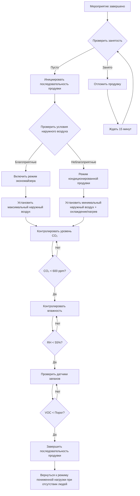

# Системы продувки после мероприятия

Вентиляция продувки после мероприятия обеспечивает быстрое восстановление качества воздуха в помещениях с переменной занятостью после мероприятий с высокой плотностью посещающих. Система устраняет повышенные концентрации CO₂, накопление влаги, биоэффлюенты и запахи, одновременно оптимизируя рекуперацию энергии и подготавливая помещение для последующей занятости.

## Физические принципы

После мероприятия деградация качества воздуха в помещении происходит из нескольких источников:

**Накопление загрязняющих веществ** происходит в результате метаболического производства CO₂, типично 0,3 л/мин на человека при уровне активности сидя. Для мероприятия с 1000 человек продолжительностью 3 часа общее производство CO₂ достигает примерно 54 000 л (108 кг).

**Влажностная нагрузка** от дыхания и потоотделения участников добавляет скрытую теплоту в помещение. Каждый участник выделяет примерно 50–70 г/ч влаги при средних уровнях активности. Мероприятие с 1000 человек генерирует 150–210 кг водяного пара, требующего удаления.

**Биоэффлюенты и запахи** накапливаются во время занятости, включая летучие органические соединения, альдегиды и твердые частицы. Эти загрязняющие вещества проявляют различную стойкость в зависимости от характеристик адсорбции и взаимодействий с поверхностями.

## Расчеты времени продувки

Время, необходимое для снижения концентраций загрязняющих веществ, следует кинетике первого порядка на основе скорости воздухообмена.

### Декай концентрации

$$C(t) = C_0 \cdot e^{-\lambda t} + C_{oa}(1 - e^{-\lambda t})$$

Где:
- $C(t)$ = концентрация в помещении в момент времени $t$ (ppm или г/м³)
- $C_0$ = начальная концентрация после мероприятия
- $C_{oa}$ = концентрация наружного воздуха
- $\lambda$ = скорость воздухообмена (1/ч)
- $t$ = время продувки (ч)

### Требуемое время продувки

$$t_{purge} = \frac{\ln\left(\frac{C_0 - C_{oa}}{C_f - C_{oa}}\right)}{\lambda}$$

Где:
- $C_f$ = целевая финальная концентрация

**Пример:** Снижение CO₂ с 1500 ppm до 600 ppm (наружный воздух = 420 ppm) при 6 ACH:

$$t_{purge} = \frac{\ln\left(\frac{1500 - 420}{600 - 420}\right)}{6} = \frac{\ln(6,0)}{6} = 0,30 \text{ ч} = 18 \text{ минут}$$

### Время удаления влаги

Для помещений с повышенной влажностью:

$$t_{moisture} = \frac{V \cdot \rho_{air} \cdot (W_i - W_f)}{Q \cdot \rho_{air} \cdot (W_i - W_{oa})}$$

Где:
- $V$ = объем помещения (м³)
- $W_i$ = начальное соотношение влажности (кг/кг)
- $W_f$ = целевое финальное соотношение влажности (кг/кг)
- $W_{oa}$ = соотношение влажности наружного воздуха (кг/кг)
- $Q$ = расход воздуха продувки (м³/с)

## Режимы работы продувки

| Режим | Расход воздуха | Температура | Применение | Влияние на энергию |
|------|--------------|-------------|-------------|---------------|
| Быстрая продувка | 8–12 ACH | Некондиционированный наружный воздух | Требуется быстрое восстановление | Минимальное кондиционирование |
| Продувка с экономайзером | 6–8 ACH | Наружный воздух (благоприятные условия) | Умеренное восстановление | Низкое потребление энергии |
| Кондиционируемая продувка | 4–6 ACH | Кондиционированный наружный воздух | Приоритет поддержания комфорта | Стандартное кондиционирование |
| Ночная продувка | 2–4 ACH | Некондиционированный наружный воздух | Восстановление в ночное время | Минимальное потребление энергии |
| Гибридная продувка | Переменный | Смешанный температурный контроль | Сбалансированный подход | Оптимизированное потребление энергии |

## Управление последовательностью продувки

## Руководящие принципы ASHRAE

**Стандарт ASHRAE 62.1** предоставляет минимальные скорости вентиляции, но не рассматривает явно стратегии продувки после мероприятия. Однако раздел 6.2.7 по системам переменного объема воздуха устанавливает принципы вентиляции по требованию, применимые к последовательностям продувки.

**Стандарт ASHRAE 55** критерии теплового комфорта могут быть временно ослаблены во время циклов продувки при отсутствии людей, позволяя работу экономайзера за пределами нормальных границ комфорта для максимизации энергосбережения.

**Руководящий документ ASHRAE 36** Высокоэффективные последовательности операций для систем HVAC предоставляет детальные управляющие последовательности для работы экономайзера и вентиляции по требованию, применимые к стратегиям продувки.

## Интеграция рекуперации энергии

Вентиляторы с рекуперацией тепла и вентиляторы с рекуперацией энергии усложняют операции продувки, снижая эффективность удаления загрязняющих веществ.

### Стратегия байпаса

В режиме быстрой продувки обойти устройства рекуперации энергии для максимизации выхлопа загрязняющих веществ:

$$\eta_{purge} = \frac{(C_0 - C_f)}{(C_0 - C_{oa})} \cdot 100\%$$

Байпас рекуперации энергии предотвращает перекрестное загрязнение от воздуха рециркуляции к подаваемому воздуху, улучшая эффективность продувки на 15–30%.

### Режим частичной рекуперации

Для операций кондиционированной продувки поддерживают частичную рекуперацию энергии:

$$\dot{Q}_{recovered} = \dot{m} \cdot c_p \cdot \epsilon \cdot (T_{return} - T_{outdoor})$$

Где:
- $\epsilon$ = эффективность теплообменника (снижена до 40–50% во время продувки)
- $\dot{m}$ = массовый расход воздуха (кг/с)
- $c_p$ = удельная теплоемкость воздуха (1,006 кДж/кг·К)

## Рассмотрения проектирования системы

**Размещение датчиков** определяет эффективность продувки. Установите датчики CO₂ в потоках воздуха рециркуляции на высоте зоны занятости. Поместите датчики влажности вдали от прямого потока воздуха и источников тепла.

**Мощность вентилятора** должна обеспечивать максимальные расходы воздуха продувки, типично 150–200% проектного расхода при занятости для режимов быстрой продувки.

**Размер демпфера** для впуска наружного воздуха должен обеспечивать работу полного экономайзера при расходах продувки без чрезмерного перепада давления. Целевой максимальный перепад давления 12,4 Па (0,5 дюйм вод. ст.) поперек демпферов наружного воздуха при полном открытии.

**Управляющие блокировки** предотвращают одновременное нагревание и охлаждение при переходах режимов продувки. Реализуйте минимальные временные задержки в 3 минуты между переходами режимов для предотвращения короткого цикла оборудования.

## Проверка производительности

Измеряйте эффективность продувки путем непрерывного контроля:

$$E_{purge} = \frac{(C_0 - C_{final})}{(C_0 - C_{oa})} \cdot 100\%$$

Целевая эффективность продувки, превышающая 85% для удаления CO₂ и 70% для удаления влаги в пределах ограничений по времени проектирования.

## Стратегии оптимизации

**Предсказательное инициирование продувки** на основе расписания мероприятий сокращает время восстановления между мероприятиями. Начните продувку за 30–60 минут до открытия объекта для оптимального качества воздуха.

**Выбор режима на основе погоды** автоматически выбирает быструю некондиционированную продувку во время благоприятных условий наружного воздуха и кондиционируемую продувку при экстремальной погоде.

**Зональные последовательности продувки** для больших объектов приоритизируют области с высокой занятостью, снижая общее потребление энергии при поддержании качества воздуха в критических пространствах.

Системы продувки после мероприятия обеспечивают важное управление качеством воздуха в объектах с переменной занятостью, уравновешивая быстрое восстановление с энергоэффективностью посредством интеллектуальных управляющих последовательностей и адаптивных режимов работы.
