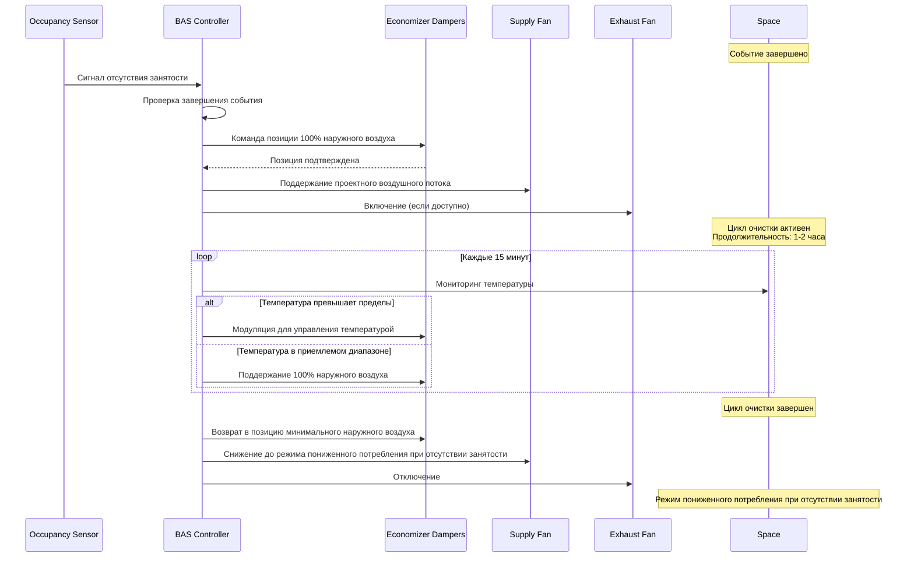

## Цикл послесобытийной очистки с воздухообменом

Циклы послесобытийной очистки используют высокие скорости воздухообмена для быстрого удаления загрязняющих веществ, запахов и биопродуктов, накопленных во время событий с высокой занятостью. Эта стратегия максимизирует подачу наружного воздуха, когда помещение не занято, обеспечивая экономически эффективное восстановление качества воздуха перед следующим циклом занятости.

### Основы скорости воздухообмена

Скорость воздухообмена количественно определяет объемную замену внутреннего воздуха наружным воздухом. Для операций послесобытийной очистки повышенные воздухообмены в час (ACH) значительно снижают концентрации загрязняющих веществ посредством разбавляющей вентиляции.

**Определение воздухообменов в час (ACH):**

$$ACH = \frac{Q \times 60}{V}$$

Где:
- $ACH$ = воздухообмены в час [ч⁻¹]
- $Q$ = скорость вентиляционного воздушного потока [CFM]
- $V$ = объем помещения [м³]
- $60$ = коэффициент преобразования (минуты в часы)

**Спад концентрации загрязняющих веществ при очистке:**

$$C(t) = C_0 \cdot e^{-N \cdot t}$$

Где:
- $C(t)$ = концентрация загрязняющего вещества в момент времени $t$ [ppm или µg/м³]
- $C_0$ = начальная концентрация загрязняющего вещества [ppm или µg/м³]
- $N$ = скорость воздухообмена [ч⁻¹]
- $t$ = продолжительность очистки [часы]
- $e$ = основание натурального логарифма (≈2,718)

### Рассмотрение стандарта ASHRAE 62.1

Хотя ASHRAE 62.1 предписывает минимальные скорости вентиляции для периодов занятости, циклы послесобытийной очистки работают по другим критериям. Стратегия использует периоды отсутствия занятости для подачи скоростей воздухообмена в 3-5 раз выше требований режима занятости, обеспечивая быстрое удаление загрязняющих веществ без штрафов за тепловой комфорт или чрезмерные затраты на кондиционирование.

ASHRAE 62.1 раздел 6.2.7.1 разрешает стратегии вентиляции с контролем по требованиям, которые снижают подачу наружного воздуха во время незанятых периодов, но послесобытийная очистка обращает этот подход вспять, намеренно максимизируя наружный воздух сразу после событий с высокой плотностью занятости.

## Требования ACH для цикла очистки

| Тип помещения | ACH при занятости | ACH послесобытийной очистки | Продолжительность очистки |
|------------|--------------|----------------------|----------------|
| Аудитория | 2-4 | 6-8 | 1,0-1,5 часа |
| Спортзал | 3-6 | 8-10 | 1,5-2,0 часа |
| Переговорная | 4-6 | 10-12 | 0,5-1,0 час |
| Столовая | 4-8 | 10-15 | 1,0-1,5 часа |
| Конференц-зал | 2-4 | 6-10 | 1,5-2,0 часа |

**Факторы, влияющие на выбор ACH для очистки:**

- **Плотность занятости:** События с более высокой плотностью создают большее накопление биопродуктов, требующее повышенного ACH
- **Уровень активности:** Энергичная деятельность (спорт) производит больше метаболических побочных продуктов, чем малоподвижные события
- **Продолжительность занятости:** Более длительные события накапливают более высокие концентрации загрязняющих веществ
- **Качество наружного воздуха:** Плохое качество наружного воздуха может ограничить эффективность очистки
- **Время между событиями:** Более короткие интервалы требуют более высокого ACH для адекватной очистки

## Работа последовательности очистки

Циклы послесобытийной очистки максимизируют подачу наружного воздуха посредством скоординированного управления оборудованием систем кондиционирования воздуха. Последовательность приоритизирует воздухообмен над управлением температурой, допуская временный дрейф температуры помещения в незанятые периоды очистки.

## Расчет продолжительности цикла очистки

Требуемая продолжительность очистки зависит от целевого снижения загрязнения и достижимой скорости воздухообмена.

**Время очистки для заданного снижения загрязнения:**

$$t = \frac{\ln(C_0) - \ln(C_t)}{N}$$

Или эквивалентно:

$$t = \frac{\ln(C_0/C_t)}{N}$$

Где:
- $t$ = требуемое время очистки [часы]
- $C_0$ = начальная концентрация загрязняющего вещества
- $C_t$ = целевая концентрация загрязняющего вещества
- $N$ = скорость воздухообмена [ч⁻¹]

**Пример расчета:**

Для спортзала, требующего снижения загрязнения на 90% ($C_t = 0,1 \times C_0$) с ACH очистки 8:

$$t = \frac{\ln(10)}{8} = \frac{2,303}{8} = 0,288 \text{ часа} \approx 17 \text{ минут}$$

Для снижения на 95%:

$$t = \frac{\ln(20)}{8} = \frac{2,996}{8} = 0,375 \text{ часа} \approx 23 \text{ минуты}$$

Для снижения на 99%:

$$t = \frac{\ln(100)}{8} = \frac{4,605}{8} = 0,576 \text{ часа} \approx 35 \text{ минут}$$

## Эффективность удаления загрязняющих веществ

| Продолжительность очистки (минуты) | ACH = 6 | ACH = 8 | ACH = 10 | ACH = 12 |
|-------------------------|---------|---------|----------|----------|
| 15 | 59,3% | 69,9% | 77,7% | 83,5% |
| 30 | 83,5% | 90,2% | 94,5% | 96,9% |
| 45 | 93,1% | 96,9% | 98,6% | 99,4% |
| 60 | 97,0% | 99,0% | 99,7% | 99,9% |
| 90 | 99,4% | 99,9% | 99,99% | 99,997% |
| 120 | 99,9% | 99,997% | 99,9997% | 99,9999% |

Эта таблица демонстрирует характеристики экспоненциального спада, где начальное удаление загрязняющих веществ происходит быстро, с убывающей отдачей для расширенных периодов очистки.

## Требования к проектированию системы

**Способность к 100% наружному воздуху:**

Обработчики воздуха, обслуживающие помещения с переменной занятостью, должны поддерживать полную работу с наружным воздухом без компрометации производительности оборудования. Рассмотрение проекта включает:

- Размер демпфера экономайзера для доставки 100% наружного воздуха при номинальной производительности вентилятора
- Проверка размещения приема наружного воздуха в соответствии с IMC раздел 401.3
- Стратегии защиты от замерзания для защиты катушки при циклах очистки зимой
- Проверка производительности вентилятора подачи при условиях статического давления 100% наружного воздуха

**Балансировка давления смесительного бокса:**

$$\Delta P_{OA} = \Delta P_{RA}$$

Размер демпфера должен обеспечить, чтобы перепад давления демпфера наружного воздуха в позиции 100% был равен перепаду давления демпфера рециркуляционного воздуха для предотвращения избыточного давления в смесительном боксе.

**Интеграция управления экономайзером:**

Последовательности послесобытийной очистки переопределяют стандартную логику управления экономайзером. Блокировки экономайзера на основе температуры и энтальпии отключаются во время циклов очистки, приоритизируя воздухообмен над энергоэффективностью.

## Измерение и проверка

**Проверка воздушного потока:**

Измерение воздушного потока после установки подтверждает достижение целевого ACH:

$$Q_{measured} = \frac{ACH_{target} \times V}{60}$$

**Размещение датчиков:**

- Датчики CO₂ документируют спад концентрации при циклах очистки
- Размещение на уровне дыхания (0,9-1,8 м выше пола) в репрезентативных местах
- Многоточечная выборка для помещений, превышающих 465 м²

**Метрики производительности:**

- Снижение CO₂ от пиковых уровней занятости до почти окружающей среды (≤600 ppm)
- Дрейф температуры при цикле очистки
- Потребление энергии на цикл очистки

## Энергетические последствия

Циклы послесобытийной очистки налагают штрафы на энергию кондиционирования, пропорциональные разности температур наружного и внутреннего воздуха и продолжительности очистки. Анализ полного жизненного цикла стоимости балансирует преимущества качества воздуха в помещении против увеличенного потребления энергии HVAC.

**Энергия цикла очистки:**

$$E_{purge} = Q \times \rho \times c_p \times (T_{OA} - T_{SA}) \times t$$

Где:
- $E_{purge}$ = энергия отопления или охлаждения [кДж]
- $Q$ = скорость воздушного потока [CFM]
- $\rho$ = плотность воздуха [кг/м³]
- $c_p$ = удельная теплота воздуха [кДж/кг·°C]
- $T_{OA}$ = температура наружного воздуха [°C]
- $T_{SA}$ = температура подаваемого воздуха [°C]
- $t$ = продолжительность очистки [минуты]

Оптимальные стратегии очистки балансируют интенсивность ACH против продолжительности, признавая, что чрезмерно высокий ACH обеспечивает минимальное преимущество качества воздуха при одновременном увеличении энергии вентилятора и нагрузки на кондиционирование воздуха.

## Лучшие практики реализации

1. **Интеграция расписания:** Программируйте циклы очистки для инициирования сразу после завершения события, проверяется датчиками занятости или расписанием на основе календаря
2. **Пределы температуры:** Установите пороги приостановки цикла очистки (обычно ±5,6°C от уставки) для предотвращения повреждения оборудования или чрезмерного дрейфа температуры
3. **Сезонная регулировка:** Уменьшите продолжительность очистки при экстремальных условиях температуры наружного воздуха, когда затраты на кондиционирование чрезмерны
4. **Координация нескольких зон:** Сдвигайте циклы очистки в нескольких зонах, чтобы ограничить пиковый спрос
5. **Документация:** Ведите журналы циклов очистки, документируя частоту, продолжительность и измеренную эффективность

Послесобытийная очистка с повышенными скоростями воздухообмена обеспечивает эффективную стратегию управления качеством воздуха в помещении для помещений с переменной занятостью, используя незанятые периоды для восстановления качества воздуха в помещении посредством интенсивного разбавления наружным воздухом.
