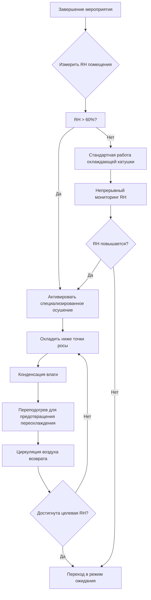

## Обзор

Удаление влаги после мероприятия решает проблему значительных скрытых нагрузок, возникающих во время периодов высокой занятости в зданиях. Каждый человек вносит приблизительно 58-116 кДж/ч скрытого тепла в зависимости от уровня активности, создавая существенные нагрузки по влажности, которые сохраняются после ухода людей. Эффективное удаление влаги предотвращает конденсацию на поверхностях здания, поддерживает качество воздуха в помещении и подготавливает пространство для последующих циклов занятости.

## Основы скрытых нагрузок

### Влага, образуемая людьми

Скрытое тепло, генерируемое людьми, следует предсказуемым закономерностям на основе метаболической активности:

| Уровень активности | Явная нагрузка (кДж/ч) | Скрытая нагрузка (кДж/ч) | Полная нагрузка (кДж/ч) |
|-------------------|------------------------|--------------------------|-------------------------|
| Сидя в покое | 259 | 164 | 423 |
| Легкая работа/ходьба | 264 | 211 | 475 |
| Умеренная активность | 264 | 317 | 581 |
| Тяжелая работа/танцы | 290 | 554 | 844 |

Требуемое полное удаление влаги рассчитывается как:

$$Q_L = N \times q_L \times t$$

где:
- $Q_L$ = полная скрытая энергия для удаления (кДж)
- $N$ = количество людей (человек)
- $q_L$ = скрытая нагрузка на человека (кДж/ч)
- $t$ = продолжительность занятости (ч)

### Расчет массы влаги

Масса водяного пара, поступившего в помещение:

$$m_{H_2O} = \frac{Q_L}{h_{fg}}$$

где:
- $m_{H_2O}$ = масса водяного пара (кг)
- $h_{fg}$ = удельная теплота испарения ≈ 2 450 кДж/кг при типичных условиях

Для здания с 5 000 человек при умеренной активности в течение 3 часов:

$$Q_L = 5000 \times 317 \times 3 = 4 755 000 \text{ кДж}$$
$$m_{H_2O} = \frac{4 755 000}{2 450} \approx 1 941 \text{ кг воды}$$

## Требования к производительности осушения

### Расчет скорости удаления

Требуемая производительность осушения зависит от целевого времени восстановления:

$$\dot{m}_{removal} = \frac{m_{H_2O}}{t_{recovery}} \times 60$$

где:
- $\dot{m}_{removal}$ = производительность осушения (л/ч)
- $t_{recovery}$ = целевое время восстановления (ч)

Для приведенного выше примера с целевым временем восстановления 4 часа:

$$\dot{m}_{removal} = \frac{1 941}{4} \times 60 \approx 29 072 \text{ л/ч}$$

Это представляет приблизительно 116 410 л за период восстановления, требуя существенного специализированного оборудования осушения сверх стандартного удаления конденсата охлаждающей катушкой.

## Психрометрический анализ

### Изменение коэффициента влажности

Изменение коэффициента влажности от занятых до целевых условий:

$$\Delta W = W_{occupied} - W_{target}$$

$$W = 0.622 \times \frac{P_{vapor}}{P_{atm} - P_{vapor}}$$

где:
- $W$ = коэффициент влажности (кг влаги/кг сухого воздуха)
- $P_{vapor}$ = парциальное давление водяного пара (кПа)
- $P_{atm}$ = атмосферное давление (кПа)

### Требуемый объем воздуха

Полный объем воздуха, который необходимо обработать:

$$V_{air} = \frac{m_{H_2O}}{\Delta W \times \rho_{air}}$$

где:
- $V_{air}$ = полный объем воздуха (м³)
- $\rho_{air}$ = плотность воздуха ≈ 1,2 кг/м³ при стандартных условиях

## Процесс осушения

## Стратегия предотвращения конденсации

### Контроль точки росы

Конденсация на поверхности происходит, когда температура поверхности падает ниже температуры точки росы прилежащего воздуха. Связь температуры точки росы:

$$T_{dp} = T - \frac{100 - RH}{5}$$

Это приближение (справедливо для типичных условий комфорта) обеспечивает быстрый полевой расчет где:
- $T_{dp}$ = температура точки росы (°C)
- $T$ = температура сухого термометра (°C)
- $RH$ = относительная влажность (%)

### Критические температуры поверхности

| Тип поверхности | Типичная температура (°C) | Критическая RH при 24°C (%) |
|-----------------|---------------------------|------------------------------|
| Однослойное стекло | 13-18 | 60-70 |
| Изолированное стекло | 18-21 | 70-80 |
| Наружные стены (теплоизолированные) | 20-22 | 80-90 |
| Холодные водопроводные трубы | 10-16 | 50-65 |
| Воздуховоды подачи (неондиционированное пространство) | 13-16 | 60-70 |

## Протокол графика восстановления

### Осушение по фазам

```mermaid
gantt
    title График удаления влаги после мероприятия
    dateFormat HH:mm
    axisFormat %H:%M
    section Немедленный ответ
    Циркуляция высокого объема воздуха     :a1, 00:00, 1h
    Активация начального осушения :a2, 00:00, 1h
    section Активное удаление
    Максимальная производительность осушения :b1, 01:00, 3h
    Контроль температуры с переподогревом   :b2, 01:00, 3h
    section Фаза восстановления
    Режим сниженного осушения     :c1, 04:00, 2h
    Приближение к уставке RH              :c2, 04:00, 2h
    section Стабилизация
    Стандартная работа HVAC           :d1, 06:00, 2h
    Непрерывный мониторинг             :d2, 06:00, 2h
```

### Логика последовательности управления

1. **Немедленный ответ (0-1 ч после мероприятия)**
   - Максимизировать забор наружного воздуха, если коэффициент влажности наружного воздуха < коэффициент влажности внутреннего воздуха
   - Активировать все оборудование осушения с полной производительностью
   - Увеличить скорости циркуляции воздуха на 150% от расчетных

2. **Активное удаление (1-4 ч после мероприятия)**
   - Поддерживать температуру на выходе охлаждающей катушки на уровне 10-11°C для максимизации конденсации
   - Применить переподогрев при необходимости для предотвращения падения температуры в помещении ниже 20°C
   - Контролировать скорости удаления конденсата для проверки производительности

3. **Фаза восстановления (4-6 ч после мероприятия)**
   - Модулировать производительность осушения по мере приближения RH к уставке
   - Снизить циркуляцию воздуха до расчетных значений
   - Переместить заслонки наружного воздуха в минимальное положение

4. **Стабилизация (6-8 ч после мероприятия)**
   - Вернуться к стандартному управлению, основанному на занятости
   - Проверить стабильность RH в пределах ±5% от уставки
   - Записать производительность системы для оптимизации

## Критерии калибровки оборудования

### Системы специализированного осушения

На основе ASHRAE Standard 62.1 и эмпирических данных:

| Вместимость зала | Пиковая скрытая нагрузка (кВт) | Производительность осушения (л/день) | Время восстановления (ч) |
|-----------------|------------------------------|--------------------------------------|------------------------|
| 1 000 человек | 88 | 27 120 | 4 |
| 5 000 человек | 440 | 135 600 | 6 |
| 10 000 человек | 880 | 271 200 | 8 |
| 20 000 человек | 1 760 | 542 400 | 10 |

Примечание: 1 кВт скрытого охлаждения = 3 517 кДж/ч скрытой производительности

### Эффективность удаления влаги

Коэффициент производительности для специализированного осушения:

$$COP_{dehum} = \frac{Q_L}{W_{input}}$$

где:
- $COP_{dehum}$ = коэффициент производительности осушения
- $Q_L$ = предоставленное скрытое охлаждение (кДж/ч)
- $W_{input}$ = электрическая входная мощность (кДж/ч)

Типичные системы осушения с использованием адсорбентов достигают COP 0.8-1.2, в то время как системы охлаждения достигают 2.5-3.5 при правильном применении.

## Проверка датчиков и калибровка

Точное измерение влажности критично для эффективного управления удалением влаги. Согласно ASHRAE Guideline 36, датчики влажности должны поддерживать точность ±3% RH в диапазоне рабочих условий.

### Стратегия размещения датчиков

- **Воздух возврата**: первичный датчик управления, минимум 3 м от любого источника влаги
- **Воздух подачи**: проверка производительности осушения, после переподогрева
- **Датчики пространства**: распределенные в областях, склонных к высокому накоплению влаги
- **Критические поверхности**: датчики температуры поверхности на областях, подверженных конденсации

### Компенсация дрейфа

Ожидаемые скорости дрейфа датчиков:
- Емкостные датчики RH: 1-2% в год
- Резистивные датчики RH: 2-3% в год
- Частота калибровки: ежегодно или после 1 000 часов работы при >85% RH

Реализовать автоматическую перекрестную проверку между несколькими датчиками для выявления условий дрейфа, требующих повторной калибровки.

## Ссылки

- ASHRAE Standard 62.1: Вентиляция для приемлемого качества воздуха в помещении
- ASHRAE Standard 55: Тепловые условия окружающей среды для комфорта человека
- ASHRAE Handbook - Fundamentals: Психрометрика (Глава 1)
- ASHRAE Guideline 36: Высокопроизводительные последовательности работы для систем HVAC
