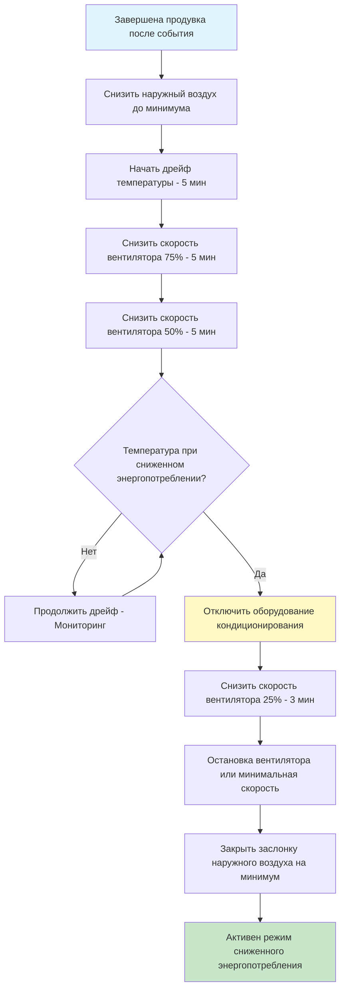
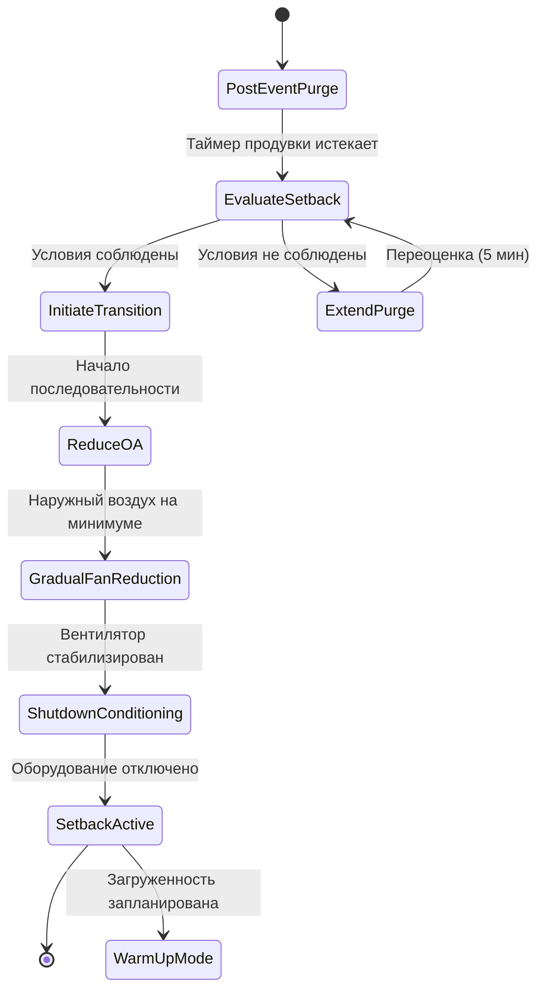

## Обзор

Возврат к режиму сниженного энергопотребления представляет завершающий этап управления переменной загруженностью, осуществляя переход систем HVAC из режима продувки после события в режим энергосбережения при отсутствии людей. Этап приоритизирует экономию энергии при сохранении минимального качества внутреннего воздуха и предотвращении повреждения оборудования путем управляемых последовательностей отключения.

Надлежащие переходы в режим сниженного энергопотребления снижают циклирование оборудования, минимизируют энергопотребление и продлевают срок службы оборудования, предотвращая резкие изменения режима работы, которые нагружают механические компоненты.

## Критерии инициирования режима сниженного энергопотребления

Переход в режим сниженного энергопотребления начинается после завершения продувки после события, подтверждаемый посредством:

**Инициирование на основе времени:**
- Таймер длительности продувки истекает (обычно 30-60 минут)
- График подтверждает отсутствие предстоящей загруженности в течение следующих 2 часов
- Все зоны с загруженностью сообщают о завершении полного воздухообмена

**Инициирование на основе условий:**
- Концентрация CO₂ внутри помещения ≤ уличная + 100 ppm
- Уровни летучих органических соединений возвращаются к базовому уровню (если контролируются)
- Температуры в зонах находятся в пределах допустимого диапазона отклонения
- Все аварийные или требуемые переопределения вентиляции отменены

**Проверка статуса системы:**
- Отсутствуют активные тревоги или состояния неисправности
- Все датчики зоны сообщают достоверные данные
- Заслонки наружного воздуха функциональны и управляемы
- Отсутствуют условия ручного переопределения

## Стратегии снижения температуры

### Снижение температуры в отопительный сезон

Температуры сниженного энергопотребления во время отопления предотвращают повреждение от промерзания при минимизации энергопотребления:

| Тип здания | Задание при загруженности | Температура сниженного энергопотребления | Потенциал экономии энергии |
|------------|-------------------------|----------------------------------|-------------------------|
| Офис | 21°C | 15,6-18,3°C | 15-25% энергии отопления |
| Помещение общественного собрания | 20°C | 12,8-15,6°C | 20-30% энергии отопления |
| Розничный | 22°C | 16,7-18,3°C | 12-20% энергии отопления |
| Образовательное | 21°C | 15,6-18,3°C | 18-28% энергии отопления |

**Расчет экономии энергии отопления:**

Экономия энергии от снижения температуры следует:

$$Q_{saved} = UA(T_{occ} - T_{sb})\Delta t$$

где:
- $Q_{saved}$ = сэкономленная энергия в период сниженного энергопотребления (кДж)
- $U$ = общий коэффициент теплопередачи (кДж/ч·м²·°C)
- $A$ = площадь оболочки здания (м²)
- $T_{occ}$ = температура задания при загруженности (°C)
- $T_{sb}$ = температура сниженного энергопотребления (°C)
- $\Delta t$ = длительность снижения (часы)

**Процент снижения энергии:**

$$\eta_{setback} = \frac{(T_{occ} - T_{sb})}{(T_{occ} - T_{outdoor,avg})} \times 100\%$$

Для снижения на 5,6°C с разностью температур наружного воздуха и внутреннего в среднем 16,7°C:

$$\eta_{setback} = \frac{5,6}{16,7} \times 100\% = 33,5\%$$

### Повышение температуры в охладительный сезон

Повышенные температуры сниженного энергопотребления во время охлаждения снижают время работы компрессора и электрический спрос:

| Тип здания | Задание при загруженности | Температура повышенного энергопотребления | Потенциал экономии энергии |
|------------|-------------------------|----------------------------------|-------------------------|
| Офис | 23,3°C | 26,7-29,4°C | 20-35% энергии охлаждения |
| Помещение общественного собрания | 22,2°C | 27,8-29,4°C | 25-40% энергии охлаждения |
| Розничный | 23,3°C | 26,7-27,8°C | 18-30% энергии охлаждения |
| Образовательное | 23,3°C | 26,7-29,4°C | 22-38% энергии охлаждения |

**Экономия энергии охлаждения:**

$$P_{saved} = \frac{Q_{avoided}}{COP} = \frac{UA(T_{setup} - T_{occ})\Delta t}{COP}$$

где:
- $P_{saved}$ = сэкономленная электрическая энергия (kWh)
- $COP$ = коэффициент производительности (обычно 2,5-4,0)
- $Q_{avoided}$ = избегнутая нагрузка охлаждения (кДж)

## Последовательность постепенного перехода

Резкое отключение оборудования вызывает тепловой удар и повышенный износ. Внедрите поэтапные переходы:

### Таблица времени переходов

| Этап | Длительность | Скорость вентилятора | Заслонка наружного воздуха | Отопление/Охлаждение | Задание |
|------|----------|--------------|---------------------|-----------|----------|
| Завершение продувки | 0 мин | 100% | 15-25% | Активно | При загруженности |
| Снижение наружного воздуха | 2 мин | 100% | Минимальное положение | Активно | При загруженности |
| Начальный дрейф | 5 мин | 100% | Минимальное положение | Активно | При загруженности |
| Этап 1 | 5 мин | 75% | Минимальное положение | Активно | Начало дрейфа |
| Этап 2 | 5 мин | 50% | Минимальное положение | Модуляция | Дрейф |
| Этап 3 | Переменная | 50% | Минимальное положение | Отключено | Значение сниженного энергопотребления |
| Отключение кондиционирования | 0 мин | 50% | Минимальное положение | Отключено | Сниженное энергопотребление |
| Этап 4 | 3 мин | 25% | Минимальное положение | Отключено | Сниженное энергопотребление |
| Активно сниженное энергопотребление | Постоянно | 0-25% | Минимальное положение | Отключено | Сниженное энергопотребление |

Общее время переходов: 15-25 минут в зависимости от тепловой реакции здания.

## Последовательность отключения оборудования

**Поэтапная деактивация оборудования:**

1. **Отключение механического охлаждения (если активно):**
   - Снизить клапан холодной воды до 0% за 2 минуты
   - Остановить компрессор(ы) после полного закрытия клапана
   - Поддерживать поток воды конденсатора в течение 3 минут (промывка)
   - Остановить насосы конденсатора и вентиляторы градирни

2. **Отключение оборудования отопления (если активно):**
   - Снизить клапан отопления/газовый вход до 0% за 2 минуты
   - Продолжить работу вентилятора для рассеивания тепла (5 минут)
   - Проверить температуру выпуска < 32°C перед снижением скорости вентилятора
   - Полностью закрыть клапаны пара/горячей воды

3. **Позиционирование заслонки наружного воздуха:**
   - Модулировать на минимальное положение в соответствии с кодом (обычно 5-10% для герметизации заслонки)
   - ASHRAE 90.1 Section 6.4.3.4.3 допускает закрытие при отсутствии людей
   - Проверить закрытие заслонки посредством обратной связи по положению
   - Отключить логику управления экономайзером

4. **Снижение скорости приточного вентилятора:**
   - Постепенное снижение скорости предотвращает переходные процессы давления
   - Скорость спада VFD: максимум 10% в минуту
   - Контролировать температуру подшипников во время отключения
   - Достичь режима ожидания или полной остановки

## Эксплуатация в режиме ожидания

Системы могут работать в частичном режиме ожидания, а не в полном отключении:

**Непрерывная работа вентилятора (Рекомендуется для крупных зданий):**
- Приточный вентилятор на скорости 15-25% поддерживает циркуляцию воздуха
- Предотвращает расслоение и накопление влаги
- Позволяет более быстрое восстановление в режиме загруженности
- Дополнительные затраты энергии: 2-5% от общей энергии HVAC

**Прерывистая работа вентилятора (Приоритет экономии энергии):**
- Вентилятор работает на основе предельных значений температурного дрейфа
- Типичный цикл: 10 минут в час
- Максимальное энергосбережение, но более медленное восстановление
- Риск проблем с влагой в влажном климате

**Полное отключение (Малые системы):**
- Все оборудование отключено, кроме защитных цепей
- Максимальное энергосбережение (приближающееся к 100% сбережений при отсутствии людей)
- Требует более длительного времени восстановления (1-3 часа)
- Подходит только для зданий с низкой тепловой массой

## Приоритет энергосбережения

ASHRAE 90.1-2019 Section 6.4.3.3 требует автоматических управлений сниженного энергопотребления для зон с рабочими часами < 168 часов/неделя.

**Влияние годовой энергии:**

Для офисного здания площадью 4 645 м² с рабочим временем 50 часов/неделя:

$$E_{annual,saved} = Q_{hourly} \times \Delta T_{setback} \times h_{unoccupied} \times \eta_{system}$$

Допущения:
- $Q_{hourly}$ = 493 кВт проектная нагрузка
- $\Delta T_{setback}$ = 3,1°C среднее эффективное снижение
- $h_{unoccupied}$ = 118 часов/неделя × 50 недель = 5900 часов/год
- $\eta_{system}$ = 30% средний коэффициент экономии

$$E_{annual,saved} = 493 \times 0,30 \times 5900 = 872 \text{ MWh/год}$$

При $12/ГДж для природного газа, годовая экономия = 10 464 доллара.

Для охлаждения при COP 3,5 и $0,12/kWh:

$$E_{cooling,saved} = \frac{872 \times 3600}{3,5} = 896 \text{ MWh/год}$$

Годовая экономия охлаждения = 107 520 доллара.

**Общая годовая экономия: 117 984 доллара за внедрение управления сниженного энергопотребления.**

## Интеграция логики управления

## Проверка и пусконаладка

**Требования функционального тестирования:**

- Проверить инициирование сниженного энергопотребления после завершения продувки
- Подтвердить постепенный переход в течение 15-25 минут
- Измерить скорость температурного дрейфа (не должна превышать 1,1°C за 10 минут)
- Документировать фактические и проектные температуры сниженного энергопотребления
- Проверить закрытие и герметизацию заслонки наружного воздуха
- Протестировать время восстановления из сниженного энергопотребления до задания при загруженности
- Измерить энергопотребление в режиме сниженного энергопотребления в сравнении с проектными прогнозами

**Точки мониторинга:**

- Температуры в зонах во время переходов
- Температура приточного воздуха при отключении оборудования
- Электропотребление вентилятора на каждом этапе
- Обратная связь положения заслонки наружного воздуха
- Часы работы оборудования в режиме сниженного энергопотребления
- Статистика времени восстановления для оптимизации

## Стратегии оптимизации

**Адаптивное время сниженного энергопотребления:**

Отрегулируйте глубину сниженного энергопотребления на основе:
- Прогноза температуры наружного воздуха (более глубокое снижение в мягкую погоду)
- Времени следующей загруженности (поддерживать более высокое снижение при раннем событии)
- Ответа тепловой массы здания (измеренные скорости дрейфа)

**Защита оборудования:**

- Требования минимального времени работы перед отключением (предотвратить частое циклирование)
- Ограничения температуры выпуска перед снижением скорости вентилятора (< 32°C)
- Контроль температуры подшипников при отключении
- Минимальное время отключения перед перезапуском (обычно 5 минут для компрессоров)

Возврат к режиму сниженного энергопотребления представляет критическую возможность энергосбережения при внедрении с надлежащими постепенными переходами, которые защищают оборудование и максимизируют экономию.
